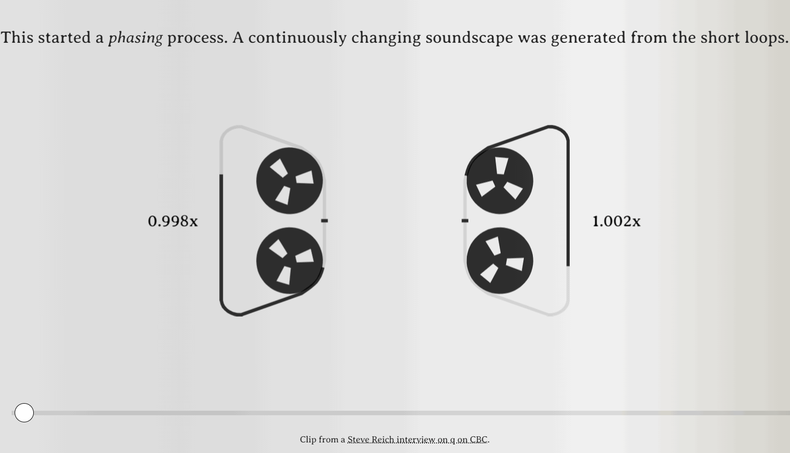
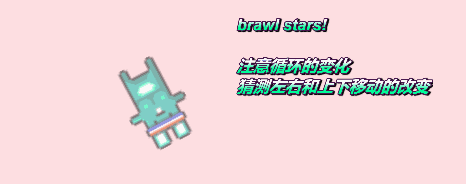
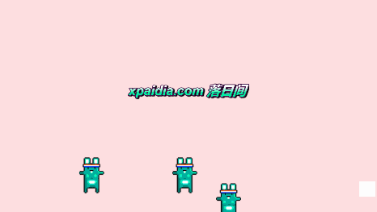

# 《回 声 SOUND RETURN》CiGA Game Jam 2021

请扫码直接体验，建议佩戴耳机


（特别是安卓手机，可能会出现分辨率有问题导致UI消失的问题，麻烦进行刷新或者是通过不同的外部浏览器进行打开尝试，请谅解）

《回 声 SOUNDRETURN》

一个名副其实的「声音解谜」游戏。

落日间出品 | Demo


### 操作教程 Instructions

点击右上角的耳机按钮听题目，而玩家需要通过与场景进行交互来尝试还原出题目的声音。 Click the right-up button to listen to the puzzle: a targeted sound you should interact with the scene objects to reproduce.

如果你接近了正确答案或做对了，那么进度条就会增长，当其充满的时候便可再次点击右上角的关卡到下一关。 and if you make it right, the progress bar will grow and fill, then click the up-right button to go to the next level.

右下角的按键是用来测试的跳关键，正常通关流程不需要使用，但你可以使用它来跳过无法理解的关卡。 The right-down button is a skip level for debugging and test, it's no needed for the game, but you can use it to pass the level.

希望你在其中得到乐趣 Hope you get fun in it.


叶梓涛 Zitao Ye


A sound puzzle web game based on Tone.js and Pixi.js by zitaoye

the JavaScript Systematic Music tutorial and How Generative Music Works by [https://twitter.com/teropa](https://link.zhihu.com/?target=https%3A//twitter.com/teropa) and the Nicky Case game source code structure is really inspiring for me as a web development starter

It's really related to Brian Eno's talks 生成性音乐 Generative Music and the Ableton Live Learning Synth interactive tutorial.

如果你希望使用电脑，可以登入 [https://yezi.itch.io/soundreturn](https://link.zhihu.com/?target=https%3A//yezi.itch.io/soundreturn)

## 回顾

这个Demo是本人在2021/7/10-7/11号 CiGA Game Jam制作的原型作品。

### 关于GameJam

简单解释一下GameJam：

Game Jam是一种限定时间与条件的游戏极限开发活动，专注于游戏领域的创意开发，鼓励热爱游戏和有开发热情的人群聚集在一起，通过游戏创作这一形式和过程进行头脑风暴、经验分享以及自我表达。通过一个限定的时间唤醒游戏的创意理念并同时体验游戏的开发过程，包括编程、互动设计、叙事探索、美术设计等都将在限定时间内完成。

GameJam参加是没有门槛的，是作为我鼓励很多没有游戏开发经验的朋友都可以去参加和体验的原因。

中国常见的线下GameJam是每年1月份的Global Game Jam，以及每年7月份的华语游戏圈的CiGA Game Jam，线上大概数月会有Ludum Dare Game Jam，而海外最大的线上GameJam现在或许是由油管频道「游戏设计工具箱Game Maker Toolkits」所举办 GTMK Game Jam，某种意义上，Game Jam汇聚了一个地区内的独立游戏开发者，从其中的作品可以观察出整体环境和生态的好坏及游戏设计的水平，从每年的GMTK 复盘中能看到国人在Game Jam和创作上与国外还是有差距的。

每次的GameJam都会有一个主题在开始的时候公布，本次出题依旧是CiGA Game Jam 「臭名昭著」的图片解读题：作为一个主要还是做自己想做的想法，并且solo的老油条，我大概是这样附会声音的音轨，而这个还原的解谜又是如何将声音拉回「正轨」的（胡说八道）


关于CiGA GameJam的活动以及题目等其他内容可以参考 [2021 CiGA Game Jam回顾，对于游戏开发的热爱把我们聚集到了一起 ](https://link.zhihu.com/?target=https%3A//mp.weixin.qq.com/s/hfsa62qqOmV-D8Scpum6bA)， 参加GameJam的朋友太多了，我只推荐同场的作品吧：

同事制作的双人Rap对战音游《满嘴跑火车》 [www.bilibili.com/video/BV1YB4y1N7ym](https://zhuanlan.zhihu.com/www.bilibili.com/video/BV1YB4y1N7ym)

朋友制作的高完成度也有设计想法的《小镇火车》 [www.bilibili.com/video/BV1d44y1q794](https://zhuanlan.zhihu.com/www.bilibili.com/video/BV1d44y1q794)

一位solo策划用ppt做的叙事体验向的特别作品《Min's Metro 民氏地铁》[youxibd.com/v2/gamejam/cgj2021/works/1406](https://link.zhihu.com/?target=http%3A//youxibd.com/v2/gamejam/cgj2021/works/1406)

作为一个算是参加过不少次GameJam的老人，这次我给自己的评价是：不是一个好的参与者。作为结果的作品《回 声 SOUNDRETURN》的形态只能算是及格，但从对我自己来说却学习到了许多，也是一次新的挑战。

**对于GameJam的理解总是丰富的，有人把其当作是某种竞赛，有人当作是一次实验性想法的落实，当做认识新的朋友的实践，有人则将其当作是一次学习和使用新工具的机会。**

对我来说，这更像是我在今年开始逐渐接触Web游戏开发和新工具之后的一次实打实的演练，这也是我自己第一个完全基于html5以及JavaScript还有使用网页库的作品。

不同于之前《剑入禅境》或者是其他GameJam大多使用Unity进行开发，这次也没有选择最近刚入门的更轻便的Construct3引擎，而是选择了使用原生的web的html+js库进行。 原因在于在web端有一个我想要在这次的主题中切入使用的重要的东西

Web Audio API。

### Web Audio API

因为落日间只是一个游戏相关的公众号，我不知道关注者们中前端程序员或者是做互动音频的朋友是否会熟悉，但我还是介绍一下这个东西。

我知道似乎谈论到编程、技术、合成器相关的东西，可能大部分的读者鉴于专业性就退却了，但是我其实也不是相关专业和行业的，但我依旧认为这其中有非常神奇的力量，我们远远忽略了合成器的意义以及它们在我们今天的听觉经验中的重要地位。

在一个JavaScript的会议上，一位名为Chris Lowis的老哥做了一个分享 [Chris Lowis: A Brief History of Synthesis with the Web Audio API](https://zhuanlan.zhihu.com/p/389444455) ，他使用web audio api展示了合成器的发展历史。

我不知道怎么解释合成器（synthesizer），但我觉得最简单的理解便是能够产生声音的电子乐器，即如今大家听到的许多声音其实并不是通过sample 采样进行录制的，而是通过某些方式合成的。

这往往可能是通过analog模拟信号（电流）或数字信号来进行声音的制作，声音通过振荡器（oscillator）发出，并且这样的信号可以通过各种类似滤波器（Filters）的「控件 controls」来进行塑造，可以并且可以使用包络曲线（Envelopes），低频振荡器（LFO）等方式进行调制（modulation）。

关于这部分的内容我推荐大家可以去重轻老师的B站账号进行学习，他有对于合成器很棒的解说，而Ableton Live 所做的交互式教学页面，无论是很棒的合成器入门 Learning Synth [https://learningsynths.ableton.com/zh-Hans/](https://link.zhihu.com/?target=https%3A//learningsynths.ableton.com/zh-Hans) ，还是很棒的音乐入门 Learning Music [https://learningmusic.ableton.com/zh-Hans/](https://link.zhihu.com/?target=https%3A//learningmusic.ableton.com/zh-Hans) （这两个交互教程都有中文）。


上面我提到的那位老哥也在二十分钟内简单介绍了单音合成器 Monophonic Synthesis 加法合成器 Addictive Synthesis 减法合成器 Substractive Synthesis 调频合成 FM Synthesis 采样合成 Sampling Synthesis 粒子合成 Granular Synthesis 等。

但是这件事有趣的就在于，他并不是展示一台又一台的合成器，也并不是打开类似 Ableton Live 这样的数字音频工作站（DAW），而是使用了简单的网页，而这些代码全部都可以在 [github.com/chrislo/synth\_history](https://link.zhihu.com/?target=http%3A//github.com/chrislo/synth\_history) 中访问到，他的分享的结尾提到了最早制造一批在贝尔实验室做计算机音乐的老前辈 Max Matthews 分享的一句话：

**计算机是一切的/全体的乐器 the computer is the universal instrument。**

通过电子合成器技术，你可以创造世界上任何的声音，而这样的伟大的、无限的乐器的可能，就在你现在的每个人的浏览器之中。

那就是Web Audio API


Web Audio API 可以让你在任何Web应用程序中创建和处理声音，有一位名为Tepora的老哥在上做了非常棒的两个教程，我在知乎放出了部分的我的笔记，在 Learn Web Audio from the Ground Up 中，他面向没有任何音乐/音频的JavaScript 开发者做了一个音乐 + Web Audio的科普，其中不乏类似对于十分重要的泛音列的科普。

而在后续的另一个教程中，JavaScript Systems Music - Learning Web Audio by Recreating The Works of Steve Reich and Brian Eno ，他手把手地继续教我们如何使用Web Audio 进行基本的循环来复刻名作 Steve Reich - It‘s Gonna Rain ，通过使用采样计算音程并且使用卷积混响来制作 Brian Eno Ambient 1: Music for Airports, 2/1 1978，以及简单介绍了基于Web Audio API的 JavaScript的库，也正是这次我的GameJam所使用的 Tone.js，用于来更方便地创建合成器来模拟重现 Brian Eno 的旧作 Discreet Music 1975（他所使用的 Tone.js 的API有些老旧，部分还需要重新查阅Tone.js 的官方最新文档）。


两篇笔记：

[https://zhuanlan.zhihu.com/p/383946261](https://zhuanlan.zhihu.com/p/383946261)

[https://zhuanlan.zhihu.com/p/38930300](https://zhuanlan.zhihu.com/p/389303009)

你能十分惊奇地发现当初的那些使用循环磁带来制作的生成音乐，如今在计算机和程序之下可以非常方便地制作出来。

### 两个挑战

所以对我来说这次GameJam的两个挑战如下：

我要使用我尚不熟悉的Web Audio API 与 Tone.js 从教程到应用（我甚至还是当天晚上补完的第二篇教程），并且将其与玩家的交互与渲染结合起来，在渲染和交互上我使用了也是仅仅入了门的，可能是网页上最快的2D渲染器 Pixi.js

[Diving In: Pixi JS ](https://zhuanlan.zhihu.com/p/383581835)

使用Pixi.js 的原因主要是因为我很喜欢的游戏开发者Nicky Case例如他的名作《信任的进化 The Evolution of Trust》也是使用了Pixi.js来做渲染的，不过他是一个专业的网页开发者，混合了非常多原生的h5代码和其他的库，这个作品也是开源的，在Github上有近五千的Star。


信任的进化 [http://ncase.me/trust/](https://link.zhihu.com/?target=http%3A//ncase.me/trust)

[https://github.com/ncase/trust](https://link.zhihu.com/?target=https%3A//github.com/ncase/trust)

我觉得非常神奇的，并且在先前腾讯研究院邀请我去做的关于Metaverse和创作者的分享中，我主要提的对于元宇宙的想象其实是近乎等同于Web的，因为我意识到与类似Unity的游戏引擎不同，对于这样的一个Web开发，这是一个充满变化，充满分享和奇妙场所，你可以通过简单的

```
<scirpt src = "... "></script>
```

来引入世界上其他人所分享的任何开源代码包，然后再次之上进行创作和开发，这是一个有很多空白，但是却也充满了可能性的场所。

例如我这次就是用了来做 观察者模式 The Publisher/Subscriber Pattern的minipubsub.js，然后提到的pixi.js和Tone.js，还有用于处理运动和缓动的Gsap.js。

另外一个挑战在于我没有想过在web端上面对完全空白的文档，要如何构建出一个游戏。

要怎么进行关卡放置加载，这些过去在Unity和游戏引擎中封装好的功能如今完全需要由自己来构建，所以对我来说，第二天（周六）的很长一段时间而都在对照着Nicky Case的《信任的进化》的源代码中的关卡加载的代码来构建一个非常简单的框架来使用，这对我来说是一次可以说from scratch 的游戏开发，如果要是平常我可能早就放弃了，但是在Game Jam中，一切困难和学习都是冲着一个具体的解决问题去的，所以反倒做了出来。

以此就有了这个看似粗糙简单，但花了不少力气的Demo

### SOUND RETURN

我必须要承认这次的关卡设计非常地糟糕，不仅难度没有调好，集中精力在实现各种不同的看上去花哨的功能的想法的我其实并没有真正多少去寻找和制作关卡，每一关都是不同的功能，而对于一些基本的如响度，声像这些都没有做，在交互的传达上也碍于时间和懒惰而省略了许多，但想后面专门拿出时间做修缮和扩展也不知道猴年马月了，于是就凑合一聊了。

**Level 1**


所以对于关卡1，实际上这样的一只小兔子 🐰 ，被创建的同时也创建了一个合成器，而这个合成器的频率（Frequency），也是我们常说的音高（Pitch），被我设定是由兔子之于屏幕的 x 轴的位置决定的，所以在左右拖动的时候，可以很清晰地听到音高的变化。

这一部分很有趣地是在于我在观察玩家玩这关的时候，有一位朋友试图通过不断点击兔子来发出谜题的那种抖动式的声音，但其实那仅仅只是降低了频率的结果，在这点上说明其实大部分人是不会意识到声音的频率在渐变中会有这么丰富的变化的。

**Level 2**


第二关是很早就想到的，其实最早也是希望做出更多类似的有独立的碰撞逻辑的声音循环，玩家通过引导这些小兔子到正确的轨道上发出正确的声音，但结果却做了这个有些不合理的谜题。

但我觉得如果细心的话，玩家应该能基本地感受到他点击的时机不同，这些小兔子不同地运动方式因此改变，而他所到的声音循环也因此改变——可能大部分人觉得这没什么特别的，但是可能对某些人来说，这可能就是所谓生成音乐的一个最小的单元：你想想，只需要轻轻一点，根据不同人的点击时刻，这两只兔子在移动碰撞的声音间隔被错开，整体声音发生变化。

这一点可能 Steve Reich 的 It‘s Gonna Rains 中有类似的这种微妙变化的和错位带来的丰富性。



而这仅仅是两只移动发生碰撞声音的简单兔子！

当然谜题显得有些Tricky，我想让你将兔子发出的声音重合变为听上去像是只有一只。

**Level 3**


第三关依旧是糟糕的关卡设计和引导，更多其实我是想展现出：其实我完全可以用类似物理的规则方式驱动这个发声的兔子。

比如我设定了兔子的跳跃，设定每次落地触发的声音根据碰撞点的X轴位置来修改并且触发对应合成器的不同频率，那么这完全就成了一个音乐玩件，你可以试试看就放着听它不断地跳跃并且生成音乐，而蓄力的时间不同，可能生成的后续一连串完全不同的声音。

而这仅仅只是一只兔子！

在游戏最后可以看到我一次性丢了三四只的兔子，可以听听他们是如何在不同声部上进行演奏和生成的。

**Level 4**



第四关依旧是糟糕的关卡设计，这里旋转的兔子所代表的是一段不断循环Loop的音乐素材，游戏《荒野乱斗 Brawl Stars》的开场音效，而这类似 Steve Reich 地处理方式，但其中的映射规则设计得并不好：

兔子的 X 轴实际上代表着 循环的磁头的开始 LoopStart，而Y 轴代表循环磁头的结尾 LoopEnd：


这就是为什么当兔子越过对角线的时候就停止的原因：循环开始的磁头超过了结束的时间点，所以循环播放停止了。

所以在我探索这样的交互的过程，也是我在探索这段素材被再度制造和修改的可能性，我也是很惊讶地通过循环才注意到了这段采样中有一个非常亮的一个尾音，而将其切分出来循环会有类似鸣钟式的效果，我也希望玩家在探索的时候可以感受到自己居然可以通过对于素材的重放区域的移动来创造出这样特别的声音效果，虽然我的这个重放机器的设计非常不直觉。

**Level 5**


这一关和第一关的触发方式类似，但是不同的地方在于，这只兔子背后不再是单音合成器，而是一个双合成器 DuoSynth。

不同于之前用的单合成器MonoSynth 使用一个振荡器，DuoSynth使用了两个单音合成器叠加来形成更加丰富的音色。在X轴和Y轴上我都绑定了不同参数的控制，都比较特殊，Y轴上变化的是一个数值：Harmonicity ，Harmonicity is the ratio between the two voices. 是两个合成器频率的比值；而X轴上则是控制我在合成器的输出上多加了一个低通滤波器（lowpass）的频率，效果是只允许比起频率低的声音通过，所以当小兔子越往左移动，声音就被削弱地越多直到完全无声。

这完全是在不同维度上对声音进行了操控和改造，所以固然和Level 1 是近似的设计，但其内在的规则完全不一样。

大概如此，当时周日中午在会场本来还想多做几关，但感觉周围的试玩氛围的丰富以及可能大概是前两天睡眠不好加上信息量太大，大脑基本不转了，所以就干脆还是草草作结。

但我真的很有趣看到大家戴着耳机对着这样的一个粗糙的画面的一只小兔子如同老中医把脉式的移动和对照的，我意识到我确实创造了一个有趣的、丰富的声音挑战，这使得玩家重新去觉察声音的丰富性，其实虽然是关卡，但本质上每一关我都在设计一个新的乐器。

就像我在自己的作品集页面 [yezi.itch.io/soundreturn](https://link.zhihu.com/?target=http%3A//yezi.itch.io/soundreturn) 中写的：

这仅仅只是一次试图结合web audio，渲染，互动的练习式作品，但我可以瞥见其中进行谜题关卡设计的丰富多样性，受益于声音宇宙的慷慨，这近乎能够有创作出无限的关卡与可能。

It's just an exercise to combine the web audio, render, and interaction, but I can see a vast variety of puzzles and future level design - which has almost infinite possibilities that are beneficiary of this generosity of the sound universe.

这次完整试验了使用web-based的技术来制作游戏，并且通过二维码直接进行传播和多端试玩的体验，已经可以说达到了我期待的那种轻量式的创作和传播可能，之后落日间也会周期性地将从媒体转移到实践和制作直接分享上来，作为创作者的批评者，避免眼高手低是我们时刻提醒自己的。

非常感谢椰岛游戏承办了这一场GameJam，以及会场的工作人员小伙伴们的支持。

也非常感谢在现场试玩和投票给我的朋友们：）

这次完成度远不够，但是也拿到了全场第五的投票数，还有朋友专门来表达对我作品的认可感到非常开心，但也有些许愧疚，毕竟我觉得在关卡设计和引导上可以做得更好的，期待日后有找到合作者或者有其他的外部机遇能够将其展开。



落日间的其他游戏作品可见

[剑入禅境 Sword Zen | Global Game Jam 2021](https://link.zhihu.com/?target=http%3A//mp.weixin.qq.com/s%3F\_\_biz%3DMzIzMjM0NDk1NQ%3D%3D%26mid%3D2247485641%26idx%3D1%26sn%3Da886a170c2add461c3ec4413504f333d%26chksm%3De89714dddfe09dcbdc9013e6c075ffa1ae04f26eccc7a8448cd7369ca7966362068b6456e70c%26scene%3D21%23wechat\_redirect)

[人生不是永远开不完的硬纸板箱](https://link.zhihu.com/?target=http%3A//mp.weixin.qq.com/s%3F\_\_biz%3DMzIzMjM0NDk1NQ%3D%3D%26mid%3D2247485218%26idx%3D1%26sn%3Ddd65c4ef467ed79e2fe3c57266d0b0f8%26chksm%3De8971b36dfe0922015c3ecc9816acc7d569b71f825ac69ebdd0752886170e85236c2d1ab8077%26scene%3D21%23wechat\_redirect)[游戏0x007C：Là-bas #1](https://link.zhihu.com/?target=http%3A//mp.weixin.qq.com/s%3F\_\_biz%3DMzIzMjM0NDk1NQ%3D%3D%26mid%3D2247484955%26idx%3D1%26sn%3D4aa44d5d16a4e36fe827b8cd12941b39%26chksm%3De8971a0fdfe09319ebf945fccc84106c8d68633cc95d6b7dfbe97a2b9f193fe8ad8bd6f6c3e4%26scene%3D21%23wechat\_redirect)

[游戏0x006A：S E E K](https://link.zhihu.com/?target=http%3A//mp.weixin.qq.com/s%3F\_\_biz%3DMzIzMjM0NDk1NQ%3D%3D%26mid%3D2247484825%26idx%3D1%26sn%3D19706cedbbcdb9f681e096a4c56ab8c2%26chksm%3De897198ddfe0909b9a06ecfb50f9b94e24ae5191103af45a1887f3395b51c73c4897f7e0543d%26scene%3D21%23wechat\_redirect) （前年CiGA全场最佳）

[游戏0x0069：我做的游戏好难玩](https://link.zhihu.com/?target=http%3A//mp.weixin.qq.com/s%3F\_\_biz%3DMzIzMjM0NDk1NQ%3D%3D%26mid%3D2247484793%26idx%3D1%26sn%3D934789ac5d2d7307a1bd5fccba50b867%26chksm%3De897196ddfe0907b2148eb9bc71ab8e2d10d50daab52426fd5cd1cf0cbf17684eda093e1e36b%26scene%3D21%23wechat\_redirect)[游戏0x0064：EI Hacedor](https://link.zhihu.com/?target=http%3A//mp.weixin.qq.com/s%3F\_\_biz%3DMzIzMjM0NDk1NQ%3D%3D%26mid%3D2247484741%26idx%3D1%26sn%3Dd90155e2f0545c9206bc1109e85d2280%26chksm%3De8971951dfe090477d1b03ed96aa6432da93c2cd11c943b551c53a18c9a99bb5b02ed55f9607%26scene%3D21%23wechat\_redirect)

这也是落日间第一次尝试直接在公众号上制作可以直接体验和跳转的游戏作品，会看情况增加更多这样的呈现形式：）

感谢游玩和阅读！
