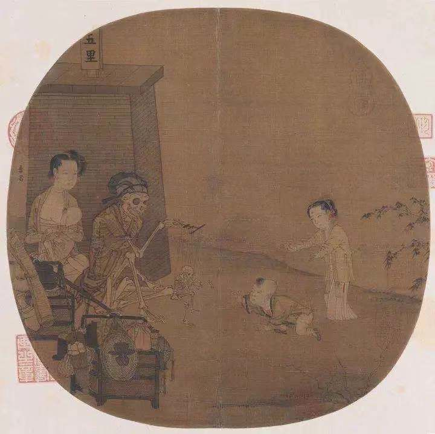
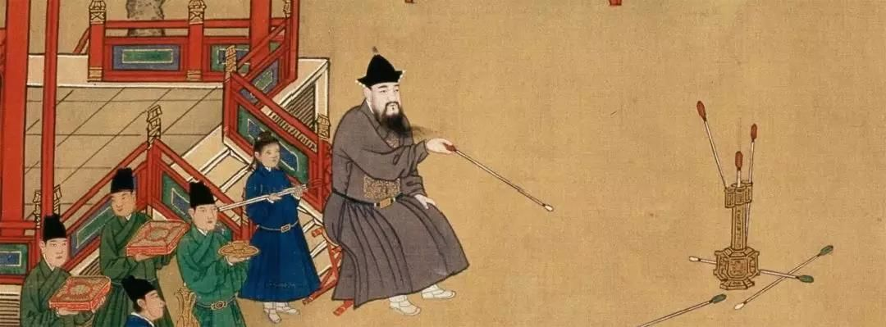

# \#1 “严肃”的游戏

### 游戏与严肃

日常生活中我们使用游戏这个词时，常常指一种无所谓的玩乐，也常常与“不重要的”，“没有意义的”，“无用的”标签联系在一起。而国外有一类被称作“严肃游戏”（serious game）的游戏，某种意义上从反面印证了这种现状——游戏是“不严肃”的，所以“严肃游戏”似乎是“不同于一般游戏的游戏”。

但实际上，游戏在日常生活中的地位，“游戏”这个词的使用，在历史上并不是像今天那样处于一种容易与“不重要和无意义的”，“无用甚至有害的”话语联系在一起的。

**游戏和严肃，本来就是十分复杂却又相伴而行的。**

周作人在其1925年出版的翻译小集《陀螺》序中，将其所做的文字工作全都称作“游戏”，并与日常谈论的游戏区分开来，

> “平常说起游戏，总含有多少不诚实的风雅和故意的玩笑的意味，这也是我所不喜欢的，我的乃是古典文字本义的游戏，是儿戏（Paidia），是玩，书册图象都是（Paignia）之一。”

妄图去定义游戏是困难的，写下《游戏的人：文化的游戏要素研究》的荷兰历史学家约翰赫伊津哈在其1933年的莱顿演讲中所警告的那样：“游戏是一个吞噬一切的范畴，就像愚行（当愚行占据了伊拉斯谟的思想之后）已成了整个世界的女皇时一样”。

但正如贡布里希所评述的，游戏的定义模糊以及游戏与严肃的游离不定的并不意味着我们不能谈论它们，只要我们不要把使用的词看得比历史分期的例子中更重。

-

_周作人译，肖毛校：《陀螺》，新潮社文艺丛书之七，1925年6月。   
维特根斯坦：《哲学研究》北京：商务印书馆，2015年，第7、66、68、69、100等节。   
贡布⾥希：《游戏的⾼度严肃性：约翰·赫伊津哈&lt;游戏的⼈&gt;随感》转引⾃赫伊津哈：《游戏的⼈》多⼈译，杭州：中国美术学院出版社，1996，第291页。_

\_\_

### **游戏与神圣：**从酒神、掷骰子到迎神赛社

让我们尝试“谱系学式”地回到游戏的根源（Herkunft）处，也就是一种尚未区分神圣领域与世俗领域的史前史（Urgeschichte）阶段时，我们可以清晰的看到游戏与神圣的紧密关联。

狄俄尼索斯酒神形象的出现，就带着某种迷狂而神圣的两重性；而就如麦克卢汉所指出的，源起于希腊的奥林匹克运动会原先就是扮演太阳神争斗的游戏——竞技者绕圆形跑道奔跑时，头上扎着黄带，模仿太阳神驾车一日一周所经过的圆形黄道带 。

如赫拉克利特所言“哈德斯与狄奥尼索斯，在酒神节为之狂热的颂扬，都是一回事（残篇15）”，死亡的严肃与游戏的欢愉并举，《伊利亚特》中阿克琉斯在朋友尸体前呼唤着他的灵魂，悲痛之情突然就被赛车、拳击、摔跤和剑术比赛爆发出来的欢愉与热情替代了 。

**在古希腊，柏拉图把游戏等同于神圣，称神圣为游戏，这并未亵渎神圣，反而把游戏概念升华到最高的精神境界。**

在赫拉克利特时代，人们的神灵信仰不再虔诚，所谓酒神节蜕变成一种娱乐活动，所以他指责“倘若他们不是以狄奥尼索斯之名举行赛会和阳具崇拜的活动，那就是极为可耻的。（残篇15） ”

柏拉图明确地表示，“老年人玩游戏和祈祷的时候，应该立刻祈请狄奥尼索斯降临，因为那是狄奥尼索斯给人类消除上了年纪的急躁情绪的礼物。”

**而这种游戏与神圣要素的紧密联系，绝不仅是在希腊才有。**

中世纪欧洲基督教伦理中对于“运气游戏”是禁止的，认为其是在妄称神灵的名字，而这种投骰子的运气游戏，也与最早时候的占卜有紧密的关系。

而中国传统文化中驱傩活动，赶鬼之时必然伴随着欢笑，好年景靠的是节令庆典中正规迎神赛社——“风乎舞雩，咏而归”。

而在描述原始仪式过程中，时刻都可见到游戏的影子，以至于赫伊津哈梳理了人类学的研究后，把仪式行为，或仪式行为中的重要部分都看作游戏范畴之内，认为原始仪式就是神圣的游戏，野蛮人世界就是儿童、诗人的游戏世界。

-

_吉奥乔·阿甘本《万物的签名：论方法》北京：中央编译出版社，2017年，第104-112页。   
马歇尔·麦克卢汉 何道宽译《理解媒介：论人的延伸》南京：译林出版社，第269页。   
吉奥乔·阿甘本《幼年与历史：经验的毁灭》北京：河南大学出版社，2016年，第118页。   
付立峰：《“游戏”的哲学：从赫拉克利特到德里达》，中国社会科学出版社，2012年，第7页。   
柏拉图 ：《柏拉图全集第3卷》，王晓朝译，人民出版社，2003年，第561页。   
唐运冠：《游戏与法国 11-17世纪的社会演变》 浙江大学，博士论文，2013年，第146页。   
赫伊津哈：《游戏的人》，傅存良译，北京大学出版社，第21、286页及302页。_

### \*\*\*\*

### **游戏与教育：**一对分不开的共同体

游戏在古希腊首先被当做教育的方式，“请不要强迫孩子们学习，要用做游戏的方法，你可以在游戏中更好地了解到他们每个人的天性。”。作为总体人文学“拜德雅”\(paideia\)，其与“游戏”\(paidia\)的词源关联再明显不过。

与其相对，中国传统六艺中的射礼投壶之“游于艺”，本身也是一种游戏形式。

就如今天我们重新提游戏化学习与游戏教育一样，16-17世纪随着人文主义学者兴起，儿童游戏在当时被看做是一个教育的核心话题。

蒙田认为“儿童游戏其实不是游戏，应该看作是他们最严肃的举动”，伊拉斯谟认为应该让游戏来促进孩子的学习兴趣（但对于游戏中的克制与行为举止有要求），而拉伯雷《巨人传》中，游戏更是直接成了新式教育的工具。

教育与儿童游戏也是共同体稳定的源泉，“提到儿童的游戏，我认为我们的共同体对此陷入了一种普遍的无知状态，看不到它对我们已经制定的法律能否永久保存起着决定性的影响。”

对于希腊人来说，游戏应该是神圣的，故有“城邦生活是一场由神所主宰的游戏”，而值得提及的是“游戏与教育是我们这样的生灵最严肃的工作，因此，我们应该在和平中度过一生中的大部分时间，而且要过得幸福。

正确方法是什么？我们要在玩游戏中度过我们的一生——我指的是某些游戏，亦即献祭、唱歌、跳舞——由此获得上苍的恩宠。”

**这样的游戏所型塑的共同体生活的形态在法国中世纪的“游戏共同体”也可见一斑。**

正如老勃鲁盖尔（Pieter Bruegel the Elder）所绘制的画作《儿童游戏》（Children's Games），虽然名为儿童游戏，但是我们可以在画中找到许多成年人甚至年纪较大的人的身影。

在中世纪，包括教士和贵族这些特权阶层在内，所有人共享同样的生活方式。游戏是在一个这样充满着危险的世界里谋求生存的体系和纽带，游戏社团在驱逐恐惧寻求神灵保护以及作为社群自治中扮演重要的角色。

而游戏承担的「教化」作用，甚至在某些时候成为一种民族的认同 —— 人类学家格尔茨在《文化的阐释》中记录了巴厘岛的斗鸡的“深度游戏”的民族志中，巴厘岛原住民对于他的接纳，正是在他参与了斗鸡游戏后才发生的 ，这就像当有人学会了希腊传统游戏后，希腊人对他说“你现在是个希腊人了”。

-

_柏拉图：《理想国》，郭斌和、张竹明译，商务印书馆，1986年，第304-305页。   
****伽达默尔：《赞美理论》，夏镇平译，上海三联书店，1988年，第11页。关于词源学上的考察 “希腊人表达儿童游戏的方式是在词尾加-inda，是词缀而给一些单词添上“玩”的意思。而παιδά-paidia，其词源意味“儿童的或与儿童有关的”，其派生词παίξειν\(游戏\)、παῖγμα和παίγιον（玩具），可以用来表示各种游戏，甚至是柏拉图《法律篇》最高等最神圣的游戏，整组词似乎都带有轻松愉悦，快乐舒畅的味道。和παιδά想比，另外表示游戏的词άδὔρω ἄδνρμα则远非那么常用，它略含“微不足道”、“徒劳无益”的意思” 见赫伊津哈：《游戏的人》，傅存良译，北京大学出版社，第34页。   
柏拉图 ：《柏拉图全集第3卷》，王晓朝译，人民出版社，2003年，第553页，第561页。   
克利福德·格里茨：《文化的解释》南京：译林出版社，2015年，第484-489页。   
Thomas Malaby, “Beyond Play: A New Approach to Games,” Games and Culture 2, no. 2 \(2007\): 95–103. 转引自 Greg Costikyan: Uncertainty in Games, MIT Press, 2013, p102._

### **走进现代：**游戏精神的分化与衰弱

这种游戏中所带的神圣意味在现代逐渐消失了，或者用赫伊津哈的话说，游戏精神失落了。

**▌体育运动的专业化**

奥运会（Olympics Games）已经成为了四年一度，事关民族国家的荣誉与软实力的严肃之物，而这样冠着游戏的名字的严肃盛会，其严肃性以及“游戏”这一个词所蕴藏的无意义与玩笑的意味存在剧烈的冲突。

原因在于在“随着体育运动日益系统化、组织化，某种纯粹地游戏特征不可避免的丢失了”，它缺乏自主，不能随心所欲。

现代奥运会之父顾拜旦，所提出的三条原则“非职业化/非政治化/非商业化”已经一条不剩地被民族主义和资本主义所大肆掩盖与僭越。

体育竞技活动（Games）的职业化赫伊津哈在《游戏的人》的结尾将其描述为一种游戏精神的失落，体育运动被推离真正的游戏领域，越来越远，直到它自成一体（sui generis）：既非游戏，也不当真。

> “这项活动名义上叫做游戏，却被提升到专业化组织和科学化精确的高度，致使真正的游戏精神面临消亡的威胁”。

而伴随着电竞以及网络的普及，人们开始汲汲于排位赛的上分。当人们看着在各种视频平台他人的神仙操作而构造出“需要有怎样的操作才能算是会玩游戏”，而不是从自己的进步和乐趣中获得满足感的时候的，那种闲适的，非必要的游戏本质也就丢失了。

**▌新教伦理与资本主义**

首当其冲的，早在十八世纪，功利主义、追求枯燥无味的效率和资产阶级的社会福利观念就已经深深地侵蚀社会。

劳动与游戏（Spiel）本互相排斥，而如今，游戏却要服从于生产。显而易见的是以游戏（Game）为名博弈论（Game Theory）的经济学算计的理论，用数学模型来计算在理性人决策之间的研究，完全依照一种纯功利性的方式开展研究，令人惊讶的是，这样对于游戏（Game）一词的使用，完全站在了游戏精神的反面。

新教伦理精神所蕴藏的财富无限积累，以及对于非生产性活动排斥的禁欲主义一下子把曾经在亚里士多德哲学中拥有重要地位的休闲的目的论给颠倒过来（工作生产的目的不再是为了休闲与安逸，反倒是人们休闲，为了更高效率地工作）。

而资本主义计量的时间观，人们开始重视每分每秒时间的流逝，“时间就是生命，效率就是金钱”，这种精打细算与节庆，以及作为游戏的艺术自身“属己的”时间性有巨大的矛盾，人们不再能容许花费大量时间在这种无用的事物上。

**▌游戏话语的抽象化**

“游戏”在《判断力批判》中是重要概念，而康德也确实在文章中提及了具体现实的游戏以及休闲的看法，包括其对于“运气游戏”，“音调游戏”，“思想游戏”以及它们和健康之间的关系。

而席勒则将游戏发展为《审美教育书简》中最为重要的概念，席勒甚至认为“人只有在游戏的时候，才是完整的人。”这与麦克卢汉所说的““没有艺术的人，没有游戏这种大众艺术的人，往往像毫无意识的自动机器。”异曲同工。

美学理论和审美自主性（aesthetic autonomy）的发展，作为语言的“游戏”与现实中游戏的距离进一步拉远。一种不严肃的游戏反而成为了法兰克福学派批评的对象，学者们甚至直接完全否认康德美学中游戏的现实来源，这种对游戏谱系的不了解而泛泛而谈的态度依旧长存留于今。

如同阿利埃斯\(Phillippe Ariès\)所认为的，“游戏史是游戏由庄重变为浅薄的历史”。

**游戏在现代处在凋零与分化的状态。**

康德，席勒，之后在其上重新回到前文所提及的古希腊悲剧酒神游戏的尼采，海德格尔，伽达默尔美学和艺术哲学的序列，还有麦克卢汉，他们所谈论的游戏一词，在现实中早已失去了它的对应物——而更别提蕴藏在其中原本的神圣与创造之维度，只能沦为一个抽象的比喻或者概念加以理解。

在这个意义上，

游戏（Padia）。

连同在哲学家书写中那些“游戏”的同名物的传统被有意识或无意识地遗忘了。

-

_唐运冠：《游戏，11-17世纪的法国游戏》，浙江大学，博士学位论文。   
伽达默尔：《美的现实性》，张志扬等译，三联书店1991年版，第70页、第114-126页。   
康德：《康德美学文集》，曹俊峰译，北京师范大学，2003年，第193、217页。   
马歇尔·麦克卢汉：《理解媒介：论人的延伸》，何道宽译，译林出版社，2011年，第266-277页。_

### **结语**

这是一个电子游戏借助技术重新以“游戏”之名发展成熟并且造成有广泛影响力的时代，在小部分的一些优秀的电子游戏中能瞥见艺术的时代精神的闪现。

这个时代大部分的电子游戏或许仅可被称作娱乐（Unterhaltung），而无法称作真正的游戏（Spiel）。

“没有游戏要素，就不可能有真正的文明。”赫伊津哈结尾做出了这样的论断。“把游戏的纯粹的亵渎召命归还游戏”，阿甘本如是说。

我们应该更严肃且更深刻地去看待电子游戏的发展与无限潜能，当我们逾越这个光怪陆离、心不在焉的时代，当我们严肃且自觉地推动游戏的媒介发展与成熟，“借助美好事物进行娱乐，这时‘游戏’（Spiel）才会重见天日”。

-

_韩炳哲，关玉红译：《娱乐何为》北京：中信出版集团，2019年，第1页及第96-110页。   
吉奥乔·阿甘本：《渎神》王立秋译，北京大学出版社，2017年，第124-160页。_

感谢 腾云 约稿，编辑 杨璠 / 公众号发布于 2020/01 《[“严肃”的游戏](https://mp.weixin.qq.com/s/uiYhfS_vDIN9oTabnxzkFA) 》  

