# 中国当代艺术场域的电子游戏

**殊途同归——中国当代艺术场域中的电子游戏 \[1\]**

_**All Road Lead To Rome --- the video game in the Chinese Contemporary Art Field**_

腾讯NExT Studios 游戏设计师 叶梓涛

## 摘要

随着在当代中国社会造成巨大的影响，电子游戏也自然而然地进入了中国当代艺术创作的视野，但是由于技术，行业壁垒等问题，对于电子游戏的讨论一直分散在艺术，学术，互联网数个行业之中。本文望通过对于中国当代艺术场域中与电子游戏相关的艺术作品的介绍与分析，通过与西方形成对照，展现出中国当代艺术场域对于电子游戏的处理方式，展现出各行业越发紧密交流的态势。

关键词：当代艺术；电子游戏；

## **目录**

第一章 中国当代艺术史中的早期“游戏”作品（1990-2010）

第二章 正发生的中国当代艺术中的“游戏”作品（2010-2020）

第三章 作品分析以及原因探索

 - 作为社会现象与文化符号的电子游戏

 - 作为材料的电子游戏

 - 游戏空间作为一种艺术实践场所

 - 超越规则的游玩与改造

 - 虚拟与现实的参照与勾连

 - 游戏作为容器

 - 生成艺术与模拟游戏

 - 游戏设计与交互

结语

#### 

## 前言

当诸如海外学者亨利·詹金斯（Henry Jenkins），约翰·夏普（John Sharp）等人在谈论电子游戏作为一种新的艺术形式与媒介时，是相对统一的。而在当代中国，我们却常在两个，甚至三个分别的领域去讨论电子游戏与艺术的。玩家群体，艺术圈，游戏业内，学界各执一词，而其中常常被忽视的，便是中国当代艺术的场域内的电子游戏。

当中国游戏行业面向西方游戏工业追赶的同时，中国当代艺术也在接受西方当代艺术使用的话语，对新式媒介的尝试，互联网技术的使用，到如今新媒体艺术网红展遍地开花。电子游戏作为如今重要的文化现象与话语，当代艺术界也曾有过对应叙述与作品。

本文旨在通过与艺术家的访谈，互联网资料，作品文本分析等的方式，尝试梳理中国当代艺术场域内对于电子游戏相关的作品以及脉络，讨论在这二十多年来，作为媒介和时代先锋的中国当代艺术，有哪些电子游戏相关的，或者以电子游戏为形式呈现的作品，而电子游戏要素在其中又是扮演怎样的角色，希望勾勒出中国当代艺术界在处理电子游戏这一新兴媒介的历史与境况，以及当下愈发紧密的行业交流态势，借此让被行业所分隔的电子游戏艺术重新为人所认知。

#### 

## 第一章 中国当代艺术史中的早期“游戏”作品（1990-2010）

中国的当代艺术史中的游戏的发展阶段大概可依照2010年前后分为两段。

2010年之前的探索大部分展现为一种探索，这一阶段，电子游戏开发技术还未实现民主化，没有良好的游戏开发技术与工具，新媒体艺术还未传播开来，艺术家大都借助于一些多媒体软件以及游戏模组（Mod,Modification，又名游戏修改，游戏增强程序\)的方式进行创作。游戏行业与学界也处在发展的早期阶段，并无艺术自觉与游戏自觉。此处断代没有严格的时间节点与依据，主要以叙述方便为主。

### **冯梦波\[2\]**

冯梦波是中国最早开始电子游戏相关艺术的探索并为当代艺术圈所接受的艺术家。早在1994年创作的一组由四十二幅油画构成的系列作品《游戏结束：长征》中，对象征和符号进行了出其不意的结合，把中国近代史与新体制和大众娱乐符号——即电脑游戏——联系在了一起\[3\]。

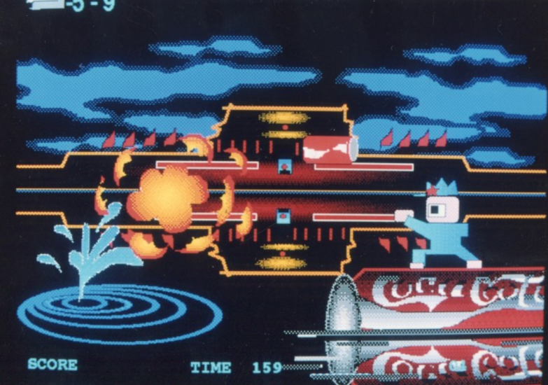

绘画的主角是一位像素化的小红军，以可口可乐罐为武器，进行一场从远古到太空的伟大长征，敌人则来自诸如《超级马里奥兄弟》（Super Mario Bros，1985）《街头霸王II》\(Street Fighter 2,1991\)等游戏文化产品无所不包。2008年的《长征：重启》（Long March: Restart，2008）实现了这个14年前的勾勒的电子游戏草图，并且在尤伦斯的8个大型投影中给予展现，观众可以使用一个无线游戏控制器打通游戏的各个关卡，因为空间的巨大以及角色的运动速度，旁观的观众也需要快速挪动脚步和转身才能跟得上长征的步伐。

冯梦波1991年从中央美术学院版画系毕业，恰逢中国当代艺术进入国际视野，对新技术的迷恋与钻研使其作品在当时备受瞩目。2004年，冯梦波将早年视频动画作品制作了数字化转录\[4\]，其中有许多艺术家许多借助早期苹果电脑Macintosh LCII的图形绘制软件以及演示软件Aldus Persuasion v2.0进行的动画创作，其中就包括了与同名油画同样作于1994年的动画版本《游戏结束：长征》。其中可见其在1994年前后已用“梦波游戏（Mb Video Game）”来作为作品出品的主体。

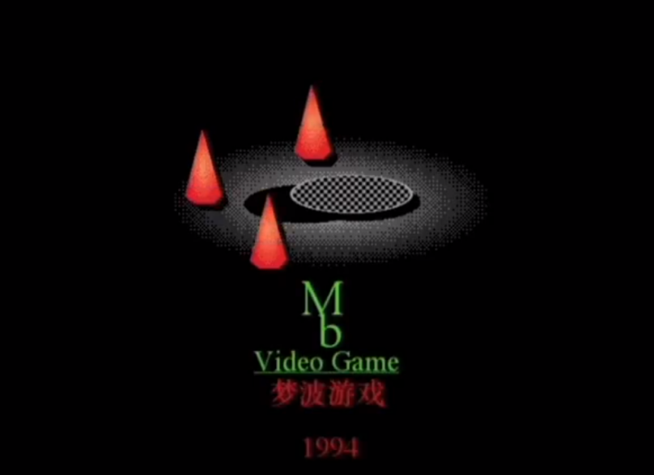

在千禧年前，冯梦波的电子游戏相关的作品更多是利用捕捉卡从Sony Hi8捕捉游戏画面到电脑剪辑，并借助当时唯一的互动多媒体内容创作软件，Macromedia Director与Quicktime进行后期处理并且制作成的互动视频。在创作了入围卡塞尔文献展的中国第一个基于电脑创作的艺术作品《私人照相簿（1996）》后,游戏开发公司Id Software在当时推出了有着独特画面表现的《毁灭战士》（Doom，1993），很早就接触到电子游戏的他将这些游戏中的影像变为了其艺术创作的素材。

冯梦波将之前自己擅长的交互视频的技术，延续了早期创作的《智取威虎山》（Taking Tiger Mountain by Strategy ，1994）的母题，通过自己制作并拆分《毁灭战士》的游戏素材，与电影素材剪辑，制作了这个虚实结合的作品《智取Doom山》（Taking Mt Doom by Strategy ，1997）\[5\]。

1999年，恰逢Id Software的新作《雷神之锤3：竞技场》\(Quake III ：Arena，1999\)推出，冯梦波写作了剧情脚本并花费八个月时间单人制作了一部短片《Q3》（1999），使用MiniDV对屏幕拍摄素材并且进行蓝幕抠像，将自己形象融入进了游戏之中，这即便是在引擎电影（Machinima）的发展史上，也是相当早期将游戏画面引入艺术创作中去的例子。其中有一段和游戏中角色的虚构对话十分精彩：

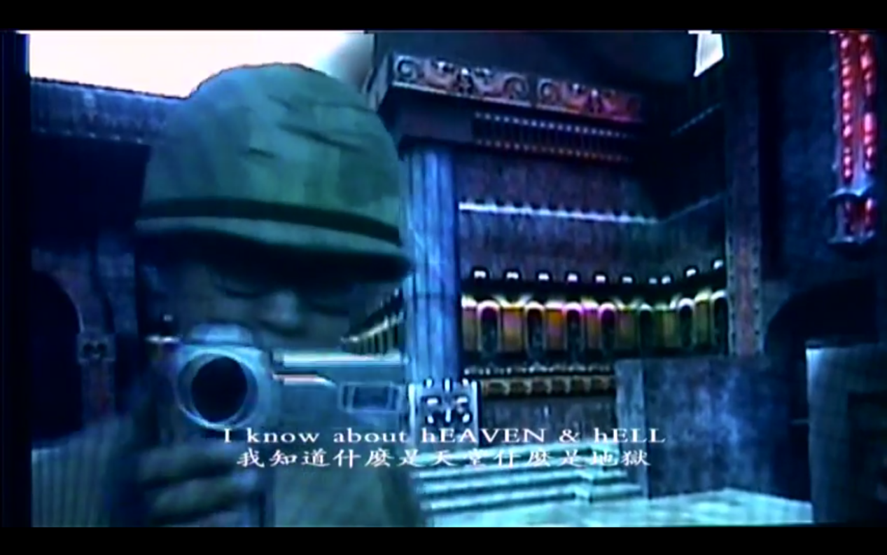

《雷神之锤3：竞技场》区别于前面几作，它没有线性的单人故事剧情，而完全聚焦在多人对战中，（单人模式也是以与电脑机器人（Bot）进行对战完成），所以最终对于艺术家，其呈现出的并非有始有终的线性战斗，而是无止境地重复与杀戮。

得益于高度可定制化的“修改”（Modification）的游戏，以及开放的源代码，冯梦波不满足于利用后期进行游戏画面制作再拼接与处理，他开始希望能够介入游戏引擎之中，制作出一个可玩的游戏Mod。

2002年制作的作品《Q4U》（2002）再次进入卡塞尔文献展，这也是文献展有史以来第一个谢绝未成年人参观的作品。作者以自己的形象制作了建模贴图来替换游戏中的角色，就好似有无数个冯梦波在互相厮杀。装置可供两位现场观众操作，并有第三台投影自动切换视角直播。《Q4U》在卡塞尔展出期间，开放服务器地址给全世界的玩家自由加入。

同年所制作的《阿Q》\(Ah\_Q，2002\)继承了《Q4U》中人物模型，并使用跳舞毯来替代游戏中的键盘与鼠标进行操控，这种非常规、身体化的交互界面使得游戏的操控和射击变得笨拙与艰难。

2008年，冯梦波在尝试将游戏引擎作为一种绘画工具，继承了他对于艺术史上自动绘画系统的兴趣，通过修改一行《雷神之锤3》的游戏代码：r\_drawworld，调整参数，他发现了捕捉一系列动画帧的可能，创作行动派或未来主义式的艺术作品《Q2008》（2008）。

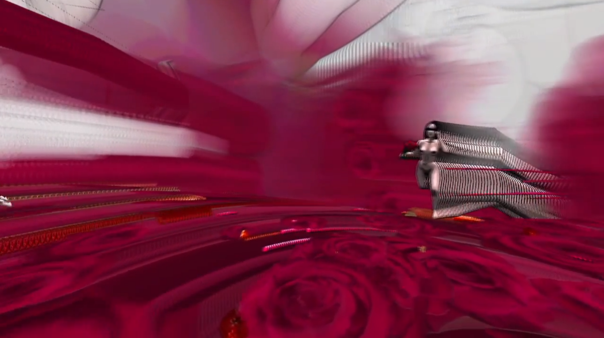

这种借助引擎进行自动作图的思路延续并同样出现在其后的游戏装置与书法作品《不太晚》（Not Too Late，2010）中，游戏引擎进行自动的演化进行绘制出如同书法的笔触，艺术家通过定时的截图来制作成平面绘画作品，并且在此基础上进行书法的再创作。而再往后的《Q2012》（2012）则将《Q2008》升级为了高清投影，呈现出黑白电影的效果。

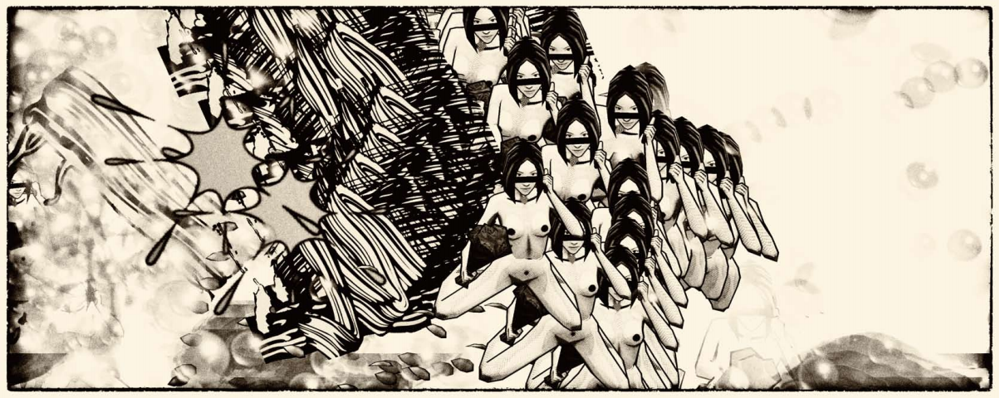

2008年，完成《长征：重启》后的冯梦波希望创作一个如同1993年Midway开发的《真人快打2》（Mortal Kombat II,1993）的游戏，艺术家希望其游戏作品能反映现实，故其将生活中的亲朋好友的形象通过大量的抠像动作进了这个游戏作品《真人快打》（2011），并使用了古早的舞美技术幻影成像（Holovision），使其得以与真实的场景结合。

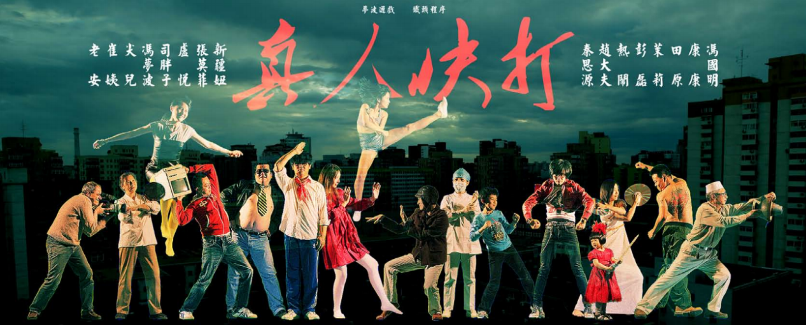

### **郑国谷**

> “了园”正向另一种审美骤变，一种有别于思想、观念、时间或符号学的审美，它是一种土地能量学的审美。这种审美让一个艺术家的意识与定力在大地上深深地扎根，与隐藏在大地的各种各样的能量聚集点对接，并相互响应，让现实的矛盾在现实中互相中计，并顺利产生灵感。\[6\] ——郑国谷

郑国谷 1970 年出生于广东省西南部的阳江，毕业于广东美术学院，主修版画复制，90年代创作了《阳江越轨青年》。郑国谷所在的阳江当时的阳江青年日常娱乐赌球，沉浸于网吧游戏之中，小城镇生活与时代的快速发展形成了某种虚拟与现实的冲撞。

2000年开始，他在阳江购买了一片5000平方米土地，以当时90年代流行的全效工作室（Ensemble Studios）开发的即时战略游戏《帝国时代》（Age of Empires，1997）中的建造模式为模版，借用了波普艺术的概念，希望能够将这种种地-建造-城堡-世界奇观的模式从虚拟搬运到现实之中。

在这个名为“帝国时代”的建造计划中，他使用生活中随处可见的材料，收集来自“上一秒到这一秒之间无限的空间里，从虚无缥缈里迸发的惊喜”的灵感，在与当代农民交易得来的土地上进行不断地的建造，同时与相关部门进行各种斡旋与妥善处理其违章搭建问题。

2016年，随着建筑的实践越来越倾向于东式风格，也随《帝国时代》游戏的没落与个人创作的体悟，郑国谷将“帝国时代”重新改名为“了园”。郑国谷的了园的建造过程就如同游戏地图的设计，每一丛植物的设计和安排，都会考虑到人在其中所感受到的状态，在时间中连续不断地改变。

### **曹斐**

> _2008年夏天，北京奥运会开幕前夕，我在蛇形画廊大堂空间展出了《人民城寨》项目，正式宣布开工建城，那时大家都有一种对未来的极度亢奋与乐观。开幕的时候，我们连线在地球上不同角落的友人，用各自虚拟化身登陆人民城寨的空中预览中心，在落地窗前一同观赏虚拟宇宙中的电子烟花，人们继而飞出窗外，在悬浮的奥运标志上雀跃起舞。\[7\]_

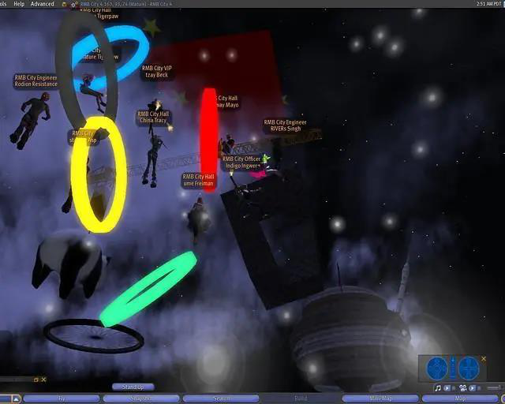

时间恰逢西方世界流行着Linden Lab制作的《第二人生》（The second life，2003） ，这个基于因特网的虚拟世界因媒体报道而在2006年末开始受到广泛的关注，在2007年达到500万的用户注册量。

在这个网络社区之中，玩家都有一个作为居民的虚拟化身（avatar），可以自定义其形象，玩家可以通过其中的本地聊天与私信（IM）进行交流，使用名为Linden币的货币，并且通过自由制造商品提供服务进行买卖。

游戏的一大特色就在于其虚拟世界中绝大部分物品都由居民而非开发者创造，居民可以借助游戏中的3D建模工具建造虚拟建筑，风景，交通工具，机器等，也可以利用系统之外的各种图像，动画创造出更精细的物品上传，使用，交换和出售。其中还有一种名为LSL的脚本语言可以为物品添加自主行为。而这也就成了许多艺术家创作的出发点，其中就有曹斐。

持续观察年轻人文化的中国当代影像艺术家曹斐，借助其化身，名为“中国. 翠西China Tracy”的角色，在2007年在游戏中搭建了名为《人民币城寨》（RMB City，2007）的一座奇特建筑物，建筑物上充满了各式各样非常具有代表性的中国建筑、中国文化符号，比如鸟巢、东方明珠塔、天安门等等，被称作“一个浓缩了几乎所有中国当代城市特征的新城，它是一系列高度自相矛盾的、相互整合的、充满揶揄与质疑的、同时散布极度娱乐和政治意识的新中国画境。”

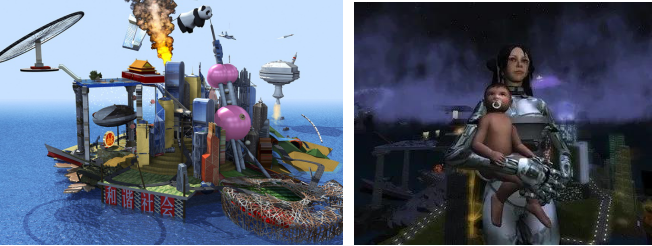

围绕此建筑，曹斐制作了名为《人民城寨——第二人生城市计划》录像作品，在随后直到2011年的时间中，拍摄了《人民城寨的生活》（2009）、《人民城寨的诞生》（2007-2011）等虚拟电影。

除此之外，曹斐借助“中国翠西”的角色展开了创作，如《中国翠西展馆计划 China Tracy Pavilion Project》并拍摄了一系列第二人生记录片《i.Mirror》\[8\]以及诸如《The Fashions of China Tracy 04》 （2009）的摄影作品\[9\]。作品通过剪辑加上后期的对白以及音乐，非常动人。

### **顾德新**

如果说曹斐所实践的当时风靡全球的《第二人生》是一个真正意义上具有经济产值的虚拟社会，那么以单机版起步的《模拟人生》则更受限于游戏设定的程序逻辑，是一块让玩家自我耕耘、复制梦想、通过资本积累建标准化完美人生的试验田\[10\]。

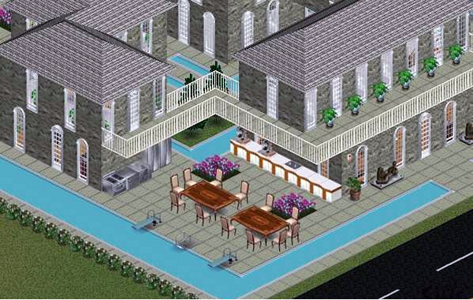

作为中国当代早期十分具有影响力的概念艺术家，顾德新在其停止艺术创作的前一年，在电脑游戏“模拟人生”的启发下，顾德新运用镜子、大型建筑模型、大量的其游玩《模拟人生》的录像和截图照片以及霓虹灯字在外滩三号沪申画廊内建立起一个虚拟城市。

_冰冷、简洁、空荡的现场与五彩斑斓、频繁刷新的游戏情景迥然不同，这让观众一进入就与游戏里的互动世界划清界限，并且不太容易理解艺术家想要表明的意图。整齐排列的模型、被标价的虚拟商品深具符号性，它们一方面与艺术家在游戏中的角色身分和生活场景有所关联，另一方面则是商业系统中最直观的个人价值的显现和象征。而由这些类型化的物质样式所营造出的模式化的样板生活，则更像一种美好人生目标的讽喻。玩游戏的顾德新没有让我们发现游戏的乐趣，如同展览不提供互动和接口，却呈现出冷酷的矛盾与反常，还有言不尽意的遗憾。当透过狭小的镜面窗口看到与镜像交错的外滩风景，那个疯狂运转的真实世界倒更像一场没有终局的游戏。\[11\]_

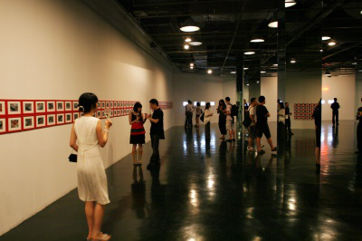

### **郑达\[12\]**

数字媒体设计专业出身的郑达并非由当代艺术切入电子游戏，相反，他是从制作游戏而进入的当代艺术领域。学生时代在法国同学的影响下，开始使用了图像节点编程的实时3D环境虚拟实境编辑软件Virtools制作互动式场景，2006年开始，华中师范大学执教期间，与团队一同制作了严肃游戏（Serious Game）《热血救助员》（2008）\[13\]。

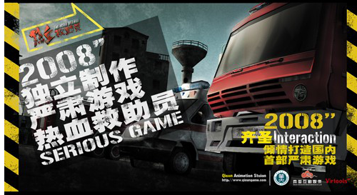

这是一款面对社会公共突发事件中的应急求生训练的三维游戏。游戏的主题是让玩家在游戏的模拟体验中学习正确的求生急救专业知识。

后郑达将《热血救助员》作为来源，将其中的某些素材抽出加以创作为《多种物》系列游戏艺术作品，《多种物C的起源》（The Origin of Multi-Object C，2008），《多种物E》（Multi-Object E，2009）以及《多种物H》（Multi-Object H，2010）。\[14\]

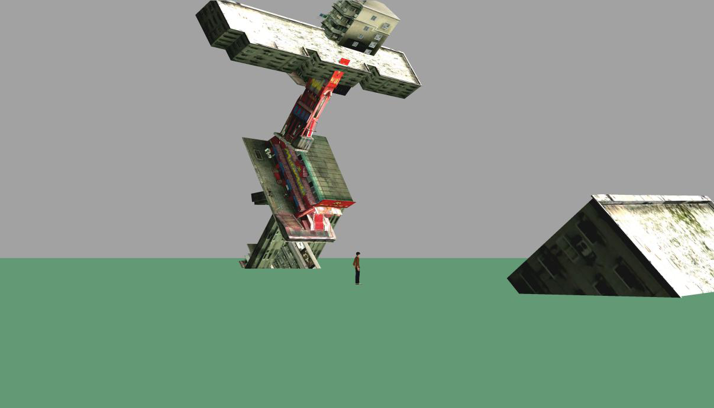

郑达创作的这些作品在当时使用了三墙投影的方式，观众需要控制主角在水面上奔跑，使用鼠标和键盘进行真正地交互，通过点击漂浮的物品将其变为碎片凝固，水面不断上升而淹没玩家，最后完成游戏。

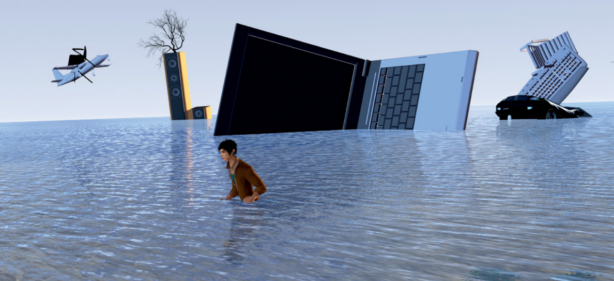

### 

## 第二章 正发生的中国当代艺术中的“游戏”作品（2010-2020）

2010年之后，随着游戏制作工具的普及与民主化，技术软件的易用性加之团队合作的普遍化，国外独立游戏潮的兴起，游戏在慢慢地被更多人认识与接受，不仅逐渐开始成为作为一种愈发重要的大众文化，而其作为拥有强烈体验表达与新媒体高互动性的媒介亦得到了更多关注。

有更多的新媒体艺术家开始尝试使用游戏这一“新潮”的表达手段来进行创作，其中许多作品都是脱离某些已有的游戏作品的独立完整的游戏创作。

### **陈轴**

《模仿生活》\(LIFE IMITATION，2017\)是青年艺术家陈轴的电影处女作，该片获2017年哥本哈根国际纪录片电影节 “新视野奖”。作品细致描绘了几位在上海生活的年轻人的日常生活，巧妙穿插了微信对话以及《GTAV》的游戏场景画面在其中\[15\]。

### **陆扬**

毕业于中国美术学院新媒体艺术家陆扬一直在处理与ACG（动画Anime，漫画Comics，电子游戏Games）相关的材料，其2019年的新作《器世界大冒险》（Material World Knight，2019）糅合了先前一系列创作，其中经过基因编辑的人类；外骨骼机械强化后的人机合成体；以及难以用生命体来界定的机器人都被放置进这样一个完整的，可互动的电子游戏形式中，形成一个混杂且强烈的异次元世界，展现出毁灭与重生，欲望与情绪等带有浓厚佛学色彩的问题。玩家在一个半封闭式的名为“神秘宇宙装置”的银色空间中使用游戏手柄来玩这个作品，操控角色按照箭头指示进行飞行或行走的移动，对怪物进行攻击，并且达成通关。

《器世界大冒险》的游戏程序由一家位于香港与伦敦的数码工作室元物Meta Object\[16\]支持与合作，而最近陆扬开始制作的数字人“独生独死”也大量进行了合作，采用了在游戏工业中虚幻引擎，实时动态与面目捕捉，照相扫描建模等方式。\[17\]

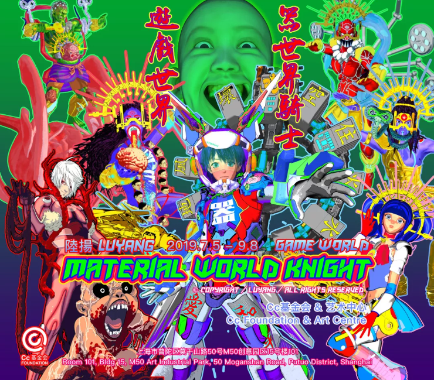

### **佩恩恩**

天梯系统是各类电子竞技游戏排名对战系统，根据玩家在游戏对战中获得的数据来积累积分，获得排名，将不同排名的玩家分类至不同的段位。艺术家佩恩恩很早便开始了对于中国电子游戏行业的观察，通过其2018年创作的作品三屏录像作品《天梯系统》（Ladder System，2018）表达了佩恩恩对其的认知：

> 天梯系统是结合了监控-排名-选拔-奖励-惩罚于一体的24小时实时更新的人才调控系统。它是一个不休市的“股票市场”，玩家的积分根据表现实时变动，大多数玩家困于中间段位就难以往上爬，顶层段位想要维持就得不断获得胜利以维持积分不被超越，这套积分排名算法能获如此大的成功依赖的正是复杂的人性。《天梯系统》将观众从玩家的位置转移到游戏开发者的位置，在影像中，佩恩恩将数据转化为影像，强化了整个天梯系统的控制属性，玩家被游戏绑定并不断生产数据。

### **关子维**

香港艺术家关子维（Alan Kwan）在2011年，录制了18个月的自己生活的视频和音频片段，通过电脑游戏来将他的这些记忆片段存储起来，用电子游戏的3D场景构建出适合这些不同记忆碎片的建筑或地点，制作了《坏旅行》（Bad Trip，2012），玩家就可以如同一般的步行模拟游戏一样在其中探索，在不同的地点和建筑里存放着不同的隐秘的记忆碎片。

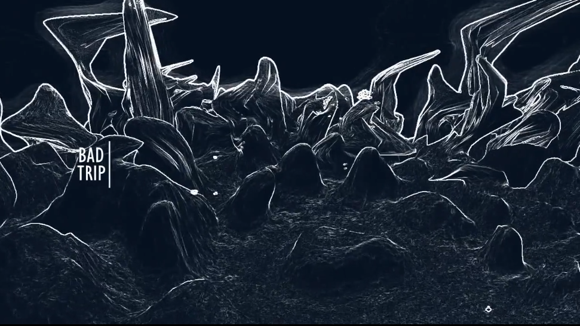

2016年，他根据童年记忆创作了一个互动游戏《走廊》（Hallway，2016），成功地用无限的房屋迷宫传达了一个小男孩被无助地困在香港住宅楼的走廊间的绝望体验，玩家在其中与不同的物件尝试交互，探寻一个解脱的可能。

而2021年，由关子维与策展人与游戏专栏作者杨静所制作的，由DSL Collection提供赞助开发的展览游戏《[Forgetter](https://store.steampowered.com/app/1499990/Forgetter/)》登上了Steam，直接面对玩家，某种意义上或许意味着一种数字媒体艺术与电子游戏的去中心化分发特性的贯通与突破当代艺术场域稀缺性大胆的尝试，值得肯定。

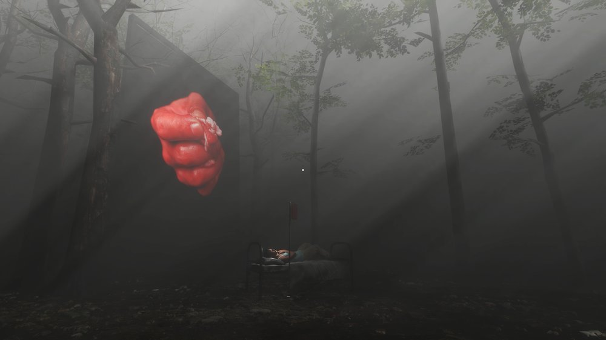

### **田晓磊**

毕业于中央美术学院数码媒体专业，田晓磊作品多以人与科技关系为主题，他感兴趣这个时代快速迭代的不确定性、物种演化中科技与生命结合的杂交时代新物种。\[18\] 其过硬的3D技术，精细华丽的模型和对于视觉语言的大胆尝试形成了其特殊的个人风格。

其作品直接以游戏的形式呈现，早期创作以VR游戏为主，使用HTC VIVE的《赛博格游戏》（“Cyborg Game”VR Game,2016）《赛博格的秘密》（“Cyborg’s Secret”，2018）已经显露出对于交互的理解。

《赛博格游戏》由三个小游戏作品《必然》（Inevitable）、《创造》（Creation）、《秘密》（Secret）构成，使用了一些动作游戏中的常用交互，如射击，击打等，其中交互的规则和场景化设置有较好的融合\[19\]。

关于投掷星球的两个体感游戏《寻星》（Chase，2018）以及《尽头》（The End，2019）借助了XBOX Kinect技术，在这两个游戏中玩家丢出的星球会随即反弹并且留下痕迹或者吸引宇航员NPC的追逐并引发爆炸。

从《“我要为你跳支舞！”》（I am going to dance for you！，2018） 开始，田晓磊晚近的作品《大乐园》（Paradise，2019）与《逆行》（Retrograde，2019）都开始呈现为PC的游戏作品。

其中《大乐园》是基于其早期的影像视频作品《欢乐颂》（Song of Joy，2011）以及《乐园》（Paradise，2010），将当时虚拟的游乐园小岛放置在游戏中，各种无脸的，穿着西装的人们在其中，玩家扮演一个“自由的囚徒”,体验十个不同的游戏。

《逆行》则是制作成了一个跑酷的躲避游戏，玩家身着西装的人在城市中孤独的奔跑，他与其他人奔跑的方向相反，躲避人潮和障碍，并且不断发问“我去哪？他们去哪？”

### 

## 第三章 作品分析以及原因探索

对于这些不同的与电子游戏相关的艺术创作，从电子游戏在其中扮演的角色和受到的处理出发，我们可以粗略地规划出几类。不同艺术创作有自身特性，故以下的分类难以做到完整归纳，只是一种试图寻找其不同作品之间共性的尝试，并且与一些国际上的电子游戏相关的艺术作品形成对照。

### 作为社会现象与文化符号的电子游戏

电子游戏从上世纪末兴起进入中国，在发展中逐渐成为一种不能忽视的文化，进入社会的日常生活之中，而电子游戏这件事也称为一种富有当代性的社会现象为艺术家所关注。

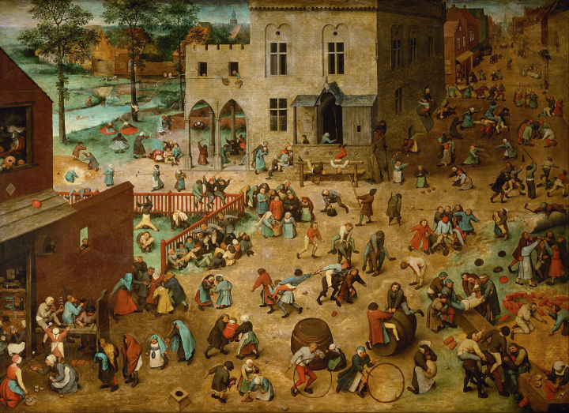

就如同勃鲁盖尔时期以当时社会的游戏共同体绘制的《儿童游戏》， 杜米埃\(Honore Daumier\)的《玩象棋的人》\(The Chess Players，1863\)，印象派时期塞尚（Paul Cézanne）的名画系列《玩纸牌者》（Les Joueurs de cartes，1894-95）一样，玩电子游戏的行为，玩电子游戏的人也都成为一种当代艺术的文本与描绘的对象。

上文提及艺术家佩恩恩对于有对于当代DAU（日均活跃用户Daily Active User）均值达到一亿的《王者荣耀》排位系统进行了的伦理批判反思，采取一个跳出的观察者的视角呈现的《天梯系统》。

艺术家乔恩·拉夫曼 \(Jon Rafman\)的视频影像作品《荣誉密码》（Codes of Honor, 2011）描绘了唐人街游戏厅（Chinatown Fair）的传奇玩家艾迪·李\(Eddie Lee\) 所使用的以完美防御零失误的方式等待对手犯错的“纽约式玩法“ \(New York-style\)和他的经历。

哈伦法罗基（Harun Farocki）的纪录影像《严肃游戏》（Serious Game，2010）四部曲对科技与暴力图像的研究中就涉及到了计算机游戏的虚拟场景如何同时用于美军在部署战区前的训练，以及为遭受战场创伤的士兵做心理护理。其去世前的最后一个重要作品《平行I-IV》（Parallel I-IV, 2012-14），则是从一个貌似细枝末节的问题研究开始：电脑游戏出现的前三十年，对树的表现形式的变化，来将电子游戏的视觉表现作为一种艺术史进行考量，思索一种虚拟数字世界的人类学\[20\]。

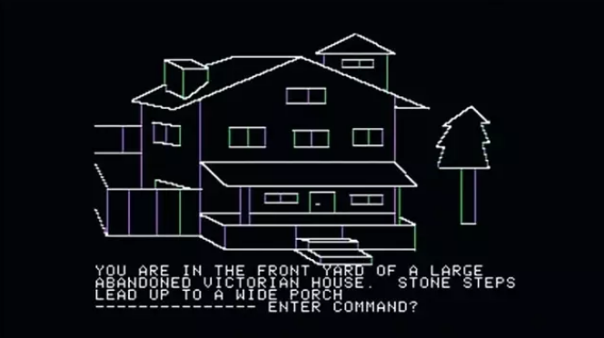

而这种青年时期的电子游戏游玩记忆，以及如今的日常对电子游戏的消费也成为了艺术家经验。诸如郑国谷《帝国时代》的直接灵感来源。而游戏从亚文化到主流文化的转变，其保留下来的视觉文化于符号，也深深的影响了冯梦波的创作，例如有浓厚马里奥像素风格的油画组画的《游戏开始》。

### 作为材料的电子游戏

得益于游戏画面拟真度的增加，艺术家开始直接挪用游戏画面作为作品，或作为作品素材。

这类最常见于游戏的摄影作品，例如EA的艺术家在《对马岛之魂》中的摄影作品。顾德新的模拟人生展览也是此类，通过在其《模拟人生》的游戏存档中进行截图来作为图像展示。以此Quake引擎短片而兴起的引擎电影也是将游戏画面与片段进行一种叙事性的编排，乔纳森·维奈勒（Jonathan Vinel） 将《侠盗猎车手五》（Grand Theft Auto V，2013）里的游戏画面剪辑而成的一部短片《马丁哭了》（Martin Pleure，2017），讲述了一个关于爱和失去的故事\[21\]；而曹斐以中国翠西进行的一系列影像创作和摄影也是在完全在电子游戏中进行的。

但因为单一的游戏画面图像素材以及电子游戏缺少自身的文本性与意义，所以艺术家在以其作为研究创作的时候大概常有延伸，与现实的艺术史或艺术实践活动联系在一起。

肯特·希里（Kent Sheely）的参展作品《胜利之日战争新闻学》（DoD，2009-2012）中艺术家将开火键改造为屏幕截图的获取，并且通过隐藏UI等处理，使得游戏截图呈现的战场效果有一种如同战地摄影师罗伯特卡帕（Robert Capa）的充满颗粒状和模糊的效果。

除此之外，这种一般多来自于一种对于传统艺术或场景的再现。数码艺术家罗克·赫姆斯\(Roc Herms\) 在《GTA5》当中重现了另一位艺术家的在世界各地的著名地标前竖起中指的行为作品——研究视角”\(Study of Perspective\)，赫姆斯在《GTA》中模仿了这一行为，在洛杉矶市内穿梭，并在城市标志性场所前竖起中指，两者都是对权威系统性和象征性的批评。

肯特希里（Kent Sheely）的另外一部作品《重回二战》（World War II Redux，2009）使用阀门（Valve）游戏公司的游戏《盖瑞的模组》（Garry‘s Mod，2004）来重新构建第二次世界大战的著名摄影作品相似的摄影画面。

除了将游戏中的画面与现实艺术史作参照，也有艺术家借助已有的游戏内的画面作为一种材料进行材料之一进行使用与再加工。 其中如冯梦波早期的《Q3》《智取Doom山》就是此类，使用了游戏画面作为叙事片段，用蓝幕拍摄技术与剪辑构建出完整的新叙事。如陈轴《LIFE IMITATION》也依旧延续了这一使用方式，在电影创作中中大量使用《侠盗猎车手5》的片段，当游戏画面开始无限逼近现实，游戏画面成为一种很好的处理虚拟与现实的关系。

### 游戏空间作为一种艺术实践场所

在线下空间匮乏的情况下，电子游戏空间逐渐成为一个似乎理想的，且新潮的特殊空间，在《The Second Life》之中，曹斐创建的Avatar-中国翠西，进行了许多的艺术实践，摄影，记录影像，申奥成功后的线上活动。

而对于顾德新或策展人陈旻来说，《模拟人生》系列游戏也成为了一个创作艺术的场所。

在2020年的后疫情时期，艺术家aaajiao（徐文恺）在其个展洞穴模拟器（Cave Simulator）中做了一个活动名为《动森交换故事》，每周邀请一位《集合啦！动物森友会》的玩家到他的岛上与他交换故事。

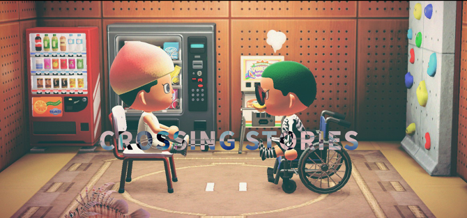

### 超越规则的游玩与改造

艺术家在游戏中的实践需求常常受到游戏规则的限制，对于此种限制的反思以及对于既有游戏的设计的反思常常以一种行为艺术的方式呈现为特殊的游戏游玩实践，一种元游玩（Meta Gaming）或者反游玩（Counter Gaming）。

《美国陆军》为美国政府征兵由政府投资的一款游戏，来自美国阿伯泰大学（Abertay University）的教授兼艺术家约瑟夫·德拉普（Joseph DeLappe）在其中进行了一次行为艺术《死于伊拉克》（Dead in Iraq，2006），在游戏中每当一位玩家阵亡，Joseph DeLappe 就利用文字留言系统，发布真实在伊拉克战争中去世的美军士兵姓名、去世日期\[22\]。

肯特·希里\(Kent Sheely\)于2016年发布了一篇文章《现代和平主义》\[23\]，文章记录了他在第一人称射击游戏 《使命召唤：现代战争》（Call of Duty 4: Modern Warfare，2007）中尝试不开任何一枪来通过游戏，违背游戏设计者的意图来进行过关，并且对此种“保护生命”的行为进行反思。

除了采取一种特殊的游玩态度与方式外，有一定有技术积累或工具使用能力的艺术家会借助游戏的内置地图编辑器或提供的游戏改造Mod进行规则的突破甚至修改与再创造，这样既能够保留原有的游戏语境与文本，也并不需要复杂的游戏引擎和团队组件，在诸如Unity或UE等游戏引擎还未民主化的早期，艺术家得以进行电子游戏媒介的创作。

《自动保存: 城门棱堡》（Autosave: Redoubt，2018）由陆浩明（Andrew Luk）、彼得·尼尔森（Peter Nelson）和阿莱克斯·马伊思（Alexis Mailles）创作，是第二次世界大战时九龙半岛掩体和隧道的特定场域的再创造，艺术家通过《反恐精英：全球攻势》（Counter-Strike: Global Offensive，2012）的地图编辑器创作并还原了这个场景，将其作为游戏的地图进行游戏。艺术家认为这些3D电脑游戏技术应该被理解为军事视域的模拟，通过重建一个来自二战的地点，强调了射击游戏的意识形态隐含在3D操作空间的视野之中。\[24\]

### 虚拟与现实的参照与勾连

中国当代艺术着迷于电子游戏媒介的虚拟与现实性之间的辩证关系探讨。在许多艺术家的实践中，游戏成为了临摹的对象，仿佛是比现实还要更真实的“超真实”。

艺术家雷童以在中国大火的多人竞技游戏 《绝地求生》（PLAYERUNKNOWN’S BATTLEGROUNDS,2017）中的游戏世界作为临摹的对象进行战斗的写生，还要时刻小心突然被其他玩家消灭。而也有以 GTA 中的工厂场景为原型绘制的乔恩·帕布克斯（Joan Pamboukes） 在2008年创作的《侠盗猎车中的工厂》（The Factory from Grand Theft Auto，2008）。

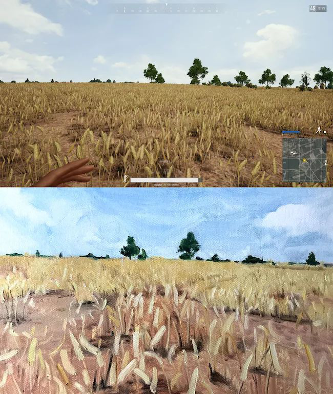

电子游戏的虚拟的目标，与现实之间的关系被艺术家持续关注着。如美军训练与PTSD治疗之于哈伦法罗基，西方所风行的“枪车球”（射击游戏，竞速游戏，体育游戏）中关于杀戮的作品涉及到的暴力、伦理以及历史性尤其受到关注。

有些艺术家将这种虚拟情形中的失败/伤害呈现为现实，构造关联，这类艺术创作在中国当代艺术家中呈现得较少：

2001年，艺术家Eddo Stern和Mark Allen举办了一个游戏竞技比赛“Tekken Torture Tournament”（铁拳折磨竞技场），《铁拳》（Tekken，1995）是索尼PlayStation上最热门的格斗游戏，他们让参与的玩家在手臂上穿上会发出非致命电流的装置，电流会与玩家在游戏中的角色受伤相连，参与的人都需要签署一份免责文件。

德国艺术家Volker Morawe 和Tilman Reiff同样创造了一台能够施加物理伤害的游戏机——PainStation，玩家用右手操作来玩一个和早期游戏Pong类似的游戏，左手则是放在一个艺术家称作PEU（Pain Execution Unit）惩罚执行单元之上，这个单元会烧灼电击，并且甚至包括了一条小金属鞭来施加真正的物理伤害。\[25\]

在马修·切拉比尼\(Matthieu Cherubini\)的作品《阿富汗战争日记》（Afghan War Diary，2010）被连接到一个《反恐精英》的在线游戏服务器中，每当有玩家进行成功击杀的时候进行实时的碎片搜索，这些碎片会触发数据库中按时间顺序进行的搜索，该数据库包含超过75,000份有关于阿富汗战争的秘密军事报告。根据检索到的数据，网站显示在地球上的实际攻击位置。这个作品在“反恐精英”的玩家所进行的虚拟杀戮与现实的战争死亡建立关联\[26\]，模糊了界限的同时再度叩问了电子游戏中的无限循环的暴力过程。

### 游戏作为容器

当代艺术对于电子游戏的最极简的认知为一种三维空间中的可操控的视点（view point）/角色（avatar），所以随着数字技术的发展以及新媒体艺术的实践，游戏作为一个虚拟空间，作为内容的容器提供简易的交互与浏览成为一个常见的使用，这类使用方式与电子游戏中的步行模拟类（Walking Simulator）颇有相似的逻辑。

可见如田晓磊他将其早期的作品《欢乐颂》以及其他三维艺术作品中的建模与动画放置在一个游戏空间中，并给玩家赋予一个可操作性交互角色身份，让其能够在其中以这种角度观看作品。艺术家陆扬的《器世界大冒险》游戏也是将自己过去的诸如《子宫战士》的一系列3D建模和动画作品整合为了一个完整的游戏过程，这些动画在玩家移动的空间中进行循环的播放。艺术家aaajiao的个展《洞穴模拟器》（Cava Simulator）的预告片就将整个作品的建模搬运至了游戏引擎之中，并基于此创作了带有剧本和交互选择的游戏作品《深渊模拟器》（Deep Simulator，2020）\[27\] 。关子维则从一个记忆角度去构造了一个独特的思维容器。

随着技术引擎和线上展览需求的增加，创建于2017年的艺术团体史莱姆引擎，开始尝试各类作品创作形态，展览策划与观展方式\[28\]。配合流行的虚拟现实技术（VR）以及对于“沉浸式”的强调，游戏空间与浏览背上了一种进步的技术当代性的底色。

在后疫情时代，线上展览高扬，机械复制时代下的当代艺术与新媒体艺术似乎朝向电子游戏的空间前进，虚拟空间的游戏成为一种策展与艺术作品，其带来的新奇似乎更加符合当代的观众，它会成为一个“终极”的新媒体艺术形式吗？

### 生成艺术与模拟游戏

与将电子游戏作为玩家可以进入并且浏览静态物的容器不同，在中国当代艺术家的处理中也有将电子游戏视作一种自洽的，不断生长的模拟系统。通过游戏mod修改或者是游戏引擎创作出有一系列规则的世界，电子游戏与某种生成艺术（Generative Art）联系在了一起。

冯梦波的作品《Q2008》，《Q2012》以及《不太晚》被他自己称作用电子游戏引擎驱动的“行动绘画”项目，在重新设计了游戏Mod之后，借助游戏引擎的程序接口将时间序列的图像呈现在屏幕上，留下痕迹，让三维电脑游戏引擎成为一种画具，成为一部二十一世纪的自动绘画机器。

华裔当代艺术家郑曦然（Ian Cheng）创作的《使徒》（Emissaries，2015-2017）系列是关于认知进化的模拟，他使用Unity引擎制作这样一个能够无穷演进下去的虚拟世界，他尝试拼贴了不同的思维方式，例如内在需求，或者威胁需求，或叙事需求其中的生物基构建的AI行为让其这样的生态环境有了某种涌现式（Emergent）的效果，他称其为“现场模拟”（live simulation）。

### 游戏设计与交互

由于技术能力，早期人数的限制以及游戏引擎尚未民主化的缘故，早期艺术家多为前文所说的借助于游戏修改，而不是自己真正去制作独立的电子游戏，因为其需要大量的素材和技术积累，而有些对电子游戏制作有执念和追求的艺术家，在早期便尝试使用各类对编程要求不高的图形化节点式编程或者逻辑语言的多媒体工具进行开发，例如冯梦波的作品《真人快打》（2010）与《重启：长征》（2008）都是使用《多媒体熔炉》（MMF, multimedia fusion 面向对象的游戏程序和多媒体程序设计工具）进行开发的，而郑达则是在05，06年时接触了法国Virtools实时3D环境虚拟实景编辑软件进行的开发，借助先前的数字媒体设计的背景以及游戏的开发经验而制作后来的《多种物》系列。

所以其实只有小部分电子游戏相关的中国当代艺术是独立且拥有设计的"可玩的"机制的电子游戏艺术的。冯梦波的游戏作品《重启：长征》与《真人快打》有着《超级马里奥》或者是《真人快打》这样的射击跳跃与对战的可玩性，因其正是来自对这两部作品的一种戏仿与修改制作。

晚近也能看到关子维的《走廊》有明确的关卡，交互与目的。田晓磊的作品有机制设计的部分，早期其《VR游戏》大部分借助常见的射击，击打等符合引擎特性的玩法，晚近的《逆行》更进一步，整体呈现为相对简单却统一的机制设计。《Forgetter》中没有陷入简单将展品放入虚拟空间的简单化思考，而是构造了一个整体的叙事流程，并且以打破/清理的动作基于不同的作品进行了再创作，策展在这里与展品交融，并且尝试努力挣脱艺术品稀缺逻辑的束缚。

艺术家郑达在08年的早期由对严肃游戏的研究而创作《热血救助员》时，参与了2008年的Indiecade独立游戏节，其在很早的时候就认识到游戏机制和交互的独立性与重要性，这样的思索让他在08-10年创作的《多种物》系列游戏作品的时候做出了一些游戏交互上独特的尝试。

在这类游戏中，有一些艺术家开始尝试通过交互界面的改变而带来一些变化，例如冯梦波的《Ah-Q》使用的跳舞毯的界面来操控《雷神之锤》的mod与敌人进行混战，这种输入的转换与国外一些艺术家的实践颇有相似之处，例如帕崔克·勒谬（Patrick Lemieux）的《八达手柄》（Octopad），将手柄的八个按键变为八个手柄上的每一个按键，通过改变映射方式带来特别的交互体验\[29\]。

### 

## 结语

不得不说，许多与电子游戏关涉的当代艺术作品与大众语境中的"第九艺术"是完全不同的两个东西，而许多以电子游戏形式呈现的中国当代艺术作品在电子游戏的设计语言上并没有深入的考究与拓展，这些作品只是借用了电子游戏的形式，文本，或空间，而并没有去真的切入电子游戏的表达，从其机制与交互来进行观念或当代性的表述。

电子游戏其自身的语言表达和机制的独立性对中国当代艺术家来说相对不受重视。以电子游戏为名，真正"可玩"的作品并不多，在游戏性Gameplay上有更多思索和表达的作品也较少。

这是很可以理解的，从上文的论述中可以看到，中国当代艺术所关涉电子游戏的点并非将其作为一种自身完备的艺术形式进行创作与实践，而是更重视其作为当代大众文化的文化现象进行反思，将其虚拟性与现实的复杂关系进行思索，作为可实践行为的特殊意义空间或承接其他新媒体艺术创作的容器。这种创作逻辑与独立游戏对于电子游戏本身的语言和机制的实验性探索是较为相反的方向。

这样的分裂似乎在国外的游戏艺术家那里会显得小一些。《山》（Mountain，2014）以及《万物》（Everything，2017）的作者大卫奥瑞利（David O’Reilly）同时活跃于游戏行业与当代艺术领域\[30\]；《尼德霍格》（Nidhogg，2014）的开发者马克·爱森（Mark Essen \(Messhof\)）的作品被洛杉矶当代艺术博物馆介绍\[31\]；游戏设计师皮蓬·巴尔（PippinBarr）也有与当代艺术家阿布拉莫维奇合作制作游戏《阿布拉莫维奇方法游戏》（Abramovic Method Games，2014）\[32\]等等。

但我们也能够逐渐看到中国当代艺术行业与游戏业界以及学界的交流趋势。

中国当代艺术场域对于电子游戏的接受常常以展览的形式呈现，例如2018年在中央美术学院举办的首届功能与艺术游戏大展“重识游戏”，其中就有腾讯的身影\[33\]，适时OUTPUT也开始举办GAMEBOX沉浸式游戏艺术展；2019年初第四届深圳独立动画双年展“游戏共生”中，有近20个跨媒体艺术家、游戏设计师、游戏研究学者的作品参展，有许多国外先锋的独立游戏\[34\]；19年中，首届之江国际青年艺术周中的“游戏的游戏”论坛有独立游戏开发者参与并且举办了一次48小时游戏开发大赛GameJam\[35\]，2019年底，上海昊美术馆举办“严肃游戏”展，其间有不少学界与业界交流的声音\[\]。2020年，Hyundai Blue Prize2019获奖展《游戏社会:狼、猞猁和蚁群》在北京开幕\[36\]；华东师范大学举办“游戏/哲学”工作坊，其间艺术家，游戏设计师皆有参与\[37\]；明当代美术馆“游戏的人”展览也开始回顾中国当代艺术中的游戏。业界逐渐呈现出交融的态势。

这样的趋势一方面是新媒体涉及到的技术门槛使得在艺术家使用更高技术的时候需要有更多的合作，陆扬的数字人《独生独死（DokushoDokushi）》就是大量合作的产物，其中与FACEGOOD数字人技术提供商以及游戏行业的其他人士进行了大量合作，其中也涉及到大量游戏引擎的使用。一方面则呈现为在线展览与艺术虚拟化的需求，新媒体艺术展对于交互性的强调，也出现了类似“史莱姆引擎”这样的组织。从游戏行业的角度来说，独立游戏的兴起，对游戏创作作者性的诉求，还有商业游戏大厂希望呈现出多元的社会文化影响，以及游戏这一媒介的的艺术认可焦虑都成为其中。

而在商业与生产经济的变化上来看，虽然艺术场域的游戏作品常常因其艺术品的稀缺与收藏属性而远离通常的玩家群体，但其实也能在某些采访中了解到艺术家有许多对商业模式与传播的想象，田晓磊与陆扬似乎有将作品搬上Steam的想法，而aaajiao的作品也能够在独立游戏作品网站itch.io上找到。

或许有一天，两条不同角度出发的道路会走到一起呢？

期待中国当代艺术场域能够不断探索，挖掘电子游戏的边界，探索电子游戏的语言；学界进行更多关于电子游戏的研究与思索，也期待业界能够更具有反思与创新意识，提高玩家素养，有更加多的独立游戏开发者，创造出更加多元的作品。

## 脚注

_\[1\] 十分感谢冯梦波，郑达老师接受《落日间》的访谈，也感谢友人杨静，陈旻，邓剑的帮助，并且感谢邀请我参与活动的昊美术馆与其策展人付了了，华东师范大学以及姜宇辉老师还有张哲川学长等，文中部分内容参考了机核网《_[_Gadio Pro：当代艺术中的电子游戏_](https://www.gcores.com/radios/102010)_》节目的论述。_

_\*\[2\] 在本文写作期间，本人与策展人杨静对艺术家冯梦波进行了一次访谈，已整理发布在播客《落日间》上《_[_E7：与中国最早的游戏艺术家聊聊游戏和当代艺术_](https://docs.xpaidia.com/podcast/e7)_》。_

_\[3\] 尤伦斯当代艺术中心：《冯梦波：重启》，《关于展览》，_[_https://ucca.org.cn/exhibition/feng-mengbo-restart/_](https://ucca.org.cn/exhibition/feng-mengbo-restart/) _2009年。_

_\[4\] 转录方式为使用视频捕捉卡，从电脑视频输出模拟讯号到MiniDV磁带，再捕捉回电脑。_

_\[5\] 目前冯梦波大部分影像作品都可以在网站找到_ [_FENG Mengbo_](https://www.youtube.com/channel/UC7l5osVyVvlUGop5nWtHkmw)\_\_

_\[6\] OCAT：《郑国谷：了园（帝国时代）》，_[_https://www.trueart.com/news/235743.html_](https://www.trueart.com/news/235743.html)_，2018年_

_\[7\] MTM：《曹斐：从历史中的电波，到永不消逝的虚拟现实》，_[_https://mp.weixin.qq.com/s/MfeG9NBBAUqzd038F8KY1w_](https://mp.weixin.qq.com/s/MfeG9NBBAUqzd038F8KY1w)_，2020年3月4日。_

_\[8\] 《China Tracy Introduction》_ [_https://www.youtube.com/watch?v=vjhKdEHg3YY&list=PLF083DFBC19CE50E4_](https://www.youtube.com/watch?v=vjhKdEHg3YY&list=PLF083DFBC19CE50E4)\_\_

_\[9\] HiArt：《曹斐：当香港成为游戏的界面》，_[_http://www.hiart.cn/feature/detail/89dfpBn.html_](http://www.hiart.cn/feature/detail/89dfpBn.html)_，2015年，3月16日。_

_\[10\] 吴蔚：《顾德新展评》，_[_https://www.artforum.com.cn/picks/903_](https://www.artforum.com.cn/picks/903)_，2008年_

_\[11\] 同上。_

_\[12\]本文写作过程中对郑达进行了一次访谈，并已整理发布在播客《落日间》中，《_[_落日间E11：生成的线索：游戏的自在之语言_](https://docs.xpaidia.com/podcast/e11)_》。_

_\[13\] 《热血救助员》，_[_http://www.souvr.com/serve/201006/23768.shtml_](http://www.souvr.com/serve/201006/23768.shtml)_，2010年6月3日_

_\[14\] 郑达，林欣编著：《低科技艺术计划+郑达》，武汉理工大学出版社2014年版，第94-133页。_

_\[15\]_ [_https://www.metaobjects.org/_](https://www.metaobjects.org/)\_\_

_\[16\] RAM：《_[_Issue \#1｜陆扬：我决定舍弃肉身， 重新投胎于虚拟世界_](https://mp.weixin.qq.com/s?subscene=21&__biz=MjM5OTAwMTUwMQ==&mid=2649879573&idx=1&sn=27d274b315964a5822c37ea95de5eb09&chksm=bec778e789b0f1f18b1b34389e031288c3bfb2d1311fa14511f3db79d04235d545d229e3a141&scene=7&key=aea9a2a3368fe01bdac33feb32aca14681da2f5960#wechat_redirect)_》_

_\[17\] 《_[_田晓磊 未来世界的奇异赛伯格_](https://mp.weixin.qq.com/s?subscene=21&__biz=MzI5MjkwODE1MQ==&mid=2247496748&idx=1&sn=00ffed43fe3824467c4f75763544edf4&chksm=ec788934db0f00224cac77514d72de531ae7e4d46e0c865c9e6e9510f6a3eea4ece6582d5fbb&scene=7&key=a82cc69f202f5983c57e0a7adf3fb0a688c40f7c7a#wechat_redirect)_》_

_\[18\]_ [_http://www.tianxiaolei.cn/2016-Cyborg-game-VR-Game_](http://www.tianxiaolei.cn/2016-Cyborg-game-VR-Game)\_\_

_\[19\] 亚当·贾斯（Adam Jasper）：《_[_游戏理论：哈伦·法罗基最后的项目_](https://mp.weixin.qq.com/s?__biz=MzA3NjUyNzAxNg==&mid=2649755899&idx=1&sn=cc35cbd9b0e3b6418d80624bf573c764&scene=21#wechat_redirect)_》引用于ArtForum，_[_https://mp.weixin.qq.com/s/Ri24M4JvL-BE0bzJa1UjZQ_](https://mp.weixin.qq.com/s/Ri24M4JvL-BE0bzJa1UjZQ) _2017年9月13号。_

_\[20\] Vice：This 'GTA V' Short About Friendship Premiered at the Berlin International Film Festiva，2017年2月17号。_

_\[21\]_ [_https://en.wikipedia.org/wiki/Joseph\_DeLappe_](https://en.wikipedia.org/wiki/Joseph_DeLappe)\_\_

_\[22\] videogametourism.at翻译见于 《_[_现代和平主义_](https://mp.weixin.qq.com/s?__biz=MzA5MzA0NTUyMw==&mid=2649885372&idx=1&sn=b6e26fc9f8000f5214f79938956399aa&scene=21#wechat_redirect)_》_

_\[23\] HOW美术馆：《\*\*_[_HOW 严肃游戏 \| 自动保存：城门棱堡_](https://mp.weixin.qq.com/s?__biz=MzA5MzA0NTUyMw==&mid=2649885165&idx=1&sn=23d4c4f1d9086753f94155b8f618d6fb&scene=21#wechat_redirect)_》2019年8月7日。_

_\[24\] Katherine Isbister：《How Games Move Us》, MIT Press, p88._

_\[25\]_ [_HOW 严肃游戏 \| 马修·切拉比尼：一切都是可以计算的吗？_](https://mp.weixin.qq.com/s?__biz=MzA5MzA0NTUyMw==&mid=2649885267&idx=1&sn=cf72fbaf5c9e1eac71c32327a8eef6dd&scene=21#wechat_redirect)\_\_

_\[26\]_ [_https://www.eventstructure.com/Deep-Simulator_](https://www.eventstructure.com/Deep-Simulator)\_\_

_\[27\]_ [_https://www.slimeengine.com/about/_](https://www.slimeengine.com/about/)\_\_

_\[28\]_ [_http://patrick-lemieux.com/projects/Octopad/_](http://patrick-lemieux.com/projects/Octopad/)\_\_

_\[29\]_ [_http://www.davidoreilly.com/works_](http://www.davidoreilly.com/works)\_\_

_\[30\]_ [_https://www.gamezebo.com/2014/07/03/nidhogg-creator-mark-essen-artist/_](https://www.gamezebo.com/2014/07/03/nidhogg-creator-mark-essen-artist/)\_\_

_\[31\]_ [_https://www.pippinbarr.com/2014/09/29/abramovic-method-games/_](https://www.pippinbarr.com/2014/09/29/abramovic-method-games/)\_\_

_\[32\]_ [_http://game.people.com.cn/n1/2018/0910/c218877-30283729.html_](http://game.people.com.cn/n1/2018/0910/c218877-30283729.html)\_\_

_\[33\]_ [_https://www.sohu.com/a/279426030\_695210_](https://www.sohu.com/a/279426030_695210)\_\_

_\[34\] 《_[_青艺周 \| 如果人生是一场游戏，那么谁是游戏的人？_](https://mp.weixin.qq.com/s?__biz=MjM5NjY2NjI1Mg==&mid=2712930569&idx=1&sn=ca02c0ff3211be5671195442a3bbdcfb&scene=21#wechat_redirect)_》_

_\[35\] 《_[_HOW讲座 \| 说不可说：电子游戏的艺术语言_](https://mp.weixin.qq.com/s?__biz=MzA5MzA0NTUyMw==&mid=2649886005&idx=1&sn=e2560bfd183e2cf36b1d2ba13eb056a3&scene=21#wechat_redirect)_》 笔者有幸以NExT Studios设计师身份参与其中_

_\[36\]_ [_https://www.sohu.com/a/402304616\_645580_](https://www.sohu.com/a/402304616_645580)\_\_

_\[37\] 陈嘉莹：《_[_工作坊｜“游戏致/至死”——游戏与哲学一日谈_](https://www.thepaper.cn/newsDetail_forward_10201281)_》澎湃新闻，2020年12月2日_

\_\_

_\*_本文发布在微信公众号 《[中国当代艺术场域中的电子游戏 \| 落日间](https://mp.weixin.qq.com/s/fMOkRcm08kW3g4PPFnOvQQ)》/ 节选发布于[腾云](https://mp.weixin.qq.com/s/Sxc1LCjHjAVVTLSFywpXSg)

\*主要内容写作于2020/12

