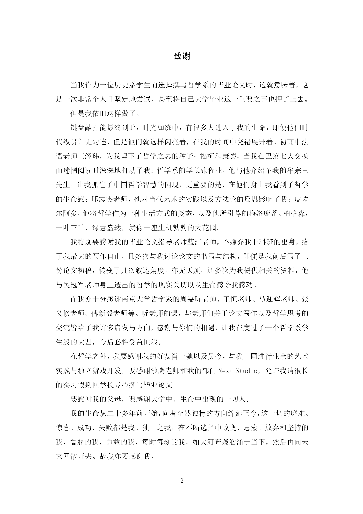

# #0 何为游戏？

周作人在其1925年出版的翻译小集《陀螺》序中，将其所做的文字工作全都称作“游戏”，并与日常谈论的游戏区分开来，

> “平常说起游戏，总含有多少不诚实的风雅和故意的玩笑的意味，这也是我所不喜欢的，我的乃是古典文字本义的游戏，是儿戏（Paidia），是玩，书册图象都是（Paignia）之一。”

Paidia是古希腊语中游戏的意思。

这系列文章是一个「基石」，但却不是以一个奠基性的方式开始，而是一个发问：

**何为游戏？**

****

### 源头

本系列的的文章的核心全部来自于本科的那篇充满了文科黑话与自我的毕业论文《潜能的游戏——重思游戏的哲学话语》，在写过那篇论文往前的两年，往后的三年至今，我做的工作都是不断地重写和扩展并且推向更远的边界，但是这确实是重要的出发点。

我也在工作和日常的实践中、和在对有毒语言的反思中重新寻找表达的方式，而腾云编辑Sean的约稿也成为了一个契机，在他的帮助家，逐渐寻找在学术与古典风格之间的某种中道，进行了Paidia 系列的写作。

我选择要把引用和来源作为列出，因为我认为我的思考大部分都是在前人的帮助下进行的，如果不作列出是某种剽窃与不尊重。但我却不希望以学院派的方式给予脚注和以圈内的话语来作为表达，在保证阅读体验的情况下，我会通过段落的参考文献来呈现出这些文本的来源，对此有探究兴趣的朋友们可以花费一些心思去寻找对应的内容。

### 结构

01 游戏严肃性的衰败：希望通过回顾游戏由庄重变为浅薄的历史，从外部的具体的历史视角中看游戏这一行为与人类文化的缠绕以及在历史过程中流变的谱系。

02 游戏态度中的严肃部分：紧接着，这篇的内容则试图聚焦于游戏者的态度，试图（共时性地）进入游戏运作过程的内部，去尝试理解游戏是如何成为游戏，而玩家又是如何参与其中的。以此展现出游戏态度的辩证性的第一个部分：谦恭与严肃。

03 游戏态度中的游戏部分（未完成）

以这三篇文章勾勒出我认为或许可以指向「游戏」思考的路线——游戏的态度。

### 感谢

在开始之前，我希望把这三年前的论文致谢放在这里，以记录一段回忆：

毕业论文下载《[潜能的游戏——重思游戏的哲学话语](https://github.com/switchball/ex\_paideia/blob/master/Essay%2018.6.15.pdf)》\

当世界的游戏变为儿戏而浅薄时，我们需要严肃；

而当严肃被固化失去生命感时，我们需要亵渎。
