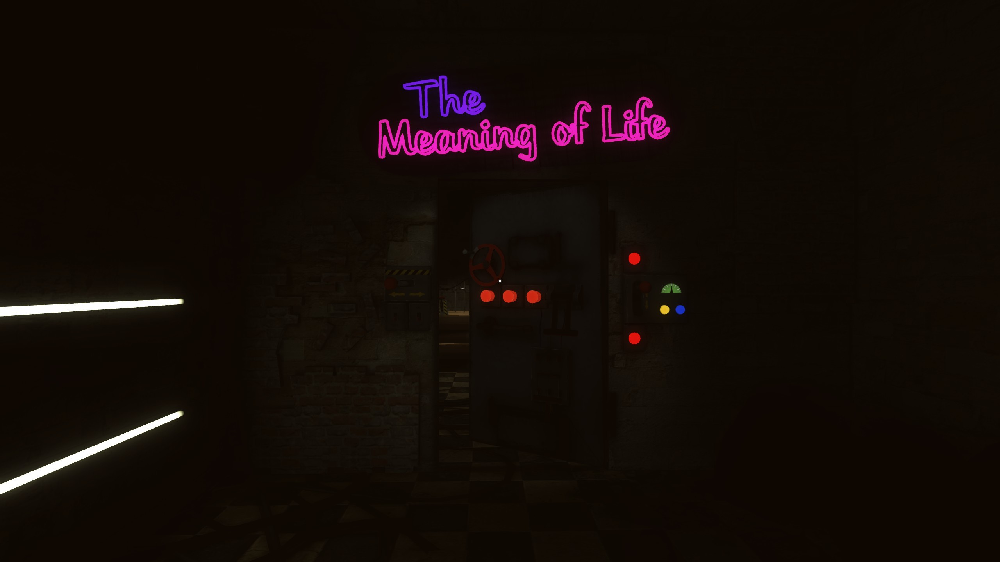
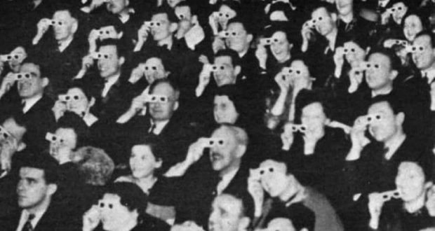
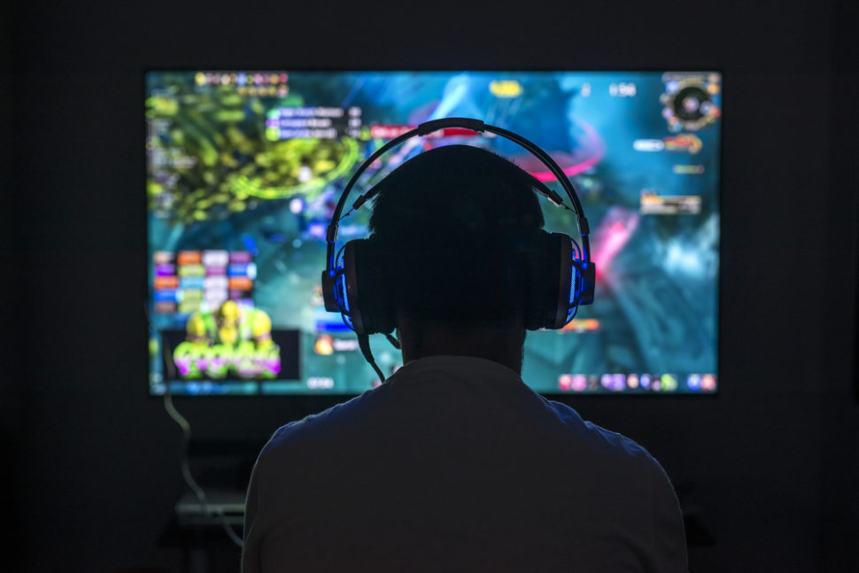

# #2 游戏的高度严肃性

本文在腾云公众号发布时，名字为《[游戏的态度：如果不“严肃”，你就无法感受它的魅力](https://mp.weixin.qq.com/s/p34QyzNl91PUCH4vcKc5BA)》

### 引子

_有一种错觉是，游戏之所以吸引人，是因为你可以在游戏世界里“为所欲为”。但事实恰恰相反，游戏的迷人之处，正是因为它的规则性，或者说“限制性”。_

_另一个错觉是，因为游戏太“真实”，所以人们才心甘情愿“陷”在其中。事实上，和看电影类似，人们是主动选择将自己置身于一种“假信”的状态，并以此感受其中的乐趣。_

_这些“错觉”的存在，恰恰说明了“游戏”和“严肃”如影随形。_

_而“严肃”或许是最好的“游戏态度”。_

### 00 孩子教给大人的事

> “我想要把这本书献给我六岁的儿子山姆......**他教会了我以严肃的态度看待并体验游戏，让我自始至终都乐在其中。”**【1】

在《游戏改变学习：游戏素养、批判性思维与未来教育》一书的序言中，美国著名语言学学者詹姆斯·保罗·吉这样感谢他六岁的儿子。

以严肃的态度来看待游戏，许多人都可以理解，但是“以严肃的态度来体验游戏”，这是什么意思？

在游戏中，严肃与玩乐相伴而行，形成一种辨证的诡辞（dialectic paradox），在限制与自由、谦恭与解放之间，“严肃”就像是一个捉摸不透却总是处处闪现的“幽灵”，总想摆脱人们对它的思考和定义。

让我们从游戏的“严肃性”谈起。

### 01 **没有严肃性就没有游戏**

> 没有比游戏更严肃的事【2】。—— 法国哲学家亨利·列斐伏尔

这种说法乍听起来有些不可思议。但我甚至要说：“严肃性”才是游戏成立的基础。这里的“严肃”指的是一种游戏者的心态，一种“假装”(make-believe)。

举例来说，当我们与孩子玩耍时，会假装看不见蹩脚地躲在窗帘背后的孩子；我们在踢球的时候，会假装与对方是对抗的敌人；动物们在追逐嬉戏的时候，即便不会伤害对方，也会装作在捕猎而轻咬打闹。

荷兰文化史学家赫伊津哈在《游戏的人》中也举了一个让人印象深刻的例子：“一位父亲发现四岁的儿子坐在一排椅子的前端玩‘开火车’游戏。他拥抱儿子的时候，男孩说：‘别亲火车头，爸爸，不然车厢就知道它不是真的了。’ ”【3】

**每个孩子都心知肚明他“只是在假装（only-pretending）”，但这种“假装”绝不是一种不严肃的态度。这种假装实际上是一种对于规则的认可，对于游戏某种虚构本质视而不见却又沉浸其中的态度的“严肃”，才能让这个游戏进行下去。**

人类学家罗杰凯瓦卢（Roger Caillois）将其称之为假装Make-Believe，一种与现实相对应的非现实性/第二现实的特殊态度。【4】

哲学家伯纳尔·舒兹在《蚱蜢：游戏，生命与乌托邦》中则将其称之为“游戏态度（Lusory attitude，拉丁文ludus，意指游戏）”，指这样一种“奇异”的状态：人们接受游戏规则限制采取效率低下的方法，而非用直接且高效的方式来达成目标。【5】

**这种假装与严肃的态度还体现在对游戏规则的遵守。**

游戏都有前游戏目标（Pre-lusory Goal），例如四百米赛跑，目标就是从起点跑到终点；同时有我们要遵守的规则（Constitutive Rules），我们并不能骑着自行车去拿长跑第一名，或者是开着作弊器违反规则通关游戏之后说——我赢了！因为你在违反规则，或者说参与游戏的这种"假装"的时候，你已经离开了游戏。

**因此，游戏绝不仅仅是嬉皮笑脸、毫无规矩。事实恰恰相反。**

荷兰语言学家赫伊津哈一直把“扫兴的人”作为理解游戏意义的关键。所谓“扫兴的人”，就是那些触犯规则、无视规则的人，这样的搅局者（spoil-sport）褫夺了游戏的幻觉，也是游戏者最反感的。

举例来说，在餐桌上行酒令，输了游戏却不愿接受惩罚的人一定会被人“看扁”；下棋的时候，我们也不愿意和那些违反“落棋无悔”规则的人下棋；看直播的时候，我们对于开挂者和作弊者的愤怒，对于假赛和不全力以赴之人的鄙视......都说明游戏里的“搅局者”是不受欢迎的。

**由此我们也可以发现，游戏的意义与魅力并不在于人们通常认为的“自由”或是“解放”，而恰恰是在于游戏本身的“限制条件”，在于游戏使人必须“遵守规则”。**

这是“游戏”与“玩”的悖论：“乐趣源于对自由的限制而不是对自由的放纵。【6】”

### 02 **假信：游戏和艺术的“异曲同工”**

可别小瞧这种“严肃性”与“假装”。这样的态度不仅仅存在于孩子们搭沙堡、过家家游戏中，同样和审美/艺术相关联。

“小男孩将一根木棍当作木马，假装在骑马以获取乐趣。”在《木马沉思录》中，艺术史家贡布里希著名以这种“假信”为起点，探究所有艺术形式的根源。

这种“假信”的态度可以在很多艺术形式的审美中找到。

例如，对于文学作品的欣赏，有一种被称之为“怀疑搁置(suspension of disbelief)”的状态。这一概念由诗人塞缪尔·泰勒·柯尔律治所创造，指的是读者主动接受故事荒谬或在现实世界中“不可能”的地方【7】，并享受其中。如何理解？

**你可以想象一下，如果你在阅读奇幻小说时忍不住去质疑“世界上哪有这么大的龙？”“怎么可能有人脱水了还能活着？”等这些场景的“荒谬”，那么你可能会与《权力的游戏》或《三体》等作品中最震撼人心的场景失之交臂。因为你不愿意让自己处于“假信”的状态。**

同理，演员的专业表演、固定的座椅、安静的空间...电影院或剧院的这些规则，都是为了让观众忘记现实，沉浸在导演营造的叙事中。

这种在电影院中仿佛置身另一个世界而假装忘记现实的体验是十分重要的。这也是为什么大卫林奇认为，倘若在手机上播放电影，那么“一万年也无法体验电影”。【8】

一旦这种“假信”的状态被“揭穿”，在场的所有人就会从陶醉的美梦中惊醒——打破了尼采所说的观众的施魔(Verzauberung)。美妙的体验便瞬间消失。

> 玩是谦恭，不是解放。——伊恩·博格斯特（Ian Bogost）

**更进一步说，游戏规则之下的“严肃性”和“假装”中蕴含着一种对于事物的“尊重感”。**

玩家心甘情愿接受这些规则，进入这个游戏所创造的魔圈（magic circle）之中；观众同样仿佛都约定好了似的，进入电影和戏剧“不真实”的世界里。在这种状态中，人不再是以自己为中心，而是去接受事物本身的设置，去倾听艺术的声音，去接受艺术作品。

也就是说，人们心甘情愿地放下自我为中心的主体地位，而与处于客体的事物共同游戏。

在电影院里，与被“固定”在座椅上、不能随意移动、不能大声说话的观影者相比，电影本身反而成为了一个“行动者”，它仿佛在用自身的光影刺向身处黑暗中的观众，让他们被触动（affected）。【9】

**也就是说，自认为最具有能动性（agency）的人类，在电影院中恰恰不是特别“有生气”（vibrant）。如果从“非人类中心主义”的视角来看，事实确实如此。**

电子游戏也是如此。

玩家需要主动放弃自己身体的运动，放弃多余的感知方式，去接受一个由游戏设计师设定好的、由交互与反馈构成的“角色替身”（avatar）。当然，还有那些游戏世界中的复杂规则。

在这样的限制中，当玩家的操作变得越来越娴熟，他就能够感受到动作游戏中操作的美感，感受到游戏中的角色就像玩家感官和身体的延伸。一种虚拟的运动感（kinesthesia）与本体感受（proprioception）【10】被构建出来。

表面上，游戏角色是被玩家所操控的，但实际上，玩家也受着游戏和角色的限制——游戏角色或游戏成为一种具有自己生命力的主体，一种“拟生命”(quasi-life)，反过来限制和操控着玩家。【11】

**玩家在这样对限制的接受和发挥、被动与主动、操控与反操控之间，感受到游戏的美感与乐趣。**

从这个角度出发，或许就可以理解为什么哲学家伽达默尔将 “游戏作为艺术作品的存在方式”。因为游戏/艺术不再是一个对象化的客体，而成为卷入游戏者的主体，被动而却又含有主动性的意义(der mediale sinn)。

这也是为什么说游戏和艺术有异曲同工之处。

因为游戏和所有艺术的运作方式，都涉及到观众/玩家的一种“参与限制”又“超越限制”的审美状态。事实上，只有这样才能感受到美的存在。当然，这里也涉及到现代人应该具备的一种能力：一种能够沉浸在事物之中，遵守规则而体会事物的规律与美好之处的能力。

### 03 **辩证的游戏态度：“无用”游戏的魔法**

> “或许一个人如果想体会到生活中的浪漫情调就必须在某种程度上是一个演员；而要想跳出自身之外，则必须能够对自己的行动抱着一种既超然物外又沉浸于其中的兴趣。” —— 毛姆

前文说游戏的成立核心在于严肃的遵守规则、接受限制而追逐目标、沉浸在游戏之中。但当游戏结束，我们其实都明白：它只是一场游戏，It's just for fun（这只是为了开心），it's not real（这并不是真的）。

**玩游戏的人知道自己在玩游戏。**玩游戏的人知道它的结果其实并不重要，它是“无意义”的，Roger Caillois将其定义为非生产性的（Unproductive）。

简单来说：游戏本质上是“无用”的。

游戏要达成的目标是没有意义且微不足道的（例如把高尔夫球放进洞里，或者是电子游戏这样的干脆虚构出来的目标）。

有些人对于大部分游戏不感兴趣，或者说，提不起兴趣，很大的原因就来自于这里，他们用功利主义或目标论的标准来看游戏，游戏就是完全无意义的。

但奇特的辩证法就在于此，参与游戏中的人们并不是因为游戏的目标十分重要，或者游戏可以给自己带来什么样的好处去玩游戏，而仅仅因为游戏的过程中的体验。他们愿意进行严肃的参与，愿意去做这样的一件在寻常价值体系下毫无价值的事情。而这往往就是乐趣和意义的魔法发生的地方。

**这里所提倡的是一种辨证的游戏态度，超然物外而又沉浸其中。**

相反的，当很多人误把游戏的目标当做游戏的价值，为了得到某些游戏内的数值，达到某个段位，为了游戏的目标（实际上是微不足道的）而废寝忘食，醒悟过来后发现这些目标对现实没有任何价值（当然了，这就是游戏的特点）。

如果当我们只是一心为了游戏中虚构的目标而努力，忽略了过程。亦或在过程中没有感到丝毫乐趣却依旧在重复性地游玩，那我们并不在游戏，而在工作与劳作。

###

### 04 **缺乏游戏态度的现代人**

当你因游戏而忘了吃饭时间，你的母亲或许会感到不理解，而你也很难向她作出解释。

这是因为，你们之间存在一个错位：

母亲所看到的是游戏这项活动的非必要性/非生产性的一面——即“游戏只不过是游戏”；而此时，她的孩子正全心全意正扑在游戏中——他暂时忘记了“现实”，他正灵活运用这游戏世界中的符号，符号背后是他与九个真实的人在先前的三十分钟里的投入，所以**他对此十分严肃——而这也正是游戏得以成立与展开的基础，也是这个孩子能够进行游戏，并享受游戏乐趣的基本条件与要求**。

这或许是现在的整个社会上对电子游戏存在的错位。

游戏玩家的游戏态度让其投入其中，但有些人过了头沉迷游戏，而那些站在电子游戏外部的人困惑并对这种社会现象指指点点，他们并不能投入其中，也并没有玩游戏的能力。

想要学会玩游戏并不是那么简单的。

这里首先需要一种游戏素养（Game literacy），也就是接受一套新的规则，一套新的符号系统并且灵活运用的能力。

就像《游戏设计之快乐理论》或者是许多游戏设计者和思考者将游戏看作是对于某种模式（pattern）的学习一样，《游戏改变学习》一书中将游戏的过程其称之为批判式的学习。前提在于，首先我们要主动，且自愿地面对游戏提供给的一种新的学习以及思维方式，要自愿地去接受一套规则。【12】

好比一个从来没有接触过《英雄联盟》的玩家，它需要学习游戏中的上百个英雄，记住其对应的技能形象，出装，并且能够在学习中逐渐把握到整体游戏战场节奏的变化，用书中的话来说：“学会用新视角来定位词语/图像/标识/物品等事物的意义，建立新联系。”

还有一种最重要的态度，也就是这篇文章谈论的：

在生活和工作节奏如此快速的今天，我们能够保有一种不“功利”的态度，在认识到游戏“目标无用”的前提下，花时间去严肃和真诚地做“无用之事”，这本身就是珍贵的。这需要一种对事物本身的好奇，对创造物与艺术品的尊重和投入，更需要不凡的创造力。

**“世间最肤浅的莫过于以浅薄的姿态面对正经事，世间最引人入胜的莫过于对待琐事的事后显示出你之所为绝非琐事。”** 伊拉斯谟在他的传世名篇《愚人颂》的开头这样写道。

或许玩亦是自制、亦是自由，如同玩家可主动接受游戏的规则限制与他人共享乐趣，亦可跳脱出来进行批判性思考，将游戏看做一个系统、一个被设计的空间，进行再创造和超越，并评判游戏的好坏。那就有待下篇文章去扩展了【13】

_1.詹姆斯·保罗·吉，孙静译：《游戏改变学习：游戏素养、批判性思维与未来教育》上海：华东师范大学出版社，2020年，第1页。_ \
_2.Lefebvre, “Kostas Axelos: Vers la pensée planétaire,” 1115._ \
_3.约翰·赫伊津哈，傅存良译《游戏的人：文化的游戏要素研究》北京：北京大学出版社，2014年，第9页。_ \
_4.Roger Caillois：Man,Play, and Games, University of Illinois Press,2001, p10._ \
_5.伯尔纳德·舒兹：《蚱蜢：遊戲、生命與烏托邦》台北：心灵工坊文化，2016年，第99页。_\
_6.伊恩·博格斯特，周芳芳译：《玩的就是规则》，中信出版集团，2018年，第173页。_ \
_7. 同上，第108页。_ \
_8.吴冠军：《爱、死亡、与后人类：后电影时代重铸电影哲学》上海：上海文艺出版社，2019年，第4页。_ \
_9.吴冠军：《爱、死亡、与后人类：后电影时代重铸电影哲学》上海：上海文艺出版社，2019年，第76页。_ \
_10.史蒂夫斯温克，腾讯游戏译：《游戏感：游戏操控感和体验设计指南》北京：电子工业出版社，2020年，第26页。_ \
_11.蓝江：《数码身体、拟-生命与游戏生态学——游戏中的玩家-角色辩证法》《探索与争鸣》2019年第4期_ \
_12.詹姆斯·保罗·吉，孙静译：《游戏改变学习：游戏素养、批判性思维与未来教育》上海：华东师范大学出版社，2020年，第85页。_ \
_13.同上，第89-91页。_

\
