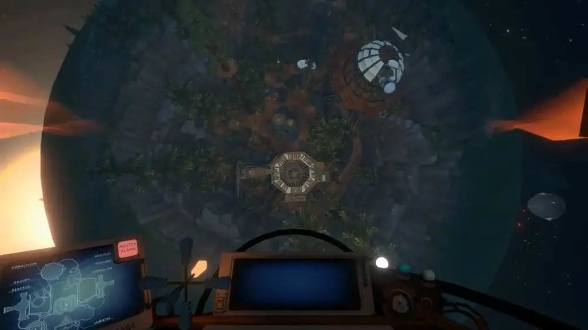
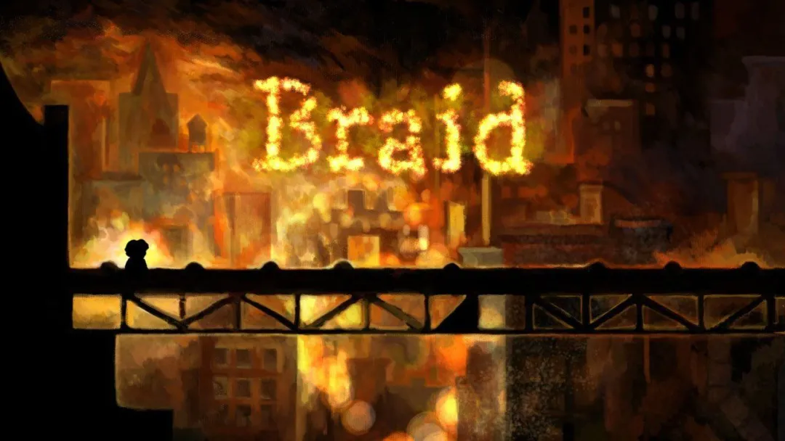
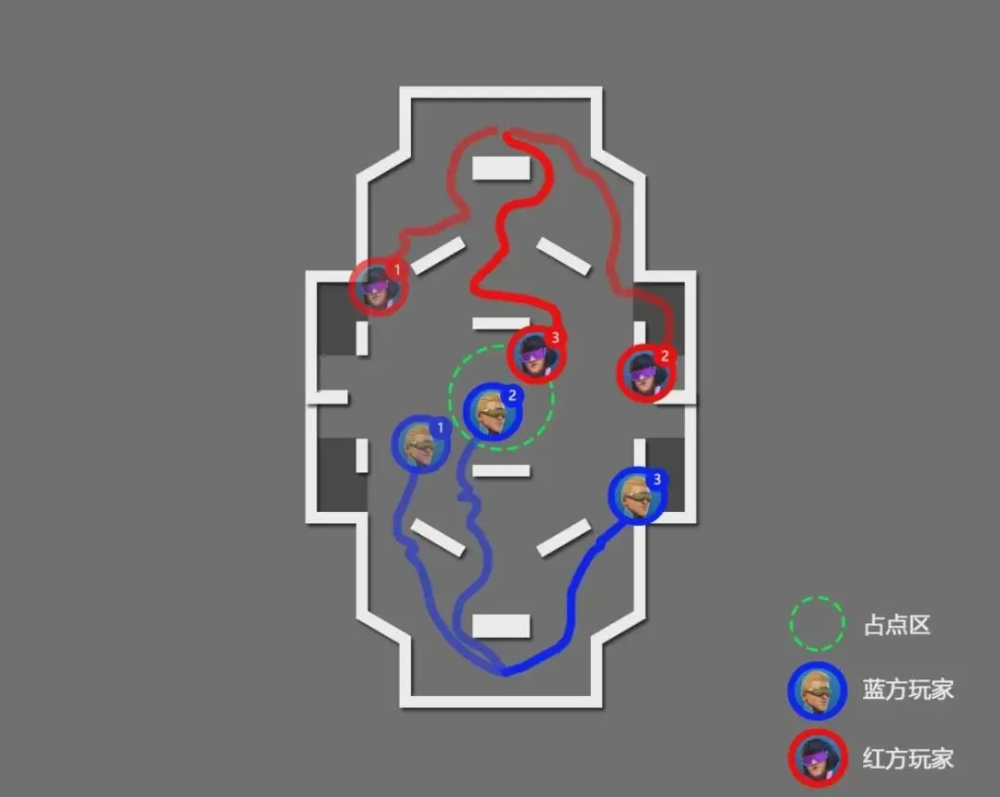

# 游戏设计中的时间

本文写作于2020/09，发布于[公众号](https://mp.weixin.qq.com/s?__biz=MzIzMjM0NDk1NQ==&mid=2247485340&idx=1&sn=7ba6abbde5a4b70fb9f168f92edff05e&chksm=e8971b88dfe0929edd794fa8138aaa1003d3ec5ea146ef8059266f14eeee0b4563e32d42ab91&token=2101092556&lang=zh_CN#rd)，非学术文章，仅提供相关游戏的浏览

> 然而，只有在时间内部，  
> 那玫瑰园中的一瞬，那凉亭下雨点急速拍打的一瞬，   
> 那微风习习的教堂中烟雾降临的一瞬，   
> 才能够被记起；交缠在过去和未来之间，   
> 只有在时间之中，才能征服时间。   
>   
> —— T·S Eliot

## **时间漫游**

在各个艺术形式中，关于时间的那部分是最令我着迷的。

与时间有关的艺术在六十年代忽然大规模地爆发出来：大地艺术，过程艺术，偶发艺术，激浪派，摄影和录像也被冠以 “ 时基媒体 ” 的大名：以时间为基础的媒体。到了新媒体网络化时期，时间在作品呈现的过程中更加必不可少。

在作品中表现时间，这是很多不同媒介不同形式的作品都尝试过的。意识流的小说暂且不论，杜尚的未来主义尝试，《下楼梯的裸女》在早期的各种作品中都尝试着捕捉时间在同一画面上的展示。

葛哈·李希特（Gerhard Richter）的摄影作品的某种奇特的虚幻感和布列松（Henri Cartier-Bresson），所寻找的“决定性瞬间”——寻找瞬间中美丽的偶然\(en quête du bel hasard de l’instant “involontaire”\)，并使得他可以到达某些永恒的必然性\(atteindre à la nécessité immuable “éternel”\) 之间恰好形成了某种对应的美妙关系。

艺术家邱志杰将现代艺术归出的四条线索，其中一条便是“过程的体验”。在古典主义的艺术中的“时间”是全然不均等的，只有决定性、史诗性的瞬间才有意义，而期间的大段空白毫无意义。到了印象派，则转变为某种机械式的时间，每一瞬间可以不完美，但是并不真的缺乏魅力。在这样的瞬息的变化之中，塞尚试图捕捉关系的永恒，而未来主义则走向了狂欢，甚至发展为“让作品自身成为一种能生长的有机物，让时间的属性成为作品的一部分”，如同Yves Klein以及R.Smithson的作品一般。最终发展的技术的发展让人们越来越能够将这样的过程来体验，一切都被储存，一切都可被重演，重新体验。

> _时间变成每秒二十四帧的胶片之后就变得可以剪裁，倒转，延长。比尔 · 维奥拉的慢镜头就像放大镜一样把时间中微小的细节都变成了庄重的仪式。而重复的镜头则使轮回的观念复活，使线性的时间感崩溃。_

安德烈·巴赞（André Bazin）在《绘画与时间》中提及阿伦·雷乃的《梵·高》也涉及了不同媒介的呈现。“通过蒙太奇让绘画的时间性如地质学一般往纵深发展”，最特别的便是其打开了绘画自身的空间，通过荧幕和镜头的反打自由地穿梭，瓦解了画框带来的异质性和绘画自身的方位和界限（空间性为主的第一次革命）。

而在后文谈及乔治·克鲁佐的《毕加索的秘密》的时候，更是指出了其带来的第二次的革命，绘画作为时间性的存在，时间延续可以成为作品的一部分，而绘画过程中的生成、修改、变异，甚至“死亡”都有其自身的延续——柏格森式的影片。

电影可以通过蒙太奇或者镜头的时间来加速和慢放时间，也能像是沃霍尔的《帝国大厦》一样，纪实式地将物理时间与电影时间严整对齐。阿涅斯·瓦尔达（Agnès Varda）作为新浪潮祖母级的人物，大概她也热爱着时间吧，《五至七时的奇奥 \(Cléo de 5 à 7\)》是“实时电影”的独特代表作，而《尤利西斯 Ulysse（1982）》则将回忆中虚幻的时间，微小的个人与时代的全球的时间所联系在一起，交相缠绕出一张独特的网；而从电影的本体论角度，塔可夫斯基称电影的创作过程为“雕刻时光”是颇有道理的。

而无论何种艺术，在与观者相遇的时候，总是在时间中展开自身的，从斯蒂格勒意义上，这都是一个第三存留（tertiary retention），通过它们，我们才能找回第二存留\(记忆和想象\)，而后到达第一存留。

而游戏又是怎么一个独特的方式来运用和表达时间的呢？

## **游戏中的时间**

### **时间感（时间知觉 Time Perception ）**

在大多数的游戏中，我们不怎么会感受到“时间”的概念。

因为首先游戏中的时间的“感觉”，大部分与现实中物理时间的流逝是一样的，并不是真的存在游戏的“时间”，而是游戏借用动画的播放速度，与现实相仿的感官印象和节奏来带来的“相似”，以此方式来带给玩家更强的“真实感”（与现实世界的相似感）。

所以在这个意义上，“时间”在游戏中并没有被独立出来，而是作为一种辅助手段来强调游戏的沉浸和游戏的真实，似乎可以先以“时间感”来称呼（被独立出来的下文会讨论），而这实际上只是动画速度带来的幻觉。

游戏可以很轻易地营造出一种独特的时间感的“场”，带给玩家完完全全地时间感的真切体验。能够想象《GTA5》的世界中，你开着车到海边，下车，看着太阳一点点地下沉，世界的光影在一点点地变化，你此刻处在的状态或许完全就沉浸在了游戏时空的场中，你的感官、现象世界是被游戏中的时空元素所充斥，就好像为什么玩起游戏来，很容易忘记现实中的时间，大概是因为玩游戏过程中的你的主观时间，或者是时间知觉\( Time Perception \) 几乎完全是与游戏中的时间感相符合的，所以当你玩游戏突然被现实中的事物打扰，意向转回现实世界，那么往往会有种“脱出感”，恍然如梦。

当然游戏中对时间感的营造往往是有错位的，并不是完全以现实世界为参照的。诸如很多游戏中的昼夜交替额外地快，例如《对马岛之鬼》，几乎走一段时间就换一换。

而有些游戏如《The Witness》，走路的速度和现实世界比较近似，但是太阳永不落下，神秘岛永夜明亮。

这更接近一种弥散的状态，是一种精确性的取消，是一种不同于现代资本社会时间观的感觉。就好像在《阴阳师》中你看到阴阳师的式神们在院子中来回走动，仿佛这些时候就好像是梦幻中的时间，循环往复，一如那个永远阳光灿烂，永远不会过去的炎热夏日，你也可以在塞尔达的大陆上随意淌洋，或者是游戏中的新手村，只要你不去接任务，时间就有这么一直无概念式地继续下去，不必担心任何的东西。

提一句，我觉得《NieR:Automata》的原声带中能非常切实地感受到这种弥散的状态。

### **被规定的时间**

游戏常常也会规定某些时间，那么这个时候时间常常会被作为游戏机制的考量，而不只是一种沉浸手段的加强出现。很简单的例子便是如“在时间限制内完成任务”，或者是像是《守望先锋》这样的，占点超过的时间，进攻需要的时间等等；或者是赛车游戏中完成赛道达成的最短时间。

或者是在一个策略游戏，甚至是动作游戏中关于“时机”或者“时间窗口”的挑战也是如此，这些时间点有其特殊的Gameplay意义，游戏系统在演变中的时间性和玩家交互的时间构成了系统的不同变化。

被规定的时间玩家往往会极为关注——毕竟与胜利失败有着高度相关性。就像是在合作游戏《Keep Talking and Nobody Explode》中的炸弹爆炸的倒计时一样，这样的时间并不是去体会的，而是去不断尝试挑战的。一些很小的时间的改变或者是设置往往会带来十分紧张刺激的想法，毕竟从“快要来不及了”到“太惊险了，我们居然做到了”这样的时间倒数带来的紧张后释放的感觉确实美妙。

### **游戏时对应的现实时间**

即玩家在玩游戏时的现实时间。比如我从8点到10点一直在玩CS，包括我在菜单，我死亡，我复活，我等人这一系列时间都计算在内，主要是要取用玩游戏时的现实的物理时间用于参照，即游戏运行运转的时间。

### **游戏内时间 - 暂停**

即一般意义上的游戏时间。可以与暂停一起来理解。

游戏作为时基媒体的一种，有一种十分特别的能力，它真的可以实现拉马丁式的诗歌愿想：“游戏将在暂停10s后重新开始。”

这句话在200年前简直是不可理喻的，暂停多少时间成了可能。

当我们按下暂停之后，“游戏内时间”就停止了，然后在停止了若干“游戏时对应的现实时间”后，游戏内时间再次运转起来。

现实时间中没有所谓暂停，但是游戏中的暂停在外在时间的包裹下存有，但很多时候，每当游戏突然暂停，就好像看着的电影到精彩处突然就开始网络加载一样，我们会被逼迫着跳出世界之外：“天哪这好感人啊”到“这破烂宽带要换了”。

当然游戏中的“暂停”的意涵不只是暂停游戏内时间，在回合制游戏中、P社游戏中、策略式的游戏中的决策环节，操作选择的环节都可以看做一种“暂停”。当然有些游戏为了推动节奏，比如炉石的烧绳子，依旧会设定一定对应的现实时间来作为限制。

当然也有类似特别的《Transistor 晶体管》引入了战斗前的规划阶段，然后再执行操作，《Ronin》也是如此，动作回合制。

而其中游戏UI和菜单的操作也是一种，现在特色的手机游戏各种系统化内容中就有很多这样的时间；比如《阴阳师》中的除了战斗部分的菜单、式神、抽卡部分，比如很多游戏中的一些非游戏的版块“加点部分”等等，这不同于前文“弥散的时间”，而是可以看作从游戏世界中的抽离出来的“菜单时间”。

### **游戏的世界时间**

因为实际上游戏中的世界时间是“虚假的”，例如如果玩家不踏入任务触发区域，那可能那个快要死掉期望临别前赠给玩家武器的勇士永远不会死去，哥谭市的坏蛋们总是会等游戏中的蝙蝠侠做完支线任务之后触发主线的时候才开始实施计划。

这种世界时间的推进往往并不是真的对应于的“现实时间”或者“游戏内时间”的流逝（比如村民说好着急啊有强盗来了，但是很多时候你不去触发的话，他们永远不会来）而往往是由于事件的触发，任务的达成，挑战的通过来推进时间发展的，更像是一种游戏世界状态，或游戏剧情推进的时间。

而剧情时间往往就会与现实时间或者游戏内时间发生冲突，带来一种十分“不真实”和出戏的地方。例如：我不往前走我身后的桥就不会塌；例如博士一直喊救命，但是我就一直不去他也不会怎么样；比如某人明明有妻女要挽救，时间紧迫依旧可以在牌局中忘我，诸如此类。

所以我们切入游戏的方式就从这里开始。

## **时间游戏**

### **自我流逝的时间**

——《Outer Wilds 星际拓荒》《Dead Rising》《Vision Soft Reset》

先前曾经翻译过游戏设计师Pietro Righi Riva的**非传统可玩媒体宣言\(nontraditional playable manifesto\)** [游戏0x0060：rejecta](http://mp.weixin.qq.com/s?__biz=MzIzMjM0NDk1NQ==&mid=2247484662&idx=1&sn=3967e416475e9de9296fcc9a27c629a4&chksm=e89718e2dfe091f4770f57b0d4df1047a912de0950ddeac7f353610f42ee863e38a0e9195ace&scene=21#wechat_redirect) 其中的第一条便是如下表述：

_The game must flow like a river, time must exist beyond player’s action_

_一个游戏应该如同河水般自如流动，时间的运转应该超越出玩家的行动_

_a\) Action must always happen in real time, the world’s time must never be frozen_

_行为应总是发生在真实时间中，世界时间永不停止_

_b\) Events must exist that happen independently from players’ action_

_事件应该独立存在且其发生独立于玩家的行动_

_c\) Reject all fail states, never wait for players’ input to progress all action_

_抛弃所有的失败/停止状态，绝不等待玩家的输入来推进所有的行为_

而游戏制作工具箱GMTK有一期专门讲时钟游戏（Clockwork Game）和时间循环（Timeloop），其中所说的Clockwork Game便是游戏的世界时间会自我流逝的游戏，无论玩家是否进行交互，游戏内的人物，世界总是会按照预设好的自我节奏向前发展。

MarkBrown所举的例子便是《Outer Wilds 星际拓荒》和《Dead Rising》,以前者为例（我还没玩多少），游戏中的星球无论玩家是否到达都会变化，有些星球会瓦解成碎片，有些星球表面的尘埃会散去露出其中的通道，玩家重要的不仅仅再是到达什么地点，而何时到达也同等重要。

而一旦一个游戏的时间会不断向前发展，那么随之而来的问题便是游戏的内容量要如何处理的问题，除开用系统的规则浮现式的处理方式，很多游戏使用的办法便是“无限循环”，例如《梅祖拉的假面》游戏中3天（大概6小时的现实时间），整个游戏世界便会重置；而《Outer Wilds》也是每22分钟，太阳吞没所有的行星，重新再来。

### **永劫轮回 Time Loop**

——《12 Minutes》《Minit》《The Sexy Brutal》《Elisonore》

当内容不够的时候，将时间的发展扭成一个循环那么也是一种选择。在电影或者动漫作品中有不少，类似《土拨鼠之日》《凉宫春日的忧郁》这样的作品**，特点为首尾相互连接，形成闭环，主角往往被困在某一段时间之内，难以逃出某一个既定的结局**。

就像MarkBrown在GMTK中所举例的作品：

《The Sexy Brutal》当你在时间剧场看到了结局之后，要想办法在下一次循环中通过线索发现和道具交互来让结局有所不同，而《Elisonore》中你扮演父亲被杀的《哈姆雷特》中的奥菲利亚，试图通过各种选择来改变结局。

而严格意义上的无限循环的作品是非常难制作的，一个可能在放出预告片后四年直到今天还在制作的《Twelve Minutes 十二分钟》或许可以说明一些问题，当希望把可能交互的空间尽可能扩展细化的时候就会带来分支状态变化的无限膨胀，而趣味性也成问题。

不过也有像是《Minit》这样的作品，你六十秒后就会死亡，所以整个游戏的关卡，寻找捷径，找到下一个复活点就构造了这样的一个紧凑的作品。

其中有一个成就满令人唏嘘的，就是你可以花费你一生（60s）听一位口吃的老人说完他的故事，我还保留着那张截图。

### **时间是一条可来回线**

——《Clocker 铸时匠》《Iron Danger魔铁危机》《Garden Between》《Time lie》

类似《Garden Between 花园之间》这样精美的作品还有《Time lie》都有一根比较明显的时间轴可以进行调整进度的前后，同时通过在不同位置与不同与时间可以有互动关系的物件交互来解谜。

而《Iron Danger魔铁危机》是前段时间出的一个颇为奇特的冒险动作类游戏，但当你做出了错误决策的时候你可以通过调整时间轴倒退到觉得合适的时间点来重新安排。相识的国人朋友早期的《Clocker 铸时匠》是一个颇为复杂的设定，场景中不同的物品与人物都有自己单独的时间轴，需要在其中寻找逻辑合理的排布来让剧情推进下去。

因为自己制作过类似的原型，所以对于这样的作品颇为关注，但这类作品往往可能比较难做出除了机关交互的变化，需要通过一些不那么优雅的解谜方式来让时间轴可以正常运转下去，但大部分也逃不出下文提到的Braid的范畴。

### **与现实时间同步的游戏时间**

——《生命线Lifeline》《动物之森》Robert Yang、《The Longing 漫长等待》

如果说游戏中有些自我流逝的时间创造出一个小游戏世界的感觉，那么那些与现实时间同步的游戏，那就可以说是试图于我们的生活世界创造出另一个平行前进相互关联的世界了。

《生命线Lifeline》利用手机不离身的特性以及通知栏推送的方式，通过一种“游戏内时间”与“游戏时对应的现实时间”带来一种同步时间的真实感，在游戏中，你连线的伙伴泰勒说“等我走到远处飞船遗骸处再联系”之后后，你真的要等待15分钟的现实时间后他才会回复你。

其实疫情期间破圈流行的《动物之森》也是如此，游戏自己有着一套运行的规则，而这个时间和现实运转是完全一致的。在这样同步的时间感条件下可以很容易地制造出一个对于游戏世界某种真实感和可信感的想象，类似《Bird Alone》这样的电子宠物也是如此，更容易创造出陪伴感。

去年IGF获奖的《The Longing 漫长等待》将整个游戏的卖点放置在一本《扎拉图斯特拉》电子书以及400天的真实时间上的对照上也是颇为艺术化的实践。

而例如在同性游戏大师Robert Yang的很多作品中都有类似的同步时间限制的设定，这种真实的时间的限制再次证明了其深得“欲罢不能”的精髓，甚至还会有详细的时间表，你在周三晚上某个时间点浴室就会出现某个特定的可互动的男生——如果他是你喜欢的类型的话，那你可就要准时打开游戏了。

### **交互创造的时间**

——《Time Locker》《Superhot 燥热》

再者，一般来说“时间感”是默认与玩家现实时间一样捆绑运行的。

但是在某些游戏中，“时间感”被独立了出来，被特殊地作为设计对象予以处理，于是便带来了一种十分惊艳独特的体验。

将游戏内时间流动与玩家交互做了联结，时间的流速变成了关注的对象，当做了系统玩法的一部分。手机游戏《Time Locker》，将时间感的设计与游戏机制，心流理论都结合得非常到位，同样对于上文所提到的独立后的“时间感”与“游戏内时间”（在游戏内表现为黑潮），以及暂停对应的“现实时间”的概念理解都有非常大的帮助。

而最有名气和帅气的《Super Hot 燥热》，在当时的7天FPS Game Jam游戏开发活动大赛中制作出来后，它的概念简单易懂并且令人兴奋，将子弹时间做这样的演绎，将战斗和粒子的场景的美感与决策结合在一起。

拙作《El Hacedor 诗人，创作者》[游戏0x0064：EI Hacedor](http://mp.weixin.qq.com/s?__biz=MzIzMjM0NDk1NQ==&mid=2247484741&idx=1&sn=d90155e2f0545c9206bc1109e85d2280&chksm=e8971951dfe090477d1b03ed96aa6432da93c2cd11c943b551c53a18c9a99bb5b02ed55f9607&scene=21#wechat_redirect) 某些桥段也使用了类似的做法，并且用线条的自我交叉作为时空回返。而NExT Studios马上要推出的《Crown Trick不思议的皇冠》的即时回合制某种意义上也是一种被游戏玩家输入所推动的古老类型。

### **时间连续地倒流**

——《Braid 时空幻境》

玩转时间的独立神作。

很多我们日常游戏中的“重生/重来”（Retry）其实是一次剧情时间（事件发生先后）的突变性重置，但是《Braid》的巧妙之处在于利用了时间的“倒流”来让这种关卡的重置变得平滑，大大分离了游戏的“时间感”，不仅仅慢放，而是甚至将其倒流以达到剧情时间的倒流。再以此衍生出了许多让人拍案叫绝的关卡设计，开拓了一种全新而独特的时间感受。

在这个意义上，一般游戏的复活如果说是返回一个过去的时间点的穿越，**而《Braid》之于游戏就更像是《信条 Tenet》之于电影的意义**，将时空返回这个主题做成线性的连续点的回返而非时间点的穿越。你是逐渐通过倒退回到过去，而不是直接在过去的一个时间点位置复活。

Jonathan Blow充分发挥其谜题设计的深度，通过不同多种的原型设计尝试，最后留下的每一个世界其实都是倒流时光谜题下的某一个变种，而游戏最后的桥段结合叙事的动力，比起《信条》来，我只能说过瘾太多了。

### **多重平行宇宙**

——《拒绝上班 \(Does not Commute\)》《Echoplex 回音倒影》《Super Time Force》《Quantum League》

在时间上做重复的活动，多周目，多次复活尝试后创造出一个新的自我，这类游戏的设计太多以至于近乎被玩烂了。还有各种变种，例如录制某一部分的自己，然后通过踩头跳跃，或者是踩开关解谜来进行调整。

手机上的游戏《拒绝上班 \(Does not Commute\)》就是一个俯视角的很好例子，在每一次时间回返之后，你都要避开自己过去的影子来在这个越来越拥挤的世界努力行驶到目标位置。

而这类游戏通常有一个弊病就是如果处理不好，得到的结果就是混乱，以《Super Time Force》为例，它有一个非常优雅的机制，但是结果却很糟糕：

玩家扮演一个角色，在一段时间内被要求通关。

当玩家死亡的时候，玩家可以倒退时间，自由寻找已经过去的时间点中一个合适的时间点复活角色，然后这个复活不是简单的复活，而是创造另外一个样本，过去的玩家自己依旧会存在，并且在之前的死亡时间线上进行刚才玩家做过的事情，跳跃，射击，死亡。

——然后如果玩家这个时候在他死亡之前击杀了之前的击杀自己的怪物，解救了上个时空中自己后，过去的自己就会停在原地，如果玩家去收集，那么就会和现在的自己合二为一，然后变为现在自己的第二滴HP（如果没有能解救，那么另一条时间线就依旧死亡）。

结果的实际体验就是玩家不能以自己的节奏过关，也不是通过练习，而是通过累计错误去过关。借用IGN的说法：_混乱根深蒂固的存在于《超级时间力量》的血液之中，这与干脆利落地过关是相冲突地。_

《Quantum League 量子联盟》是一个试图将平行宇宙引入多人对战FPS的一个尝试，我与另外一位杜克大学计算机系的天才朋友一起玩，发现大概在第三回合的时候我们的脑子就失去了运算能力。

### **时间的拉伸与压缩**

——《Passage》《One Hour One Life》《Killing Time at Light Speed》

这类作品是很常见的，在各类Paradox Interactive的历史游戏，或者文明中，一回合就是百年。

但从小的游戏上来看或许更有意思：《Passage》通过象征、符号、音乐、美术，表现出一种独特的“时间感”的混合，是对我影响最大的游戏，而作者Jason Rohrer的后来发售的《One Hour One Life》通过将一生的时间和进程以一种多人社会合作，语言交流的方式浓缩成一小时的游戏进程也同样是充满了力量。

《Killing Time at Light Speed》则颇有《星际穿越》式的诗意，你坐在一艘以近光速飞行的宇宙飞船上，你可以刷新你的朋友圈，但是你每次刷新，你地球上的朋友实际上都过去了数月数年，这种时空的压缩带来的体验也非常独特。

### **蒙太奇的时空转换**

——《Gorogoa》《Virginia》《What Reminds of Edith Finch》

《Virginia》在蒙太奇的电影镜头的使用上颇有自己的一套风格，《What Reminds of Edith Finch》在确切又虚幻的时间之流之间来回跳跃与切换，在各种超现实的场景中来回，勾勒出一个《百年孤独》似的家族的死亡与生长，我现在还能会想起那秋千上的时光。而《Gorogoa 画中世界》从漫画的媒介出发，其中的神兽就是时间的巨兽，从小对于神秘探寻直到垂老的主角在时光的回溯与切换中最终集齐了全部的果实，见证了终极。

## **结语**

怕是没有人像我这样写游戏推荐了，这类处理方式的游戏还有很多。比如《Her Story》中通过一种Remediation式的高位语境方式来对待这些游戏的材料；还有我还不敢挑战的“奇怪的游戏，唯一获胜的办法就是不去玩它”的《多元宇宙时间旅行的5D象棋》；非常有名气的《428被封锁的涩谷》等等，游戏在对于时间的处理上已经有过很多了，在形式上的花样私以为玩得比电影要溜得多。

_从运行肌理来说，电影24帧所记录的时光是被雕刻在底片上的，固定不变并且在电影院以匀速传输至大屏幕上的、不能被修改。但是游戏的核心循环的60帧，是每一帧都在玩家的循环而时刻准备产出相应的结果的，是动态的、不断持续改变的。_

游戏的时间对于每个人是私人的，是可以完全不同的。也是属于己的。

卡林内斯库认为现代性便是来自两套价值观念不可调和的对立之中，这两套价值观分别对应 于资本主义文明客观化的、社会性可测量的时间以及个人的、主观的、想象性的绵延（durée），亦 即“自我”的展开所创造的私人时间。大概现代人难以再去理解那种过去的时间观了，就好像本尼迪克特所提及的，全世界现在就在媒体和互联网的连接下真真切切地共时性地“存在于”这个世界上，现代的资本主义发展带来的理性主义的时间与劳动力的交换让我们越来越去计较时间。

或许游戏有机会能够让我们归于那个空间，能体会自身时间的独特绵延，带我们回到那个一切都像是在漂浮着的，时间如同被悬置，弥散开来的夜晚。

> _我感觉自己必须向后回溯，_
>
> _越过帕特农神庙的石马，回到我童年的木马。_
>
> _Paul Gauguin_

\_\_

