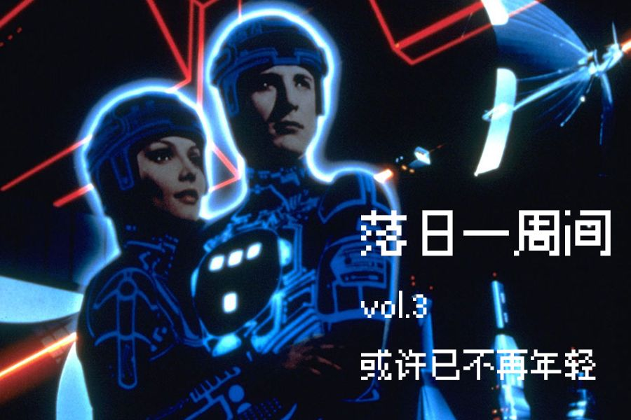
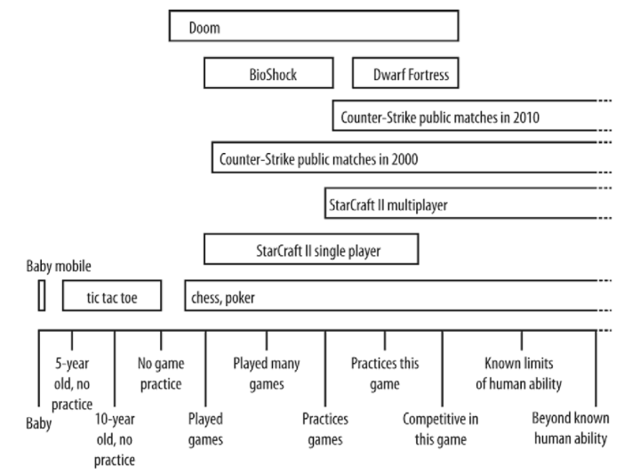

# vol.3 或许已不再年轻 \| 电子竞技

**🐏vol 3 或许已不再年轻 \| 落日一周间 2020/10/26-11/01**

相关《落日间》播客内容可见：



### 🎯 英雄联盟S10电子竞技总决赛

如果以本周体验来说，对我情感冲击最大的是这样的一场直播 [英雄联盟S10电子竞技总决赛](https://www.bilibili.com/video/BV1Y54y1r7ux) 。

如果你在周六那个晚上打开朋友圈，并且你的好友中有些年轻人的话，或许你一定会看到他们的呐喊，B站当时的直播有14992.5w的人气，确实在那个时刻，各大学校的食堂，酒吧，电影院，都有着这么一群人聚在一起看10个人打游戏。

当昨天第二局，落后一分的中国战队SN的[上单选手ABin五杀](https://www.bilibili.com/video/BV1n54y1r7Qk?t=306)的时候，整个朋友圈，学校食堂都沸腾了，B站现在到处都是拍摄的那一刻全部人为之激动兴奋的视频，整栋宿舍楼传来呐喊，以至于校领导以为学生发起了暴动。

这样的一项万众瞩目，充满了穿透力的活动名为电竞，但它可不是凭空出现的，也并非只是一个纯粹游戏圈玩家性质的聚会。

电竞有它的发展的历史，有它自己的脉络与基因，在这个吸引交杂着数亿年轻人的场域里，选手年纪轻轻都要承担常人难以想象的网络压力；菜是原罪，电竞不仅是年轻人的游乐场，或许也是年轻人的网络情绪制造机，民族的，资本的，混杂青春记忆，爱恨交加。

这个复杂的，美丽与危险丑恶并存，魅力十足的地方。

### 🐝 蚱蜢：游戏作为无用的溢出，乌托邦中的唯一可做之事

电竞或者说游戏中的竞技与现在我们常常谈论的作为艺术作品或者作为商业氪金的游戏产品中间有一条裂隙，以至于我们谈论游戏时常会把这类多人对抗的游戏忽视，但它却是今天有着最多受众，影响最大的。

而确实，电竞或者是多人对抗的游戏有着比起作品更为古老的基因，切莫忘记发轫于古希腊的奥运会名字即为Olympic Games，奥林匹克的游戏。

此处的游戏并非取非严肃之意，就如麦克卢汉在《[理解媒介](https://book.douban.com/subject/6391212/)》一书中所指出的，源起于希腊的奥林匹克运动会原先就是扮演太阳神争斗的游戏——竞技者绕圆形跑道奔跑时，头上扎着黄带，模仿太阳神驾车一日一周所经过的圆形黄道带。

当我们理解电竞的时候，或许应当将其放置在传统体育精神在现代互联网和虚拟世界的演绎与延续，而非视作一种艺术媒介的发展。

而游戏最常常作为的比喻便是战争游戏（War Games），在奥森·斯科特·卡德著名的[科幻小说](https://book.douban.com/subject/1140727/)与电影《[安德的游戏（Ender's Game）](https://book.douban.com/subject/1140727/)》了，政治手腕交锋常常有类似纸牌，象棋，或者是围棋的意象，而博弈论也是取了游戏作为它的名字Game Theory，这种竞争与多人对抗的面向从游戏出现之初便已经存在了。

非常有趣的是，在赛博朋克或者是科幻世界的想象的作品中，游戏也常常以一种重要的主题出现其中。动漫《[游戏人生 ノーゲーム・ノーライフ](https://movie.douban.com/subject/24883272/)（No Game No Life）》以一个连家门都不敢出的“御宅族”进入游戏作为开场，《[刀剑神域 ソードアート・オンライン](https://movie.douban.com/subject/6869376/)》架构了整个社会的游戏设计师茅场晶彦将所有进入的玩家控制在了游戏内部，无法登出。

甚至早在威廉吉布森的《神经漫游者》之前的1982年，一部超前的，大胆尝试3D技术的赛博朋克电影就已经出现了，这部名为《[电子世界争霸战 TRON \(1982\)](https://movie.douban.com/subject/1293482/)》就已经在构想一个以光盘大战以及赛车比赛为主要活动的软件人的世界了，人与数据人的亲吻，以user为核心的价值观，这些都十分超前地被表现了出来。这部影片在2010年由Daft Punk配乐重新以迪士尼的品牌拍摄了续集，或许大家更加耳熟能详的《[创：战纪 TRON: Legacy \(2010\)](https://movie.douban.com/subject/2997134/)》一代的风格，视觉设定，光盘和赛车大赛都给予了保留，如果你有去过上海的迪士尼体验，那你一定对创极速光轮印象深刻，那种氛围和竞争感。

2001年押井守少有的与波兰合作的跨界玩票真人电影《[阿瓦隆 アヴァロン](https://movie.douban.com/subject/1298688/)》，故事描绘了一款名为“阿瓦隆”的游戏。押井守对于真人电影有自己的思索和认知，把其与动画的根本性差异的媒介意识发挥出来，利用数字特效滤镜 + 彩色胶片来制作出不同层的现实的思考，充满着暧昧的多义。如果我们的下下代的网络原住民如果在网络/脑机中出生，是否会有这种奥德修斯似的回返真实的欲望呢，影片本身非常晦涩，色调与节奏缓慢，争议颇多。

再后便是两年前引起广泛影响的，史蒂文·斯皮尔伯格的《[头号玩家 Ready Player One \(2018\)](https://movie.douban.com/subject/4920389/)》，其中整个电竞就是架构在虚拟游戏世界之中的，一场关于游戏胜负的成立与解构的漂亮作品。

究其原因，其实或许伯尔纳德·舒兹（Bernard Suits）早在《蚱蜢：游戏、生命与乌托邦》\(The Grasshopper: Games, Life, and Utopia\)，他基于对于游戏的论述：**玩一场游戏，意味着自愿去克服非必要的障碍（voluntarily overcoming unnecessary obstacles）**做出大胆地作出了对于未来乌托邦的推测。想象一个衣食无忧、心灵满足的乌托邦世界，活在其中的人类早已心想事成，无事可做，剩下唯一能做的事，就只有玩游戏，玩游戏将变成人类存在理想的全部。并提出：游戏是未来的线索；趁现在认真培育游戏，或许是我们唯一的救赎。

回到那部1982年的影片，游戏中作为大Boss而拥有自主意识的主控程序四处在网络上捕捉其他各种程序，被捕捉的程序这样说： 「主控程序把你送到这里来，如果你是有用的，就利用你，如果你是无用的，就把你送到这里玩游戏受苦。」

虚拟空间的生活和赛博朋克世界的自由，这一切都与电子游戏的幻象一直紧密地关联在一起，游戏的乌托邦与反乌托邦之间只有一步之遥。

**参考链接**

关于游戏从严肃到轻慢的历史可以参考旧文：《[严肃的游戏](https://zhuanlan.zhihu.com/p/101866037)》关于Tron可见CGWorld影评： [从《Tron》到《创：战记》——电子美学文化的伟大回归](https://movie.douban.com/review/4555401/)关于Bernard Suits 可见之前写的文章《[劝君莫再谈“游戏](https://zhuanlan.zhihu.com/p/24661449)”》

### 📙电竞的游戏

当我们简要谈论电竞中的游戏的时候，我们谈论的并不是一般的多人游戏，而是具有足够深度与技巧上限的游戏：Tynan Sylveste的 &lt;Designing Games:A Guide to Engineering Experiences&gt;（中文名《[体验引擎](https://book.douban.com/subject/26323699/)》）一书中中对于游戏的技巧部分有很好的论述:

这部分可参考旧文：《[电子竞技：技巧、浮现、与传统游戏精神](https://zhuanlan.zhihu.com/p/23026441)》，

以下摘录部分：

我们需要考虑的是游戏的深度\(depth 用于描述游戏中需要学习内容的多寡\)，以及技巧范围（Skill range 上手难度和上限）：以下为部分游戏的技巧范围，类似井字棋（tic tac toe）是有上限的，而类似象棋或者《星际争霸》这类游戏作品是无上限的：

在PVP（Player versus Player）多人对抗，也就是「与人斗其乐无穷」的过程中，因为双方都具备学习的能力，所以双方的博弈会不断上升，下图以《虚幻竞技场 Unreal Tournament》为例子，表现了双方的一个自我再造（Reinvention）的过程：自我再造的是指随着玩家技巧提升，游戏会不断地进行自我再造扩展技巧范围。

值得留意的一点是，多人游戏往往是一个强机制性的游戏，通过不同玩家的行为而在这个游戏规则内浮现出（Emerge）出许许多多的可能性，打出各种各样精彩的对决，这样的一个游戏可以支撑上万个小时的游玩，玩家的进入与对战为其创造出源源不断的内容，也在时刻挑战和挖掘这个游戏的极限，在这个角度可以与类似我们熟悉的《巫师3》这种线性的进程游戏（Progression）有一个概念上最基本的区分。

### ⛩ 中国的电竞史

在节目中我说：严格意义上来说，我的童年不是游戏，而是电竞。

我感觉我的童年体验总是与为电子游戏正名的冲动联系在一起的，从这个角度上来说，我从当时到现在可能做的事情是类似的，只是从单纯的正名转向一个更宽广的研究心态。

在中国能够为打游戏正名的，电子竞技起到了很大的作用。

就像在播客中读的那段话一样：

（《中国星际争霸历史回顾》，转引自王亚晖[《中国游戏风云》](https://book.douban.com/subject/30399060/)）

> 无论承认与否，事实就摆在面前，星际的繁荣已经走到尽头，现在呈现的是一个游戏多元化的时代，每个经典游戏都有人数不等的拥护群体，星际作为将竞技游戏带入成熟（无论职业化还是商业化，总之正在逐步完善）领域的过渡，已经成功完成了任务，从这个意义上来讲，中国的星际玩家与《雷神之锤Ⅲ》玩家都是这个阶梯上第一个台阶。很不幸我这样比喻，星际与广大前仆后继的星际玩家为中国电子竞技产业做了铺路石子，享受这个成果的是今后的游戏和玩家。若干年后，同处在我们这个年龄的年轻人正在宽松良好的政策环境下玩游戏，他们不知道什么是电子海洛因，不知道网吧玩竞技游戏属于违法，不明白玩游戏也需要权利。他们怎么也不会理解有多少孩子曾经很有组织有纪律地聚集在一起，发誓永远不碰游戏，将童贞与天性掐死在自己手里。他们会问：什么是星际？

在这里，我记得当初第一次托亲戚网购而买到的签名版本的《[当李晓峰成为SKY](https://book.douban.com/subject/10797625/)》，曾经在2005年与2006年在世界电子竞技大赛WCG上身披五星红旗的电竞明星的童年史。

在2011年一本《[三联生活周刊](http://games.sina.com.cn/e/n/2011-03-03/1933479199.shtml)》中报道了Dota选手2009伍声，我记得我当时特意跑去报刊亭买下，现在还放在家中的书柜里保存着。

王亚晖[《中国游戏风云》](https://book.douban.com/subject/30399060/) 其中也有许多关于电竞的历史和叙述，在播客中的很多资料的论述就来自于这本厚厚的书。

2015年读的BBkinG《中国电竞幕后史》是关于这个年轻的行业为数不多的论述，BBKing多年媒体人经验所练就的铁血柔情般的文风，一篇篇幕后史，见证了一位位伴随着中国电子竞技成长起来的传奇人物，以人物传记、加大方向演变的叙述方式，给我们呈现了一副中国电竞全景式酸甜苦辣的光辉岁月。

中国电竞行业的发展可以参考韩国，韩国1997年经济崩溃后大批人群在社会上无所事事，国家来牵头大力发展大家开始打游戏，鼓励网吧行业，游戏成为了国家战略，在98年-2008年韩国电子竞技飞速发展，三星，大韩航空都是重要的赞助商，2003年韩国当时首尔市长李明博甚至和WCG冠军Ongogo进行了一场表演赛。

但是中国电子竞技之路却十分的复杂和曲折。从2004年的电视《关于禁止播出电脑网络游戏类节目的通知》后，中央台，安徽卫视等关于电子竞技与游戏的频道全部下架，只有付费频道《游戏风云》与《GTV电子体育》幸免于难，国家体育总局，主流媒体，地方赛事主办，P2P直播技术，富二代支援（王思聪，LGD老干爹），肉松饼模式：优酷+淘宝+电子竞技的发展，走过了太多。此处可以参考上文提到BBKing在TEDxSuzhou进行的分享《[中国电子竞技，让路更多一些](https://www.bilibili.com/video/BV1ts411U7tz)》

电竞也带来了很多问题，在分享和《[中国电竞幕后史](https://www.zhihu.com/column/bbking)》的自序中，他说道：

> 比如，我们经常接到家长的电话，跟我们说自己的小孩子要退学打电竞，他什么办法都用过了，还是拦不住，希望我们能找个电竞明星出面帮忙劝劝他的孩子，我们通常都会帮他劝的。因为我曾经就是这样一个小孩子，所以我知道，大部分小孩子的内心其实并不是十分确信自己适合走电子竞技这条路的。他们只是在自己学业受挫之后，潜意识里在给自己找新的出路。

### \*\*\*\*📓 **参考**

BBKing的B站视频 [BK短纪录片](https://space.bilibili.com/10500463)

《[中国电竞幕后史](https://www.zhihu.com/column/bbking)》知乎专栏

TEDxSuzhou《[中国电子竞技，让路更多一些](https://www.bilibili.com/video/BV1ts411U7tz)》

《[中国电子竞技发展史](https://www.bilibili.com/video/BV17s411X7xZ/?spm_id_from=333.788.videocard.3)》

两位少年的纪录片，本次总决赛五杀的Bin [SN Bin 纪录片](https://v.qq.com/x/cover/mzc0020085wxasb/u0034xsakxt.html) SN.Bin的成长记录 ,

以及ADC huanfeng [少年来到海边：油管上SN战队Adc焕烽的故事](https://www.bilibili.com/video/BV1VA411E7Lp/?spm_id_from=333.788.videocard.0)

电子竞技不只是一个行业，也是这个社会的缩影。

电子竞技或许已不再年轻，但这意味着它在成熟，它值得被重视，也值得承担起应当的时代责任。

### \*\*\*\*🐖 **本周进展**

1. 录制《后戏003》，进行音频剪辑发布为《落日间 E10》
2. 收获了一位新的内测支持者
3. 听了很多的《不在场》，准备声音相关节目的可能，尝试AbletonLive
4. 准备游戏与建筑播客话题 / 游戏与低科技采访计划

