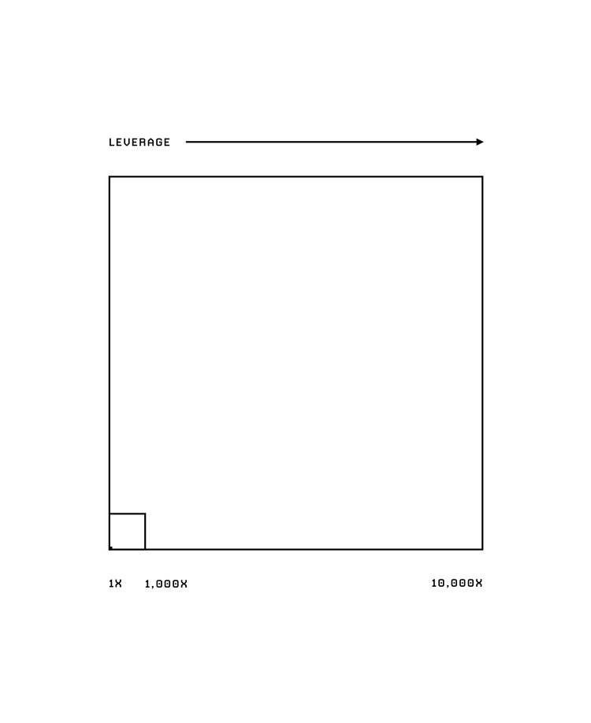
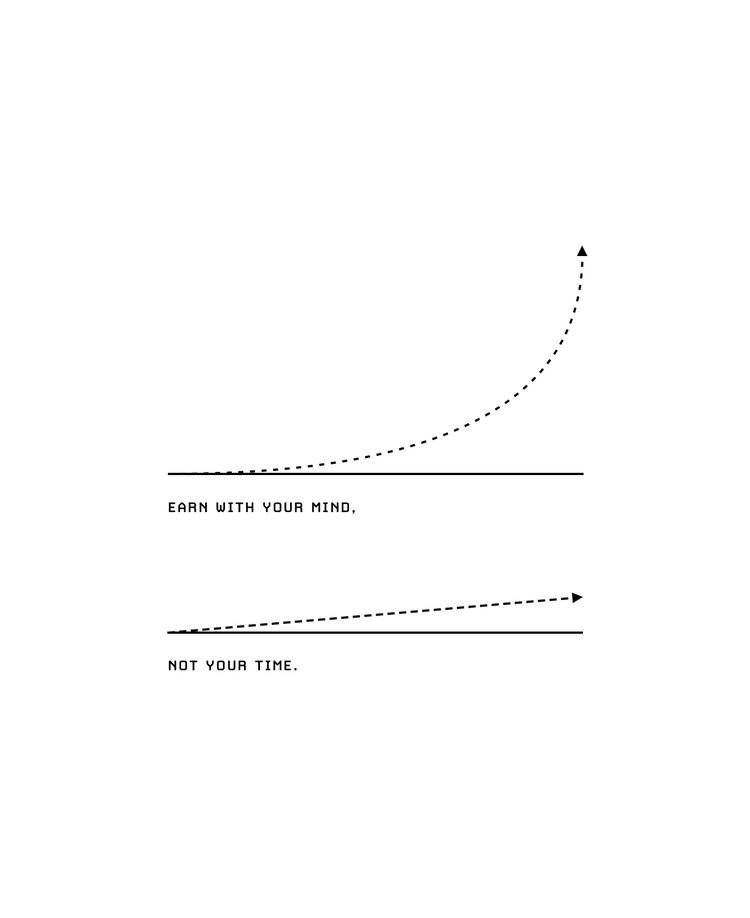
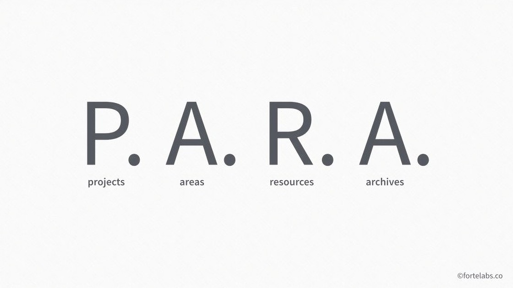
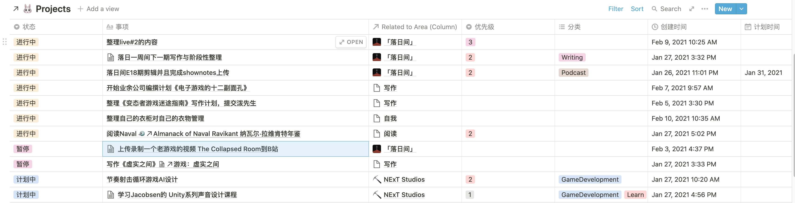
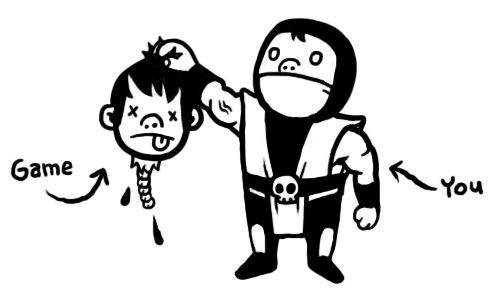

# vol.6 「完成」是一种能力

**🐏vol 6 「完成」是一种能力 2020/12/09-2021/02/13**

149位 [xpaidia.com](https://xpaidia.com) 邮件订阅者，2561位公众号关注者，大家新春快乐！

当我看到这个时间跨度的时候，我才意识到「落日一周间」系列鸽了那么久。

在这期之中，我想聊聊「完成」这件事情。

### 从启动到完成

我是一个启动非常迅速的人。

我做什么都可以凭借三分钟热度，毫无摩擦地开始。

这或许也是我所擅长的。从大学甚至更早开始的写作的习惯，或许就是来自在当时「我想在知乎拿到些赞同！」的想法而突如其来地开始的；去年疫情期间突然想试试做B站视频，就立刻下单买个麦克风，第二天就学剪辑，一周内就把第一期给发了出来；后来的播客也是一样，用糟糕的麦克风先未经规划就匆忙录制了两期（现在听起来已经不堪入耳），但也拜那些「黑历史」所赐，才有了如今近20期的播客内容和小宇宙上3000+的订阅。

但今天要谈论的，并不是「启动」这事。

我想要谈论的是「完成」。

### 反馈与复利的指数曲线

前面说到我的快速启动方式，前面一两次靠热情推动，而再后来，则更多是反馈推动我无意识地前进，例如突然有个回答获得了大量赞同，或者涨了不少粉，我会想再写一个获得更多的出来——但往往并不如意。

依靠偶然和外部的反馈推动这件事情是难的，因为大概率这些事情在前期都不会特别顺利。

为何？

用一位友人的话来说

> 若要成事，必然要经历一段回报与投入不成正比例的时期，或长或短。

Naval Ravikant在[《Almanack of Naval Ravikant 纳瓦尔·拉维肯特年鉴》](https://www.navalmanack.com/)创造财富的章节的最后也给出了建议：

> BE PATIENT 要耐心。

他认为只要利用杠杆来运用特定知识（specific knowledge），最终会得到应得的，但是这需要时间。

我们不能依靠数数，或者是外界的反馈大小来决定我们是否应该把某件事情做下去，我们应该依照我们自己的意愿和对它重要性的判断。

黑天鹅和Naval Ravikant给我们的教益是:

**某些成功从来不会在在你想要的时间尺度内发生，但是它确实会发生。**

因为成功和复利和杠杆都是靠指数型增长的方式运作。

倘若没有一个长线和持续地耕耘，我们是无法获得各种意义上的「成功」与持续的反馈的。

### 为什么在今天「持续」与「完成」这么难？

#### 同步性营造了竞争感

首先，互联网的同步与透明性激发了人的焦虑。

我们生活的这个时代，互联网的共时性和速度让世界上的进步被点赞的浪花推到我们眼前，整个外部世界成为了敌人，在你吃饭睡觉工作搬砖任何时候，你都能看到别人的漂亮朋友圈，B站首页的火热视频，小宇宙上万的播客单集。

而平台横在了创作者与内容之间，当你在一个平台上创作，或许逐渐你会开始反复地刷社交媒体查看点赞，刷知乎，查看粉丝与订阅，构想自己是不是发出的东西得到了反馈，长久以来或许，你会混淆你的创作目的是粉丝的反馈还是内容。

当其他人开始做各种过年特别节目的时候，你或许也会下意识地想想看自己是不是也要做一期这样的。

在平台引导创作者的这个时代，这两者实际上已经交缠在一起的，平台鼓励创作者创作更多「更当下」的内容，而创作者若是配合平台创作「当下」的内容，相应地会获得更多的短期流量和关注曝光，但可能也会失去自己的创作初衷和节奏。

**而当我们看到了更多的捷径时，的确就会本能地认为以前的方式是落后和低效的。**

想先推荐一期Steve说的播客《[Steve说218期 - 我是如何找回迷失的自我的](https://www.xiaoyuzhoufm.com/episode/60003033af29abf7e959afec?s=eyJ1IjogIjVlYmNkNzkwMjFhYzg1ODA0MTJiNzcxMCJ9)》，近乎是在一个同样焦虑的时间点上，我听了这期播客，其实说的非常简单：Steve不再囿于粉丝订阅，而是重新发现了希望「默默耕耘」的自我。具体的转变心理我没法概括，只能通过他的叙述来感受。

> “你焦虑的来源是因为你什么都能做，所以什么都想做，但是这是不可能的，每个人的时间是相等的，你不可能做所有事情。你在意所有的事情 = 你什么都不在意。”

当我看到理财投资别人股票一个月翻了四倍，看到别人因网络的乘法效应突然爆火获得成功，我也想快速抓住这些火热的风口来取代手上做的；我看到别人画得如此漂亮的图画，制作的如此动听的音乐，我也想。

而互联网的便捷让这一切似乎都有了切实的脚手架——遍地的教学视频和各种十分钟让你完成某件事。

于是出现了一种人：**「Infovores · 食知动物」**，用来形容那些强行给自己灌输无穷无尽的书籍、文章和课程，希望有东西能坚持下来，但最终一无所得的人。

这太正常不过了：

> 每个人都想要马上变得富有，但是这个世界是一个看重效能的地方，即时性并不起作用，你需要投入时间。Everybody wants to get rich immediately, but the world is an efficient place; immediate doesn’t work. You do have to put in the time. - Naval Ravikant

在互联网的同步性中，仿佛大家一同出发，一同跑在同样的一场比赛里，所有互联网上的创作者就好似在一场巨大的排位天梯系统里相互争夺。

但这实际这完全不是，因为每个人有自己的节奏和自我的比赛。

#### 信息洪流

前段时间突然想明白了，为何我每天总是焦虑不止，我似乎总需要不断地整理。

——**那是因为今天我们每天接触的信息量是父辈上百倍不止**。

我们的大脑一天之间场景可能会发生数次巨大的改变，推送，算法，多平台，多角色，工作，播客，文章，微博，知乎，朋友圈，轻芒，即刻，小宇宙，一切app一切事物都想要让我们无时不刻把自己的注意力塞满，信息量拉满。

除了对于知识功利性的贪图而出现的「Infovores · 食知动物」，我们们每天在网上收集各种东西，生怕错过什么，这种对于重要信息错失的恐惧也演化出「FOMO，“Fear of Missing Out” 错失恐惧症」

在这个无限的讯息赋予我们无限的新想法世界中，这或许也是为何在今天冥想变得如此重要和流行——而甚至有些人甚至会害怕冥想，因为冥想时他突然发现自己居然有如此多的想法和乱糟糟的心灵：正如《冥想十分钟》提到的：这些想法是日常时就在你的脑海中盘旋的，而不是因为冥想而出现的。冥想只是有这么一束光照，打在上面，把这些被掩盖起来的照亮出来。

那些被照亮的想法和意识之下实际上是无时不刻暗流汹涌的情感，来回穿梭，而我们常常会被这些突然冒出潜意识的想法所支配，甚至我们还认为这是「理性」所做出的的决定。

如果我们任由自己的当下的想法去引领自己的行为，那我们就近乎无法完成任何一件事情了。

因为当下沉浸在这些强烈的信息和反馈的我已经把那个「理性的我」抛到的脑后，或者换个[卡尼曼](https://book.douban.com/subject/10785583/)的说法可能是「系统二」被「系统一」带走，而「骑象人」被「大象」给带走了。

这件事情在今天环境下的困难就在于，我们没办法时刻维持对理性上最重要的事情保持感知，我们总是在某些反思的、深度思考的情形下搞清楚什么事情是重要的，做出长线的规划；但是在每时每刻，我们由常常因为当前的刺激与念头而将其抛在脑后，我们总是倾向于做当下最具有诱惑力的事。

当我们看到信息和捷径的时候，想到只要「看完这篇文章就可以学会XXX」,「只需要多少钱就可以学会XXX」的时候，我们心中全被这件事填满了——这件事情因为是在我们眼下所发生的：

《稀缺》一书中有这样的说法：

**现时偏见（present bias） 我们会将未来的利益作为代价，过高地估计即刻的利益。**

如同上篇newsletter提到的



> 世界上的那些好的东西，有益处的东西太多了，在没有带宽限制的世界中，所有知识都是值得学习，一切事物都有其美好之处。但现实世界，并不是那样。当我们觉得难以做好手上的某一件事的时候，忙碌得停不下来的时候并不是要陷入管窥（Tunneling）的心态，只看到眼前的急迫，而借用（borrowing）之后的时间，也不是去选择多线并行同时做其他事情。

当我们为了解决眼下的难题而极度专注时，就无法有效地规划未来。俘获我们的稀缺，就存在于当下，它所产生的管窥负担，令我们带着短视的眼光做人做事。稀缺，尤其是管窥心态，会让你搁置那些重要但不紧急的事务，以及借用（borrowing）未来的时间和心智。

### 「没有终止」以及「随意输入」

前段时间看到少楠[在 Notion 中实践 PARA 的一些总结](https://linmi.cc/pin/9011)。

他针对焦躁和凌乱的感觉进行了反思，他是这样总结：

**「没有终止」以及「随意输入」**。

而这正是在上文提到的今天现状中我们常常会出现的问题。

面对前者，**我们需要有一个项列表来制作确保追踪自己的项目**（开的坑得到阶段性完成）。

面对后者，我们要时刻提醒自己，**我们的「带宽」有限，当我们头脑中同时进行多样事情的时候，我们不能再因为当下的兴致勃勃而随意开始一些实际上我们并没有精力处理的事物。**

很多事情往往单独看起来极好的或无害，包括但不限于开始看一本书架上的书，购买刚出的国产游戏，开始新的长期计划等等。但是如果这个时候你的项目中已经有10件以上的事情再并行，那么这件新开始的事情并不会让你感受到轻松，而只会增加你莫名的焦虑——即便其实你已经忘记你还有那些计划了，因为某种意义上焦虑可以被解释为「我并没有在做现在我认为最重要的事」。

如果我们不能控制自己的意识，那么或许也可以通过将自己和这些信息切分开来达到这一点。

即**信息斋戒**：

之前的博文[《当代青年工作自救指北》](https://xpaidia.com/work_pervert_guide/)中，有更详细的叙述：

> 几乎我所阅读的这几本书的作者都在提倡少接受信息，不要过分关心时事，因为真正重要的事情是会传到你的耳朵边，而不需要你去主动了解的。 《反脆弱》塔勒布基本上不用手机，因为他相信真正有价值的东西会随着时间的筛选而留下来，而当下在发生的例如社会新闻等，大部分仅仅只是噪声；《每周工作四小时》蒂莫西则倡导低信息食谱，戒掉任何无意义的阅读，时刻反思这样的信息是否非需要不可。《深度工作》卡尔·纽波特则让我们认清现代社交媒体点赞之交的无意义，这与创作真正创作有价值之物背道而驰。 这些信息和社交媒体除了占用了你大量时间外，更大的问题是它会损害你的大脑。《深度工作》希望我们能够定期地进行“数字排毒”，戒掉社交媒体，“学习梭罗，在这个普遍联系的世界里有一点点的失联”，一旦你适应了分心，你就会迷恋于此，并且很有可能你再也无法专心。

### P.A.R.A

我大概在两三周前用Notion建立了自己的P.A.R.A的管理体系。

P.A.R.A是什么，简单地来说就是以有明确结果的**项目Projects**以及持续关注的**领域Area**所组成的一套自我管理和笔记系统，还有作为辅助的**Resources资源库**以及用作整理的**Archives归档**。

具体我是根据少楠的文章 [P.A.R.A. 是什么及在 Notion 中的应用](https://sspai.com/post/61459) 来学习的，并且对其进行了一些改造和简化。

我现在利用Notion简单构建了一个Dashboard页面，围绕自己关注的几个领域Area创建了Projects并且每次给予维护。

此外，在这个页面设置了一个日记本来取代Obsidian我喜欢的日记功能，并且用Flomo来作为自己所有片段和笔记输入inbox有待整理。

具体这些操作和工具并不重要，重要的是在这其中达到了两件事情：

1. **我可以观察到在不同领域的投入。**例如对我来说的落日间，工作，写作，理财等不同的领域我有多少的投入，避免过度铺在一个领域上而导致了不平衡的生活。
2. **目前正在进行的Projects状态的情况一目了然。**我可以看到现在处在这个时间点的我有多少件同时在进行的事情，每当我有一些新的想法的时候，它们都会被添加到这个长的project表单的尾部，我就会看到在这之前我还有多少东西没有处理掉——然后我就会在一个更宏观的维度上去重新衡量这件新的想法的优先级。

在设定了这样的自己的一个列表之后，我的很多焦虑得到了缓解。

无论我看到什么吸引人的东西，我至少会在添加新计划时做一些权衡。

而当别人在互联网上展现各种自己的成果与价值的时候，我也明确地知道我自己的计划的进展。而这些计划的推进并不是单纯由于外界的刺激我做出的当下反应，而是在一系列理性思索后的非常坚实和确切的有长期规划的行为，即：我认为当下重要的，构成了我的部分，也是我真正应该关心的的事物。

而也是一个努力创作心态的转变——有了自己的内容长线的创作计划与积累，并且相信这些内容的价值与复利的可能。

因为很简单，**我的目的是创作出好的、我认为有持续价值的内容，而不是获取高的粉丝量和点赞数**。

当然，即便是同为创作者的同伴们心中是这样想的，但是也常常会被当下的想法，惯性与「动物性」牵着走。

### Finishing is a skill 「完成」是一种能力

开发出的《洞穴冒险 Spelunky》的老牌的独立游戏设计师Derek Yu在他一篇老博文中[《Make Games - Finishing a Game》](https://makegames.tumblr.com/post/1136623767/finishing-a-game)中写道：

> As I work towards completing my own game, I’ve been thinking a lot about finishing projects in general. I’ve noticed that there are a lot of talented developers out there that have trouble finishing games. Truthfully, I’ve left a long trail of unfinished games in my wake… I think everyone has. Not every project is going to pan out, for whatever reason. But if you find yourself consistently backing out of game projects that have a lot of potential, it could be worth taking a step back and examining why this happens.
>
> 在我努力完成自己游戏的过程中，我一直在思考关于完成项目这件事。我注意到很多天赋异禀的开发者在完成游戏时遇到了困难。说实话，我留下了一长串未完成的游戏... 我想每个人都有。不管出于什么原因，并不是每个项目都会成功。但是如果你发现自己一直在放弃那些有很大潜力的游戏项目的话，退一步想想为什么会发生这种情况是值得的。
>
> We’ve all had that feeling about at least one game, comic book, movie, etc., that comes out: “Gee, I could do better than this! This is overrated.” But it’s important to take a step back and realize that, hey, they put in the time to finish a project and I haven’t. That’s at least one thing they might be better than me at, and it’s probably why they have the recognition I don’t! If you treat finishing like a skill, rather than simply a step in the process, you can acknowledge not only that it’s something you can get better at, but also what habits and thought processes get in your way.
>
> 我们都有过这样的感觉，当一个游戏，漫画书，电影出来的时候: “哎呀，我可以做得更好！这玩意被高估了。”但是重要的是退后一步，并且意识到，**嘿，他们投入了时间来完成一个项目，而我没有**。至少有一件事他们可能比我做得好，这可能就是为什么他们得到了我没有的认可！如果你把完成作为一种技能，而不仅仅是过程中的一个步骤，你不仅可以承认这是你可以做得更好的事情，还可以反思是什么样的习惯和思维过程阻碍了你。

看到这里的时候，我就觉得自己被击中了。

保证事物未完结的状态并不只是被时代的信息洪流干扰而造成的计划失效，或者是平台或关注者的反馈使得创作变了味，而或许更深入更本质的：

**「保持事物的未完结状态」，这也来源于我的某种逃避心理。**

我会认为零散的，随意的信手创作可能会通向更好，更有灵性作品的可能。

但实际上，这种浪漫主义的创作构想可以解构如下：

1. 完美主义式的拖延症。我不愿意完成它，因为我觉得我去做它的时候它就变得不完美了，那不如保留我做这件事情「完美」的可能和想象。
2. 一种自卑情结的自我欺骗：用还未创造的可能性来安慰自己的，提供自我保护。
3. 对时间，资源，限制没有概念，焦虑就是什么都可以。这种无自觉的逃避心态并不同于那种灵感状态。
4. 对完全全部和打磨有畏惧，没有珍惜自己吸引他人眼光的机会，也没有意识到其实自己有限的人生中也只有有限的时间制作有限的事物。
5. 潜意识中或许认为自己永远不会成功，担心背上任何的的真正的accountability或者是credit。
6. 认为现在进展遇到的问题会因为重新开始而消失不见，认为放弃现在的开始新的就可以与这次不一样。

先前在即刻看到的一个动态，是谈论微信公众号的

> 「其实，这也是为什么，公众号时代让真正优质的内容创作者完全复兴了：限制发布频次，无法撤回，限制修改次数和字数。你必须且只能，在扣动扳机之前，反复确定真的已经竭尽所能、全力以赴。 「机会」是一把双刃剑。」

公众号的有限修改次数虽然影响了文章持续后续更新迭代的可能，但是却让每一次的发布都需要仔细检查，确保想说的都说完了，要删减的也都不留一句废话。

从这个角度来说，我发现「完成」作为一种能力是我极度欠缺的。

**「完成」，它不是一件事情的进展阶段，而是一项可以提高练习，可以持续精进的重要能力。**

也希望「落日间」会一直做下去，可以完成一些有价值的事物，当然我并不强迫自己苦苦支撑，就像是「快做一个好玩的文科生」公众号。2018年至今，有非常长时的停顿，但都没有最终停止。

我突然想起[《艺术与恐惧》](https://xpaidia.com/create_fear/)一书中的忠告：

> 不要放弃，停止时常会发生，但是放弃意味着不会重新开始。

叶梓涛

2021/2/13

## 「落日间」进展

🐏vol 6 2020/12/09-2021/02/13

我想总结一下这两个月「落日间」的进展。

目前有149位朋友订阅了本Newsletter，并且有几位我要感谢的特别支持的朋友，是你们一直在帮助让我持续地且有计划地写作下去。

12/12 前往上海明当代美术馆参加「游戏的人」展览开幕论坛，回来之后把过去大概2个月左右的研究写作计划《[中国当代艺术场域中的电子游戏](https://mp.weixin.qq.com/s/fMOkRcm08kW3g4PPFnOvQQ)》给发了出来。这篇文章有1800的阅读量，新认识了不少朋友，作为一个不是学术圈也不是艺术圈的大厂员工的业余计划也惊动了策展人朋友，邀请我去明当代美术馆做一次讲座。

12/13 与小伙伴厌氧菌以及小河进行了Oulipo60周年的活动直播「[电子游戏中的故事机器](https://mp.weixin.qq.com/s/OAXyNPLEvAfYs5ZGCxAx-Q)」，谈论Inkle工作室的新作品《Pendragon》以及游戏叙事，其中活动录像已经分段上传[B站视频](https://www.bilibili.com/video/BV13y4y1D7qY)存档。

12/16 播客《落日间》与腾讯游戏开发者大会的合作一期《[E14 工业化浪潮下的中国游戏产业 \| 落日间 x TGDC](https://xpaidia.com/e14/)》发布，是播客《落日间》的第一次品牌合作。

12/24 受到了井盖chat的邀请，为落日间在井盖chat上建立了一个很佛的交流群组，进行一些异步留言式的互动以及信息分享的尝试，也欢迎大家前去加入 [sunset.jgchat.net](http://sunset.jgchat.net/)

12/29 播客《落日间》与《后戏》一起发布了一期2020年终总结《[E15 我们期待的未来其实也是我们自己 \| 2020年终](https://xpaidia.com/e15/)》大概构想了我对于落日间之后的想象，并且和Tony，Xichen谈论了2020年游戏行业发生的相关的事，做了一次年终盘点。

01/06 播客《落日间》策划了很久的与友台《城市罐头》一起出品的元旦大作《[E16 虚-构：虚拟建筑学与游戏建构学 \| 落日间 x 城市罐头](https://xpaidia.com/e16/)》，腾云将其文字化进行了发布：《[游戏设计&建筑设计：未来，谁来规划我们的虚拟空间？](https://mp.weixin.qq.com/mp/appmsgalbum?__biz=MjM5NTA0MzIyMA==&action=getalbum&album_id=1377750423183998977&scene=173&from_msgid=2649928090&from_itemidx=1&count=3#wechat_redirect)》

01/10 进行了一场线上的分享活动《[电子游戏的十二副面孔 \| 「落日谈」](https://xpaidia.com/a2/)》，感谢Hpast小组老朋友的邀请，谈论了我这几年来对于游戏几方面的考察以及拼凑出来的地图，线上版本已经上传B站视频存档，欢迎回看收藏点赞保存，[电子游戏的十二副面孔 \| 落日间讲座](https://www.bilibili.com/video/BV1T5411n7J1)

01/16 同样的主题，前往明当代美术馆进行了《[McaM 讲座 \| 电子游戏的十二副面孔](https://mp.weixin.qq.com/s/wCX_G4s8pO_oMTEfpDdMbg)》的线下分享，见到了不少小伙伴，录像有问题，有些可惜，等待美术馆内容反馈后准备整理出一些文字线索。

01/21 《后戏》节目《[得游戏者得天下！拜登或是美国历史上最懂游戏的总统](https://mp.weixin.qq.com/s/hAC2KAocdN6L6qTPmcWccA)》发布，因喜马拉雅的审核问题，也发布在了《[落日间 E17 得游戏者得天下：拜登的动森拉票法与政治的游戏延伸 ｜后戏 \#06](https://www.xiaoyuzhoufm.com/episode/60072173ca2eae825672f19d?s=eyJ1IjogIjVlYmNkNzkwMjFhYzg1ODA0MTJiNzcxMCJ9)》进行同步。

01/20 为《落日间》创建了一个[豆瓣页面](https://music.douban.com/subject/35255715/)。

01/27 构想把「落日间」井盖社群中分享的链接，每个月做一次整理，类似[GameMakersToolkit](https://www.patreon.com/GameMakersToolkit)那样的做法发送给在游戏开发方面需要的并且在Patreon上付费的人，注册了[「爱发电」](https://afdian.net/@sunset_studio)页面，构想「激浪 Game Flux Monthly」分享计划，但是还未开始启动。

01/29-01/31 与Xichen两人参加Global Game Jam 2021 48小时极限游戏开发，制作出游戏作品《剑入禅境》，[比赛页面](https://www.youxibd.com/v2/gamejam/ggj2021/works/768) 发布游戏并且四处宣传，[B站视频](https://www.bilibili.com/video/bv1Lt4y1B7xz)，下载链接：[itch页面](https://yezi.itch.io/sz) , [indienova页面](https://indienova.com/g/swordzen)

02/03 落日间开始谈论自己的游戏与具体的游戏设计：剪辑发布播客 《[落日间E18：四十八小时做个游戏？\| 剑入禅境 Sword Zen GGJ 2021 Post-Mortem](https://xpaidia.com/swordzen/)》，内容是来自当时周日参加完比赛和Xichen当下录制的回顾内容，Xichen同样发布Vlog内容《[Xichen's Vlog \#037 2021 Global Game Jam&lt;剑入禅境&gt;开发纪录](https://www.bilibili.com/video/BV16v411s7i6?t=1074)》。

02/04 思索自己与工具，创作与平台之间的关系，写作草稿[《关于内容创作者「独立性」与「平台」的一些思索》](https://xpaidia.com/indie_platform/) ，后续会扩展为目前自己的工作流思考与分享。

02/05 在Clubhouse拉人进行了第一次「落日间Live」活动，尝试了新的交流方式，并大概以文字来总结为 [《\#1 Metaverse 虚实之间：游戏的未来 + AI \| 落日间 Live》](https://xpaidia.com/live1/)

02/08 CH被墙了之后，借助腾讯会议来进行了一些形式类似的「落日间Live \#2：失落的理想主义：新时代独立游戏开发生存谈」，请了很多位朋友以及独立游戏人来聊聊这个具体的现实话题，文字和播客内容还在整理中未发布。

### 絮絮叨叨

这段时间的创作心态有了些转变，而进行的Ch式的交流方式也是一次意外的惊喜，能够链接到很多新的人们。我或许感觉自己也在慢慢地更摸清一些「落日间」的存在，它应该不仅仅是一个谈论游戏的地方，很多的产品，媒介，品牌实际上都同时，或者隐藏着一种生活方式的提倡：那么如果要我定义的话：「落日间」希望贩卖一种以创造、真诚与好奇心来对抗自我Ego的生活方式。

之后也对应的，包括「落日一周间Newsletter」外，我会整理更多一些日常思索的，非游戏相关的思考内容。就像是我1月18号在即刻上发的一条动态写的：

> 我打算在落日间做一个新分区。和游戏、艺术这些都没有关系的“关于现实”的一个页面。 里面搜集和寻找积累非传统游戏/非游戏从业开发者的过程、经验、思考以及关于如何构造wealth generation machine这件事情的一些探索。因为我觉得如果我们没有争取自由的资源和现实环境要素的累积，我们或许并不能开始谈论游戏与艺术；或者，从Ian Bogost的角度，现实的游戏正是我们应该面对的第一个游戏。

