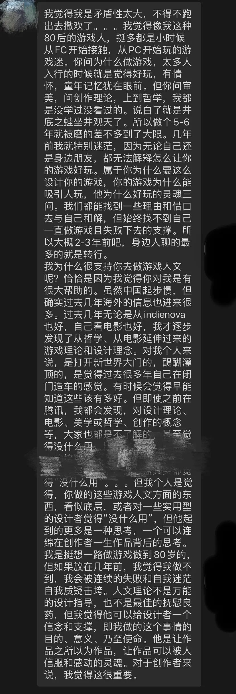
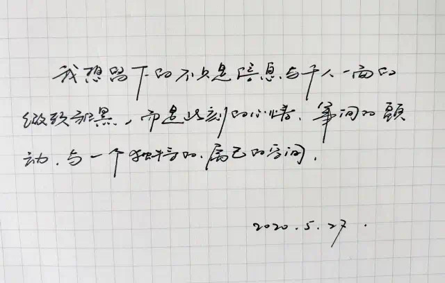

# E1 他者

回头整理前面这几期觉得有些困惑，当时为何以这种形式来使用播客，但这其实能够后来的我对播客的想法形成呼应。

因为在我看来，播客对于我最好的使用场景就是与他人做即兴的交谈。

甚至可以说，这期播客像是一个预言，在做播客的进程中，我遭遇了很多新鲜的事物，新鲜的人，我对世界和自我的认知扩展和成熟每天都有新的进展，在这个时代，声音，叙述，聆听，交流，这件事可能是打破封闭自我的很好的方式。

### 收听

[E1 他者](https://www.xiaoyuzhoufm.com/episodes/5ef1608d418a84a046a1ca62?s=eyJ1IjogIjVlYmNkNzkwMjFhYzg1ODA0MTJiNzcxMCJ9)

### **Show Notes**

1. 《后戏 After Gaming》节目预告
2. 一位思索游戏的朋友写的信
3. 韩炳哲[《他者的消失》](https://book.douban.com/subject/33442258/)
4. 个人的空虚感在于他者的消失，及其解决
5. 阿德勒[《被讨厌的勇气》](https://book.douban.com/subject/26369699/)[《自卑与超越》](https://book.douban.com/subject/26989781/)
6. 巴迪欧[《爱的多重奏》](https://book.douban.com/subject/19964304/)
7. 他者，作为艺术/哲学，同时或许也是游戏的使命
8. 结尾BGM Air - Jeanne - Sexy Boy

我也不知道为什么会扯到他者，但我觉得作为这个播客旅程的第一站，他者是很好的，同时也是做游戏，以及游戏的艺术观会触碰到的一个核心要素。

对于创作者而言，游戏一定是期待着被玩，被打开，就像是书本期待被阅读，CD期待被播放，钢琴期待被演奏一样，它们都希望遇见一个他者可以完成它们自身，没有人听到的声音是缺乏意义的。

在表达与所谓妥协，在受众玩家的进入与游戏制作人设计师的表达之间，甚至在个人意义与对他人的意义之间有一个永恒的张力，这个张力的作用下我们选择自己的生活，我们寻找何者为意义。

我们确实说“我不是为别人而活”，但是这种个人主义神话的问题就是在于用绝对两分的思考割裂了为他人与为自己，它造成了这样一种误解，这两者之间是无法共存的，为人为己是矛盾。

但是这种矛盾只有基于理性经济人和理性的算计之下才是无解的，但是人与人的交际原本就不是这样，马塞尔莫斯的人类学研究[《礼物》](https://book.douban.com/subject/26772504/)早已说明了这一点：

> “我们在生活中所采用的原则其实都是些由来已久的原则，而且在未来仍会有效：**这就是要走出自我，要给予**——无论是自发的还是被迫的；这种原则是不会错的。”

秘密就在于：

**为人与为己的意义最终是同时发生的。**

