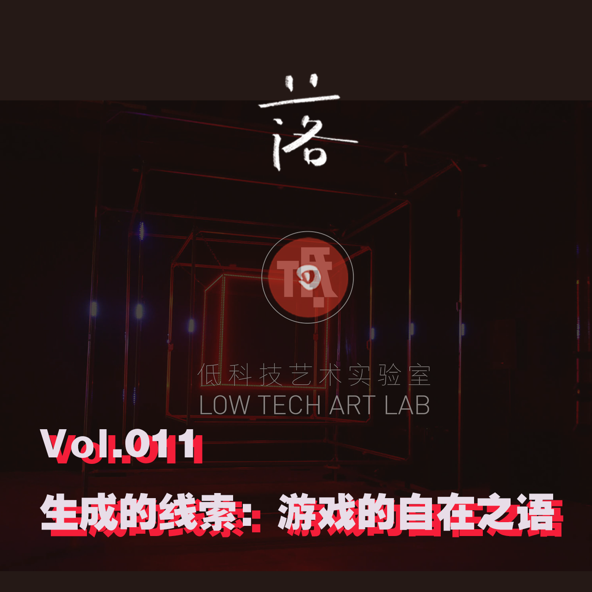
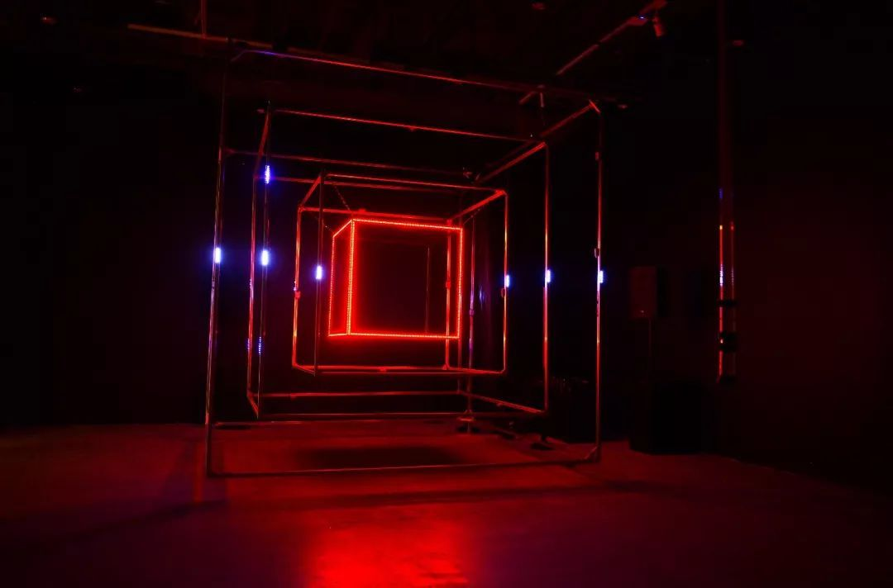
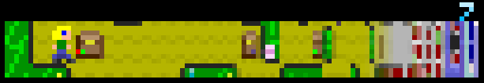
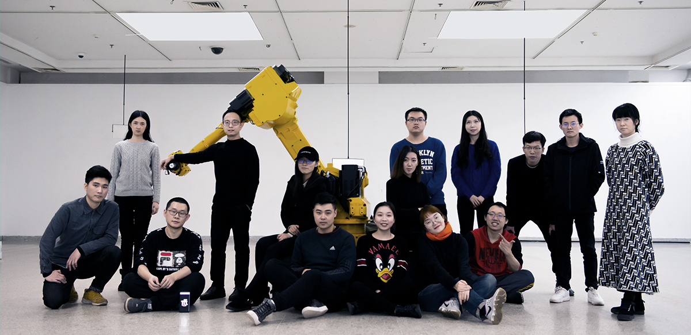
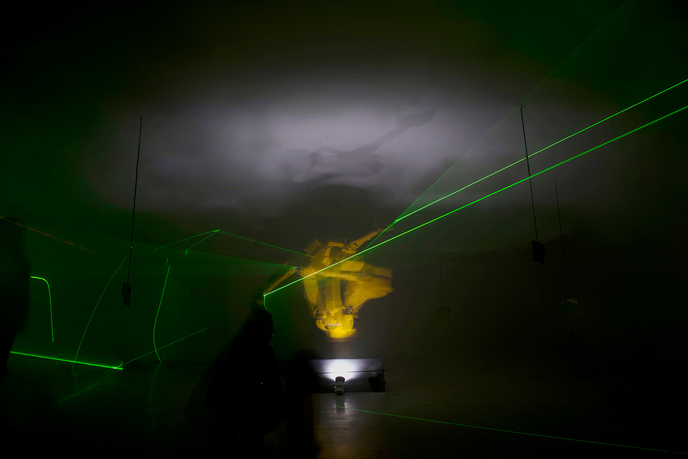

# E11 生成的线索：游戏的自在之语 \| 低科技 x 落日间

## 基本信息

**低科技艺术实验室 x 落日间**

非常荣幸能请到郑达老师聊聊游戏与艺术。

郑达老师是我无意间发现的，国内少数很早就对游戏机制与创作有自觉的艺术工作者，后来随着在艺术领域的工作，郑达老师逐渐转向了人工智能与更技术性的课题。但没想到郑达老师谈论其那段尘封的记忆时，也充满了感慨，非常感谢为我们带来了这期情感真挚的，充满了珍贵口述资料经历的播客。

### 收听

[E11 生成的线索：游戏的自在之语 \| 落日间 x 低科技](https://www.xiaoyuzhoufm.com/episodes/5fa6712083c34e85dd6df335?s=eyJ1IjogIjVlYmNkNzkwMjFhYzg1ODA0MTJiNzcxMCJ9)

### 嘉宾

**郑达**

媒体艺术家，“低科技艺术实验室”创立者。华中师范大学美术学院副教授、数字媒体艺术专业（DMA）主任、英属哥伦比亚大学艺术系访问学者和韩国首尔CPI研究员。艺术工作聚焦于跨媒体互动艺术，其创作轨迹映现在现实与虚拟世界交错点的探索和实践，包括游戏艺术、互动艺术、机械装置、媒体剧场等。创立的“低科技艺术实验室”专注于当下媒体文化和跨学科的融合，基于电子虚拟环境的艺术实验，先后完成“游戏空间—多种物”、“入侵计划”、“后机器计划”“后人类的副本”等系列作品。作品展出于：中央美术学院美术馆“未来展”， 上海K11美术馆、湖北美术馆、南京艺术学院美术馆等，曾在专业艺术机构、美术馆举办个人媒体艺术作品展。作品获得英国“The 2017 Lumen Prize”互动艺术大奖，“2018第三届王式廓奖”艺术奖得主。「独立游戏人」。

## Show Notes

BGM Daft Punk - Overture / Daft Punk - The Son of Flynn

00:00 对《落日间》播客的定位和之后的发展与计划，三个部分

03:30 关于本期《落日间》的标题与缘由

06:20 自我介绍《[低科技艺术-郑达](https://book.douban.com/subject/25881260/)》/ [低科技艺术实验室 Low-Tech Art Lab](http://zhengda.tech/index.php/about/3)

07:20 2008 Indiecade 独立游戏的国际评审节 an international juried festival of independent games.

### 游戏制作的起点

09:00 04/05年的游戏市场神话与教育背景「数码设计」

11:22 早些年使用的图像节点编程的实时3D环境虚拟实境编辑软件[Virtools](https://baike.baidu.com/item/virtools/251885?fr=aladdin) 与现在的[Touch Designer](https://blog.csdn.net/EdwinLee01/article/details/89083080)

14:15 冯梦波，详细可见 [落日间E7 与中国最早的游戏艺术家聊聊游戏和当代艺术](https://www.xiaoyuzhoufm.com/episodes/5f4f068f9504bbdb77ba44c8?s=eyJ1IjogIjVlYmNkNzkwMjFhYzg1ODA0MTJiNzcxMCJ9) , 落日间之前也做过一个小作品《[寻找冯梦波](https://yezi.itch.io/fengmengbo)》可以试玩 / 曹斐 [RMB City](https://www.notion.so/yzitao/26f7d4b6ab68472a8f1d46587ef9ca95#e1b315b3975849eba73aabfa576fc927)

15:14 Serious Game 今译 「功能游戏」，可以参考文章《[最好没有严肃游戏](https://zhuanlan.zhihu.com/p/32908209)》

15:30 2006年郑达与团队制作的独立游戏《[热血救助员](http://www.souvr.com/serve/201006/23768.shtml)》以及其相关回忆，研究创作

### 从游戏设计到当代艺术圈

26:55 从功能游戏《热血救助员》的设计，到当代艺术游戏作品《多物种》系列，[多物种C的起源 THE ORIGIN OF MULTI-OBJECT C . 2008](http://zhengda.tech/index.php/content/24) / Cave 投影环境

28:12 游戏形式的作品/新媒介在当时的艺术圈的边缘化，从老师到艺术家的身份转换

30:00 中国当代艺术《[灰色的狂欢节：2000年以来的中国当代艺术](https://book.douban.com/subject/25775605/)》

31:30 当时创作的同路人? [陈星汉](https://baike.baidu.com/item/%E9%99%88%E6%98%9F%E6%B1%89/327688?fr=aladdin) / 《[Cloud云](http://www.jenovachen.com/flowingames/cloud.htm)》官网（似乎已无法下载），[Trailer视频](https://www.youtube.com/watch?v=zM0NwnQV0Nk)，关于陈星汉很早的采访《[【一人一世界】 CCTV专访著名游戏制作人陈星汉](https://www.bilibili.com/video/BV1fs41127d8)》, 陈星汉对于情感效价区域的分析以及创作的追求。

34:15 郑达游戏艺术作品的创作思路：作品与观众的交互系统 / 作为「高自反性」媒介的放大能力

35:20 指的是先前我玩魂类2D银河恶魔城类游戏《[盐与避难所\(Salt and Sanctury\)](https://www.douban.com/game/26426310/)》的最终Boss的感受 / 游戏角色的扮演 王者荣耀或类似MOBA都有分工，射手，辅助，中路法师，上单，打野 对应不同的队伍职责 / 理查德·巴特尔（Richard Bartle）《[牌上的花色——MUD中的玩家](https://www.gameres.com/684100.html)》的四种玩家分类

36:15 《多种物系列》作品的玩法以及当时的策展，艺术的观念与形式性是否被过分强调了？

38:55 被收藏和参加 收到的反馈与鼓舞 [《亚现象》首届CAFAM未来展](http://fashion.163.com/special/art/yaxianxiang.html) 参展艺术家：[郑达](http://fashion.163.com/13/0122/23/8LS1CDJE00264MK3.html) 8000块的艺术作品收藏，到整个身份和方向的转变，艺术家的决心。

45:04 游戏分级国家课题的网吧调研（2008），当时的三四线乡镇的网吧青年，游戏作为平等的社会交往协作。

49:35 韩国文化部CPI的交流经历（2012年韩国文化部下属的这个做游戏审查和分级的公务员部门挺庞大的，大概有300人，包括做整套的网吧管理以及游戏分级制度建设和审查等工作，郑达老师在那边工作交流了8个月）

51:15 孩子与我们面对游戏的态度

### 从游戏再往前

53:03 「低科技艺术实验室」概念，科技艺术的跨学科合作特性“Lab”的概念，低分辨率。

55:40 艺术如何介入技术系统，如何面对科技——「可控性」概念与技术创作体验

58:35 作为研究，交流的工作方式：从「多种物」游戏到「入侵计划」再到「后机器」的议题转换。

60:15 团队合作进行艺术创作是如何可能的？境况的好转

64:30 从当时到现在，对于受众的设想有变化吗？从视觉凝视的绘画到主动性的参与的富媒体 / 多种维度的表现和情景化的作用

67:40 公共空间，[随境游戏（Pervasive Game）](https://en.wikipedia.org/wiki/Pervasive_game) / 这一部分概念其实本来就比较模糊，我表达有误，平行实境游戏（Alternate Reality Gaming，ARG）似乎是指简.麦戈尼格尔所用来替代游戏化（Gamification）的表达，平行实境就是反遁世的游戏，强调现实行动。而随境游戏或者增强现实游戏则是指借用了现实来作为游戏内容或场景的游戏，强调其中部分内容来源于现实。类似[Pokémon Go](https://en.wikipedia.org/wiki/Pok%C3%A9mon_Go) 或者[Ingress](https://en.wikipedia.org/wiki/Ingress_%28video_game%29)

69:30 「我觉得我的艺术创作就是一个游戏」

72:30 电子游戏创作与「游戏」的当代艺术作品的选择，对更多种媒介的好奇

74:23 对郑达老师影响很深的游戏，也是我最喜欢的游戏之一《[Passage](http://hcsoftware.sourceforge.net/passage/)》（会结合Jason Rohrer日后谈一期这个游戏以及我以这个为线索创作的作品

76:16《[El Hacedor](https://www.bilibili.com/video/BV1Jp4y1i7Mc/)》- 欢迎去我的B站观看以及试玩）

76:41 技术的诗性

77:27 《[One Hour One Life](https://store.steampowered.com/app/595690/One_Hour_One_Life/)》 / NYU Game Center的游戏档案室

78:45 电子游戏创作与「游戏」的当代艺术作品的区别，媒介古典的凝练的纯度与当代艺术的文本与批判性的差异。

80:35 游戏作品会进当代艺术馆吗？希望在艺术馆中玩游戏吗？

83:18 结尾 - 听众会不会觉得很无聊？

### 其他链接

[【美术文献·访谈】郑达工作室](https://mp.weixin.qq.com/s/7dCQTRZzXAvcbcYnzxtmIg)

[【雅昌专访】郑达：从“低科技艺术”到“后机器”时代](https://m-news.artron.net/news/20160415/n887557.html?from=singlemessage&isappinstalled=0)

[25个问题问郑达，原来你是这样的艺术家！ \| 2018王式廓奖](https://m.sohu.com/a/272968371_309976)

[当代艺术中的电子游戏（上）](https://www.gcores.com/radios/102010)

《[现代主义绘画](https://www.sohu.com/a/411141714_100230219?_f=index_betapagehotnews_1&_trans_=000014_bdss_dklgqxj)》

## 补遗

我询问到郑达老师这样一个问题。

就是他怎么看现在的当代艺术的封闭性，外人如何去看待当代艺术的这种封闭性。

他站在一个执中的角度，说这是因为是时代或许不同人都有不同的背景与起点，理解，就好像反过来说，电子游戏也有自己的品类，有自己的审美经验的积累，如同重轻老师在《[圆桌辩论：好玩，是不是一款好游戏的必须条件](https://www.gcores.com/radios/118240)》提到的，游戏或许也是一种后天习得的品味。

一些非游戏玩家，对游戏有兴趣却发现市面上全是商业手游，与那些我们对当代艺术的了解只停留在表面的一些令人哗然的行为艺术其实没有什么差别，我们可能会投入数百个小时在一个游戏之中努力去理解，但可能并不会花上数百个小时了解当代艺术。

我的意思并不是说我们这个游戏人的群体缺少爱与兴趣，而是说或许我们应该走出去更多的谈论我们所喜爱的东西，在这个意义上，或许「游戏人」比起「当代艺术」反而做得远不够。

