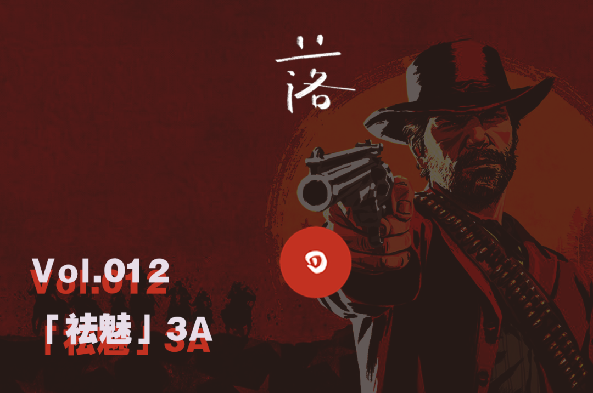

# E12 「祛魅」3A

## 基本信息

3A（triple A Games）游戏。

这个词似乎经常被许多玩家朋友们当作一件非常神圣、必要的事物来做期待，而无论是先前的《大圣归来》还是《黑神话：悟空》，我们的情感似乎总是被这样的游戏所牵动，但是3A游戏并不是神话，而也只是一桩能跑得起来的生意，我们请到了曾经参加过《荒野大镖客2：救赎》开发的游戏策划刘嘉俊以及参加过多部育碧的3A作品的老朋友希辰，一同来聊这个话题，希望大家有所收获。

### 嘉宾

刘嘉俊：中美之间数年经验的游戏技术策划（technical designer）。作品包括《荒野大镖客：救赎2》，NBA Live Mobile，《秘境对决》等。前网易、EA Tiburon，Rockstar Games 员工，现就职于莉莉丝游戏。毕业于卡内基梅隆大学娱乐技术中心\(CMU ETC\)。知乎账号：[刘嘉俊](https://www.zhihu.com/people/je.liu)

希辰 Xichen： 声音设计师 Ubisoft Shanghai，有数代《Farcry》工作经验，目前就职于NExT Studios，个人网站 [Soundoer](https://soundoer.com/) , B站 [@Xichen](https://space.bilibili.com/157914767)

### 收听链接

[E12 「祛魅」3A](https://www.xiaoyuzhoufm.com/episode/5fb3e6a183c34e85ddae36d2?s=eyJ1IjogIjVlYmNkNzkwMjFhYzg1ODA0MTJiNzcxMCJ9)

## Show Notes

BGM: Deadman's Gun - Ashtar Command - Red Dead Redemption Original Soundtrack

00:00 Intro 重轻提到的Acquired taste [圆桌辩论：好玩，是不是一款好游戏的必须条件](https://www.gcores.com/radios/118240)   
03:27 节目开始 以及讨论开头 / Xichen客串   
06:00 嘉俊的自我介绍 

### 3A游戏开发秘辛

06:55 何为3A游戏？《鬼泣5 Devel May Cry5》《死亡搁浅 Death Stranding》《只狼 Sekiro》 《神秘海域》   
09:00 「很多钱，很多人，卖得多」，3A游戏作为工业的最高生产力与技术质量（Production Value 和 Design Value的拆分）   
11:53 3A 游戏背后的开发团队 [《荒野大镖客 救赎 2》的背后开发者付出了怎样的代价？](https://gouhuo.qq.com/content/detail/0_20181028135724_s0MEdz4Sn) / [译介 \| Kotaku 深度报导：BioWare 的《圣歌》到底怎么了？（上篇）](https://gouhuo.qq.com/content/detail/0_20190404160815_ug1tmr3Xi) / （[下篇](https://gouhuo.qq.com/content/detail/0_20190404184532_rZ5OUq0jM)），著名的游戏业界深度内容报导者 Jason Schreier，著有《[血、汗与像素（BLOOD, SWEAT, AND PIXELS）](https://book.douban.com/subject/27065531/)》  
14:05 在EA的工作经历，EA的工作方式，控制工时与顺延工作量   
16:18 对于国人在海外游戏厂商工作  
18:30 工作的文化隔阂问题与地区工作差异性 Live Operation \(Live Ops\) 或可参考文章 [Understanding LiveOps, Doing LiveOps](https://www.gamasutra.com/blogs/CrystinCox/20200327/360105/Understanding_LiveOps_Doing_LiveOps.php)   
20:10 「游戏作为服务」 Games as a service \(GaaS\)，订阅制 Xbox Live / Origin EA Access   
22:05 播客 [游戏面包房](http://xima.tv/GhTnb6?_sonic=0) EP2 游戏设计的梦想与现实   
23:08 第一个比喻：作为音乐节持续运营游戏的Live Ops与作为专辑Album的买断制游戏的区别   
24:35 在RockStar R星的工作体验与经历，总工时计算，全球化工作   
26:25 Xichen在Ubi Shanghai的「螺丝钉」体验 Leading Studio的区别   
30:55 不同工作室的工作方式与加班，人力成本以及管理风格 / 圣歌中飞行功能因为管理原因而加入 [小岛秀夫：从没浪费过时间 连睡觉做梦都在思考](https://www.gamersky.com/news/201811/1127768.shtml)   
33:10 《巫师3》的波兰游戏开发商 CD Project Red，目前预备发售《赛博朋克2077》关于工资水平和人力成本的考虑   
35:40 3A的瓶颈  
36:33 嘉俊对于游戏商业性/艺术性的考量，对流行文化的影响   
37:20 第二个比喻：作为宗教场所进入大家生活中木刻菩萨相与作为博物馆中的艺术品   
38:50 作为一门商业生意的3A游戏   
40:40 3A游戏面对瓶颈的解法：《对马岛之鬼 Ghost of Tsushima》开放世界的商业考量，《四海兄弟Mafia: The City of Lost Heaven 》《睡狗 Sleeping Dogs（热血无赖）》 / 从《我叫MT》到《原神》  
43:20 3A游戏的竞争带来的好处，各类2A游戏的出现《地狱之刃》 Lucas Pope 《幽灵行者 GhostRunner》《奇异人生 Life is Strange》   
44:15 在美国工作身边的人与生活的体验，美国人懒惰吗？一个同事的例子   
46:55 在《荒野大镖客2》工作的最大收获，可参考嘉俊知乎回答：[出国留学的意义是什么](https://www.zhihu.com/question/20830287/answer/582676742)   
48:36 「八尺男儿为游戏落泪」百年之后的同地同族的感通瞬间   
51:47 3A游戏对于世界营造的用心感   
52:34 3A在国内游戏圈被期待与文化上被代表的需求 / 游戏科学《黑神话：悟空》柳叶刀工作室《边境计划》   
55:20 中国离3A还有多远？  
58:50 中国3A的瓶颈与出路：人力成本

### 做游戏与进入游戏行业

61:17 游戏行业的工作方式，心动网络「离职致意金」[触乐：成年人的公司](http://www.chuapp.com/article/287576.html)，《[奈飞文化手册](https://book.douban.com/subject/30356081/)》   
62:00 现在的毕业生进入游戏行业的门槛提升，竞争压力大  
64:45 「卷」以及「倒挂」   
65:20 来自Xichen的入行建议   
67:20 家庭条件的差别带来的信息不平等   
68:09 入行和「做游戏」心态的摆正   
69:32 关于游戏学历以及游戏素养的讨论，游戏开发民主化，手游用户增长   
72:10 MiniGame和制作游戏的体验与经历

### 做有当代性的游戏

74:10 游戏经历以及游戏群体的分享，游戏对于非玩家群体的高门槛与「奢侈」   
76:10 对于我们所喜欢的，所想谈论的游戏是很有门槛的，是否有更民主化的方式？《原神》的双端互通，云游戏的未来展望。   
78:13 对于嘉俊做游戏最重要的当代性  
      《GTA》「荧幕美国的还原」/ 《荒野大镖客》「时代变了我没跟上」   
80:25 无法忽视的当代性与游戏高下的分野，「是不是应该有更加高级的审美趣味？」   
82:03 二次元抽卡游戏与SLG游戏的当代性   
85:55 椰岛游戏的当代性   
86:14 关于二次元的另一种当代性理解   
86:40 「如果我没有朋友，我就不会开发Party Game」   
87:25 作为客人（Guest）的玩家（Player）/ 开发者与顾客之间的Tension紧张关系   
88:15 第三个比喻：餐饮行业中快餐与高端寿司店的服务者，主机/手机游戏门槛的区别  
90:00 「从萨莉亚到海底捞」，手游上升，主机游戏下降   
91:20 不仅是引导   
93:40 第四个比喻：「Maxmara与优衣库」，格调不够进高等服装店舒服吗？   
96:20 对于某些文化高雅性与鄙视链的破除   
97:50 不合时宜之人的结局会是什么？ 

