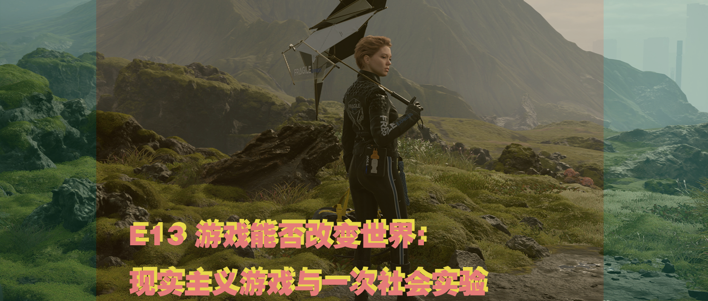
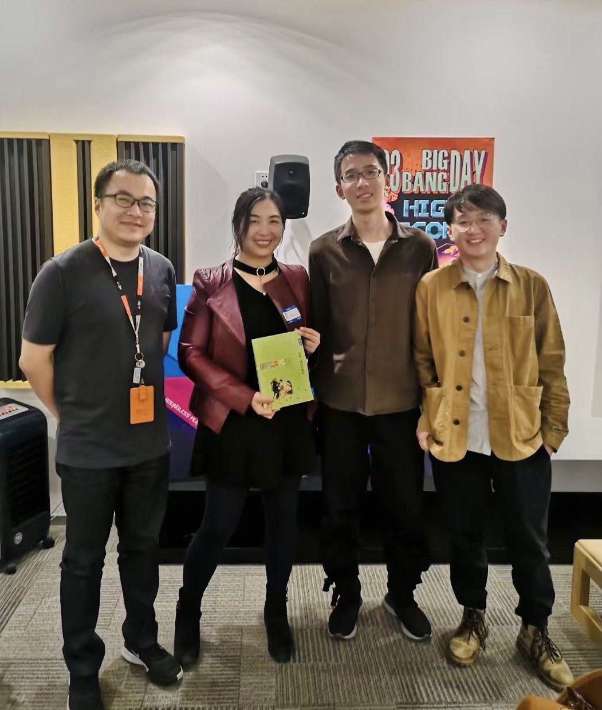
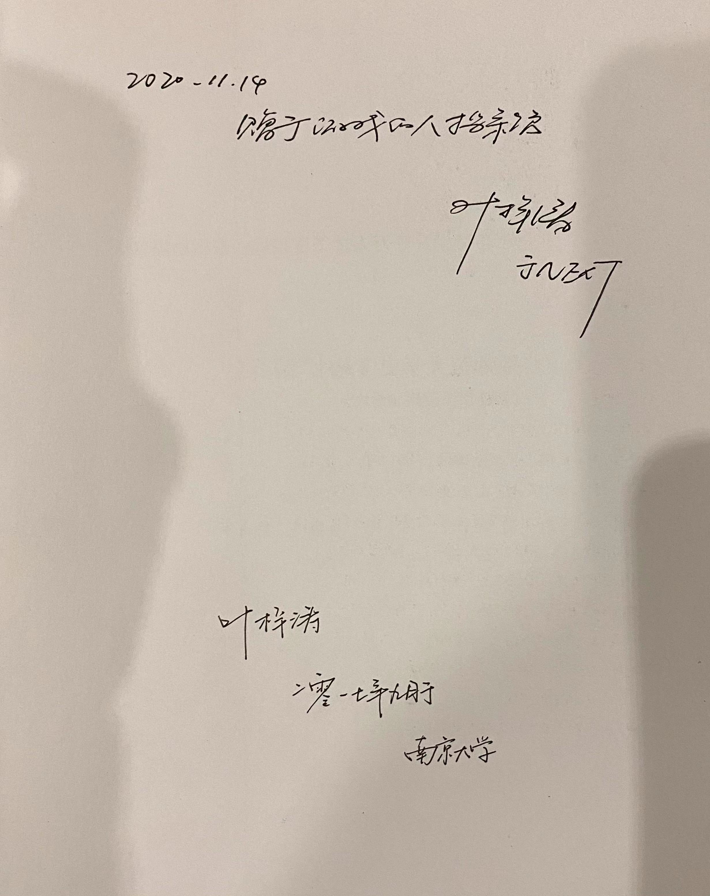

# E13 游戏能否改变世界：现实主义游戏与一次社会实验（刘梦霏）

## 基本信息

### 收听链接

[E13 游戏能否改变世界：现实主义游戏与一次社会实验](https://www.xiaoyuzhoufm.com/episode/5fcb851ddee9c1e16d7c2fe6?s=eyJ1IjogIjVlYmNkNzkwMjFhYzg1ODA0MTJiNzcxMCJ9)

### 嘉宾

刘梦霏，游戏研究学者，以历史的视角研究游戏的本质与社会影响，Chinese DiGRA（中华数字电子研究协会）前副主席，清华大学历史学博士，游戏研究学者、游戏化设计师，北京师范大学艺术与传媒学院数字媒体系讲师，《游戏研究 Game Studies》审查委员，游戏的人档案馆（Homo Ludens Archive）发起人。

牛雪莹，北京师范大学艺术与传媒学院硕士，研究兴趣为亲子游戏

Xichen 希辰 NExT Studios 音频设计师，前育碧员工，个人网站 [Soundoer](https://soundoer.com/) , B站 [@Xichen](https://space.bilibili.com/157914767)

Tony \(主持\) 游戏运营，游戏爱好者，前新闻传媒工作者

## Show Notes

开场与结尾音乐： Don't Be So Serious - Low Roar - Death Stranding \(Songs from the Video Game\)

[游戏的人（Homo Ludens Archive）档案馆网站](https://www.gamearchive.cn/2020/06/08/%E5%85%B3%E4%BA%8E%E6%A1%A3%E6%A1%88%E9%A6%86/)

Game for society：[游戏x社会GAMEJAM](https://www.gamearchive.cn/game-for-society/)

现实主义游戏的PPT：[一次游戏界的现实主义运动](https://www.kdocs.cn/l/snE3tAEdiMHA?f=201)

[Nicky Case](https://ncase.me/)

与Xichen制作的游戏原型的经历[Vlog](https://www.bilibili.com/video/BV16J411Y7FG)《C \(8,3\)》

12岁小女孩的演讲：[游戏是我精神生活的一部分](https://mp.weixin.qq.com/s/HLJBm6UhmDD5T8W4slOT1A)

00:00 开场  
02:55 嘉宾自我介绍  
04:01 [如果电脑游戏是门学问，那么读完这20本书就是博导了](https://www.thepaper.cn/newsDetail_forward_1294382) （2015年）  
04:40 《[游戏学研究奠基人阿尔萨斯来到腾讯，他都说了些什么？](https://new.qq.com/omn/20181101/20181101A1I61U.html)》2018/10/15  
04:50 [Chinese DiGRA](http://www.chinesedigra.org/) 中华数字电子研究协会

### **游戏的人档案馆**

05:30 Homo Ludens 赫伊津哈《游戏的人》  
05:48 档案馆的历史渊源 《[「重识游戏」首届功能与艺术游戏大展](http://game.people.com.cn/n1/2018/0910/c218877-30283729.html)》  
09:09 网站时间轴 《[我们的游戏史](https://www.gamearchive.cn/2020/06/08/%E5%85%B3%E4%BA%8E%E6%A1%A3%E6%A1%88%E9%A6%86/)》  
09:28 早期游戏杂志 《电玩迷》《大众软件》《游戏批评》《电子游戏软件》《电子游戏与电脑游戏》  
12:00 非游戏杂志收藏 老游戏 老主机 周边  
13:25 那些愿意为档案馆捐赠的玩家  
15:54 过去电子游戏的物质遗存 《大唐诗录》三联出版社 / 修改器网站：葵花宝典  
18:13 数字化的计划

### **游戏经历**

19:54 刘梦霏老师的家庭游戏氛围与经历  
23:00 12岁的游戏玩家的联合国演讲稿《[游戏是我精神生活的一部分](https://mp.weixin.qq.com/s/HLJBm6UhmDD5T8W4slOT1A)》  
23:53 游戏经历对职业的影响  
24:20 魔兽世界的博士论文与游戏经历  
24:40 魔兽世界的灵魂拷问：“你是部落还是联盟？”（各位可以跳过）  
25:10 因为魔兽世界而成为从业者的Xichen希辰  
27:19 三位魔兽世界玩家的激情交流与吐槽

### **金色平原与治沙活动**

30:40 强行的话题转换  
31:40 一个治沙 x 游戏的Discovery纪录片项目  
33:00 一次开放的社会实验，两组独立游戏人的创作采风  
36:30 游戏作为一种普通人也可以使用的表达方式，小朋友做的游戏，Roblox与创作  
42:07 GameJam / [Berlin AMAZE 2017](http://2017.amaze-berlin.de/) /[Meditationgames](https://meditations.games)  
43:38 一个坚定技术派眼中的“游戏作为一种表达方式”的民主化  
44:35 游戏怎么表达这种治沙 x 游戏的理念？小朋友做出的游戏是怎样的？  
47:40 游戏《Prune》，将游戏创作推进到孩子以及老人

### **游戏能改变世界吗？**

50:39 游戏创作与欣赏的高门槛，从类型游戏到另一种游戏创作与生存的可能？  
52:30 游戏素养  
54:45 关于「游戏偏差行为」与对游戏的文化歧视，中国的集体主义文化价值与资本主义的生产价值取向对于游戏的扭曲  
57:01 各方面应该为此做的事 业内，学界  
58:33 游戏纸刊杂志形成的游戏批评素养，游戏的审美与领引，文化对游戏的影响 /《血狮》 /一种更有实践性与审美高度的游戏批评  
61:01 游戏可以改变世界吗？游戏化（Gamification）是什么？「现实主义游戏」是什么  
65:21 游戏化连同游戏的消遣与游戏之于人的意义之间的龃龉 宾夕法尼亚大学沃顿商学院的Cousera网课 [Gamificaiton](https://www.coursera.org/learn/gamification) 《For the Win》（中文版《游戏化思维》）游戏化的三种起源以及”游戏化“概念的变化与现在社会的强调 /  
67:25 三种游戏分类《[游戏监管，从分类开始](https://mp.weixin.qq.com/s/Qb5BN9NNyd6TCterKbnogg)》：作品游戏，消费游戏与赌博游戏。/ 独立游戏的商业化现状 / 免费游戏与付费游戏的结构性差异 Jonathan Blow / CiGADC 独立游戏开发者大会 / 游戏素养应该是现代人的通识 / 《addiction by design》  
73:22 从游戏化到「现实主义游戏」 游戏化概念的污染 Ian Bogost《[Gamification is Bullshit](http://bogost.com/writing/blog/gamification_is_bullshit/)》  
74:55 游戏如何变成大众文化 接地气「游戏表达普通人的关怀」反类型化与主题  
78:30 动物之森的环境互动，作为切实的世界而非乌有之乡的抽象时间的符号  
80:45 《中国式家长》表达的社会问题《紫塞秋风》甘肃团队对于沙漠的展现，游戏创作精神气质上的现实主义  
83:09 现实主义题材/精神的区别，对于功能游戏/严肃游戏的反思性思考。《大航海时代》/ 游戏共享的Authorship / 游戏严肃与好玩之间的紧张关系  
90:45 游戏并不是一个高效率传达知识的媒介 《[游戏可以用来学习历史吗？葛兆光 刘梦霏](https://mp.weixin.qq.com/s/soz_NkvJOsT1aw7Ok9eAjA)》游戏的在场感 / 游戏的机制（Gameplay）游戏的语言没有被人所理解与从游戏的内容，故事，美术等其他部分中独立出来  
93:30 现实主义游戏是否会让我们导向游戏精神的反面？从文学中借用概念来谈论游戏，把游戏作为一个 以及对于现实主义游戏的再解释： 《完美的一天》/ 《人生串串》 ”现实主义游戏“商业上的机会  
101:57 玩家的能量，玩家的热情，游戏监管  
105:11 反复与重复，我们的学术环境以及社会环境  
106:40 一个植物的比喻，认识的根与叶，游戏传达的体验，做关于游戏的游戏，[《最接近生活的事物》](https://book.douban.com/subject/27073501/)[《理解漫画》](https://book.douban.com/subject/26336970/)  
110:20 游戏 x 社会的活动 Game for society：[游戏x社会GAMEJAM](https://www.gamearchive.cn/game-for-society/)  
111:30 只要游戏能够改变人的观念，那么游戏就能改变世界，游戏设计作为系统性思考 / 思考游戏即思考系统。

## 补遗

特别感谢杨杰老师（[@Digimonk](https://weibo.com/u/1717784427)）的临时音频支持，也特别感谢嘉宾梦霏与雪莹以及老朋友希辰与Tony来一起聊这个话题。聊天过程非常愉快，末赠送了刘梦霏老师一本[《游戏、竞技与娱乐》](https://book.douban.com/subject/4209078/) ，希望能为档案馆出一份力。（2020.11.14）

