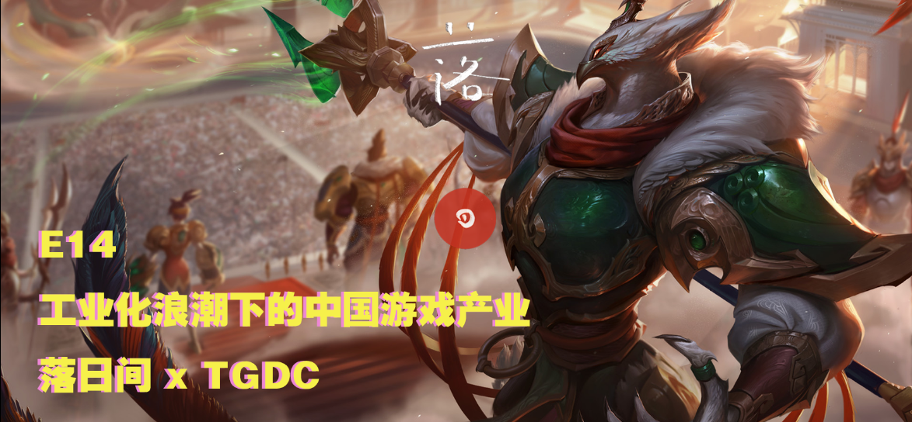
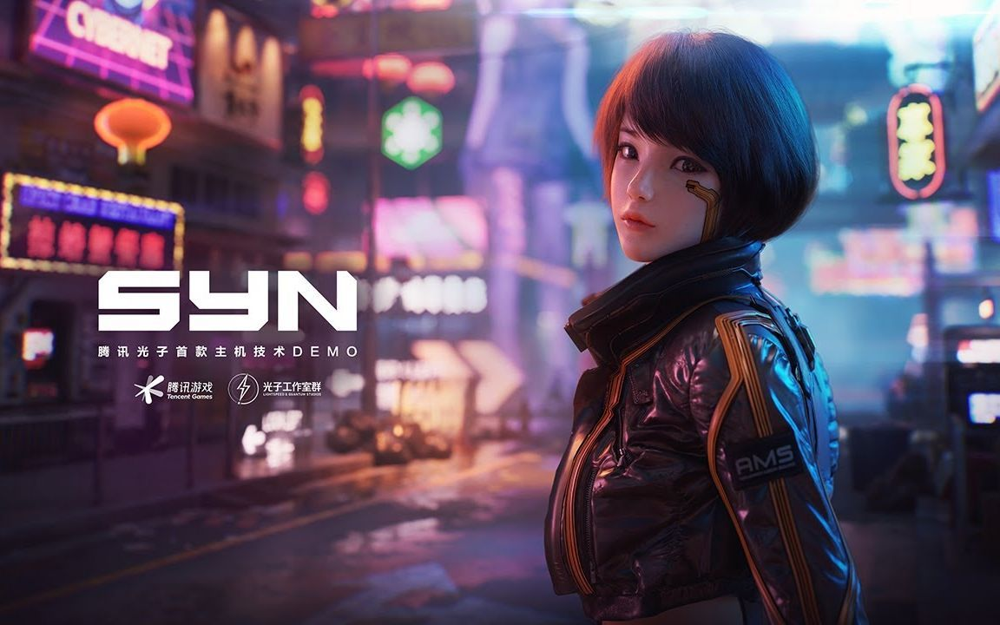

# E14 工业化浪潮下的中国游戏产业 \| TGDC x 落日间

## 基本信息

> "有的时候我会有一种感觉：这栋楼我们当然建得很高也很成功，但再往上建会越来越难。这时你让我去新建一栋楼，我又需要花更多的时间。"所有人都知道行业正处在一个变化的节点，可是在这个混沌的时代，《黑神话：悟空》能受到万众追捧，大翅膀传奇也在凶狠捞钱。红尘浊水，浪奔浪流，一时也看不出谁能借势扶摇直上，谁又外表体面，实际却在拼命扑腾。  
>  —— 托马斯之颅 《2020游戏公司转型潮：谁会掉队？谁有机会？》

本期播客是《落日间》《后戏》受2020腾讯游戏开发者大会邀请所做的特别节目。

[腾讯游戏开发者大会\(TGDC Tencent Game Developers Conference\)](https://gameinstitute.qq.com/tgdc/2020/?ADTAG=yxwm) 是腾讯游戏学院发起的一年一度为促进行业生态共建、行业蓬勃发展而举办的盛会，旨在搭建一个开放的交流平台，期望通过国内外游戏行业知名专家/学者，分享最新游戏研发经验、产业及学术发展趋势等，推动行业良性发展，探索游戏更多可能。

节目中提到的腾讯游戏开发者大会的分享都可以在官网回看 [Game 4 Change](https://gameinstitute.qq.com/tgdc/2020/)

封面：英雄联盟沙漠皇帝三国皮肤-司马懿仲达

### 收听链接

[E14 工业化浪潮下的中国游戏产业 \| 落日间 x TGDC](https://www.xiaoyuzhoufm.com/episode/5fd9fad0dee9c1e16ddea704?s=eyJ1IjogIjVlYmNkNzkwMjFhYzg1ODA0MTJiNzcxMCJ9)

### 嘉宾

托马斯 （托马斯之颅）[游戏葡萄](http://youxiputao.com/)主笔，坐标深圳，关注新晋团队和头部公司。

《[2020游戏公司转型潮：谁会掉队？谁有机会？](https://mp.weixin.qq.com/s?__biz=MjM5OTc2ODUxMw==&mid=2649791643&idx=1&sn=e91b568ceabc3fade6f939ffe154e869&chksm=bf3244358845cd238a6b08a6a61efed28656bc5d0539e48b916341928f81626a12c7311368d5&mpshare=1&scene=1&srcid=1203xo3FYKg2zuM0COxZsHBz&sharer_sharetime=1607058846384&sharer_shareid=8e2873ed66791d114792734402de17f7&key=de6f95248d27ca5e044afd1debcf094dba5aa0d60103d28c021ab1207b7be2588241253295dc465de1fd0b735ae285c97f9cf5bc0e787d6ce27e301307f63ebeb2f4ed3da19dc49dff2e3563b25af3f7a8da2649eabd1a6c008c5b200403651263bcf48c7ab8ccfd338f8bff1c8b880ad0534b3c2f40388e67e373f679c4bc47&ascene=1&uin=MjI1MDgwODAwMA%3D%3D&devicetype=Windows+10+x64&version=6300002f&lang=zh_CN&exportkey=AaM4cElDcBUOwk1CP1%2FWHGc%3D&pass_ticket=n%2FF15u1nOZrSoRckScyWpCEK7gq%2FrENJlCK9b8E8X3Pfho9BYo6ykU4CFMrKmngU&wx_header=0)》

《[对话腾讯马晓轶：用最顶尖的团队，寻求下一个突破式创新](https://mp.weixin.qq.com/s?__biz=MjM5OTc2ODUxMw==&mid=2649777940&idx=1&sn=904643d6b28ae2e41b71a74c9d1ae0d8&chksm=bf32bfba884536acf39683d161e64d3f006d7878bf4c13a949e0d724951cb89b67fc4a79fbfd&mpshare=1&scene=1&srcid=&sharer_sharetime=1593441941896&sharer_sh)》

Xichen 希辰 NExT Studios 音频设计师，前育碧员工，个人网站 [Soundoer](https://soundoer.com/) , B站 [@Xichen](https://space.bilibili.com/157914767)

Tony \(主持\) 游戏运营，游戏爱好者，前新闻传媒工作者

## Show Notes

00:00 开场 BGM：主题曲Hans Zimmer《王者荣耀 Main Theme》 

01:55 《落日间》/《后戏》与腾讯游戏开发者大会TGDC的合作 

03:04 每个人眼中的TGDC印象，GDC（Game Developer Conference） 

06:50 每个人印象最深的分享 

07:15 中国传媒大学副教授 周逵：《游戏的人：跨媒介的玩家群体画像和参与动力机制研究》银发玩家 

10:32 NExT Studios 李奇，金力《让现实更理想——Mega Photogrammetry基于摄影测量的室外3D大场景重建》 

11:35 SteveMartin《Evolving AAA Game Development》 

13:25 SWERY \(末弘秀孝）《创作出10年后还被人津津乐道故事的方法论：如何创造出奇妙且独特的世界观？》 

16:03 专业分工的发展深入背后的工业化进程 / 工业化是什么？/ 好莱坞片场制 / 能够不断生产热卖影片的能力/ 以音频设计为例 

19:37 游戏行业门槛与下限的提高 MMORPG（大型多人在线role-playing游戏） 

20:27 玩家视角中的捏脸，往更好体验的发展 

22:12 游戏开发作为复杂的工程学问题，成本，创作的顶尖的流程/ Pawel Wojs《Paint it Black: The Art Direction of Total War: THREE KINGDOMS》/ 潘诚伟《相信画中的世界 —— &lt;英雄联盟&gt;插画经验分享》 

24:18 游戏开发团队中的历史团队，《全战：三国》《育碧》 

25:45 工业化对应需求的市场的扩充，大厂的出海动向，可见托马斯在游戏葡萄的文章《[对话腾讯马晓轶：用最顶尖的团队，寻求下一个突破式创新](https://mp.weixin.qq.com/s?__biz=MjM5OTc2ODUxMw==&mid=2649777940&idx=1&sn=904643d6b28ae2e41b71a74c9d1ae0d8&chksm=bf32bfba884536acf39683d161e64d3f006d7878bf4c13a949e0d724951cb89b67fc4a79fbfd&mpshare=1&scene=1&srcid=&sharer_sharetime=1593441941896&sharer_sh)》 

27:18 云游戏是什么，可能带来什么 

29:09 细分领域的专业化——以游戏音频设计的思路为例

> _或许正是这个原因，使高度专门化的工业文化迫切需要游戏，因对许多头脑而言，它们是唯一可以理解的艺术形式。在分派务和切割职能的专门化世界中，真正的相互作用缩减到了零有些落后社会或部落猝然转换为工业化、专门化、机械化的形态之后，往往难以设计出运动和游戏之类的矫正剂，以便创造出与这一转化抗衡的力量。这些社会陷人迂腐的泥潭。没有艺术的人，没有游戏这种大众艺术的人，往往像毫无意识的自动机器。—— 麦克卢汉《理解媒介》_

30:56 工业化追求确定性，是否伤害创意上的不确定性？策划的专业化技能与对整体游戏whole picture的设计，generalist与specialist 

34:29 工业化带来的更好的技术选型以及工具能够更高效率制作与表达

35:44 工业化的复用重复与个人追求的矛盾点 

38:18 几种跳出的思路：1. 作为整体把控创作的制作人 2. 作为交叉领域的协调员例如TA（Technical Artist）3. 工业化只对中大型公司有影响，小公司更多是创意或与巨头的合作可能 

40:50 西方文化的理性主义精神与创作方法背景与中国文化的差别 

43:11 作为计量的人，游戏打工人？ 1500个人团队的Global Mega Team 全球超级团队 

44:30 创意与非工业化团队如何自处的问题，超大型团队的超高品质产品对于人才的控制

46:21 伟大的是金字塔还是莎士比亚？本雅明《机械复制时代的艺术作品》 

47:55 一个问题：不考虑成本能力，你更想做《美国末日2》还是《哈迪斯》 

51:22 是符合理想状态的工业化进程还是内卷？ 

54:46 小作坊时代的终结？除了勇气还需要什么？ 

57:14 独立游戏的现状，产学研和工业化带来的人才培养 / 清华深研院《互动媒体人才培养机制——清华-腾讯互动媒体设计与技术中心的未来人培养模式》 

59:34 自下而上，自上而下的创意过程 / 小棉花 郭亮《游戏创作需要更多意义》/ 胖布丁工作室《迷失岛》 

63:39 个人跳出来创业的勇气与一些新趋势，海外独立游戏的工业化背景 

65:59 结尾 

69:02 结结语 （BGM：《永远的长安城》）

### 评论

播客的形式一定‎不是傳播‎效率最高的、最直觀的，但對於‎「工業化」這種議題，我們‎要的反而不是結論‎，而是‎闡釋‎。幹貨看了太多，濕貨也很重要。感謝主播們，這期節目很有意義。 —— Kyle

在小宇宙听到了落日间 X TGDC（腾讯游戏开发者大会）的这期联名节目，就好奇去搜了一下TGDC。虽然错过了线上直播，但感觉如果是对游戏开发、IP运营和游戏美术感兴趣，或是在研究游戏行业都可以看下他们出了一个会后资料包👀。400多页......还挺用心的。感兴趣的可戳：[https://share.weiyun.com/EWiOCN3G](https://share.weiyun.com/EWiOCN3G) —— 即友评论

## 补遗

> _2005年，《家用电脑与游戏》曾刊登过一篇对姚晓光的采访，那时他还在盛大，天美也还未诞生。不过那篇文章结尾的感言，倒是很适合成为这个时代的注脚：“ 当不成熟的我们加入不成熟的中国游戏研发业时，没人能说自己是成功的，我们唯一能做的就是加倍努力。我们都是二、三年级的小学生，即便在国内有些名气，即便做了 5 、 6 年开发，也还是小学生。只不过有的在上二年级，有的在上三年级，有的还是学前班。大家都在学习，没有资格去比些什么，或者炫耀什么。唯一能做的是认真学习，多多积累，争取早点毕业。“_

_—— 托马斯之颅《_[_2020游戏公司转型潮：谁会掉队？谁有机会？_](https://mp.weixin.qq.com/s?__biz=MjM5OTc2ODUxMw==&mid=2649791643&idx=1&sn=e91b568ceabc3fade6f939ffe154e869&chksm=bf3244358845cd238a6b08a6a61efed28656bc5d0539e48b916341928f81626a12c7311368d5&mpshare=1&scene=1&srcid=1203xo3FYKg2zuM0COxZsHBz&sharer_sharetime=1607058846384&sharer_shareid=8e2873ed66791d114792734402de17f7&key=de6f95248d27ca5e044afd1debcf094dba5aa0d60103d28c021ab1207b7be2588241253295dc465de1fd0b735ae285c97f9cf5bc0e787d6ce27e301307f63ebeb2f4ed3da19dc49dff2e3563b25af3f7a8da2649eabd1a6c008c5b200403651263bcf48c7ab8ccfd338f8bff1c8b880ad0534b3c2f40388e67e373f679c4bc47&ascene=1&uin=MjI1MDgwODAwMA%3D%3D&devicetype=Windows+10+x64&version=6300002f&lang=zh_CN&exportkey=AaM4cElDcBUOwk1CP1%2FWHGc%3D&pass_ticket=n%2FF15u1nOZrSoRckScyWpCEK7gq%2FrENJlCK9b8E8X3Pfho9BYo6ykU4CFMrKmngU&wx_header=0)_》_

> _就是为什么我们需要TGDC。无论我在最初对这个行业抱有多大的热情，在工作了一段时间以后，我也会感到疲倦、困惑、意志消沉，我会思考所做的一切是否仍有意义。每当这种时候，我都会在这个行业里找到一些人，一些像郭亮一样的人，我会读到他们的故事，或者听到他们的声音，从中感受到爱与勇气——而这将会是我坚持下去的理由。而这将会是所有人坚持下去的理由。_

—— 触乐《[2020腾讯游戏开发者大会：为什么我们需要TGDC](https://mp.weixin.qq.com/s/rb95mhR0jSBfIBhww5674w)》

> _“有时治愈，常常帮助，总是安慰”_

——胖布丁CEO 小棉花（郭亮）在TGDC上《[游戏创作需要更多意义](https://mp.weixin.qq.com/s/9lwNZdMxcraTSYEi8sX8Mw)》

希望落日间也能如此。

_“有时治愈，常常帮助，总是安慰”_

