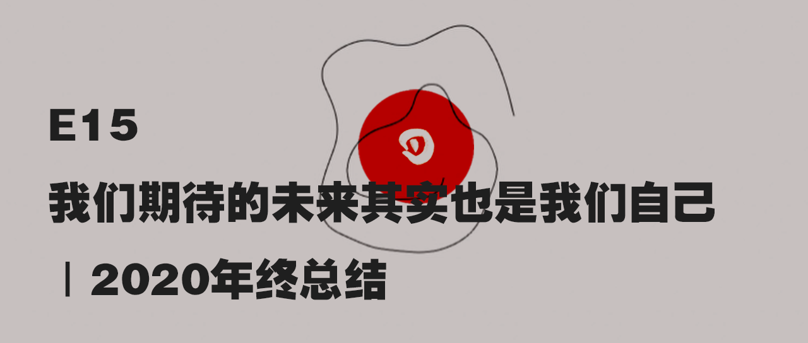

# E15 我们期待的未来其实也是我们自己

## 基本信息

> 我们要想跳舞一样认真过好作为刹那的“此时此刻”，既不看过去也不看未来，只需要过好每一个完结的刹那。没必要与谁竞争，也不需要目的地，只要跳着，就一定会到达某一个地方。

### 收听链接

[E15 我们期待的未来其实也是我们自己 \| 2020年终总结](https://www.xiaoyuzhoufm.com/episode/5fe8b0fcdee9c1e16d108789?s=eyJ1IjogIjVlYmNkNzkwMjFhYzg1ODA0MTJiNzcxMCJ9)

### 出场

叶梓涛 NExT Studios 游戏设计师，在做「落日间」

Xichen 希辰 NExT Studios 音频设计师，前育碧员工，个人网站 [Soundoer](https://soundoer.com/) , B站 [@Xichen](https://space.bilibili.com/157914767)

Tony \(主持\) 游戏运营，游戏爱好者，前新闻传媒工作者

## Show Notes

### 时间轴

00:00 关于本期节目《后戏05》

01:07 「落日间」半年回顾

07:25 「落日间」明年的flag与计划

10:00 一次口播广告插入与「落日间」讨论社群的成立

13:40 "你有计划吗？" 《被讨厌的勇气》

16:58 节目开始，随机主题抽签即兴聊天

19:05 题目1「B站跨年晚会，可能比春晚好看很多很多倍」

28:28 题目2「中国网络游戏适龄提醒公布，中国游戏分级要来了？」

37:17 题目3「疫情、美国大选、《动物森友会》中的日常生活」

45:40 题目4「电子竞技列为2022杭州亚运会正式项目，体育本身就是一种游戏」

54:20 题目5「外卖小哥的系统困局」

68:57 没抽中的两个话题 题目6「《赛博朋克2077》为什么是今年最令人期待的游戏」与题目7「《原神》入围TGA，被游戏奥斯卡提名的中国游戏竟然一款二次元手游」

69:09 讨论：与游戏相关的明年最期待的事情是什么？UE5 / 云游戏 / 空洞骑士2 /

74:50 我们展望的未来其实也是我们自己与两个FLAG

### BGM

Bon Iver - Re\_ Stacks

Bon Iver - Blindsided

Bon Iver - Flume

Bon Iver他将这个法语为《冬天好》Bon Hiver（h不发音）的名字定义为一个团体而非个人，他是这样描述的 "a creative sanctuary 一个创造性的避难所; a battle against ego 一次对自我发起的战争; a collective catharsis 一种群体的净化" ，或许这也是我所期待的 落日间的形态，一个群体的时间，空间而非个人。



## 文字

今年是一个遭遇他者的年份，对我自己来说。

疫情打头，四月份左右买了一个麦克风，做了个视频发在b站，但后来因为做视频这件事情素材的搜集整理以及剪辑打磨，对一个互联网从业者来说性价比太低了，就停止了。

机缘巧合下开始尝试播客，到今天已经有十五期了，非常感谢大家的支持和留言，还有小宇宙，几次推荐我这个被形容成「非主流的垂直类型」的播客上首页，特别感谢。

我依然觉得播客这个媒介是非常特殊的，播客声音的身体性是非常直接的，难以遮掩的。在言谈中人会透露出他是不是真正相信这些东西，他所用文字遮掩的自我会被显露出来，而为了让对话的其他人理解，他也会尝试用一种更合适地方式去传达自己的想法，我很喜欢。

并且做播客这件事无论是来自听众，还是来自嘉宾，我会有时候把自己放到一个倾听者以及引导者的角度，我觉得这也是非常重要的，一个很自我的人是很难做好一个播客的，做播客也是一个发现他人的过程，一个具体化的过程。

中间不得不提的就是Xichen希辰以及tony韬哥两位好友。

我们三个人一起做的曾经是视频后来也变成音频的《后戏》节目，希辰也是一个特别有趣的创作者，我和他的第一次合作其实被他拍成vlog放在b站了，记录了我们在gamejam48小时内做的一个游戏。后来tony找到我们然后一起做了不少期大家听过的节目，2020年我们如何谈论游戏，电竞，黑神话悟空等等，之后也会一起做下去。

之前写作，在知乎在公众号，更多是谈论一些自我的东西，可能会不顾一个听者的体验，但这一年其实有些东西让我变得更加打开了，比如我会以一个播客去串联起自己的一些创作结构，会有计划性地去展开一些更长期的计划，也更多地会从一个自闭的状态下去寻求一些可能的合作方式。

这里也非常感谢向我约稿的腾云编辑sean，今年的写作很多篇都有多次的交流，也让我学到了很多东西。

B站那个最早的视频系列停更了，但正也是因为这个视频认识到了一些新的朋友——鲍勃和他的朋友们，灵感买家俱乐部以及一群很有意思的业余工作者。

大概年中那个时候也很缺乏安全感，工作上的一些波动，也开始让我思考起公司的安全性以及稳定性的问题，那两三个月一直在持续阅读和思索关于自由职业，关注未来工作形态和自我选择的，鲍勃小河这样一群有趣的人都给了我不少帮助和引导。

也是在鼓励下，10月18号我开始做一个newsletter，目前逐渐转变为阶段性进行信息的整理和以及人文生活与思考相关的写作，好友yichi为落日间搭建了一个ghost的网站，也因网站和落日间都有成本，我也开始构想一些可能的可持续创作发展以及商业化或者是未来的自由职业的可能，在网页挂了一个支付宝并开始很小范围无限期会员内测计划，现在也得到了几位朋友的支持，十分感谢。

也是因之前的积累以及今年的遭遇，这段时间虽然自己在产业内，但也开始与学界和艺术圈的朋友认识并有了交流。参加了华东师范大学的游戏、哲学工作坊的论坛，过一两周的两场艺术分享，关于自己做的研究等。

然后就是落日间的愿景吧。

第一个是之后会更独立运作。落日间本来一部分承担了友台《后戏》节目的音频版本，之后可能就会分离开来，这样对《后戏》的品牌以及我和tony的分工也比较清楚。

第二个是落日间这边会有更多节目方面的尝试。很多节目在策划中，有关游戏和数学啊，人工智能啊，精神分析，音乐，声音的，从业者的创作体验等等，也请大家期待。落日间现在还留着播客刚开始很不成熟的录音，但初心没变，之后也在想做或许更短小的，谈论具体游戏与思考的内容。

第三者是商业化。之前播客拆盒子有一期谈论[播客商业化](https://watch-out-side.com/018text)，听了之后也有一些思考和自我定位，应该会比较少做流量向的广告因为也没什么流量，但比如上一期TGDC这类的品牌合作应该会再尝试，虽然真的很耗费精力。本期讨论中也有论及商业化以及创作者的谄媚，我觉得’对于内容创作，其实不排斥商业化和适当的营销，只要这些形式不损害内容本身，不损害了自己的创作节奏，那么是健康且合适的。

最后其实对于整个落日间一直有个小尴尬。

我是游戏设计师，游戏设计师比较少和外界交流与谈论，虽然我没有什么代表性，但做点交流，来写作啊，做播客啊啥的也没啥问题，但还是希望能够以游戏被人认知，与他人做交流，在公司做项目并不稳定，业余在家开坑的话其实蛮累的，但我觉得是有必要的慢慢开始尝试的，这个过程中，其实脑海中落日间的这个形象会清晰一些，它应该是一个游戏文化与游戏工作室，同时做文字与播客内容，以及我所认为的，好的，有趣的，有价值的游戏开发（可能是一些很小的，不那么大的），期待有一天可以带自己的货。

其实说了这么多，你问我，我有计划吗？

其实隐隐有，但隐隐没有，我其实是一个非常喜欢计划和规划反思的人，但是我发现最终最有效的，对我来说并不是去理性规划未来，因为这种规划是充满想象的和误差的。

印象很深的《被讨厌的勇气》结尾一章，我看两遍，每次看到最后的时候都很感动，有一种轻盈的放松感，它说：

> 我们要想跳舞一样认真过好作为刹那的“此时此刻”，既不看过去也不看未来，只需要过好每一个完结的刹那。没必要与谁竞争，也不需要目的地，只要跳着，就一定会到达某一个地方。

现在回想起昨天看的《心灵奇旅 Soul》，其实意思是类似的，对了，这部电影太好了，但估计这周就会下架，大家没去看的快去买票吧！

我到现在也没法很清楚的说明自己在做的事情是什么，甚至有些时候回过神来会不会觉得自己在做一些傻事，很多事情是输出和我做现在我觉得有意义的事引导着我，我先做出来了，再来想想其实发生了什么，我先做出来了，再看看大家的反馈会是什么。

想起来似乎是《得意忘形》有一句话

> 如果你不知道你在做的事情是什么，而它又很难用言语描述，那或许你就走在对了。

但愿如此。

感谢大家今年的支持

[原微信推送](https://mp.weixin.qq.com/s/_wQ3UpE2FAN01SPwMN8w9w)  

