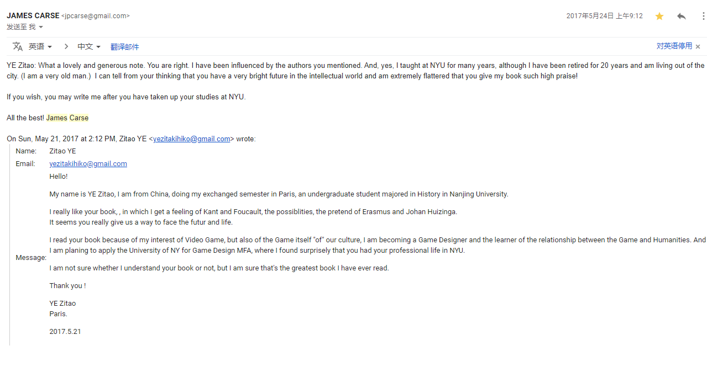

# E2 Supercell的“无限游戏”

### 收听

[E2《荒野乱斗》与Supercell的“无限游戏”](https://www.xiaoyuzhoufm.com/episode/5ef1608d418a84a046a1ca61?s=eyJ1IjogIjVlYmNkNzkwMjFhYzg1ODA0MTJiNzcxMCJ9)

### Show Notes

**0:00** 唠嗑

**1:30**《荒野乱斗》国服上线

**4:00** Supercell公司的“无限游戏”理念

 [Simon Sinek - The Infinite Game](https://simonsinek.com/product/the-infinite-game/)

> In finite games, like football or chess, the players are known, the rules are fixed, and the endpoint is clear. The winners and losers are easily identified. In infinite games, like business or politics or life itself, the players come and go, the rules are changeable, and there is no defined endpoint. There are no winners or losers in an infinite game; there is only ahead and behind.

 [James Carses -有限与无限的游戏](https://book.douban.com/subject/33438841/)

> 世界上至少有两种游戏。一种可称为有限游戏，另一种称为无限游戏。有限游戏以**取胜**为目的，而无限游戏以**延续游戏**为目的。
>
> 实际上我们都有随时离开赛场的自由，但是有限游戏的参与者在某种程度上自己遮蔽了自己的这种自由。
>
> **因为无限游戏中可以存在有限游戏**，因此无限游戏参与者并不避开有限游戏的表演。他们在进入有限游戏时也拥有所有适当的活力和自我遮蔽，但是他们这样做的时候并没有有限游戏参与者那样的“严肃性”。他们把有限游戏的抽象性看做抽象性并接受，因此他们并不是那么严肃地对待有限游戏，而是游戏似的。

**7:30** 这样的商业模式需要一个怎样的游戏设计？

* 单局时间短
* 简单上手
* 节奏上限可控
* 具有丰富博弈度量的
* 有多角色
* 交互符合移动平台

**16:22** Supercell的组织架构以及为什么难以复制？

**22:15** 一些关于这样“成功作品”和无限游戏的反思

[GDC：Cell Structure 细胞结构：Supercell如何颠覆传统的组织结构 The Cell Structure: How Supercell Turned the Traditional Org-Chart Upside Down](https://www.youtube.com/watch?v=crbQgePq5CY&t=17s)

[Supercell的十年总结](https://zhuanlan.zhihu.com/p/141728936)

[《荒野乱斗》中的「反马太效应式」设计](https://www.zhihu.com/question/388508719/answer/1275306446)

[我知道自己在玩游戏，所以我不相信](https://zhuanlan.zhihu.com/p/25055224)

### 

### 补遗

Supercell是这样叙述他们的游戏的：

> 我们的梦想是创造出更多人玩、玩更多年，以及让玩家永不忘怀的游戏，我们专注于Simon Sinek所说的“无限游戏”（the infinite game），我们围绕着这一想法构建起整个Supercell。——我们通常称之为“细胞”，是如何审视他们所做的每一件事的。当他们认为游戏无助于实现这一“无限游戏”的目标时，他们就不会让游戏上线。 团队在测试阶段测试游戏时，首要考虑的就是玩家持续玩游戏的时间。这正是我们所有团队所关心的东西，某位Supercell成员的话可以为其做注脚：“留存，留存，留存。在为你的游戏开发新功能的时候，你要关注的不仅是短期的留存，而是要永远把目光放在游戏长期的生命上。

关于真假「无限游戏」希望之后可以再好好谈谈，这期没有很好地谈清楚。

我直觉中所谓的领导力激励的Simon Sinek的言语中对于「无限游戏」很容易被误会为一个无限前进的天梯和跑道，因为排位赛和分数意义上的「无限」与现实、生命、商业世界中的「无限」并不是一回事，或者说是很容易被误用的，所以标题中的无限游戏打上了引号。

最近读到派派Zoe写的[《任天堂的「无限游戏」》](https://mp.weixin.qq.com/s?__biz=MzA4Nzc0NTQwNg==&mid=2447638267&idx=1&sn=a63dc3dcfdb694a3cac4b322ebf93fa8&chksm=8423e8eab35461fcf307d2748c56ca380b6960b221e9c04e86a863e1fee2da37fe0eaab16eeb&mpshare=1&scene=1&srcid=1016YdjwkdLULLxPukgckwa4&sharer_sharetime=1602823313526&sharer_shareid=a32291ecfe316baf5583a290742e9439&key=bd016e65e567670130a7fd47665a3e236404b144b1a4cbb54485225e95062783ab28e0f26271e2d0f0355e176c4df2729e718c314c55c1eb649e122b56e7fb982b192e477b77159ab4666cf27695b462d84d99b1a62da65c4153d4f46eb87c3a560f53626269d02dc22004810f95b0c2b95de83f8cc8b9c0d6f2cfd46a5db20a&ascene=1&uin=MjI1MDgwODAwMA%3D%3D&devicetype=Windows+10+x64&version=6300002f&lang=zh_CN&exportkey=AaY4dVkWAG0HIzmVpQCc0Vw%3D&pass_ticket=yM7CIgCRi1ajOx7hYpxwm34Tnnp%2FmpqmY2Ws57Kt3s4kPzSvl3ccxy6rdVy%2BPyDT&wx_header=0)，用公司的进步和视野解释了的真正的，哲学家卡斯语境下的无限游戏的概念。这个概念在今天似乎又要火热起来，也曾在天美工作室群总裁colin为[《天美官方艺术典藏》](https://book.douban.com/subject/31170073/)所写的后记中能够看到踪影。

后来知道《有限与无限游戏》的作者James Carse老爷子过世了（生前的[最后一个采访](https://m.okjike.com/originalPosts/6046488f334e900011678110?s=ewoidSI6ICI1YzZlN2RhZTViZDllMTAwMTA3ZWFkZDgiCn0=)），这让我猛地想起在四年前我给他官网的邮箱留过一封信里面非常稚嫩地说“这是我看过最棒的书”，以及我在其中感受到了康德、福柯还有伊拉斯谟和Huizinga，然后我找到了他的回信，现在读起来好感动，希望能不辜负他的期望。

我的英语一直很差，那个时候思想也很幼稚，见笑了。

