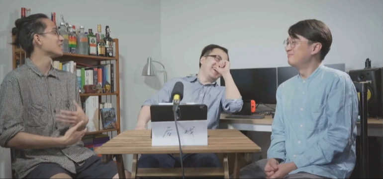
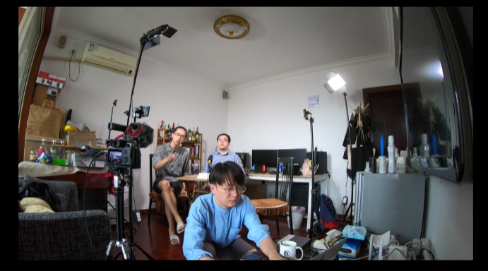

# E5 2020了，游戏还能给我们带来什么？

### 补遗

《后戏》在制作了三期视频节目（[B站链接](https://space.bilibili.com/493763515)）后暂时停止了视频更新，而后也尝试了更多播客的传播形式，目前暂时停止在第七期。

但这里要非常感谢Tony，是Tony拉了我与Xichen两位一起做节目，并且担任《后戏》节目的选题主策划，发挥了先前主持从业的经验，有很多有趣的选题思路都颇受启发，而今天看来，早期我们克服困难录制的视频也成了宝贵黑历史资料。

《落日间》也承担了前期大部分的《后戏》音频输出内容的地方，也使得播客有机会走向更多人，《后戏》的早期内容也两次被小宇宙选中进行首页推荐，非常感谢这段合作的经历，也希望今后有机会再续前缘。

### 基本信息

《后戏》是我以及两位朋友——TonyZ以及声音设计师Xichen，我们一同制作的一档视频节目，想要三人以非主流的，各自的业界的视角去展开一个对于游戏文化游戏产业的思索。

> 不仅仅关注游戏圈内的事，更关注游戏在社会中的角色，与社会的交互。一档即使不是游戏玩家，只要你关注游戏，就能听懂的游戏聊天节目。

#### 收听

B站视频全程版本 [\#01：2020了，游戏还能给我们带来什么？](https://www.bilibili.com/video/BV1dp4y1i7yv)

小宇宙播客版本 [E5 2020了，游戏还能给我们带来什么？](https://www.xiaoyuzhoufm.com/episode/5f1872119504bbdb7721024d?s=eyJ1IjogIjVlYmNkNzkwMjFhYzg1ODA0MTJiNzcxMCJ9)

微信公众号[文字推送](https://mp.weixin.qq.com/s/0A3aGHdu10zS7HBmvyZ42Q)

#### 嘉宾

叶梓涛

NExT Studios 游戏设计师，在做「落日间」

希辰 Xichen

NExT Studios 音频设计师，前育碧员工，个人网站 [Soundoer](https://soundoer.com/) , B站 [@Xichen](https://space.bilibili.com/157914767)

主持 - ****Tony

游戏运营，游戏爱好者，前新闻传媒工作者

### 嘉宾的话

#### Tony

拖拖拉拉大半年，又赶上新冠疫情，直到一个月以前才开始好好准备这档节目——后戏AfterGaming。这是一档关于游戏的聊天节目，但不推荐游戏，也不深究道理，只是想和朋友像聊天一样，聊聊大家都喜欢的这件事。

**为什么做这档节目？**

希望有一个以游戏为审美对象的聊天空间。这种审美是个人化的，不迎合的且是尝试性的。所谓个人化，即视角是属于自己的，有时独特，也难免平庸。所谓不迎合，即不取悦亦不征服他人。所谓尝试性，即方向是未知的，探索的。正确与否从来与审美无关。

游戏与真实世界息息相关。玩家在游戏里有喜怒哀乐，这些情绪甚至会被带到真实世界中继续传递，产生好或者不好的结果。玩家在游戏中有成长，或是技能的习得，或是知识的收获，甚至是价值观的塑造，在真实世界中继续塑造他们的生活。玩家之间在游戏中有互动，或是合作，或是对抗，在真实世界中继续影响人们的社交关系。

在这里，游戏被视为一种充满了丰富可能性的媒介，它可以是一种表达，包含了表达本身涉及的可以探讨的一系列话题；它也可以是一种被创造出来后就脱离作者的独立体而在每一个玩家那里逐渐改变它的形象并且成为独立的文化现象。

而有一群人聊聊这些，于“我”而言，是一件有趣的事。

**\#01：2020了，游戏还能给我们带来什么？**

第一期的话题现在看来比较大，后面可能会边做边调整。但当时准备的时候，确实感到环境变幻莫测之下一种谈论的冲动。

2020年意外爆发覆盖全球的新冠疫情，现实世界中大部分的物理场景被破坏，加速向线上虚拟场景转移。游戏+直播，虽是老搭档，但会不会有新作为？特别是越来越多的人开始观看游戏直播，如果放下对云玩家的鄙视链，直播是不是或者能不能成为一种体验游戏的新方式？

外部环境的变化与某些内在的僵化共存。近年来一批10到20年前的经典老游戏回炉再造，用技术“翻新”这些游戏的表现力，也被叫做“重置版”或“复刻版”。一些贴着“独立”或者“创意”标签的小作品也在陷入僵局，玩法简单杂糅，造成一种“用剑格挡，用盾击杀”的创意错觉。

那么2020了，新的游戏体验会何去何从？

第一期，反正就在Xichen家的客厅里，搭起草台就唱戏，好不好先唱起来再说。

#### Zitao

很有幸可以和Xichen还有Tony来做这样一档节目，其实一开始还是满担心的，本来说好其实要做播客录制，也不知道咋地，做着做着就做成了视频三人谈，还要被迫出镜。不过对自己来说其实是一件蛮有趣的事情，而这样一档节目其实也蛮神奇，蛮有挑战的事情，不同背景的人在一起聊，可能每个人脑中的游戏都不一样，常常都会空对空，但也时常会有引人深思的部分出现，希望听众能够在我们的碰撞中汲取视角，**我们不提供什么答案，因为现实是如此晦涩难明，游戏的应然和可能性状态变动不居，但是这正是世界有趣的地方，不是吗？**

#### Xichen

自认为是一个带有媒体属性的技术工作者，一直以来也尝试着以文字、声音和视频等各种形式去表达，但话题大多仅限于游戏音频/声音设计这个相对小众的领域。做这档节目，我有机会跳出自己职业的小圈子，从一个更宽广的角度去思考游戏，说实话还是有点惶恐。游戏涉及的广度和深度都很大，做这个节目，也是让自己补补课。

（上文为Tony进行的编辑与写作）

