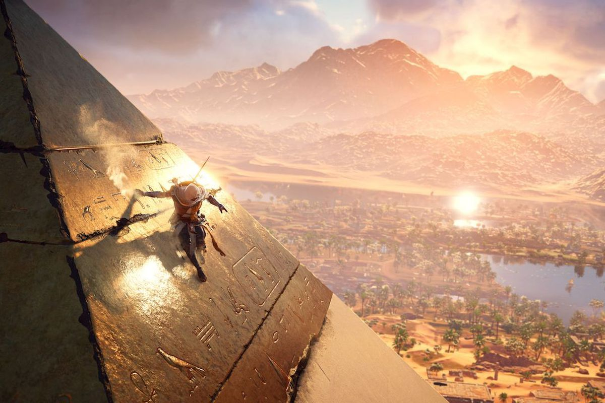

# E6 从火出圈的《黑神话：悟空》看游戏的文化表达

### 补遗

这期是在云锦路边上的 那行文化 作为聊天场地的，后面没想到有机会受到 原想 的邀请在同样的场地进行了关于《后戏》与游戏作为隐形的建筑学的分享，而落日间后来与隔壁的群岛书店旗下的可爱的播客《城市罐头》有了关于游戏与建筑学的串台节目。

本期是《落日间》第一期被小宇宙推荐首页的内容。

### 基本信息

#### 观看/收听

B站视频全程版本 [\#02：不聊《黑神话：悟空》，聊聊游戏怎么讲好中国故事](https://www.bilibili.com/video/BV1ph411R71T)

小宇宙播客版本 [E6 从火出圈的《黑神话：悟空》看游戏的文化表达](https://www.xiaoyuzhoufm.com/episode/5f454c9b9504bbdb7705ec27?s=eyJ1IjogIjVlYmNkNzkwMjFhYzg1ODA0MTJiNzcxMCJ9)

微信公众号[文字推送](https://mp.weixin.qq.com/s/BS6tPgIh4FndwPdzYJij-A)

#### 嘉宾

叶梓涛 NExT Studios 游戏设计师，在做「落日间」

Xichen 希辰 NExT Studios 音频设计师，前育碧员工，个人网站 [Soundoer](https://soundoer.com/) , B站 [@Xichen](https://space.bilibili.com/157914767)

Tony \(主持\) 游戏运营，游戏爱好者，前新闻传媒工作者

\*特别感谢这期节目的场地提供方：**那行文化——零度空间** 做节目的时候周围还在布展，就在上海云锦路地铁站，经常会举行一些有意思的独立艺术展，旁边是建筑主题的群岛书店，有兴趣的朋友不妨去看看。

#### 时间轴

00:00 主题预告  
01:27 开场   
01:57 《黑神话：悟空》以及Zitao和Xichen对此的感受   
04:45 从《黑神话：悟空》切入主题：游戏中文化内容的表达   
05:16 游戏作品中的文化元素/文化表达   
07:00 国外团队表现 中国文化“外来的和尚会念经” 《魔兽世界》熊猫人资料片   
09:07 国外团队为何能很好的表现中国文化？《对马岛之魂》《刺客信条》   
13:11 国外团队做中国文化游戏做得比中国好？   
14:44 游戏技术是否有文化性？   
16:50 是否中国人有某种“忠于原著的情结”影响了对于传统题材的自由演绎   
19:14 中国文化的“历史文化优先意识”（颜世安）   
20:11 新一代的年轻人对于新表达语言的掌握   
24:46 中国文化不易被传播是缺少“符号化”？还是缺少“体系”？   
31:38 上期节目的观众反馈   
35:41 对于《黑神话：悟空》的展望与各位的祝愿

### 

### Tony的文字开场

没想到，等到了一个《黑神话：悟空》，但真的不是为了蹭热点。

早在两个月前策划节目的时候，这个话题就已经定下来了。

不过，《黑神话：悟空》确实与这期节目话题相关，而且最近大家都在关注，就顺便用它给这期节目做了一个开场。对于那段13分钟演示视频，行业内外以及国内外有很多反应，大多数（没做过统计，可能不准确）都是认可的。认可倒也没什么，对很多高品质的作品都会有这种反应，但对《黑神话：悟空》的认可之外，更有意思的是一种情绪——感动。

我个人的理解，这种感动是与作品以外一些个人记忆相关的。如果你是玩家，可能你记忆中还没有体验过这种游戏；如果你是从业者，可能你记忆中还没有制作过这种游戏。但，有个中国团队正在做，这么近，又那么远。

一个中国团队，做了一个中国故事的游戏，中国人觉得很好，外国人也觉得很好。

由此也就有了这期节目的话题：**游戏怎么讲好中国故事？**

我们游戏已经有很多本土文化的东西，武侠、仙侠、玄幻等等，但客气点说，能登上国际舞台的不多。而反观不少海外的游戏作品，至少在表面上把中国题材做到了一个国内不一定能做出来的高度，且被中国受众所接受，比如魔兽世界资料片《熊猫人之谜》，《全战三国》等等，更别说抛开世界观这种复杂设定，一些多人游戏推出的中国元素的角色皮肤和装饰物。（这些说法也许有些争议，欢迎在节目视频下留言讨论。）

#### **“外来的和尚更会念经？”**

客观来讲，游戏和电影类似，西方比中国更早形成工业化，由此带来从业者分工更细致，专业度更高。就好像请厨师，西方的分工让一个人只负责一种口味，但把这种口味做到足够好，而国内的往往一个人什么口味都能凑活，成本也低，所以批量开餐馆满足大众口味就够了。但只要预算足够，每种口味都请大厨，那么这一桌菜往往比前面那种餐馆里的品质要高出一大截。

所以在《刺客信条：起源》里，你能看到与考古级别相差无几的埃及金字塔。

**从忠于原著到歪曲历史，游戏再演绎的空间在哪里？**

谈一点个人经历，可能并不是每个人都有。

 小时候看电影电视剧，发现父母这辈人往往对改编作品接受度较低，比如80年代的四大名著电视剧，金庸的武侠电视剧，的确堪称经典，甚至很多人没读过原著，这些电视剧就成了他们的“原著”。这些“原著”往往形成一种标准，父母这辈人会简单地觉得此后的翻拍改编都不如“原著”好看，原因仅仅是他们和“原著”不一样。更别提从周星驰的《月光宝盒》到后来每年少不了的西游贺岁片，几乎都被父母这辈人难以接受。

直到今天，舆论对于游戏中历史人物的批评声仍然不少，在这种舆论环境和观众口味下，创作者对经典人物或者剧情再演绎的空间有多少？西方的游戏创作者有类似的困扰吗？

**文化内涵vs文化符号，哪个更容易被玩家记住？**

简单归纳一下，老外至今能记住关于中国文化的东西：熊猫、春节、中国结、春联、饺子；孙悟空、唐僧、关羽、李小龙、太极......这些对普通老外而言，都是一个个文化符号，如果深究每个文化符号背后代表什么精神内涵，老外未必清楚。实话实话，中国人自己也未必能说清楚，反正大致都有个印象或者说法。

这一点也不奇怪，如果你不是潜心研究，基督教、耶稣、十字架、希腊/罗马神话、宙斯、阿喀琉斯、星球大战、克苏鲁.......对中国人而言，大部分也是只言片语，一知半解，但对于大众而言，记住这些符号或者表现形式就已经足够了，精神内涵自然有少数有兴趣的人去探究。

**武侠也好、玄幻也罢，这些文化的符号是什么？**

### 

### 文字补充

#### 补充

1. 现今同人文化盛行，某种意义上也是现在的年轻人再创作能力的体现 

2. 在讨论一些国外表达中国文化的作品的时候，我认为或许我们可以区分题材与文化的区别。很多的外国作品更多的是将中国作为一种异域风情/政治正确的题材使用而不是文化进行整体内核的探索或者表达，而我们更希望看到真正完整的，属于我们文化，有其内核与美学的，作为文化作品而非商业或者题材考量的对象。

3. 参考文章：颜世安《关于儒学中“历史文化优先”意识的一些思考》南京大学学报，2002年。

#### 

#### 反馈

@Madao

感觉从宏观层面讨论这件事会很无力，可能就是因为太宏观，太注重所谓的“中国文化”这个大概念，而不是从个体出发，由个体建构出整体才导致这样的无力。尤其还 假定中西方两个视角的这个前提 我感觉就有很多值得讨论的地方。 

但是如果从个体的角度来看，是个体受到文化影响——&gt;创作出作品——&gt;外界再对这个作品进行批评——&gt;最后这个作品也衍生成了一种文化的一种循环。

尽管时代的变化使创作者的身份得到了模糊（从独立创作演变成一种工业化体系），我仍然觉得“人”的位置还是居于中心。 因为作品表达的是个人化、主观化的东西，是基于创作者视角展开的，在这背后我们才会继续挖掘到“噢，原来作品里有这样一个很中国的内核”，还有其他一些客观内容。

所以对于“如何表现中国文化”这样一个问题，我作为个体的行动是，先挖掘自身，明确一些我本身含有的、我符合的，还有我喜欢的，再去钻研和表达会是一个比较顺水推舟的过程，而不是在作品里硬塞一些东西。 （这里讨论的不涉及题材，更偏内涵吧！像王家卫的《东邪西毒》那么玩感觉就挺不错dei\)

@shitaofan

听完后产生的一点看法：文化差异是曾经的地理隔阂与其特定时代背景下诞生的，放到当下，便需要通过普世（大众）的方式去表达。一直强调的融合，本质上是用全人类都能乐于接受的方式呈现出来。

游戏与电影作为少有的仅靠互动与视听就能传达大部分信息的媒介，打破了许多诸如异国语言隔阂的障碍，但同时也是新时代下各个“表达者（创作者）”需要学习的“新语言”。因为语言是自发形成的产物，“后来者”也需要遵循特定的“语法”（技术表现力），使用正确的“词汇”（是否适应当下时代）,否则接收者（全人类）就会难以理解或者不想理解。亦或者，“后来者”提供强大的“造词”能力，足够先进到撼动当下“先驱们”创造的这门“新语言”。

而在我看来，中国便属于这里提到的“后来者”，因为这门“新语言”大多以西方为主导的先辈们创立的（在游戏与动画电影当面，日本是特例，也一定程度解释了日本文化为什么高接受度）。

因此对于游戏与电影这门“新语言”，我们大多仍处在向外学习的状态。同时即便游戏与电影主题能够脱离当下，在表达时也应该用当下的“词汇”, 抓住诸如人性这样超越时代的点，寻找全人类都易于理解并被打动的普世价值去表达，或者对历史创新（用历史的皮表达现代的内核），剩下的文化性，便是水到渠成的产物。

