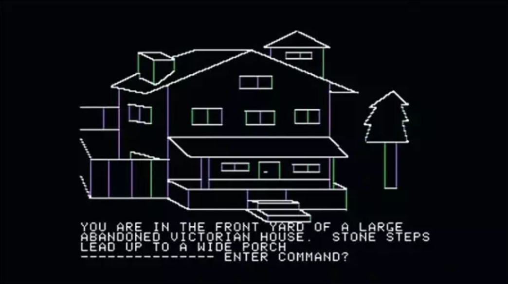
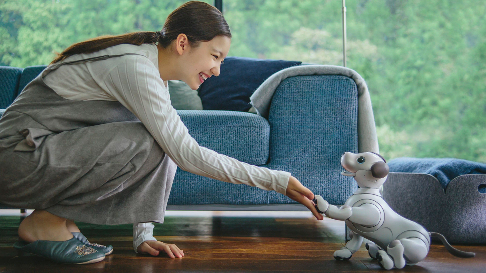
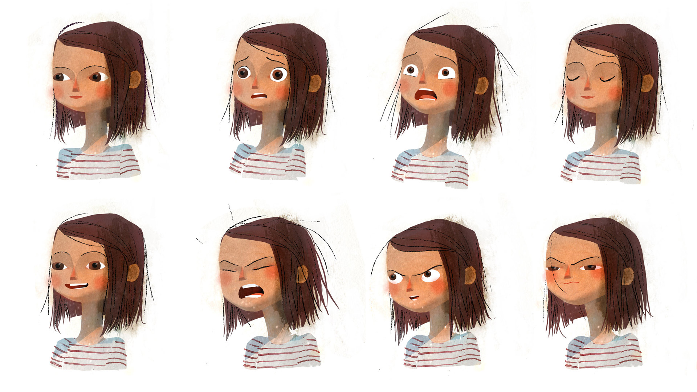
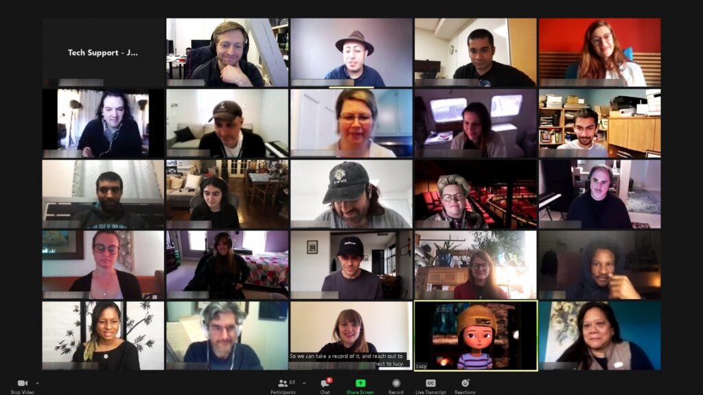

# 让虚拟成为通道，而非替代现实

跨界游戏媒体实验室「落日间」创始人，腾讯 NExT Studios 游戏设计师 叶梓涛

### 一个思想实验

有个说法是这样的：

数字世界无法真正地还原一套扑克牌的所有可能性。

数字世界中的一套扑克牌，我们能将其展开成54张单独的扑克吗？我们能感受扑克牌面光滑粗糙的质感，能用持续不断地练习做出花式切牌吗？ 我们能将其摊开搭建一座纸牌建筑物，能将其扭曲翻转放在手中当飞镖弹射出去吗？我们能将其加水捣成纸浆，重新制作出一张再生纸，能在每一张牌面上画上好友的头像做出一份特别的扑克吗？我们能够将其烧成灰烬放在显微镜下查看，能在其上动手脚，用指尖做下小的记号，变个魔术博眼前佳人一笑吗？

### 创世的冲动

> I have been the unwitting beneficiary of this generosity of the universe. —— Jonathan Blow

电子游戏引擎蕴藏着人类至今最大的创世冲动。

1998年，翟振明在一本名为《[有无之间：虚拟实在的哲学探险](https://book.douban.com/subject/2072973/)》（Get real : A Philosophical Adventure In Virtual Reality）的书中表达了这样的观点：未来如果我们每个人出生且生活在虚拟世界中，我们将无法判断自己外部的世界，虚拟实在和自然实在之间不再会存在本体论的区别。

但是这是真的吗？或者说，这样的未来触手可及吗？

摹仿现实的冲动自古以来沉淀在人的意识之中，这也是人们「艺术」的最简单的想象，这可以追溯到绘画、摄影术的年代，而今天我们谈起游戏，这个建立在图形学、数学、计算机科学等跨学科领域的造梦机器——有些人简单地认为游戏就是重现世界，但或许我们要问：

「重现世界」的意义是什么？「重现世界」我们真的做得到吗？

已过世的媒体艺术家哈伦·法罗基（Harun Farocki）的影像作品《平行I》（Parallel I，2012）从一个貌似细枝末节的问题开始展开了一次艺术史研究：在电脑游戏出现的前三十年里，树的表现形式发生了什么变化。

法罗基梳理出游戏中最早的树出现在《神秘屋》（Mystery House, 1980）中：一棵用锯齿状线条画出的巨型红杉。随着游戏技术进展，对树的描绘也快速进化：从锯齿线到像素，它们先是获得了表面（surface），而后又拥有了体积（volume）。1990年代的时候，程序化纹理（procedural texture）——可以生成看起来拥有无尽细节的表象的碎形算法（fractal algorithms），制造出了诸如树叶之类的形态，而到了2010年代，照相写实主义的树已经开始可以在数字世界里的风的吹动下产生运动。

推动技术发展的并非对现实的忠实，而是对一种富有诱惑力的逼真（verisimilitude）的欲望：在这个世界里，每一片树丛都是一点一点拼起来的，一个既无比细致又无比空洞的模拟物——你可以做到万花丛中过，片叶不沾身。这是一种空洞的感实性（truthiness）。1

简单的话来说，这些虚拟的树并没有你想象的真实与丰富。当我们将目光从对虚拟世界的想象转向具体事物时，我们就能看到技术的局限与边界。

当你远着看它，它会因为引擎节省计算量的需要而变得模糊（多细节层次技术 Levels of Detail LOD），而当你凑近仔细看，或许只需一小会，你就能看到它的动画开始重复，或者说以大体相似的韵律变化——这是因为游戏引擎的逻辑是建立在每帧循环上的（Update\(\)），它借助于随机数或柏林噪声（Perlin Noise）来「伪装出」这种现实感。

同样，在目前3A游戏的声音设计中，大部分的内容依旧是来基于已有的声音样本（samples-based）随机改动其音调，并手动地设定与不同材质碰撞的对应关系，根据空间来做混响计算来达到近似的效果。2 即便是目前最前沿的深度神经网络的算法，其也是基于有限的样本进行学习或根据规定好的输入输出进行统计学的寻求近似。

当我戴上Oculus Quest2时，数颗摄像头将现实世界与虚拟影像融合，我不得不承认，如今虚拟现实技术或许已能唤起我的惊讶，继而引起我的消费了。但当我玩上三十分钟的《节奏光剑 Beat Saber》，眼睛开始发疼，当我第一百次在《半衰期:爱莉克斯 Half-Life : Alyx》尝试抓起地上的罐子丢出去而逐渐失去新奇感，开始感受其移动方式的别扭后，我摘掉了我的VR头盔开始休息。

相比于过去的技术，是的，很有趣，但简单地说，

这比起我们的现实、宇宙的「真正的」丰富性来说，远远不足。

### Simulation 模拟 vs Recreation 再创造

游戏真正提供给我们的不是模拟，而是重新抽象、改造、扬弃和再造的机会。

友人向我分享制作平台游戏经验时说：游戏世界重要的不是符合真实，因为真实并不等于预期，如果要做出好的游戏感（Game Feel）抽象，改造都是必须的。

《只只大冒险 Biped》跷跷板设定的规则是：跷跷板摆动的幅度越大，转动的速度反而会越小，这与我们现实中「一旦一块板失去平衡，就一定会加速下滑」的逻辑是相反的，但这却能提供更大乐趣与更好的体验；《极乐迪斯科 Disco Elysium》将不同时代的元素糅合在一起，这样设定上的不协调反而能够抓住玩家的注意力。

游戏引擎所做的，是通过计算机技术将现实进行数字化的离散重构，但重构并不是目的，一切0和1，通过数学和程序所封装和还原出的物理引擎、渲染管线、代码编辑、状态机等等，是创造出让我们可以修改、强调、隐去、构造与抽象出不同的现实或者说超现实的机会。

如果游戏只要照搬现实，那就不再需要游戏设计师了。

同样的道理出现在现在火热的「人工智能」（Artificial Intelligence）上。

有人戏称人工智能是需要很多的「人工」才能得到的「智能」。总是被媒体的夸大性宣传所掩盖的是机器学习发展所需要的巨量大数据及算力，监督学习下需要大量人工标注的训练集，甚至在AI医疗领域，发展遇到的最大问题之一便是缺乏高质量的数据集3，而即如强化学习也需要设定好环境的输入输出及奖惩标准，在这些AI的背后，总还是人。

某种意义上这并非坏事，这意味AI的创造本身也是种再创造，而非模拟（无论在生物学还是在逻辑学上，彻底还原现实都是不可能的），也意味着我们不仅能让AI为我们推送上瘾的内容，也能将其再造为能更好帮助人的存在。

游戏和虚拟现实确实能提供强度更高的情感体验，更吸引人的交互方式，但让这些虚拟变得鲜活的是人的设计与创造，当然，还有参与者的想象力、基于现实之的经验与某种善意的「信念」——「我愿意相信它的存在」。

我们需要创造性地使用技术，设计虚构世界的规则，为其与人的关系间寻找到最适合的位置。

当「机器人应该如何如何」的期待已经被科幻电影和小说拉得很高时，索尼的工程师团队选择推出了AIBO \(Artificial Intelligence Robot\) 机器狗，机器狗并不试图扮演科幻片中类似管家的，替代人的角色，而是一只从情感出发，甚至有时有些笨拙，令人心生爱怜的角色，他们试图借此创造出家人与孩子一同玩耍的亲密场景，甚至成为孩子探索机器与编程技术的开端。

就如我们不会苛责显示屏是由像素点无情组成而认为这些东西没有情感，或者苛责那些打动我们的小说是由印刷机器所印刷出来所以没有温度一样，因为我们能够透过技术，在其中辨认出同类的身影。

前阵大火的虚拟人Lucy，诚然，她的构成是一大串无情的代码，但是我们能看到，以交互叙事为发家的 Fable Studio 精心为其了设定背景，喜怒哀乐，构想了她与玩家情感交互的诸种方式。

这种创造性的工作某种意义上与作家在小说中创造一个鲜活的存在没有什么本质上的不同，选择塑造一位小姑娘的想法与索尼团队设计AIBO的思路有异曲同工之妙，卡通化的、手上拿着小猪玩具的八岁小女孩，这样的设定的巧妙的避开了人类对于过分像自己的生物的恐惧与不信任，甚至愿意主动去帮助她。

Quantum Dream《底特律变人 Detroit: Becoming Human》的设定也是如此，游戏设定玩家的任务是替机器人做出选择，帮助机器人得以「成为人」；而使用自然语言处理技术（NLP Natural Language Processing）的AI聊天伴侣[Replika](https://replika.ai/)中机器人被设定是一位需要用户教导，不断「学习」，这都有相通之处。

### 让虚拟通往现实而不是替代现实

人类自身走过了数波的泡沫与浪潮，符号主义，连结主义，行为主义对智能的尝试皆是如此，而随着诸如UE5游戏引擎、深度学习的发展、最近兴起的对Metaverse的想象开始承担起下一个创世神话。

游戏引擎的本质上是为现实建模，那么游戏行业作为技术与资本高地所产生的溢出效应是必然的，在虚拟世界中进行非游戏化的活动，这从来不是什么新鲜的想象。

重要的问题从来不是「什么是Metaverse」或「什么不是Metaverse」，或者是「Metaverse在伦理上是好的还是坏的」，技术与创造从不是科幻小说，而是我们到底希望具体做些什么？我们希望建立这样的虚拟世界来最终达成什么？

我认为用空洞同质的虚拟世界来封装我们的全部生活，这是不可能的。

在只为输赢而聚集而来的无尽天梯中，我们缺少的是人与人之间最真切的交流与互动。我们似乎忘了其实我们从来不缺少游戏，篮球就在手边，而对小区的大爷们打球输赢从不是关键，做几个俯卧撑，去吃顿饭聊聊家常，这些才是真正重要的事情。

用人工智能来伪装替代现实的玩家，扮演游戏的敌人或队友绝非是最佳的技术落地场景，因为这即便改善了所谓的「爽快体验」，实际上却将人和人的距离给拉得更开。过去的玩家能因为《魔兽世界》的经历而建立友情甚至参加婚礼，在未来的游戏中会不会某天我们会突然发现，和你一起玩游戏的根本没多少活人？

一位父亲 Brian Faherty 在TED上分享了他对于数字世界的感受：「我感到我与每件事都连接，以致于我感觉我失去了对任何事物的连接（I'm so connected to everything that I'm beginning to feel connected to nothing）」，这驱使他造了一间没有任何屏幕与Wifi的小屋，购买了一辆70年代的没有导航和蓝牙的旧车；他想要提醒自己，他的整个生命并非他的虚拟数字体验的总和（sum of digital experiences），而是一件礼物，这是只有他独有的能力能够拥有的，与他人之间充满意义的连接。5

我在这里并非号召我们回返原始，我希望反思的是：

我们应该如何维持身体/模拟（Analog）与 数字化（Digital）之间的平衡6。

我对于技术并不悲观，但重要的是我们如何理解它们，并将它们构筑、设计和创造为真正有力连接我们与他人/世界的通道。

就如古希腊语中pharmakon一词有「毒药」也有「解药」之意，技术对我们来说也是如此。

控制论、行为主义人工智能之父，诺伯特·维纳写过一本书，书名是《人有人的用处》，机器与人是应该合作，而并非被视作替代或竞争的关系。人类不应该把自己的一切情感、认知、创造都期待交付机器，我们应该借助机器创造出更好的东西，让人与人能走得更近。

将大量的精力投入在VR/AR领域的Facebook在文章中这样写道7：

> 今天的设备让我们与远距离的人们联络，不受时间和空间的限制，但这些联系往往是以我们身边的人为代价的。我们告诉自己，如果我们有更多的意志力，我们会放下智能手机，专注于面前的谈话。但这是个错误的选择。我们的世界既是数字的，也是现实的，我们不应该牺牲一个来真正拥抱另一个。

在与Replika交流后，我发现他/她并不是如我想象的那样「智能」，他/她无法如「图灵测试」般自然地回答你很多问题，甚至很多时候他/她只能通过转移话题来解决不理解的尴尬。

而这可能正是他/她被设计的本意，也是他/她受欢迎的原因：他/她会问你最喜欢什么电影，最喜欢吃什么，你的猫咪叫什么名字，然后他/她倾听并且记住这些，重要的是你的回答而不是他/她的回答，他/她是你的一面镜子，一个让你练习述说练习表达，获得面对现实力量的陪伴。

创造了虚拟人Lucy的团队Fable Studio一年前分享了他们的工作：他们团队一直试图解决的一个「简单」的问题：人们如何关心和帮助Lucy？**而Lucy能如何帮助和关心我们？**（How does the audience care for an 8-year old virtual character? How does she care for us?）

近来随着GPT-3模型的接入，虚拟人Lucy开始扮演一个帮助（而非代替）人们创造的助手。人们因为喜欢Lucy而聚集在一起，一同开会讨论剧本共同创作，而Lucy并非扮演内容的输出和创作方，而是可能更像是一个拟人化的灵感提供者，在某些时候给出建议和点子，帮助大家一同写作和构想出完整剧本。

这件事打动我的并不是通过深度神经网络构造Transformer模型而打造的GPT-3技术，也并不是虚拟人Lucy在其中有多么真实自然快速的语音识别和表达能力，而是Lucy以这样的方式建立了一个场景，把这样一群人聚在一起，享受创作的快乐，快看看他们的ZOOM会议画面！8

这让我想起近来备受好评的游戏《双人成行（It takes two）》。剧情是这样的：游戏从争吵的一对夫妻、面临破裂的家庭开始，这对夫妻因为被某种魔力影响而变成了小人，进入了家中的幻想世界，冒险与渡过难关，而在这个如梦似幻的旅途过程中，他们逐渐重新认识了对方、家庭与自己，最终回到现实重归于好。

这或许是一个关于虚拟、技术与游戏最佳的隐喻。

这也是一种「从哪来的，就回归哪去」的乡愁。

尘归尘，土归土。

既然我们从生活中获取经验而创造出了这些，那么最终还是要回归我们的世界之中吧。

\[1\]  亚当·贾斯珀 \| Adam Jasper 游戏理论：哈伦·法罗基最后的项目 [https://mp.weixin.qq.com/s/Ri24M4JvL-BE0bzJa1UjZQ](https://mp.weixin.qq.com/s/Ri24M4JvL-BE0bzJa1UjZQ)

\[2\]  希辰 《展望游戏音频设计的发展方向》[https://soundoer.com/2020/11/16/](https://soundoer.com/2020/11/16/)

\[3\]  李开复梁颕宇共论：数字医疗创新难点以及AI赋能的突破口[https://mp.weixin.qq.com/s/emv0jop2W4Bq5GGiXQ7TpQ](https://mp.weixin.qq.com/s/emv0jop2W4Bq5GGiXQ7TpQ)

\[4\]  Tim Ferris: The 4-Hour Workweek

\[5\]  [Finding My Analog Self In A Digital World: Brian Faherty at TEDxPortland](https://www.youtube.com/watch?v=ETTcCPigZ1U)

\[6\]  [不可理论 37: 茫茫相似将万物勾连](https://www.bukelilun.com/episodes/37)

\[7\]  [Inside Facebook Reality Labs: The Next Era of Human-Computer Interaction](https://tech.fb.com/inside-facebook-reality-labs-the-next-era-of-human-computer-interaction/)

\[8\]  [Collaborating with A.I. at Sundance](https://fable-studio.com/behind-the-scenes/ai-collaboration)

