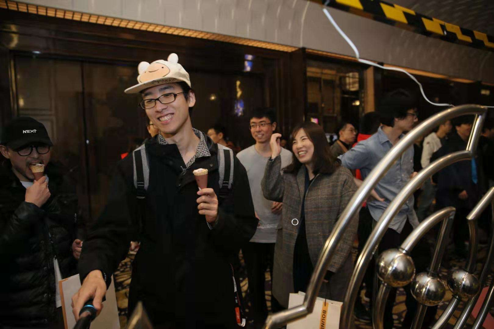

# Portfolio

叶梓涛  YE Zitao 

腾讯NExT Studios的游戏设计师，写作者，独立媒体实验室「落日间」的主理人，播客《落日间》的主播，知乎游戏、游戏设计方向优秀回答者，公布的独立作品有《剑入禅境Sword Zen》等。正积极推动电子游戏与人文、艺术、科技的跨界联结、祛魅与创作活动；近期关注的话题有哲学、人工智能、建筑、互动音乐等。毕业于南京大学，曾前往巴黎第七大学（l'Université Paris-Diderot）交换游学，兼有历史学、哲学、艺术与文化创意、人文社科高级研究院（IAS: Institute of Advanced Studies in Humanities and Social Science）的跨学科背景。

YE Zitao is a game designer and writer from NExT Studios of Tencent Games, He is also the host of the independent media lab "Luorijian", and its podcast , and an excellent answerer in the direction of games and game design in Zhihu. He is actively promoting the cross-border connection, clarification and creative activities between video games and humanities, art and technology ; recent topics of interest include philosophy, artificial intelligence, architecture, interactive music, etc. He graduated from Nanjing University and went on an exchange trip to l'Université Paris-Diderot, and has an interdisciplinary background in history, philosophy, art and cultural creativity, and IAS \(Institute of Advanced Studies in Humanities and Social Science\). 

叶梓涛 Zitao Ye  

[yzitao@foxmail.com](mailto:yzitao@foxmail.com)

[知乎](https://www.zhihu.com/people/xie-mo-zhe) / [Twitter](https://twitter.com/Nir_yezi) / [Linkedin](https://www.linkedin.com/in/%E6%A2%93%E6%B6%9B-%E5%8F%B6-46b701111/) / 即刻：叶梓涛

website: [xpaidia.com](http://xpaidia.com/)

## About Me

我是叶梓涛，一位游戏设计师，目前就职于腾讯NExT Studios。

我业余在制作一个跨界媒体实验室 落日间，有自己的持续的写作和Podcast，持续地对游戏、电子游戏进行跨界的思索，无论是哲学、当代艺术、建筑学、人工智能还是商业等，目前已经有23期，最新一期与华东师范大学的姜宇辉老师进行了关于游戏与哲学的对话《[E23 在哲学与游戏之间 \| 姜宇辉 x 落日间](https://docs.xpaidia.com/update/podcast/e23)》，先前则是与国内的前沿人工智能开发者进行的讨论：《[E21 Ghost x Shell 人工智能与游戏 \[0\]](https://docs.xpaidia.com/update/podcast/e21)》，属个人组织。

我本科毕业于南京大学历史学系，但选择了跨院系通过了哲学系的毕业论文答辩，题目是《游戏的潜能——重思游戏的哲学话语》，但其实很早就开始了持续地围绕电子游戏的跨学科思索，此也非常感谢南京大学高研院（IAS: Institute of Advanced Studies in Humanities and Social Science）的第一期本科生驻院计划（导师：勒克莱齐奥 Jean-Marie Gustave Le Clézio），艺术研究院的项目（Art and Cutural Innovation and Creativity）包给我提供的香港游学的机会和各类与艺术史相关的教育，还有在巴黎第七大学（l'Université Paris-Diderot ）人文学系的交换，这些经历和学习的过程为我提供了许多思想资源。

本科同期我持续地接触了许多具体的电子游戏，并且逐渐对发展火热的独立游戏方向保持了持续的关注，从2016年开始，[为中国的独立游戏媒体indienova.com](http://xn--indienova-pl6noen4lz29a2oltl1ace7b1yqezoqft.com)，进行了长达两年的持续约稿，并且在知乎上持续进行写作，后被认可为游戏、游戏设计的优秀回答者。

游戏媒体的写作经验以及基于人文视角的思考积累让我开始接触独立游戏创作与开发，并且得到了腾讯游戏当时新创意游戏的部门NExT Studios 的实习机会，也在持续的参与GameJam（类似电子游戏的48小时Hackthon）之间得到了更多的练习，业余的作品集可参考：[https://yezi.itch.io/](https://yezi.itch.io/) ，其中不乏一些得奖作品，最新作品是我与同事参加2021年Global Game Jam在48小时中制作出来的作品 《[Sword Zen 剑入禅境](https://docs.xpaidia.com/update/podcast/e18)》。

目前我自己个人的整体工作（落日间）思路大体如下：

首先是交流，建立起与不同领域以游戏展开的双向桥接：

通过跨界进行交流的方式，建立电子游戏作为资本与技术高地与不同外界的对接通路，使得电子游戏所积累的溢出效应得以更好的双向流动，为人所理解。这部分主要通过播客进行承接：参考 《[E23 在哲学与游戏之间 \| 姜宇辉 x 落日间](https://docs.xpaidia.com/update/podcast/e23)》或《[E20 谜与顿悟 \| Artless x 落日间](https://docs.xpaidia.com/update/podcast/e20)》或《[E16 虚 构：虚拟建筑学与游戏建构学｜城市罐头 x 落日间](https://docs.xpaidia.com/update/podcast/e16)》目前落日间播客在小宇宙app上的订阅近6000 《[落日间](https://www.xiaoyuzhoufm.com/podcast/5ef1608d418a84a046a1ca40)》，并且在逐渐从单纯游戏行业内和玩家群体往人文和青年圈进行对接。

其次为创作：

推进自己对于电子游戏的思考/写作与创作，包括但不限于：  
1 基于实际研究与创作验证的电子游戏独立学术类写作内容  
2 面向游戏和游戏设计自身的通俗性文章  
3 以电子游戏为形态的创作实践

我对外的文章发表和约稿可以在网站上找到：[https://docs.xpaidia.com/portfolio](https://docs.xpaidia.com/portfolio)

在工作之后逐渐转向更跨界和更讨论整体化的文章，发表在腾讯的对外媒体「腾云」上，比较从学术角度展开的文章：

1 游戏概念的谱系学，如何从严肃到浅薄的历史 《[\#1 “严肃”的游戏](https://docs.xpaidia.com/ficstruction/paidia/1-yan-su-de-you-xi)》  
2 游戏态度的思考 《[游戏的高度严肃性](https://docs.xpaidia.com/ficstruction/paidia/2-you-xi-de-gao-du-yan-su-xing)》  
3 对于中国当代艺术场域中电子游戏的研究《[中国当代艺术场域的电子游戏](https://docs.xpaidia.com/ficstruction/undo/contemporaryart)》  
4 对游戏设计中时间以及一些相关游戏处理方式的简单梳理《[游戏设计中的时间](https://docs.xpaidia.com/ficstruction/undo/timeingamedesign)》  
5 三年前做的一些面向非传统玩家推荐的游戏清单《[变态者电子游戏清单 The Pervert's List to VideoGame](https://zhuanlan.zhihu.com/p/87188352)》以及给建筑学朋友提供的《[E16 虚 构：虚拟建筑学与游戏建构学](https://docs.xpaidia.com/update/podcast/e16)》，未来应该会同样去做更多的面向非传统游戏玩家来认识不同游戏的切入。  
6 对虚拟和AI导向的做的思索 《[腾讯：用虚拟“取代”现实，这场“梦”该醒了吗？](https://mp.weixin.qq.com/s/ngRKfOkOp44-wQk1qvM0Bg)》

近期做的几次分享可以参考：  
腾讯研究院 Metaverse：互联网的未来是虚拟时空？｜[直播回看](https://www.bilibili.com/video/BV1nU4y1t7pB?p=2)  
群岛BOOKS，电子游戏与空间《[虚构：电子游戏中的空间](https://www.bilibili.com/video/BV1bp4y147mZ?t=806)》  
上海McaM 明当代美术馆 讲座《[电子游戏的十二幅面孔](https://www.bilibili.com/video/BV1T5411n7J1)》

---------

## XPAIDIA MEDIA LAB 落日间



[xpaidia.com](https://xpaidia.com) / [Bilibili](https://space.bilibili.com/3169565) / 公众号：落日间

2021 [《Sword Zen 剑入禅境》](https://yezi.itch.io/sz)NExT Studio GGJ winner

2020 - 《落日间》Podcast Project

2021 - [《做个游戏送给朋友吧！》](https://luorijian.gitbook.io/pweb/tools)开源电子书 with yichi   
  
2020 - 《落日一周间》Newsltter  
2020 - Game Flux Monthly 激流中  
2020 - 《[中国当代艺术场域中的电子游戏 \| 落日间](https://mp.weixin.qq.com/s/fMOkRcm08kW3g4PPFnOvQQ)》

2021 - 落日间 Live - Roundtable 圆桌讨论活动 

## Game Project

* 2019 [《S E E K》](https://yezi.itch.io/seek) CiGA China Jam Shanghai 2019 winner [活动回顾](https://mp.weixin.qq.com/s/8p2MUg6fVChKTNv1j22mkQ)
* 2018[《El Hacedor》](https://yezi.itch.io/hacedor)2020 Neo Director Group exhibition, Aotu Space, Beijing [Link](https://mp.weixin.qq.com/s/VrqQQSO24L8ji25oFbelRg)
* 2017 [《In the Box》](https://yezi.itch.io/in-the-box) NEXT IDEA 2017 Student Game Award: Bronze Prize

其他实验性作品与原型见 [yezi.itch.io](https://yezi.itch.io/)

## WORDS 约稿

x 知乎 游戏，游戏设计话题优秀回答者 [知乎首页 Link](https://www.zhihu.com/people/xie-mo-zhe)

x 独立游戏媒体indienova 兼职编辑 The Writer for the indie game website in China indienova.com [Link](https://indienova.com/u/guatif)

x 腾云智库 The Writer for Tencent Social Research Center [Link](https://mp.weixin.qq.com/s/p34QyzNl91PUCH4vcKc5BA)  
  
[“严肃”的游戏](https://mp.weixin.qq.com/s/uiYhfS_vDIN9oTabnxzkFA)  
[游戏的态度：如果不“严肃”，你就无法感受它的魅力](https://mp.weixin.qq.com/s/p34QyzNl91PUCH4vcKc5BA)  
[游戏与电影：相似的外表，不同的灵魂](https://mp.weixin.qq.com/s/Ckqn-KvI4muqtG9xLzDaGg)  
[斩获奥斯卡的《1917》让电影更像游戏了吗？](https://mp.weixin.qq.com/s/vl1sdYIiE4JzTrWCdrsd-Q)  
[为什么说游戏设计是隐形的建筑学？](https://mp.weixin.qq.com/s/_dd8rXhGrKW_vTRrmKMAUQ)  
[游戏设计&建筑设计：未来，谁来规划我们的虚拟空间？](https://mp.weixin.qq.com/s/FogiFZWrnV7vwH7hs2i8VQ)  
[用虚拟“取代”现实，这场“梦”该醒了吗？](https://mp.weixin.qq.com/s/ngRKfOkOp44-wQk1qvM0Bg)

x BIE 别的 [通过体验游戏中的失败，抓住人生的线索](https://mp.weixin.qq.com/s/qgLKD40fMCzyDlLJiOARuQ)

x OUTPUT [O:BSERVE \| 殊途同归的新媒体艺术与电子游戏](https://mp.weixin.qq.com/s/SZ9a9l4-fVYiKGAVJ31D_w)

## Talk / Activities

* 2019.10 昊美术馆 “严肃游戏”展 HOW ART MUSEUM Serious Game 上海 Shanghai 讲座《说不可说：电子游戏的艺术语言》 The Art Language of Video Gamem [HOW讲座推送](https://mp.weixin.qq.com/s/nEiuz4m-80edzaERaU_IxQ) / [活动与内容回顾](https://mp.weixin.qq.com/s/8kjMPfVYOQwDzoGPWstnfw)
* 2020.9.25 灵感买家俱乐部 [「米粉 vs 面条」](https://mp.weixin.qq.com/s/6DxFU8iE_E_MnF5CLpf9jg)Demo Night 《寻找冯梦波：一个线上展览，也是一个填字游戏》
* 2020.10.11 原想 2020 年会 《后戏 AfterGaming》/《电子游戏作为隐形的建筑学》 [活动回顾](https://mp.weixin.qq.com/s/_rE_BjMfxQYWurXiw-6LZg)
* 2020.11.20 华东师范大学 “游戏致/至死” 游戏哲学工作坊 主旨发言 《游戏的高度“严肃性”》 [Link](https://www.thepaper.cn/newsDetail_forward_10201281)
* 2020.12 山中天艺术中心 《从自己制造的迷宫中逃出去：乌力波60周年”》 线上活动《电子游戏中的故事机器 x 厌氧菌》以及《寻找 Oulipo》展览游戏制作 [活动回顾](https://mp.weixin.qq.com/s/OAXyNPLEvAfYs5ZGCxAx-Q) / [活动和直播录屏](https://www.bilibili.com/video/BV13y4y1D7qY)
* 2021.1 上海McaM 明当代美术馆 讲座《电子游戏的十二幅面孔》 [McaM 讲座预告](https://mp.weixin.qq.com/s/wCX_G4s8pO_oMTEfpDdMbg) / [回顾｜叶梓涛：游戏的艺术结构](https://mp.weixin.qq.com/s/jiS3BHYlO1PAG95parxRog) / Hpast 线上版分享 [推送](https://mp.weixin.qq.com/s/457WHeEphho3FZ-TU5g0Iw) / 线上版本录屏：[B站链接](https://www.bilibili.com/video/BV1T5411n7J1)
* 2021.4.16 独立书店 神兽之间 分享《逃离游戏文化贫民窟》[预告推送](https://mp.weixin.qq.com/s/2XB5gkBfSZZf57FUed7BfQ)
* 2021.4.21 天美工作室群 x 联合国环境规划署 知乎圆桌 [玩游戏，救地球！](https://www.zhihu.com/roundtable/playingfortheplanet) 邀请嘉宾
* 2021.4.23 腾讯游戏学院 [4.23 世界读书日「共建游戏人图书馆」](https://mp.weixin.qq.com/s/loA1heUV5SRjaNyk9vqFww) 邀请媒体人
* 2021.5.1 群岛BOOK \| 落日间Live [虚拟秘境：电子游戏与空间](https://mp.weixin.qq.com/s/MnF8CFTBF-sNrw3P4kcY5A) 圆桌嘉宾 ，分享内容录屏[《虚构：电子游戏中的空间》](https://www.bilibili.com/video/BV1bp4y147mZ?t=806)
* 2021.5.7 腾讯研究院圆桌 《[Metaverse：互联网的未来是虚拟时空？](https://mp.weixin.qq.com/s/idtlL3Fb_zPOu3aJP7Xbtg)》嘉宾，分享内容录屏《[未来我们将如何创造，并创造什么？](https://www.bilibili.com/video/BV1nU4y1t7pB?p=2)》

