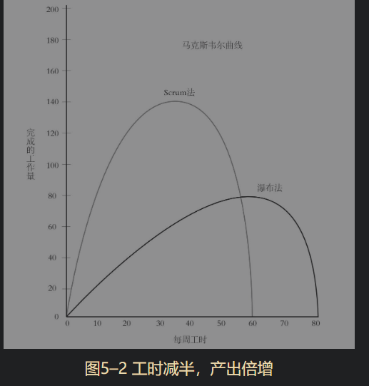
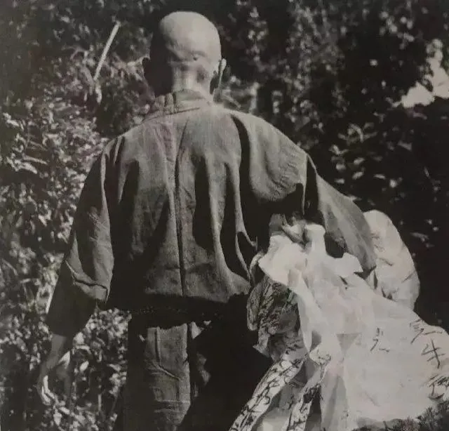
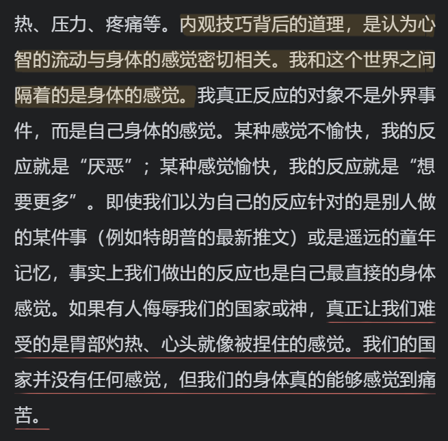
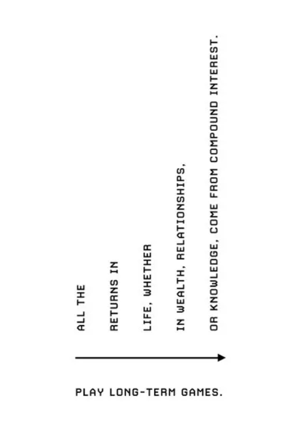
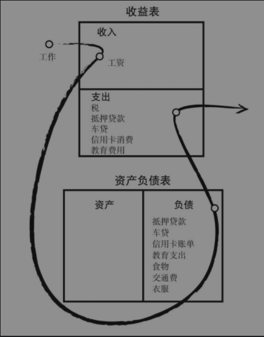
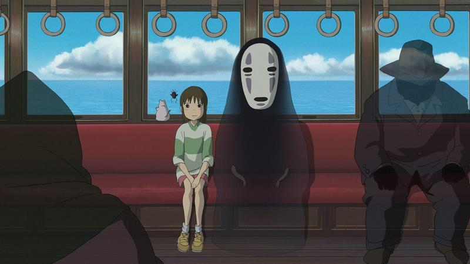

# 01 当代青年工作自救指北

### 开篇

如果你对于自己工作充满热情并且自信可以管理好其可能的风险，那本文对你或许不会有任何帮助。

推荐我认为非常棒的两个内容，或许可以构成整体的开篇

Naval 的免费电子书 《[Almanack of Naval Ravikant](https://www.navalmanack.com/almanack-of-naval-ravikant/table-of-contents)》[中文版](https://www.yuque.com/qingmiyang/naval) 文章《[如何不靠运气致富](https://mp.weixin.qq.com/s/TfhBCbr8-IoHyPKtB3hTlw)》/ [续](https://mp.weixin.qq.com/s/ZrgmFVJ52YQcjgW4ib71XA)

以及 K.K 在《给年轻人的99条建议 [99 Additional Bits of Unsolicited Advice](https://kk.org/thetechnium/99-additional-bits-of-unsolicited-advice/)》[中文版](https://www.notion.so/KK-817f2eb26e024cbc8e1703ff16454bad)

### **1 唯一不变的就是变化**

从塔勒布《[随机漫步的傻瓜](https://book.douban.com/subject/10773362/)》，到集大成的《[反脆弱](https://book.douban.com/subject/25782902/)》，书中贯穿着的大背景都是变化。

他所说的“有极小概率发生，但一旦发生就会带来剧烈变化的黑天鹅事件”，除了金融领域，也同样会在我们生活，工作中出现 。

这个时代再没有人敢说自己一辈子不跳槽，不改行，一份工作，安安稳稳直到退休。

除了职业规划师，可能再也没有人敢说你只要做了什么工作，便可以顺着某条既定路线发展，不愁吃穿。

新职业在不断出现，旧职业也在被不断淘汰，AI大潮来袭，大学的知识毕了业就过期。

这个时代唯一不变的就是变化，所以停止一切稳固的，不切实际的幻想。

### **2 做个成年人**

Netflix人力资源总监在《[奈飞文化手册](https://book.douban.com/subject/30356081/)》中提到的第一条便是

“我们只招成年人”。

很多学习成绩很好，但却缺少眼界的“小镇做题家”，他们的困境在于遵循别人给出的比赛要求做到了最好，进入了广阔天地舞台，但在获取自由的同时，却不知如何运用这种自由，并不知道自己要做什么，等比赛结束，却发现自己失去了意义与目标。

大部分人进入大学，或开始工作，都会顿然会失去方向，陷入人生的迷茫也是同理。

但这种迷茫问题只能由自己提出，并且在自己与自己的角力中解决。

**我们生命轨迹中的重大选择都应由自己想象，由自己做出，也由自己承担后果。**

所谓的成年人就是做出自己的决定，而不将自己的未来拱手于人。

### **3 反脆弱**

Fragile易碎的反义词是什么？

不是坚固的，而是反脆弱。

这是塔勒布给出了面对黑天鹅现象与变动时代的解决方案：

反脆弱指的是变化带来的益处大过坏处的现象，而这正是人的特点。

人是一个有反思与改变自己，不断进步能力的有机体，人要面对的不是总逃脱风险，而是提高自己面对风险并且从中获益的能力。

把失败和挫折当作自己改变和进步的机会，

并且正是勇于承担风险使人变得伟大。

### **4 坚持深度工作**

深度工作的意义不仅提高工作效率，还能让你拥有常人不会有的思考能力和习惯。

身处这每个APP都在疯狂抢夺你的注意力与时间的世界，能够集中注意力进行深度持续的思考创作工作是一项越发少见的能力，

如果你生活中潜在的每一刻无聊时光——比如说，需要排队等5分钟或者是在餐厅坐等朋友——都是用浏览智能手机来打发，那么你的大脑就可能已经被重新编排，就像是纳斯研究所里说的“心智残疾”。这时你的大脑已经不能够胜任深度工作《[深度工作](https://book.douban.com/subject/27056409/)》。

这个时代重要的是不可被替代的深度工作，

而不是碎片化的，随叫随到的，没有实际价值产出的浮浅工作。

### **5 减少工作时间**

十五年前，蒂莫西·费里斯（Timothy Ferriss）的纽约时报畅销书《[每周工作4小时](https://book.douban.com/subject/27065607/)》提及了两条法则：

**帕雷托80/20法则：只做最重要的事情来减少工作时间**。

**帕金森法则：通过减少工作时间，来做最重要的事**。

用最大的可能来压缩工作时间并且变相提高工作效率。

首先要明白的是，并不是在于在办公室待的时间越长，效率就越高。

可笑的是，现代互联网大部分工作团队都所遵循SCRUM法则，而这个法则的创始人在《[敏捷革命](https://book.douban.com/subject/27008697/)》一书中这样写道：_“加班加点地工作不是敬业的标志，而是失败的标志。他让员工早点下班，不是想让他们过一种平衡的生活，而是他们会完成更多的工作。”_

今年初疫情展示出远程工作的可行性，而这在世界则已经成为一种潮流，远程和自由职业让雇佣关系的双方都能提高效益。而在奈飞，公司取消了休假制度，员工可以在其认为适当的时候休假，因为他们相信员工可以为自己的时间负责。

此外，这其中实际上有一种观念的错误。

20世纪初，那时候的人们也有今天我们所遭遇的问题，阿诺德·本内特（Arnold Bennett）在《[如何度过一天24小时](https://book.douban.com/subject/4243207/)》（How to Live on 24Hours a Day）一书中描述了一位典型的上班族的最大、最影响深远的错误：**“他把10点到18点这段时间看成是‘这一天’，这之前的10个小时和之后的6个小时只是前奏和尾声。”**

工作并不是我们的全部，请一定记住：

除了工作8小时之外的16个小时，我们是自由的。

### **6 发展副业**

阿诺德·本内特给大家的，在工作之外16小时的建议是，尝试了解艺术，或者其他任何事物。

而在互联网，众包，新媒体发展如此之快的今天，发展工作之外的事业会是一个更好的选择。

《奇葩说》有一期讨论996工作制，经济学家薛兆丰这样定义议价权：

**在别处的机会就是你的议价权。**

而提高这种别处的机会自然有几种方式：

一是提高自身所谓的核心职场竞争力，这件事是被同行业其他公司所认可的，所以只要持续为自己简历打工，不求发生变动后找不到机会。

其他则是，倘若你并不喜欢自己的工作，在工作主业之外，你可以寻找机会将自己的爱好发展成一项副业。

在我所阅读的许多自由职业经历中，很多人通过爱好，或是单纯的几次尝试后走上了摇摆舞教师，瑜伽教练，撰稿人，潜水教练，手账师的道路。当然，若你很有经商头脑，像《每周工作4小时》那样打造一个能够自动运行的商业事业也未尝不可。

而当你的副业在某个时刻，它的收入甚至开始超过你的主业的时候，说明你完全有能力辞去工作而开始自由职业的道路，而这，也可以让你在面对“拥抱变化” 与各类不可控的职场和公司变化的时候泰然处之。

### **7 寻求杠铃式的风险平衡**

年轻人常常冲动裸辞以显示一种决断和酷。

但请一定记得，不要在所有地方都“特立独行”，成功的人在某一方面的大胆尝试往往是建立在其他某一方面的保守和稳定之上的。

爱因斯坦在专利局的同时进行物理研究，现代主义文学大师T.S艾略特一辈子是银行职员，书法家井上有一始终坚守教职。

在《反脆弱》中，塔勒布将这种用**一方面的低风险与稳定来对冲高风险高收益尝试**的做法称作杠铃式的风险平衡。

而这也与业余精神相挂钩，只有当你将某件事情作为“业余”的，那么你才不容易被这件事相关的这个行业的规矩所束缚，而可以更加自如地探索。

诸如公务员配独立游戏，教师配创业，程序员配自媒体，学生配任何期待的职业，都可能可以迸发出更大的空间。

你可以在有稳定工作的同时大胆放手探索与尝试，而如果你还是学生，那再好不过，你拥有最好的尝试的理由与稳定的身份。

### **8 短期退休是可行的**

这一代年轻人的工作方式绝不再如从前了。

谁也不敢说这一生就只会在一家公司做一件工作，时代要求我们不断学习，变化让我们无法在拥有稳定持续的雇佣劳动生活。

所以当疲惫时，短暂退休是完全没有问题，去成为一个“无业游民”，去尝试和学习看看新的事物，去旅游走走，回家调整方向，做两期播客，准备准备再出发，每个人都应该有自己的生命节奏。

我们可以不那么夸张地像日本青年大原扁理《[做二休五](https://book.douban.com/subject/30413046/)》中描述的那样，做两天零工休息五天；或许《[高级零工](https://book.douban.com/subject/34928387/)》中所说的半年工作，半年旅行是不错的选择；而塔勒布自己则喜欢工作一年休息和阅读创作两年。

《深度工作》书中提到的几种工作方法，其中的“双峰哲学”（Bimodal Philosophy）正是对应着某种短期退休（学习），荣格会定期去到他的湖边小屋，比尔盖茨每年都要闭关，宾夕法尼亚沃顿商学院的亚当格兰特，便是采取半年集中于教书，而半年潜心闭关写书来保证整段的输出与零碎工作时间的合理安排。

这种“退休”往往不是一种放任自流，而是一种积极学习尝试和为自己争取宝贵的整段时间的做法。

### 9 区分工作与上班

在《[只工作，不上班](https://book.douban.com/subject/34839849/)》中，林安采访了很多位自由职业者，除此之外，我很喜欢这个标题。

其中做的最好的区分是：

**上班和工作并不一样。**

如果你在家，没有一份「工作」，你也一样可以工作，为社会创造价值。

我们不从上班中获取意义，但是这不意味着游手好闲，好吃懒做

当每个人都说不做螺丝钉，说内卷，说想要做自己的时候

除了遇到老板很糟公司很差外，或许反过来要问的是：

**那个不是螺丝钉的自我能为他人创造什么样的价值，能发挥更大的作用吗？**

别人要怎么为你这部分的价值付费？

如果你不希望做重复性工作得到金钱，那你能做怎样的创造性工作？

螺丝钉的反面不是空闲而是创造。

### 10 信息斋戒，删繁就简

几乎我所阅读的这几本书的作者都在提倡少接受信息，不要过分关心时事。

因为真正重要的事情是会传到你的耳朵边，而不需要你主动了解。

现代人限制于FOMO，但是其实真正重要的或许是放弃一些而留出空间 [vol.5 为了不放弃而放弃](https://docs.xpaidia.com/newsletter/vol5)

塔勒布基本上不用手机，因为他相信真正有价值的东西会随着时间的筛选而留下来，而当下在发生的例如社会新闻等，大部分仅仅只是噪声；蒂莫西则倡导低信息食谱，戒掉任何无意义的阅读，时刻反思这样的信息是否非需要不可。卡尔·纽波特则让我们认清现代社交媒体点赞之交的无意义，这与创作真正创作有价值之物背道而驰。

而这些信息和社交媒体除了占用了你大量时间外，更大的问题是它会损害你的大脑。《深度工作》希望我们能够定期地进行“数字排毒”，戒掉社交媒体，“学习梭罗，在这个普遍联系的世界里有一点点的失联”，一旦你适应了分心，你就会迷恋于此，并且很有可能你再也无法专心。

### 11 尝试简化生活

面对消费主义，一个很好的办法是极简生活与断舍离，其目的不是全然按照书上的丢丢丢，而在于减少不必要的消费，并且审视自己手中之物并且为之感到幸福，同时积蓄为理财打下基础。

而如果东西少，那么你才更容易在不同的城市环境中移动，也更有机会在世界各地体会不同的工作生活。

当我们笑笑着说我们要吃饭不上班无法养活自己的时候，那我们指的是轻奢的有房有车的生活？抑或只是足够温饱而存活下去？大原扁理尝试过的，要生活，真正并不需要拥有太多东西的。

这样的生活是一种自我的整理，欲望的收束，摒弃零碎，让你专注于手上的工作。

弗洛姆的《[占有还是存在](https://book.douban.com/subject/30362705/)》写得很好，往往一个人占有的越多，其能感受到的存在越少。

一个人之所以有其尊严不在于其占有了什么，而是在于其能够创造什么。

### 12 感受身体，冥想，运动

尤瓦尔赫拉利在《[今日简史](https://book.douban.com/subject/30259720/)》这个宏大的，贯穿未来过去现在的简史三部曲末尾，他在解构了各类人类的宏大叙事后，他回归了自己，回归了冥想与禅思，他说他可以研究许多，控制许多，但是却发现自己在认知自己的心智方面就是一个新手。

游戏设计师Jonathan Blow进行长期工作项目的中途会面临大量的情感上的波动与心态的调整，冥想对他来说是一个很好的工具，而跳舞运动之后闲暇时光中他往往能写下更多的游戏灵感。

今天的这个世界里，许多的人与自己的身体的关系跌落谷底，仿佛身体是一个累赘，而不是属于自己之物，所以健身的生活成为不少人对冲压力的方式，而健身不是追求肌肉的变大或者是外观，最重要的或许是学习如何与自己的身体相处。

或许身心关心的相互作用比我们想象得要重要得多，身体的健康与活力极大的影响自己的精神与工作状态，而冥想，瑜伽或者运动也正是感受自己身体，同时感受存在，以及心中想要去何处做何事的日常的反思。

### **13大量阅读，思考**

“人类从未像今天这般迫切地需要阅读和书写。”

我读的这些书的作者无不谈到读书。书这样的媒介是不能被电影，视频，听书音频来取代的，阅读书籍的耐心，努力去咀嚼沉浸下来的状态也是集中注意力的能力联系，在阅读过程中的思考，是无法被还原为拆书音频的知识点或是加上表情包的公众号文章的（包括本文）。

一些极简主义者对书似乎有一种不同的态度，“买了即便放在书架上没看都是好的，便宜而且可以送人”。

面对“你买的书都读过了吗？”这样外行的询问，文学家埃科在与卡里埃尔的对话《[别想摆脱书](https://book.douban.com/subject/25714759/)》这样回复，“这是我下周要读的书”或者，“我一本都没读过，不然我留着它们干嘛”。

读书依旧是我现在验证的并且进行着的，认为可以最快从那些留存在时间长河中的大师的思考汲取精华的方式。

K.K 在《给年轻人的99条建议 [99 Additional Bits of Unsolicited Advice](https://kk.org/thetechnium/99-additional-bits-of-unsolicited-advice/)》中说道：

I have never met a person I admired who did not read more books than I did.

我从未遇到过一个我钦佩的人，读的书比我少。

### **14 输出与创作**

“任何一个阅读太多而动脑太少的人都会养成懒于思考的习惯。”

存在一种奇妙的循环

“通过增加输入来增加输出”，并且 “通过输出来倒逼输入”。

摄入多了自然就想要排出，写作和创作的开始，一定程度上是在阅读过程中自然浮现的线头，而当我有理由将其进行拓展与创作输出的时候，那么这就成为了一个整理思路的过程，输出并不是一件单纯对他人利好的事情，而是双向的。

“费曼学习法”的“教即是学”的学习回路的核心正是在于，你试图清晰地给他人解释，试图通过语言讲明事物中的内在关联时，你才能在过程中逐渐真正理解这个概念。

输出也不必要全是文字，播客，视频，讲演，一切分享皆是。

### 15 借助网络，等待复利

迄今为止我所看到过最好的关于幸福，财富的书籍《[The Almanack of Naval Ravikant](https://www.navalmanack.com)》中，Naval Ravikant 对何为杠杆给出了自己的想法，世界上有三种杠杆，劳动力，资本，还有没有复制边际成本的内容。

而最后一点其实就正是我们今天的互联网，当你睡着的时候，你在网络上发布的内容还在运作着，在网络中寻找到需要它的人。

这要求你成为一个创作者，借助互联网的平台传播和扩散你的影响。

在投资领域中有一个很有名的「复利」曲线，而这种指数型增长的同样适用于互联网的网络效应。

这不是来自于扩大规模而边际成本递减的规模效应，也不是重复做一件事情后速度提升的学习曲线，而是我们今天生活在一个节点联结的世界中，一个节点的传播可能会随着触及周围的节点而传播到互联网的任何一个人身上的可能。

这也正是黑天鹅作为正向效应的部分 —— 给自己创造成功的机会。

并且相信真正好的东西终有一天会价值回归而不会被埋没的。

### 16 Productize Yourself 成为无法化约的点

去做一个商业和资本机器无法化约的点

不要做最好的，做唯一的。

一个「怪兽」，一个奇点 Singularity

《The Almanack of Naval Ravikant》提到的

**「Productize Yourself to escape competition」**

如何逃脱内卷的方式就如同一家企业如何从市场中脱颖而出一样，你需要的不是在类似的方向上去竞争，而是成为一个无法被模仿的点 —— 这正是你自己的。这部分的内容可以参考知乎的战略张宁Neo的《[创作者](https://book.douban.com/subject/35431378/)》提到的「个人垄断」，《[从0到1](https://book.douban.com/subject/26297606/)》叙述新时代的垄断的部分《[Different](https://book.douban.com/subject/30224687/)》叙述 异质同质化（heterogeneous homogeneity） 的反向品牌战略的部分。

要变得富有，就要积累所有金钱买不到的东西，要不被取代，不用疲于奔命，就做并且发展那些只有你能做到的事情 —— 没有人比你更擅长做你自己。

### **17 提高财商**

《[小狗钱钱](https://book.douban.com/subject/3576486/)》或许是一本应该推荐给所有人的书，而《[穷爸爸富爸爸](https://book.douban.com/subject/27153484/)》，其中贯穿相同的最大核心便是“减少负债，增加资产”。

“让钱为你工作”，通过理财带来被动收入，这个是慢慢转变雇佣劳动中“以时间来换取金钱”这样固有观念的过程，如果永远以时间换取金钱，那么自由就是空谈。

### **18 注重社群**

自由职业并非代表单打独斗，相反，可能自由职业更需要有社群的链接与支持。

并且这或许是一个能以“相处得是否愉快”，而非“被安排在一起工作”的原因建立的社群。自由职业者需要有社群的支持，以保证幸福感和意义感，建立网上虚拟办公室，城市线下的自由职业者聚会，亦或者在泰国清迈的数字游民们（Digital Nomad）的联合办公空间Co-Working Space，都是不同的连接方式。

当然，或许这个时候回顾一下商业帝国We work的兴衰是一个不错的角度 《[WeWork：470亿美元独角兽的崛起与破裂](https://movie.douban.com/subject/35371277/)》。

### **19 但行好事，莫问前程**

“做对他人有意义的事”，写作，分享，帮助别人，提供价值。

《[Give and Take](https://book.douban.com/subject/30230638/)》中，亚当格兰特通过实证方式展现了一个听起来反直觉的结论：“当一个付出者，可能会带来更多的回报”。

在《[自卑与超越](https://book.douban.com/subject/26989781/)》中，阿德勒对于（某种）抑郁症的解法颇有深意：“记住，每天你都要设法为别人着想，取悦他人”，倘若你暂且找不到人生的意义时，去做对他人有意义的事情，这件事情总是会慢慢引你到你应该到的路上。

社会学家马塞尔·莫斯的人类学名篇《[礼物](https://book.douban.com/subject/26772504/)》中的结尾写道：

**“要走出自我，要给予，这是由来已久的，不会错的原则。”**

原文发布于2020年8月 微信公众号 [当代青年工作自救指北](https://mp.weixin.qq.com/s/BaVb1njZUVZrtyBbfsiaFw) , 虎嗅[转载](https://www.huxiu.com/article/421723.html)

2021/5/11 Last Update

### 关于 「指北」


[.](./)


这是自己写给自己，以及身边囿于工作与生活，疲于奔命的当代工作青年的。

当我们面临可能的“内卷”，“奋斗逼”，“996/007”，“资本主义异化” 等，我们或许需要做点什么，

值得注意的是，这些要点并不是分散的要做到的事情，而是一种可能勾画出的，某种可能生活方式的不同面向，通过不同方面的叙述尝试还原一种有关于生活，自我寻找，自由，价值感的现代生活的“非主流”方向，这条路或许是斯多噶Stoic生活哲学在今天的变型。

* 欢迎通过公众号，或 [yzitao@foxmail.com](mailto:yzitao@foxmail.com) 给我更多反馈
* 指北系列与Newsletter 落日一周间 是 跨界游戏媒体实验室 落日间 的子栏目
* 欢迎通过订阅公众号、邮件订阅来持续获得更新
* 除了特别注明，正文中提到的所有内容和书籍都是自己看过的，对每本书的评价可以参考[豆瓣页面](https://www.douban.com/people/96753197/)。
* :pig2: 也欢迎支持「落日间」的创作：[支持我们](https://afdian.net/@sunset\_studio)
