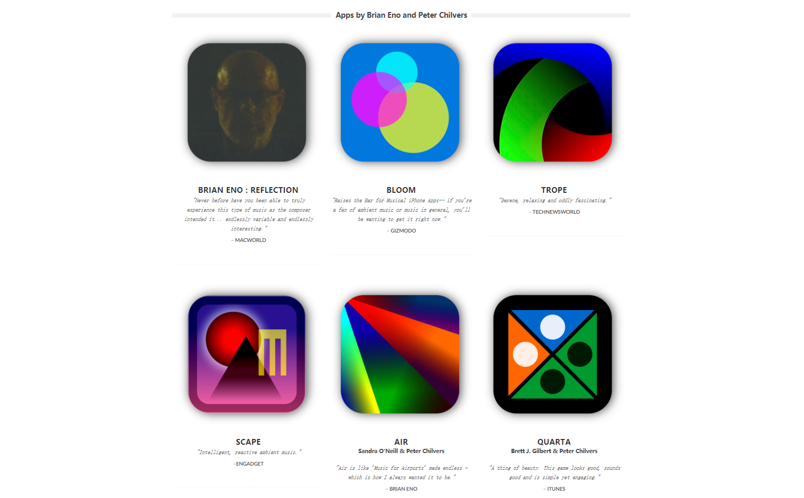
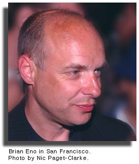
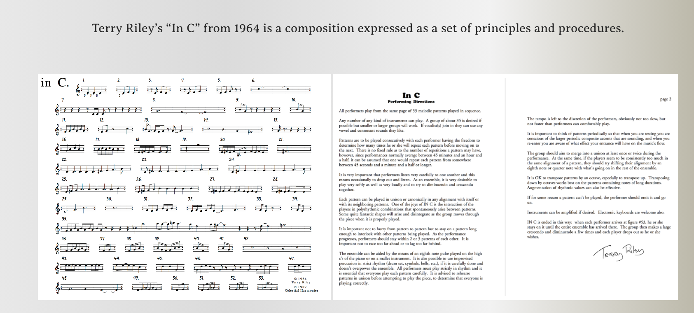
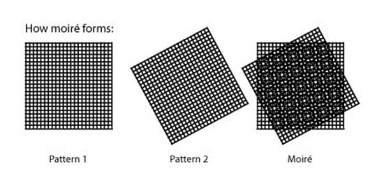
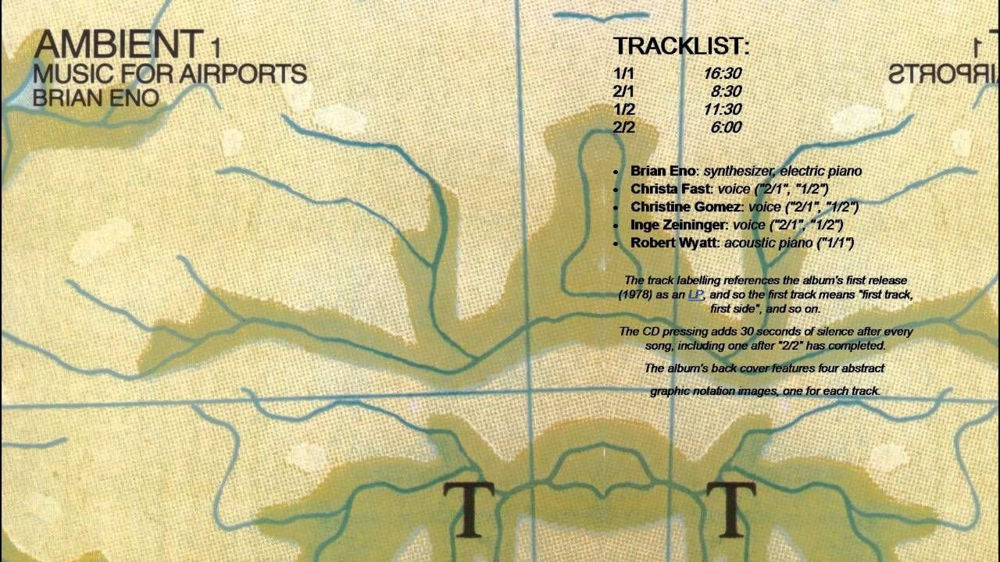
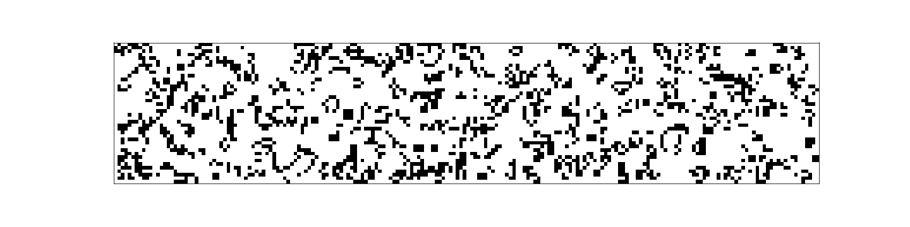
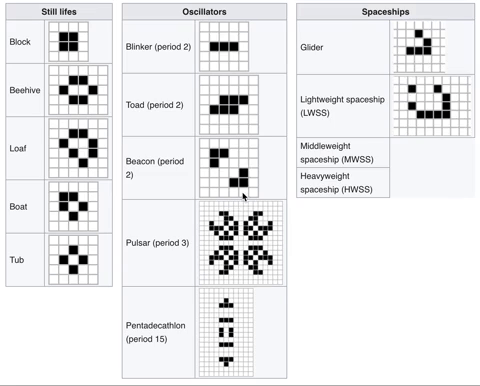
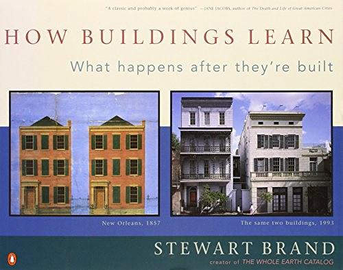

# Brian Eno 生成性音乐 Generative Music

## 推荐语

Brian Eno的这个分享令人意外的坦诚与幽默，并且随着谈论的进行，他十分积极地进行了跨界的扩展与勾连，如康威的《生命游戏》，递归的屏保程序，以及建筑学的作品，最后将这种被他称作Evolving Metaphor的艺术家的创作方式与《我们赖以生存的隐喻》结合在一起，这种过程式的展现和设计思路也是电子游戏拥有的潜能，即Ian Bogost以 Procedural Rhetoric 过程式修辞 来进行命名的展开方式。

这篇演讲是一个绝好地进入和理解Generative Music背后思路的钥匙，通过设置近似incommensurable 的无理数循环时间，让声音一路展开形成变化，以此来构建其著名的作品《Ambient 1/Music For Airports》，以及他提及了启发他的，SteveReich《Early Works》中的《It's Gonna Rain》，为什么这样的音乐可以在递归中展现出如此多的模式？或许有个原因就是这样的声音通过差异性的重复，在相减地作用中一点点地打开我们听觉对一段声音全然的感知。

虽然在演讲中Brian Eno多次自嘲自己对于计算机的不了解，但他直到晚近依旧在与Peter Chilvers合作了各种各式各样的互动音乐的Apps，他在这次演讲中就超前地意识到，计算机的功能不在于某种浪费和堆叠的数据，奇妙在于如何经济和聪明地生成，他那个极好的比喻值得所有游戏设计师和艺术家记住：

_**在我看来，这就是答案。以某种方式使用光盘，将种子植入你的电脑，然后利用电脑让这些种子为你生长。**_

日 \| 落 翻译计划 \# 01

粗译：DeepL

修改/评论+图片：叶梓涛

原文：[https://inmotionmagazine.com/eno1.html](https://inmotionmagazine.com/eno1.html)

## Generative Music 生成性音乐

"Evolving metaphors, in my opinion, is what artists do."

"在我看来，演进式的隐喻，正是艺术家的工作"。

A talk delivered in San Francisco, June 8, 1996 by Brian Eno

布莱恩-伊诺 1996年6月8日，在旧金山发表的演讲

The following talk was given by Brian Eno at the Imagination Conference in San Francisco, June 8, 1996. Billed as a progressive interactive event featuring original multimedia presentations the Imagination conference featured musician and artist Brian Eno, movie producer and director Spike Lee, and performance artist and musician Laurie Anderson. Each of the three presented their work and ideas in their own way.

以下是布莱恩-伊诺1996年6月8日在旧金山的 "想象力 "会议上的演讲。想象力会议被认为是以新颖的多媒体展示为特色的进步性的、互动性的活动，其中出席有音乐家和艺术家布莱恩-伊诺、电影制片人和导演斯派克-李，以及行为艺术家和音乐家劳里-安德森。这三个人都以自己的方式介绍了他们的工作和想法。

Brian Eno spoke about a new form of music - Generative Music - and traced its roots and the development of his ideas on it from the mid-sixties until now. For a biography of Brian Eno and description of some of his current work click here. For Spike Lee's talk click here. Laurie Anderson played music and sang/performed a set arranged for the evening. In Motion Magazine thanks Capretta Communications in San Francisco for all their help in getting us into the conference and providing materials for this coverage.

布莱恩-伊诺谈到了一种新的音乐形式--生成音乐 Generative Music--并追溯了它的根源和他从60年代中期至今的想法的发展。（关于布莱恩-伊诺的传记和他目前的一些工作的描述，点击这里）。对于斯派克-李的谈话，请点击这里。劳里-安德森演奏了音乐，并唱/表演了为当晚安排的一套节目。In Motion杂志感谢旧金山的Capretta Communications为我们进入会议现场提供的所有帮助，并为这次报道提供了材料。

以下为演讲正文：

What I am talking about tonight is an idea that really began for me about 25 years ago and has pretty much obsessed me ever since. It began as a musical idea, it began as something I heard in music and gradually I realized that in fact it was an idea that was occurring in all sorts of areas.

In the course of this talk what I would like to do is to trace the history of that idea in my own work and in the work of some other people and also to show how the idea suddenly branches out, opens up, and becomes a metaphor for what I consider a very important new body of thinking. I have 45 minutes to do this and I have a clock here as well.

我今晚谈论的是一个想法，这个想法真正开始于大约25年前，并且从那时起就几乎让我着迷。它开始是一个音乐的想法，开始是我在音乐中听到的东西，渐渐地我意识到，事实上这是一个发生在各种领域的想法。

在这次演讲的过程中，我想做的是在我自己的作品和其他一些人的作品中追溯这个想法的历史，并展示这个想法如何突然分支，打开，并成为我认为非常重要的新思维体系的一种隐喻。我有45分钟来做展示，我这里也有一个钟。

In the mid-sixties, something happened in modern music which really made a division between what had happened prior to that and what was now starting to happen. At the time it was called the new tonalism, or the new tonality. It was a movement away from the classical tradition which had sort of defined progress with becoming more atonal, becoming more chaotic and in a sense becoming less musical in the sense that ordinary people would understand the word music.

在60年代中期，现代音乐中发生了一些事情，这使之前发生的事情和现在开始发生的事情之间产生了一种分歧。当时，它被称为新调性主义，或新调性。这是一场远离古典传统的运动，古典传统将这种进步定义为变得更加无调和\(atonal\)，更加混乱，在普通人理解的音乐意义上变得不那么像「音乐」\(less musical\)。

In the mid-sixties, Terry Riley, Steve Reich, Philip Glass and several others began working with tonal music again. Simple chords, simple intervals, rhythms that you could follow that weren't in 15/8 and things like that \(laughter\). Music in fact you could almost dance to.

在60年代中期，Terry Riley、Steve Reich、Philip Glass和其他几个人又开始用调性音乐工作。简单的和弦、简单的音程、你可以跟随的节奏，而不是15/8和类似的东西（笑）。这些你几乎可以跳舞的音乐（注：形容非常简单且并且能够被大众理解的，而不是无调性的先锋）。 

At the time, the distinguishing characteristic of that music seemed to be that it was tonal, as opposed to atonal. Over the course of time, since then I think another important characteristic has emerged. It was very clear in the first major piece of Terry Riley called In C. Most of you probably know of this piece or some of you probably know it, and many of you may have played it. It's a very famous piece of music. It consists of 52 bars of music written in the key of C. And the instructions to the musicians are "proceed through those bars at any speed you choose". So you can begin on bar one, play that for as many times as you want, 20 or 30 times, then move to bar 2, if you don't like that much just play it once, go on to bar three.

在当时，这种音乐的突出特点似乎是它是调性的，而不是无调性的。随着时间的推移，从那时起，我认为另一个重要的特点已经出现了。它在特里-莱利的第一首主要作品《In C》中非常明显。你们中的大多数人可能知道这首作品，或者你们中的一些人可能知道它，而且你们中的许多人可能演奏过它。这是一首非常著名的音乐作品。它由52个C调的音乐小节组成，对音乐家的指示是 "以你选择的任何速度进行这些小节"。因此，你可以从第一小节开始，想弹多少次就弹多少次，20或30次，然后转到第二小节，如果你不喜欢，就弹一次，然后转到第三小节。

The important thing is each musician move through it at his or her own speed. The effect of that of course is to create a very complicated work of quite unpredictable combinations. If this is performed with a lot of musicians you get a very dense and fascinating web of sound as a result. It's actually a beautiful piece and having listened to it again recently I think it's stood the test of time very well. That piece however was not the one which blew my socks off.

重要的是每个音乐家都以他或她自己的速度完成它。当然，这样做的效果是创造一个非常复杂的作品，有相当多的不可预知的组合。如果与许多音乐家一起演奏，你会得到一个非常密集和迷人的声音的交织。这上是一首美丽的作品，最近我又听了一遍，我认为它非常经得起时间的考验。然而，这首曲子还不是最让我吃惊的。

That dubious credit goes to another piece of music by a composer called Steve Reich. I think it was his earliest recorded piece. It's a piece called It's Gonna Rain, and I would like to listen to a bit of that now.

我会要选择归功于一个叫史蒂夫-赖希的作曲家的另一首曲子。我想这是他最早的录音作品。那是一首叫做《要下雨了》的作品，让我们现在听一部分。

\(It's Gonna Rain played.\)

For many years I was the only person I knew who thought that was a beautiful piece of music \(laughter\). It's quite a long piece, it's about 17 minutes long. It's produced by a very, very simple process. It's a loop of a preacher saying "It's gonna rain". Identical copies of the loop are being played on two machines at once. Because of the inconsistency of the speed of the machines they gradually slip out of sync with one another. They start to sound like an echo. Then they sound like a cannon, and gradually they start to sound like all sorts of things.

许多年来，我是我认识的唯一一个认为那是一首美丽的音乐的人（笑）。这是一首相当长的作品，大约有17分钟长。它是由一个非常、非常简单的过程产生的。它是一个传教士说 "要下雨了 "的循环。循环的相同副本在两台机器上同时播放。由于机器的速度不一致，它们逐渐失去了彼此的同步性。它们开始听起来像一个回声。然后它们听起来像一首卡农，渐渐地，它们开始听起来像各种各样的东西。

The piece is very, very interesting because it's tremendously simple. It's a piece of music that anybody could of made. But the results, sonically, are very complex. What happens when you listen to that piece is that your listening brain becomes habituated in the same way that your eye does if you stare at something for a very long time. If you stare at something for a very long time your eye very quickly cancels the common information, stops seeing it, and only notices the differences. This is what happens with that piece of music.

这首作品非常、非常有趣，因为它非常简单。这是一首任何人都可以制作的音乐。但是，从声音上看，其结果是非常复杂的。当你听这首曲子的时候，会发生的事情是你的听觉大脑变得习惯了，就像你的眼睛如果长时间盯着某样东西一样。如果你盯着某样东西看了很久，你的眼睛很快就会取消共同的信息，不再看到它，而只注意到差异。这就是那段音乐所发生的情况。

Quite soon you start hearing very exotic details of the recording itself. For instance you are aware after several minutes that there are thousands of trumpets in there - this is without drugs. With drugs there would probably be millions \(laughter\). You also become aware that there are birds, there really are birds -- in the original loop of tape there are some pigeons or something and they become very prominent as the thing goes on. Most of all, if you know how the piece is made, what you become aware of is that you are getting a huge amount of material and experience from a very, very simple starting point.

很快你就开始听到录音本身的非常奇特的细节。例如，你在几分钟后意识到那里有数以千计的小号 - 这是在没有嗑药的情况下。如果嗑了药，可能会听到数百万个（笑）。你也会意识到有鸟的声音，真的有鸟--在原始的循环磁带中，有一些鸽子或其他东西，随着事情的发展，它们变得非常突出。最重要的是，如果你知道作品是如何制作的，你就会意识到，你从一个非常、非常简单的起点获得了大量的材料和经验。

Now this completely intrigued me. Partly because I've always been lazy, I guess. So I've always wanted to set things in motion that would produce far more than I had predicted. Now the Reich piece is really a ... what would be called visually a moire pattern.

现在这完全引起了我的兴趣。我猜部分原因是我一直很懒。我总是想要设定个什么然后让它运行，并产生远超过我的预测的效果。现在，赖希的作品实际上是一个......在视觉上会被称为摩尔纹的图案。

Can I have the over-head projector please?

可以帮我把头顶的投影仪打开吗？

Now a moire pattern is when you overlay two identical grids with one another. Here's one, here's the other. Now when I overlay them, see what happens, you get a very complicated interaction. You get something that actually you wouldn't have predicted from these two original identical sheets of paper. This is actually a very good analog of the Steve Reich piece in action. Something happens because of one's perception rather than because of anything physically happening to these two sheets of plastic which produce an effect that you simply couldn't have expected or predicted.

现在，摩尔纹是当你把两个相同的网格相互叠加在一起。这里是一个，这里是另一个。现在，当我把它们重叠在一起时，看看会发生什么，你会得到一个非常复杂的互动。你得到的东西实际上是你无法从这两张原来相同的纸上预测到的。这实际上是史蒂夫-赖希作品在行为上的一个很好的模拟（类比）。某些你根本无法预期或预测的事情发生了，而这是因为人的感知，而不是因为这两张塑料纸上发生了的任何物理现象。

I was so impressed by this as a way of composing that I made many, many pieces of music using more complex variations of that. In fact all of the stuff that is called ambient music really -- sorry, all the stuff I released called ambient music \(laughter\), not the stuff those other 2 1/2 million people released called ambient music, -- all of my ambient music I should say, really was based on that kind of principle, on the idea that it's possible to think of a system or a set of rules which once set in motion will create music for you.

这种作曲方式给我留下了如此深刻的印象，以至于我用更复杂的变体制作了很多很多的音乐作品。事实上，所有被称为环境音乐的东西--对不起，所有我发布的被称为环境音乐的东西（笑），而不是其他250万人发布的被称为环境音乐的东西，都是基于这种原则，基于这样的想法，即有可能想到一个系统或一套规则，一旦运行，则将为你创造音乐。

Now the wonderful thing about that is that it starts to create music that you've never heard before. This is an important point I think. If you move away from the idea of the composer as someone who creates a complete image and then steps back from it, there's a different way of composing. It's putting in motion something and letting it make the thing for you.

现在，关于这一点的美妙之处在于，它开始创造你以前从未听过的音乐。我认为这是一个重点。如果你抛掉「作曲家是创造出完整图像的人」的想法，退回来，这是一种不同的作曲方式。它是让某种东西运行起来，让它为你创造东西。

One of the first pieces I did like that is called "Music for Airports" \(applause\) , thank you very much. \(Shows graphic of Music for Airports\). This is in fact a picture of the alien fleet that abducted me last time I was in San Francisco \(laughter\), and that's the mother ship just there. It was an awful experience because they stole all my hair \(laughter\). In fact this really a diagram of Music for Airports.

我做的第一件这样的作品之一叫做《机场音乐》（掌声），非常感谢。这实际上是上次我在旧金山时绑架我的外星人舰队的照片（笑声），在那里的是母船。那是一个可怕的经历，因为他们偷走了我所有的头发（笑声）。事实上这真的是《机场音乐》的一个图解。

Music for Airports, at least one of the pieces on there, is structurally very, very simple. There are sung notes, sung by three women and my self. One of the notes repeats every 23 1/2 seconds. It is in fact a long loop running around a series of tubular aluminum chairs in Conny Plank's studio. The next lowest loop repeats every 25 7/8 seconds or something like that. The third one every 29 15/16 seconds or something. What I mean is they all repeat in cycles that are called incommensurable 无理数 -- they are not likely to come back into sync again.

Music for Airports，至少是上面的一个作品，结构上非常非常简单。有由三个女人和我自己唱的音符。其中一个音符每23.5秒重复一次。它实际上是一个长循环，围绕着Conny Plank工作室里的一系列管状铝椅运行。然后是最低的循环每25 7/8秒重复一次（大概）。第三个是每隔29 15/16秒或类似的情况。我的意思是，它们都是以被称为不可比拟的周期重复的--它们不可能再次回到同步的状态。

So this is the piece moving along in time. Your experience of the piece of course is a moment in time, there. So as the piece progresses, what you hear are the various clusterings and configurations of these six basic elements. The basic elements in that particular piece never change. They stay the same. But the piece does appear to have quite a lot of variety. In fact it's about eight minutes long on that record, but I did have a thirty minute version which I would bore friends who would listen to it.

所以这是一件在时间中进展的作品。你对这首曲子的体验当然是时间上的一个时刻。随着乐曲的进展，你所听到的是这六个基本元素的各种组合和配置。这首特定的作品中的基本元素从未改变。它们保持不变。但这首曲子看起来确实有相当多的变化。事实上，它那段录音大约有8分钟长，但我确实有一个30分钟的版本，我可以用来烦那些愿意听它的朋友。

The thing about pieces like this of course is that they are actually of almost infinite length if the numbers involved are complex enough. They simply don't ever re-configure in the same way again. This is music for free in a sense. The considerations that are important, then, become questions of how the system works and most important of all what you feed into the system.

当然，像这样的作品，如果涉及的数字足够复杂，它们的长度几乎是无限的。它们根本不会再以同样的方式重新组合。从某种意义上说，这是一种「免费」的音乐。那么，重要的考虑因素就变成了「系统如何运作」以及最重要的，「你提供给了系统什么」。

I think that the classical composers who came to this way of composing have not thought it about very much. They accepted given instruments and invented systems to reconfigure them. To me that was an important part of it. I think coming from pop music, which of course is a music more than anything else about sound, and about the possibilities of sound in studios, coming to doing this from that background, I think I was well equipped for that.

我认为采用这种作曲方式的古典作曲家们并没有过多地考虑这个问题。他们接受给定的乐器，并发明了系统来重新配置它们。但对我来说这是它的一个重要部分。我认为这来自流行音乐，一种最是关于声音的音乐，以及录音室中声音的可能性，从这个背景脉络来说，我认为我是胜任的。

Music for Airports came out in 1978 to howls of neglect \(laughter\) in fact it didn't do at all well in England. But it did do quite well here by comparison. I have an eternal debt to the United States for actually cheering me up a little bit when that record came out. In fact I was so depressed about the response to the record and the other stuff I'd been doing in England that I decided to move to America for a few years, which might be the sign of a weak-willed person who lives off flattery but, you know, there you go \(laughter\).

1978年，《机场音乐》问世，遭到冷落（笑声），事实上，它在英国的表现一点都不好。但相比之下，它在美国则做得很好。我感到对美国有一笔永久的债，因为当那张唱片出来时，是美国让我有些许振奋。事实上，我对这张唱片和我在英国做的其他事情的的回应非常沮丧，我决定搬到美国住几年，这可能是一个靠奉承为生的意志薄弱的人的标志，但是，你知道，你去了（笑声）。

One of the first places I came to was San Francisco, I lived here for a while. In fact I practically lived in the Exploratorium. \(Laughter and applause\) I have my Exploratorium. instant moire in my pocket \(laughter\). If you haven't visited the Exploratorium. in the last month you should go -- it's really a good place. If every city had one of those the world would be a much better place.

我最早来到的地方之一是旧金山，我在这里住了一段时间。事实上，我几乎是住在探索馆（加利福尼亚旧金山的科学博物馆）里。（笑声和掌声）我的口袋里有我的探索馆。即时摩尔（笑声）。如果你在上个月没有去探索馆，你真应该去 -- 它真的是一个好地方。如果每个城市都有一个这样的地方，世界将变得更加美好。

In the Exploratorium. the thing that absolutely hooked me in the same way as the Steve Reich piece had hooked me was a simple computer demonstration. It was the first thing I'd ever seen on a computer actually, of a game invented by an English mathematician called John Conway. The game was called Life. Modest title for a game.

在探索馆里，就像史蒂夫-赖希的作品一样吸引我的，是一个简单的计算机演示。这是我第一次在电脑上看到的东西，实际上是一个英国数学家约翰-康威发明的游戏。这个游戏被称为 "生命"。对于一个游戏来说，一个谦虚的标题。

Life is a very simple game, unlike the one we're in. It only actually has a few rules, which I will now tell you. You divide up an area into squares. You won't see the squares on the demonstration I'm about to do. And a square can either be dead or alive. There's a live square. Here's another one. There's another one. There's another one there.

《生命》是一个非常简单的游戏，与我们所处的游戏不同。它实际上只有几条规则，我现在告诉你们。你把一个区域划分成方块。在我将要做的演示中，你不会看到这些方块。一个方块可以是死的，也可以是活的。这是个活的方块。这里是另一个。这是另一个。那里还有一个。

The rules are very simple. In the next generation, the next click of the clock, the squares are going to change statuses in some way or another. The square which has one or zero neighbors is going to die, a live square that has one or zero neighbors is going to die. A square which has two neighbors is going to survive. A square with three neighbors is going to give birth, is going to come alive, if it isn't already alive. A square with four or more neighbors is going to die of over crowding.

规则非常简单。在接下来的一代，也是在时钟的下一次点击中，这些方格将以某种方式改变状态。有一个或零个邻居的活方块会死。一个有两个邻居的方块会存活。一个有三个邻居的方块生成一个新方块，如果那个地方还没有方块的话。一个有四个或更多邻居的方块将因过度拥挤而死亡。

These are terribly simple rules and you would think it probably couldn't produce anything very interesting. Conway spent apparently about a year finessing these simple rules. They started out much more complicated than that. He found that those were all the rules you needed to produce something that appeared life-like.

这些是非常简单的规则，你会认为它可能不会产生非常有趣的东西。康威显然花了大约一年时间对这些简单的规则进行微调。他们开始时比这要复杂得多。他发现，如果你要产生某种看起来像生命的东西，这些是你需要的所有规则。

What I have over here, if you can now go to this Mac computer, please. I have a little group of live squares up there. When I hit go I hope they are going to start behaving according to those rules. There they go. I'm sure a lot of you have seen this before. What's interesting about this is that so much happens. The rules are very, very simple, but this little population here will reconfigure itself, form beautiful patterns, collapse, open up again, do all sorts of things.

It will have little pieces that wander around, like this one over here. Little things that never stop blinking, like these ones. What is very interesting is that this is extremely sensitive to the conditions in which you started. If I had drawn it one dot different it would have had a totally different history. This is I think counter-intuitive. One's intuition doesn't lead you to believe that something like this would happen. Okay that's now settled \(looking at screen\), that will never change from that. It's settled to a fixed condition. I'll just show you another one. I'll show you this one in color because it looks nice. A little treat. \(Laughter\).

我在这里有的，如果你现在可以去这个Mac电脑，请。我有一组小的活方块在上面。当我点击 "开始 "时，我希望它们将开始按照这些规则行事。他们就在那里。我相信你们很多人以前都见过这个。有趣的是，这里面发生了很多事情。这些规则非常非常简单，但是这里的这个小群体会重新配置自己，形成美丽的模式，崩溃，再次开放，做各种各样的事情。

它将有一些四处游荡的小碎片，像这里的这个。小东西永远不会停止眨眼，像这些。非常有趣的是，这对初始条件非常敏感。如果我把它画成一个不同的点，它就会有一个完全不同的历史。这是反直觉的。一个人的直觉不会让你相信这样的事情会发生。好吧，现在已经进入了稳定状态（看着屏幕），这将永远不会改变。它已经稳定成为一个固定的状态。我再给你看一个。我给你看这个是彩色的，因为它看起来不错。一个小小的特别礼物。\(笑声\)。

At the Exploratorium, I spent literally weeks playing with this thing. Which just goes to show how idle you can be if you're unemployed. I was so fascinated, I wanted to train my intuition to grasp this. I wanted this to become intuitive to me. I wanted to be able to understand this message that I'd found in the Steve Reich piece, in the Riley piece, in my own work, and now in this. Very, very simple rules, clustering together, can produce very complex and actually rather beautiful results. I wanted to do that because I felt that this was the most important new idea of the time. Since then I have become more convinced of that, and actually I hope I can partly convince you of that tonight.

在探索馆，我花了几周时间玩这个东西。这恰恰说明，如果你没有工作，你可以有多大的空闲。我如此着迷，我想训练我的直觉来掌握它。我想让它成为我的直觉。我希望能够理解我在Steve Reich的作品中、在Riley的作品中、在我自己的作品中，以及现在在这个作品中发现的这个信息。非常、非常简单的规则，聚集在一起，可以产生非常复杂的、实际上非常美丽的结果。我想这么做是因为我觉得这是当时最重要的新想法。从那时起，我更加坚信这一点，实际上我也希望今晚我可以部分地说服你们相信这一点。

Life was the first thing I ever saw on a computer that interested me. Almost the last actually, as well. \(laughter\). For many, many years I didn't see anything else. I saw all sorts of work being done on computers, that I thought was basically a reiteration of things that had been better done in other ways. Or that were pointlessly elaborate. I didn't see many things that had this degree of class to them. A very simple beginnings and a very complex endings.

《生命》是我在电脑上看到的第一件让我感兴趣的事情。实际上也几乎是最后一个。\(笑声\)。在很多很多年里，我没有看到别的东西。我看到在电脑上做的各种工作，我认为基本上是重复那些用其他方式可以做得更好的东西。或者是毫无意义的矫揉造作。我没有看到多少东西达到这种地步：一个非常简单的开端和一个非常复杂的结局。

At the same time as I was working with Life I was also starting to some new pieces of music that used the moire principle, but in a much more sophisticated way. So now I have go back to the overhead \(screen\). What I started to do was make moires of different types of elements. Not only of single notes or similar sounds, but moires of basically rules about how sounds were made. This gave me some very much more interesting results. As you can see \(manipulating lines and shapes on the overhead\) Here's two simple cycles going out of phase, here's a wiggly one going out of phase, and then hallelujah - New Age music \(laughter\) for which I am consistently being blamed \(laughter\).

在我在尝试《生命》同时，我也开始了一些新的音乐作品，这些作品使用了摩尔原理，但以更加复杂的方式。所以让我们回到屏幕。我开始做的是把不同类型的元素做成摩尔纹。不仅是单一的音符或类似的声音，而是产生声音的基本规则的「摩尔纹化」。这给了我一些非常更有趣的结果。正如你所看到的（在投影上操作线条和形状），这是两个简单的循环相位，这是另一个脱离相位的摆动的循环，然后哈利路亚！ - 新时代音乐！（笑声），这也是我一直被指责的（笑声）。

You can start to build very beautifully complex webs of things from very simple initial ingredients. What I would like to do is play you a piece called Neroli which was released five years ago or something which was another version of this way of working. I've only ever had one idea really, and that was this, and everything I'm going to play was a version of this idea. I'll leave this running because it's a very good piece to talk over.

你可以从非常简单的初始要素开始建立非常漂亮且复杂的网络。我想给你们播放一首叫《橙花 Neroli》的作品，它是五年前发布的，是这种工作方式的另一个版本。我真的只有一个想法，那就是这个，而我要演奏的所有东西都是这个想法的一个版本。我会让它放下去，因为它是一个非常值得讨论的作品。

The next thing I ever saw on a computer that really astonished me was a screen-saver by a local lad called Gene Tantra. I don't now if he's here tonight I really wanted to invite him but I didn't have his number. He made a screen-saver for the aptly named Dim company After Dark. This screen-saver which they only released in one of their files because it's clearly much too good to come out very often was called Stained Glass. Stained Glass unlike almost all other screen-savers looks at its own history. Stained Glass generates images, then it sucks them out, multiplies them, chops them about, collages them together in different ways.

我在电脑上看到的下一个真正让我吃惊的东西是一个本地小伙子的屏幕保护程序，他叫吉恩-坦特拉。我不知道他今晚是否在这里，我真的想邀请他，但我没有他的电话号码。他为名为 "黑暗之后 "的公司制作了一个屏幕保护程序。这个屏保只在他们的一个文件中发布，因为它显然太好，不可能经常出现，它的名字叫《彩色玻璃》。与其他几乎所有的屏幕保护程序不同，Stained Glass看的是自己的历史。Stained Glass生成图像，然后把它们吸出来，把它们乘起来，把它们劈开，以不同的方式把它们拼贴在一起。【译注：可参考 After Dark, Stained Glass 2】

I realized that if you put other screen-savers in the center of Stained Glass, then it would do the same thing to them. What you have is a visual generative piece.

我意识到，如果你把其他屏幕保护程序放在彩色玻璃的中心，那么它将对它们做同样的事情。你所拥有的是一个视觉生成的作品。

I've got three versions of Stained Glass. There's one along the top there \(pointing to overhead screen\), this square is another. And then this oblong is a third. At the center of these two is a different screen-saver called Doodles. Now someone in a London magazine, when I said I'd spent a long time looking at screen-savers described this as "rather sad" \(laughter\) with that infallible cynicism that we English are so good at.

我有三个版本的《彩色玻璃》。顶部一个（指着头顶的屏幕），这个方形是另一个，这个长方形是第三个。在这两个版本的中间是一个不同的屏幕保护程序，叫做 "涂鸦"。当我说我花了很长时间看屏幕保护程序时，伦敦一家杂志上的一个人用我们英国人擅长的那种无懈可击的嘲讽态度把这描述为 "相当可悲"（笑声）。

But the reason I was looking at them so closely was because again they picked up that thread of something that uses a tiny amount of information, a minute amount of your computer's processing power, and produces something that for me is thirty times as beautiful as anything I've seen off a huge clunky CD ROM.

但是，我之所以如此仔细地观察它们，是因为它们又一次抓住了那条线索，即使用极少量的信息，使用你的电脑极小一部分的处理能力，并产生出，对我来说，比我在巨大的笨重的CD ROM上看到的任何东西都要漂亮30倍的事物。

I quickly realized that for me this was the future for computers. Computers seen not as ways of crunching huge quantities of data or storing enormous ready-made forests of material, but computers are the way of growing little seeds.

我很快意识到，对我来说，这就是计算机的未来。计算机不是被视为计算大量数据或存储巨大的现成素材林场的手段，计算机是使得小种子发芽生长的事物。

This piece here, this Stained Glass is a very small seed, in fact I think it's something like 25 K, now for those of you who know what a K is will know that 25 of them isn't very many \(laughter\). This is the kind of precise scientific language you can expect this evening \(laughter\). Just to give you an impression, a CD ROM is, ohh, very much bigger than that \(laughter\). I've never actually worked this out. Something like 30,000 times more information on a CD ROM, I suppose, than is needed to make this work. I think this is about 30,000 times as interesting actually. Partly because it never repeats itself. This thing will go on generating like this, and it will stay pretty much the same, but it will never be identical. This suits me fine. I don't want big surprises. \*I want a certain level of surprise - I'm too old for big surprises, now. \(Laughter\) - after those aliens.

这个《彩色玻璃》的作品就是一个非常小的种子，事实上，我认为它大约是25K，对于那些知道K是什么的人来说，会知道25个并不是很多（笑声）。这就是你今晚可以期待的精确的科学语言（笑声）。只是为了给你一个印象，一个CD ROM是，哦，比这大得多（笑声）。我从来没有真正计算过这个。我想，CD-ROM可以存储的信息比使《彩色玻璃》工作所需的信息还要再多3万倍左右。我认为这同样也是30,000倍的有趣。部分原因是它从不重复自己。这东西会像这样继续生成，而且会保持基本相同，但它永远不会完全相同。这很适合我。我不想要大的惊喜。\*我希望有一定程度的惊喜--我现在太老了，不适合大惊喜。（笑声）--在那些外星人之后。

I thought this has got to be the future of computer music.

我想这一定是电脑音乐的未来。

I've seen so many things done on computers that were hopelessly overwrought and complicated and in the end sounded like what I call bubble and squeak music. Or on the other hand, sounded like typical sequencer music, sequencer music where everything is bolted together and it's all completely, rigidly locked. It would have been great in the 1930s, I'm sure, that music.

我见过很多在电脑上完成的东西，都是无可奈何地过度紧张和复杂，最后听起来就像我所说的气泡和尖锐的音乐。或者在另一方面，听起来像典型的音序器音乐，所有的东西都被栓在一起，而且都是完全的、僵硬的锁定住。我相信这种音乐在20世纪30年代一定会很棒。

I wanted something that had an organic quality to it. Had some sense of movement and change. Every time you played it something slightly different happened.

我想要的是一种有机的性质。有一些运动和变化的感觉。每次你播放它时，都会发生一些稍微不同的事情。

So, screen-savers. In fact Gene Tantra's, as I was saying was the first thing that I saw like that. Subsequently I saw another one by another local lad called Greg Jarvit which is called Bliss, which is another very, very interesting system. Both of those things really impressed me. Mostly because they were economical. I am so thrilled my anything economical. It's so easy not to be economical and anything that uses a very small amount of information smartly impresses me.

所以，屏幕保护程序。事实上，Gene Tantra的，正如我所说的，是我第一次看到这样的东西。随后，我又看到了另一个本地小伙子的作品，叫Greg Jarvit，叫Bliss（这个没能找到），这是另一个非常、非常有趣的系统。这两个东西都给我留下了深刻的印象。主要是因为它们都很经济。我对任何经济的东西都感到非常兴奋。不经济的东西太容易了，任何聪明地使用极少量信息的东西都让我印象深刻。

I came to California a couple of years ago with the idea that the right approach to using this new medium called CD ROM was to actually use it not as a way of, as I said storing forests which you then, tediously navigate through. It takes you four minutes to see another bottom on the Prince video \(laughter\)

几年前，我来到加利福尼亚，我认为使用这种叫做CD-ROM的新媒体的正确方法是真正使用它，而不是像我说的那样，储存森林，然后你乏味地浏览。你要花四分钟才能看到王子Prince视频中的另一个臀部（笑声）。

but I thought how much more exciting it would be to see something that happened like that, immediately, and furthermore happened in a way that you'd never seen it happen before. It seemed to me that this was the answer. To some how use the CD ROM as a way of planting seeds into your computer, and then using the computer to grow those seeds for you.

但我想，如果能看到像这样的事情发生，立即发生，而且以一种你以前从未见过的方式发生，那将是多么令人兴奋。在我看来，这就是答案。以某种方式使用光盘，将种子植入你的电脑，然后利用电脑让这些种子为你生长。

In fact, although this abstract, Tai Roberts from ION proved to me that it could also be done figuratively, it doesn't have to be abstract. I don't have an example of that, in an afternoon Tai managed to put together an animation of a figure which was a generative animation, that's to say it didn't rely on calling up a stored video, it relied on having a very small seed and then performing certain operations. They were actually twists and turns from Photoshop performed live on to this seed. In a sense the theory was vindicated, but only in a sense because it never got made in that way.

事实上，虽然这个抽象的，来自ION的Tai Roberts向我证明了它也可以具象地进行，它不一定是抽象的。我没有这方面的例子，在一个下午的时间里，Tai设法把一个人物的动画放在一起，这是一个生成性的动画，也就是说它不依赖于调用一个存储的视频，它依赖于有一个非常小的种子，然后执行某些操作。它们实际上来自Photoshop的种子实时进行的展开与转折。从某种意义上说，这个理论是正确的，但这只是在某种意义上，因为它从未以这种方式被制作出来。

I went back to England not really having seen the musical thing I'd hoped to find. I had come with a whole proposal for how to make a sort of generative musical system in a computer. It was a muddled proposal because I don't know enough about computers to frame it properly. But it was fairly detailed and fairly accurate to what has since happened.

我回到英国后，并没有真正看到我希望找到的音乐的东西。我曾带着一个关于如何在计算机中制作一种生成性音乐系统的完整提案。这是一个糊涂的提案，因为我对计算机的了解不够，无法正确地制定它。但它是相当详细，对后来发生的事情来说，也相当准确。

When I got back to England, about a year afterward a letter came through from some people called Sseyo, a company called Sseyo, located in exotic, sunless Beaconsfield, which is about 25 miles north of London. I had been imagining that I would find the answer in San Francisco, but in fact these guys were working just up the M1 \(laughter\).

当我回到英国时，大约一年后，一些叫Sseyo的人给我来了一封信，一家叫Sseyo的公司，位于异国情调、没有阳光的Beaconsfield，距离伦敦北部大约25英里。我一直想象着我会在旧金山找到答案，但事实上这些人就在M1公路上工作（笑声）。

They sent me a demo of something they had done. It was a music generating system. I listened to this CD and there were a couple of pieces on it that were clearly in my style. In fact it turned out that they were followers of my music. The interesting thing to me was that the pieces that were in my style were actually very good examples of my style. In fact they were rather better than any I had recently done \(laughter\). I was rather impressed by this.

他们给我发了一个他们做的东西的demo。那是一个音乐生成系统。我听了这张CD，其中有几首作品明显是我的风格。事实上，事实证明他们是我的音乐的追随者。对我来说，有趣的是，那些符合我风格的作品实际上是这种风格的很好的范例。事实上，它们比我最近做的任何作品都要好（笑声）。这给我留下了深刻的印象。

I got in touch with them and the next example is really the center of this talk - which is lucky because I'm about half-way through on the clock. Now I need the PC please \(to the control room\) - it's only available on PC, I'm sorry to say. \(Hissing from the audience.\) Yes, I thoroughly agree, the people from Sseyo are here tonight - hiss louder. We have one supporter of the PC system in the front row here - he's wearing a white t-shirt ... \(laughter\).

我和他们取得了联系，下一个例子是这次谈话的中心内容--这很幸运，因为我的时间已经过了一半。现在我需要电脑，请（到控制室）--很抱歉，它只能在电脑上使用。\(观众发出嘶嘶声。\) 是的，我同意，来自Sseyo的人今晚在这里--嘶嘶声更响亮。我们这里前排有一位PC系统的支持者--他穿着一件白色的T恤衫...... \(笑声\)。【我理解这里是观众配合Brian Eno进行的善意的自嘲】

This is a very, very interesting system. It allows you to specify a set of instruments. I should first tell you a little about it technically. This is a computer \(laughter\). In there's a sound card -- that's to say a little synthesizer. And this computer tells that little synthesizer what to play according to the rules that I've set in here. Now these rules cover all sorts of things that you might want to do musically. They cover very obvious things like what scale is the piece in. And just to show what that looks like ... this is slightly re-configured since I last looked at it.

这是一个非常、非常有趣的系统。它允许你指定一套乐器。我应该先从技术上告诉你一些关于它的情况。这是一台电脑（笑声）。在那里有一个声卡--也就是一个小合成器。这台电脑根据我在这里设定的规则告诉那个小合成器要演奏什么。现在，这些规则涵盖了所有你可能想做的音乐的事情。它们涵盖了非常明显的东西，比如这首曲子是什么音阶的。就让我们看一下这是怎样的......自从我上次看了它之后，它被重新配置了一下。

These are scales. Now if I want to have a little bit of minor second in my scale I can do that. A little of this, a bit of that, and a little bit of that, and some of that, and some more of that, and so on and so on. I show you that to indicate that all of the rules are probabilistic -- that is to say they are rules that define a kind of envelope of possibilities. The machine is going to improvise within a set of rules, which is to say there's a greater chance that it's going to play a fifth, than a flat fifth for example. And so on and so on.

这些是音阶。现在，如果我想在我的音阶中加入一点小二度，我可以这么做。一点这个，一点那个，还有一点那个，还有一些那个，还有一些那个，等等，等等。我给你看这个，是为了表明所有的规则都是基于概率的--也就是说，它们是定义了一种可能性的包络（envelope）的规则。机器将在一套规则内进行即兴演奏，也就是说，它演奏五度的机会比演奏平五度的机会更大。等等，等等。

There are rules concerning harmony, that is to say, and a second harmony, play a flat fifth harmony. There are rules concerning how it would move from note to note. Will it move in big steps, or small steps, and in fact in this piece here I have some of the instruments are going to move by big steps, and some by quite small steps. There are a hundred and fifty of these kinds of rules. They govern major considerations like the basic quality of the piece to quite minor ones like exactly how the note wobbles. I'll play you a bit - is this thing up? - He cried to the empty void \(laughter\).

这些则是有关于和声的规则，也就是说，和一个二度和声，弹一个平五度和声。这是有关于它如何从一个音符移动到另一个音符的规则，它是大步走，还是小步走。事实上在这首曲子里，我有一些乐器要大步走，有的则是小步走。这类规则有一百五十条之多。它们制约着主要的考虑因素，如作品的基本质量，以及相当小的考虑因素，如音符的确切摆动方式。我给你弹一段--这东西能用吗？（他对着空旷的地方大喊）（笑声）。

This piece of music, which is quite unpredictable and sometimes has quite large gaps in it, as it has chosen to do right now, it's embarrassing, this music is making itself now. It is not a recording, and I have never heard it play exactly this before. If you don't believe me I'll start it again. See. It will start.

这段音乐，是相当不可预测的，有时会有相当大的空隙，就像它现在选择的那样，很尴尬，这段音乐现在是自己做的。它不是录音，我以前从未听过它完全这样演奏。如果你不相信我，我就再启动它。看吧。它会启动的。

This piece, I guess I've listened to for a couple of hundred hours or so. I often have it running in my studio, while I'm making records. It's a very satisfying piece of music. It carries on rebuilding itself. It sometimes pulls a surprise, like this. There's one very exotic harmony that can only occur under particular conditions and occasionally it pulls it out. What interesting to me is that again it's very economical. You can use the computer in many other ways while you're doing this. If you want to use it as a word processor, it'll carry on making the music in the background.

这个作品，我想我已经听了几百个小时左右了。我经常在工作室里，当我正在制作唱片的时候播放它。这是非常令人满意的音乐作品。它不断地重建自己。它有时带来一个惊喜，像这样。有一个非常奇特的和声，只有在特定的条件下才能出现，偶尔它会拉出它。对我来说，有趣的是，它是非常经济的。在运行这个程序的时候，你依旧可以用电脑做很多其他的事情。你打开文字处理器，那它就会在后台继续制作音乐。

I'll play you a part of another piece just to show you that it can do other things. They are so unpredictable, it's very difficult just to play to people because you can switch it on and say listen to this, and nothing happens.

我会给你播放另一个作品的一部分，为了让你知道它可以做其他事情。它们是如此的不可预测，仅仅向人们演奏是非常困难的，因为可能你打开了它，说「听这个！」，然后什么也没发生。

Having started working with this system I am so thrilled by it. I think there are other generative music systems, but I happen to understand this one and I know it's a good one. I'm so thrilled by it that it is very difficult for me to listen to records anymore. Putting on a record and knowing I'm going to hear the same thing I did last time has actually become a little bit irksome. It feels quite Victorian to do that \(laughter\).

在开始用这个系统工作后，我非常兴奋。我认为还有其他的生成音乐系统，但我碰巧了解这个系统，并且知道它是一个好系统。我对它如此兴奋，以至于我很难再听唱片了。放上一张唱片，知道我将会听到和上次一样的东西，这令人厌烦。这样做感觉很维多利亚（笑）。

I think this has really moved up into a new phase of music.

我认为这真的已经进入了音乐的新阶段。

You know up until about a hundred years ago people never heard the same music twice. Of course it was always different. When recording appeared, suddenly you had the wonderful luxury of being able to play music wherever you wanted to, and control it in various ways. But of course it was always the same thing. And now you have this thing which is kind of a new hybrid where you can play the music wherever you want just like a record, but it won't be the same thing each time. This is actually very thrilling I think.

你知道直到大约一百年前，人们从未听过两次相同的音乐。当然，它总是不同的。当录音出现时，你突然有了一种奇妙的奢侈，能够在你想去的地方播放音乐，并以各种方式控制它。但当然，它总是同样的东西。而现在你有了这个东西，这是一种新的混合体，你可以像唱片一样在任何地方播放音乐，但每次都不会是同样的东西。这十分令人兴奋。

Now whether you like the music or not is another issue. This just happens to be the music I make. It doesn't have to sound like this, just to console you \(laughter\). It's very good for making techno and all that sort of thing as well. I was informed on the radio the other day that I was the father of industrial music - which is not something I've been accused of before \(laughter\).

现在你是否喜欢这些音乐是另一个问题。这只是碰巧是我做的音乐。它不需要听起来像这样，只是为了安慰你（笑）。这对制作techno音乐和所有这类东西也非常好。有一天，我在广播中被告知，我是工业音乐之父--这可不是我以前被指控的事情（笑声）。

I started thinking about the differences between generative and what I would call classical or symphonic music - I have not really decided on a name for the rest of it. And these are the differences. It's not either or. Music can be anywhere along a line between these two.

我开始思考生成性音乐和我称之为古典或交响乐的音乐之间的区分--我还没有真正决定其余部分的名称。而这些就是区别。这不是非此即彼。音乐可以是这两者之间的任何地方。

Classical music, like classical architecture, like many other classical forms, specifies an entity in advance and then builds it. Generative music doesn't do that, it specifies a set of rules and then lets them make the thing. In the words of Kevin Kelly's great book, generative music is out of control, classical music is under control.

古典音乐，像古典建筑，像许多其他古典形式，事先指定一个实体，然后建立它。生成音乐不这样做，它指定了一套规则，然后让它们来制造这个东西。用凯文-凯利那本伟大的书中的话来说，生成音乐是失控的，古典音乐是受控的。

Now, out of control means you don't know quite what it's apt to do. It has it's own life. Generative music is unpredictable, classical music is predicted. Generative unrepeatable, classical repeatable. Generative music is unfinished, that's to say, when you use generative you implicitly don't know what the end of this is. This is an idea from architects also, from a book called How Buildings Learn, the move of architecture away from the job of making finished monumental entities toward the job of making things that would then be finished by the users, constantly refinished in fact by the users. This is a more humble and much more interesting job for the architect.

现在，失控意味着你不太知道它要做什么。它有它自己的生命。生成性音乐是不可预测的，古典音乐是可以预测的。生成性音乐不可重复，古典音乐可以重复。生成性音乐是未完成的，也就是说，当你使用生成性的时候，你隐含地不知道这个的结局是什么。这也是建筑师的一个想法，来自一本叫做《建筑养成记：建成后纪实》的书，建筑从制造完成的纪念性实体的工作转向制造将由用户完成的东西的工作，由用户不断再完成。这对建筑师来说是一个更谦虚、更有趣的工作。

Generative music is sensitive to circumstances, that is to say it will react differently depending on its initial condition, on where it's happening and so on. Where classical music seeks to subdue them. By that I mean classical music seeks a neutral battleground, the flat field. It won't be comfortable -- with a fixed reverberation, -- not too many emergencies, and people who don't cough during the music basically.

生成性音乐对环境很敏感，也就是说，它将根据其初始条件、发生地点等做出不同的反应。而古典音乐寻求的是制服它们。我的意思是古典音乐寻求一个中立的战场，平坦的场地。它不会是舒适的 -- 有固定的混响， -- 没有太多的紧急情况，人们在听音乐时基本上不会咳嗽。

Generative forms in general are multi-centered. There's not a single chain of command which runs from the top of the pyramid to the rank and file below. There are many, many, many web-like modes which become more or less active. You might notice the resemblance here to the difference between broadcasting and the Internet, for example.

一般来说，生成的形式是多中心的。没有一个单一的指令链，从金字塔的顶端到下面的士兵。有很多、很多、很多类似网络的模式，它们或多或少地变得活跃。你可能会注意到这里与广播和互联网之间的区别有相似之处。

You never know who made it. With this generative music that I played you, am I the composer? Are you if you buy the system the composer? Is Jim Coles \(?\) and his brother who wrote the software the composer? -- Who actually composes music like this? Can you describe it as composition exactly when you don't know what it's going to be?

你永远不知道是谁做的。我给你演奏的这个生成音乐，我是作曲家吗？如果你买了这个系统，你就是作曲家吗？是写软件的吉姆-科尔斯（？）和他的兄弟是作曲家吗？--究竟是谁在创作这样的音乐？如果你不知道它将会变成怎样，你能准确地以作曲的方式描述它吗？

Why does an idea like this grab my attention so much? I said at the beginning that what I thought was important about this idea was that it keeps opening out. This notion of a self-generating system, or organisms, keeps becoming a richer and richer idea for me. I see it happening in more and more places.

为什么这样一个想法会如此吸引我的注意力？我在一开始就说过，我认为这个想法的重要之处在于，它一直在保持开放（敞开）。这个自生成系统的概念，或者说有机体，对我来说不断成为一个越来越丰富的想法。我看到它在越来越多的地方发生。

I think what artists do, and what people who make culture do, is somehow produce simulators where new ideas like this can be explored. If you start to accept the idea of generative music, if you take home one of my not-available-in-the-foyer packs and play it at home, and you know that this is how this thing is made, you start to change your concept about how things can be organized. What you've done is moved into a new kind of metaphor. How things are made, and how they evolve. How they look after themselves.

我认为艺术家所做的，以及创造文化的人所做的，是以某种方式产生模拟器（Simulators），在那里可以探索这样的新想法。如果你开始接受生成性音乐的想法，如果你把我的这个不可用的门厅包带回家并在家里播放，并且你知道这东西是如何制造的，你就开始改变你对事物如何组织的概念。你所做的是转入一种新的隐喻。事物是如何被制造出来的，以及它们是如何演变的。它们如何照料自身。

Evolving metaphors, in my opinion, is what artists do.

在我看来，演进式的隐喻，是艺术家的工作。

They produce work that gives you the chance to experience in a safe environment, because nothing really happens to you when you looking at artwork, they give you the chance to experience what might be quite dangerous and radical new ideas. They give you a chance to step out of real life into simulator life. A metaphor is a way of explaining something that we've experienced in a set of terms, a different set of terms.

他们制作让你有机会在一个安全环境中体验的作品，因为当你看着艺术品时，没有什么真正发生在你身上，他们让你有机会体验可能是相当危险和激进的新想法。他们给你一个机会，让你走出现实生活，进入模拟器的生活。隐喻是一种用一套不同的术语解释我们所经历之物的方式。

There's a very interesting book by Lakoff and Johnson, that famous thirties singing team, it's a book about metaphor, it's called Metaphors We Live By. They give a very clear example of the effect of metaphor. They say we use in our culture the metaphor, argument is war. All of our language about argument "she defeated him", "he attacked her position", so on and so on, they are all arguments that relate to fighting.

拉科夫和约翰逊有一本非常有趣的书，那是三十年代著名的歌唱团队【译注：这个没get到，两位应该是认知语言学家】，是一本关于隐喻的书，叫做《我们赖以生存的隐喻》。他们对隐喻的效果给出了一个非常明确的例子。他们说我们在我们的文化中使用的隐喻是：争论就是战争。我们所有关于争论的语言，"她打败了他"，"他攻击了她的立场"，诸如此类，它们都是与战斗有关的争论。

When we think about the process of arguing, we tend to then reconstrue our possibilities in terms of that metaphor. What Lakoff and Johnson say is suppose that somebody had said argument is dance, suppose that was the dominant metaphor. So instead of it being seen you have the process where one person defeats another, it becomes a process where two people together make something beautiful between them. We could have that metaphor for argument, we don't.

如果我们思考这个争论的过程，我们会通过这个隐喻来重新解释这些可能性。拉科夫和约翰逊说的是，假设有人说争论是舞蹈，假设那是主导的隐喻。那么，争论就不再被认为是一个人打败另一个人的过程，而变成了两个人一起在他们之间创造美好事物的过程。我们可以对争论有这种隐喻，但我们没有。

But do you understand that a shift of that kind produces an entirely different kind of discourse. How the shift from one way of dealing in activity that we all engage in to another changes that activity. Suddenly our language of possibilities is renewed and different.

但你是否明白，这种转变会产生一种完全不同的话语。这种我们都参与的活动，是如何从一种处理方式转变为另一种方式的。突然间，我们的可能性语言被更新和改变了。

What I'm saying, I suppose, when I talk about these things here \(on his chart of the differences between generative and classical musics\), I'm saying we're saddled with a whole set of metaphors that belong over here. Those are our metaphors about how the world works, how things organize themselves, how things are controlled, what possibilities there are. Generative art in general is a way of not throwing those out, we don't get rid of old metaphors, we expand them to include more. These things still have value, but we want to include these things as well.

我想说的是，当我在这里谈论这些东西时（指生成性音乐和古典音乐之间的差异图表），我是说我们被一整套属于这里的隐喻所困扰。那些是我们关于世界如何运作的隐喻，事物如何组织自己，事物如何被控制，有什么可能性。一般来说，生成艺术是一种不丢弃这些旧有事物的方式，我们不摆脱旧的隐喻，我们扩展它们以包括更多。这些东西仍然有价值，但我们也想包括另外一些东西。

My feeling about artists is that we are metaphor explorers of some kind. ... An object of culture does all of the following, it innovates, it recycles, it clearly and explicitly rejects, and it ignores. Any artist's work that is doing all those four things and is doing all those four things through the metaphors that dominate our thinking.

我对艺术家的感觉是，我们是某种形式的隐喻探索者。... 一个文化之物做以下所有的事情，它创新，它回收，它明晰地拒绝，它忽略。任何艺术家的作品都在做这四件事，通过主导我们思维的隐喻来来做这四件事。

Published in In Motion Magazine - July 7, 1996

发表于《运动 Motion》杂志--1996年7月7日

_翻译于2021/6/22_

