# \#2 Chris Bell 面向友情的设计 Designing For Friendship

### **推荐语**

我希望推荐并翻译的是游戏设计师Chris Bell 2012年的GDC分享《Designing For Friendship》的全文，他从个人经历出发，我们能十分清晰地看到他对自身经历的思考与在游戏设计中的实践。

他所谈论的《Journey 风之旅人》和《WAY》中的匿名性，以及陌生人之间前语言式的建立联系的方式是共通并且有效的，而这在人与人信任崩塌，社会日益原子化而建起藩篱的今天显得额外珍贵。

诚然，这种电子游戏的买断特性，以及反向的筛选机制使得社区氛围是更好的，但是这样的设计实验被证明是有效的。

我们也能看到在那之后，使用了言语文字，但同时保持了匿名性的晚近的独立游戏《Kind Words》是如何制作出电子游戏式的善意漂流瓶的，而陈星汉也继续在《Sky 光遇》中继续做更大范围，更多人之间的新的且包括商业化的尝试，更别提最近的《双人成行 It takes two》也在双人合作的玩法上做了集大成式的探索与呈现。而我也期待电子游戏在人与人之间的误会消除，重建前语言的沟通和善意上能做得更多。

这是我认为这篇演讲值得一读的原因。

### 介绍

Chris Bell 是一位游戏设计师，在参与《风之旅人》开发之前，他学生时代的参与设计的游戏作品《WAY》拿到了2012年Game For Change的年度游戏，以及当年IGF的学生组大奖，以及NUOVO奖的Finalist，随后他参与了《艾迪芬奇的回忆 What Remains of Edith Finch》和《Sky 光遇》等情感叙事向大作的开发，现在则在一个名为Gardens的游戏工作室试图开发一款新的联网奇幻冒险游戏。可见其个人网站 [https://chrisbelldesign.com/](https://chrisbelldesign.com/)

作者：Chris Bell

翻译：DeepL

校对润色、幻灯片翻译、图片补充：叶梓涛

原文可见：[https://chrisbelldesign.com/Designing-For-Friendship](https://chrisbelldesign.com/Designing-For-Friendship)

原作者已授权

### Designing For Friendship

面向友情的设计

Shaping Player Relationships With Rules & Freedom

通过规则-自由来塑造玩家的关系

\(This is a transcript of the original talk given at the 2012 Game Developer's Conference\)

这是在2012年GDC游戏开发者大会上演讲的文字记录

"I studied abroad in Japan 4 years ago.

"4年前我在日本留学。

It was my first morning there and I was at the Tsukiji Fish Market searching for inspiration for some collage work that I was creating for a gallery show. Tsukiji is the largest wholesale fish market in the world. There are about 1000 vendors, each selling live fish just as it comes in off the boats. Fish of every color and shape. Some were familar, but I was especially fascinated by the ones that seemed alien.

在那里的第一个早晨，我在东京筑地鱼市场为当时正为画廊展览创作的拼贴作品寻找灵感。筑地是世界上最大的鱼类批发市场。这里有大约1000个商贩，每个人都在销售刚从船上运来的活鱼。各种颜色和形状的鱼都有。有些我们很熟悉，但我却特别着迷于那些看起来特别怪异的。

It was incredibly immersive—so much so that I lost all sense of time and place.

这令我沉浸，忘记了时间和地点。

Earlier that day, my professors, classmates, and I passed by a nearby shrine and chose it as our rendezvous point. At a very specific time, a bus was going to show up and we would depart. The bus was on a schedule, and so we couldn’t be late.

那天早些时候，我的教授、同学和我路过附近的一个神社，我们将它作为集合点。在某个具体的时间点，将会有一辆公交接我们离开。公交车是有时间表的，所以我们不能迟到。

When I finally pulled myself away from the fish, I realized that that time was only a few minutes away.

当我终于从对那些鱼的沉浸中反映过来时，集合时间只剩下几分钟了。

My first morning in Japan...No phone... a few words of Japanese...I didn’t even know the name of the hotel we were staying at. I was about to be stranded with very little means to get me home.

这是我在日本的第一个早晨......没有电话......只会几句日语......我甚至不知道我们所住的酒店名字。我将会被困在这里，很难能够回到家中。

I began to panic.

我开始紧张了起来。

Fortunately, I had taken a photograph of the shrine—and so I pulled out my camera and called out to the closest person to me. I said “Sumimasen”, one of the only words of Japanese I knew, which means “Excuse me!”.

幸运的是，我拍了一张神社的照片，所以我掏出相机，向离我最近的人呼喊。我说 "Sumimasen"，这是我仅会的几个日语单词之一，意思是 "打扰了！"。

That person happened to be a woman, about 60 or so years old, speaking to a man in a truck. Upon hearing me she turned, and I pointed to the display and threw my hands up as if to question “Where is this?”. She immediately ended her conversation, grabbed my hand and took off running. We ran about four blocks to the shrine, just as my classmates were boarding the bus to leave. She bowed, smiled, and disappeared forever.

那个人是个60岁左右的女性，正和一个卡车上的男人说话。听到了我的话后，她转过身来，我指着屏幕，举起双手，似乎在问："这是哪里？"。她立即结束了谈话，抓住我的手就跑了起来。我们跑了大约四个街区到了神社，当时我的同学们正登上巴士准备离开。她鞠了一躬，微笑着，然后消失了，我们再也没见过。

Now, this event took place in the infinitely complex system we call reality.

现在，这个事件发生在我们称之为「现实」的无限复杂的系统中。

To recreate it and find meaning, as designers we have to focus in and choose the parts relevant to the scope of my perspective and my narrative as a player, and the woman’s perspective and her narrative as a player.

为了重新创造它并找到意义，作为设计师，我们必须集中精力，选择与我的视角和我作为玩家的叙述范围相关的部分，以及那个女人的视角和她作为玩家的叙述。

And so we pick out factors like the stimulating environment that led to me feeling overwhelmed, my goal of getting to the rendezvous point, the amount of time before the bus leaves, the high stakes of getting left behind, the distance of the shrine, the camera with the picture of the shrine which served as my only available tool...

我们挑出了一些因素，如令我感到不知所措的刺激性环境，到达集合点的目标，离巴士出发剩余的时间，被落下的高风险，神社的距离，作为我唯一可用的工具的带有神社照片的相机。

...and because its multiplayer, we simultaneously need to be doing the same for the woman. Her old age, her investment in her conversation, her knowledge of where the shrine was.

...因为是多人游戏，我们同时需要为这个女人做同样的分析。她的年龄，她对她的谈话的投资，她对神社位置的了解。

And then there’s the relationship between us, the communication barrier that separates us, and the empathy that allows us to understand each other in spite of that.

然后是我们之间的关系，分割我们的沟通障碍，以及尽管如此，我们仍能相互理解的共情。

All of these relate to create a dynamic that leads to players feeling what we want. And then we have to take a deep breath, sit back, and give them the freedom to act.

所有这些相互关联并创造一种动态，使得玩家能感受到我们想要让他们感受的东西。然后我们就得深呼吸一口，坐好，给他们行动的自由。

【译注：这里指的更多是不通过强行设计流程并强干预玩家之间的关系，而是预设了初始条件并且让玩家之间自然进行交互】

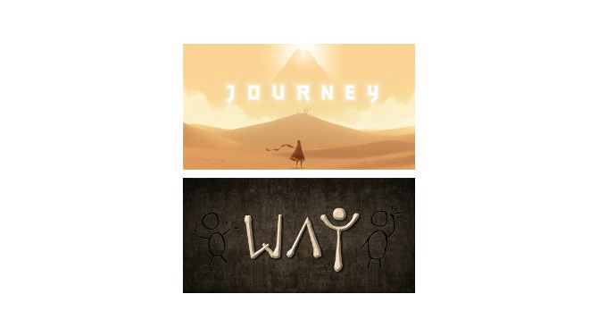

Both games I’ve helped design, "Journey" and "WAY", attempt to herd two strangers toward friendship. And both do it in similar and different ways.

我帮助设计的两个游戏，《风之旅人 Journey》 和 《WAY》，都试图把两个陌生人引向友谊。两者都以某种类似但有差异的方式做到了这一点。

But how do we do that? How do we design so friendship will emerge? And what is friendship really?

我们是如何做到的？如何设计才能使得友谊涌现？什么是真正的友谊？

It’s impossible to completely define or quantify. Nor can it be forced between players. Their emotional connection has to happen as a spontaneous creation of the participants.

它是不可能被完全定义或量化的。它也不可能在玩家之间被强迫。这种情感连接必须作为一种参与者的自发创造而发生。

So what type of friendship am I speaking about?

那么，我想说是什么类型的友谊呢？

What I’m interested in, is that spontaneous bond between strangers. I want to focus on online multiplayer that emphasizes shared goals, freedom of choice, anonymity, vulnerability, and communication.

我感兴趣的是，陌生人之间那种自发的联系。我想把重点放在强调共同目标（Shared Goals）、自由选择（Freedom of Choice）、匿名（Anonymity）、脆弱性（vulnerability）和沟通（Communication）的在线多人游戏上。

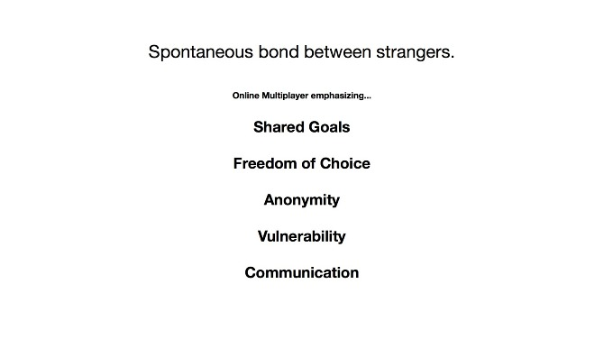

Online Multiplayer provides an incredible opportunity for people around the world to play together, exempt of prejudices or stereotypes. If we can get two people to have a connection in a game, before their prejudices get in the way, then perhaps we can challenge those prejudices. Get the two people to empathize before they draw lines between each other.

在线多人游戏（Online Multiplayer【译注：这里说的更多是联网的，可多人游玩的游戏，该定义囊括了通常所说的 MMO 大型多人在线Massive Multiplayer Online Game，诸如Journey 和 WAY都只是两人同时进行的】）提供了一个绝好的可能，使得世界各地的人们能够一同游戏，免除偏见或刻板印象。如果我们能让两个人在游戏中产生联系，在他们受到偏见的阻碍之前，那么我们也许可以挑战这些偏见。让两个人在彼此之间划清界限之前产生共情。

Play is a language all humans speak—it’s fundamental, universal, neurobiological, it’s how we’re wired—and so we can use play to build an understanding between people around the world.

**游戏是所有人类的语言——它是基础性的、普遍的、神经生物学意义上的，它是我们的相互连接的方式**，因此我们可以利用游戏在世界各地的人之间建立某种理解。

Because of this potential, I’m advocating that we treat Play with all the seriousness it deserves. A lack of seriousness can lead to oversight, misuse or abuse...and so we need to put care into our designs to ensure players are acting in the ways we value. And value is obviously subjective to the designer.

正是因为这种潜力，我主张我们应以严肃态度对待游戏，这本就是其应得的。缺少严肃性会导致疏忽、误用或滥用......因此我们需要在我们的设计中谨慎行事，以确保玩家以我们所认同的方式行事。而这种认同的价值显然是来自设计师的主观。

So I just recounted a story about spontaneous face-to-face interaction... Well let’s take that face-to-face interaction and add a few different rules. By rules I mean all the things we put into our games to define the space. Instead of being face-to-face in the same physical space, we’re connected over the internet by cameras—randomly—each of us in our own home.

我刚刚讲述了一个关于自发的面对面的互动的故事... 好吧，让我们把这种面对面的互动，加上一些有些不同的规则。这里我所说的规则是指「我们在游戏中定义空间的所有东西」。我们不再是在同一个物理空间里面对面，而是通过摄像机--随机地--我们每个人都在自己的家里通过互联网连接。

Chat Roulette is an amazing story. What could have been an incredible portal to engage and empathize with people around the world was instead used for other things. I’m sure we all know what those were.

《聊天轮盘》是一个惊人的例子。本可以成为与世界各地的人接触和共情的一个绝佳的窗口，但却被用来做其他事情。我相信我们都知道那些是什么。

【译注：Chatroulette是一个随机视频聊天网站，你可以和一个随机选出来的人进行视频聊天或者是语音聊天，网站不需要用户名和密码，在唯一的页面上有显示聊天对象视频的黑框、有输入文字内容的白色对话框。你只要用鼠标轻轻点击，就可以与网络随机抽取的陌生网友视频聊天，若不满意，你只要点击“NEXT”，就可以换一位聊天对象】

Now, why did this happen?

现在，为什么会发生这种情况？

In Chat Roulette, players are behind a screen without any rules to guide their behavior. Without rules, and secured in privacy, problematic players were able pervert the space and claim control, forcing others out.

在《聊天轮盘》中，玩家在屏幕后面，没有任何规则来引导他们的行为。没有规则，并且在隐私得到保障的情况下，那些有问题的玩家会败坏这个空间，并且要求控制，迫使其他人离开。

Now compare that to the London, New York Telectroscope.

我们将其与在伦敦、纽约的电镜进行比较。

Designed by Paul St. George for the Brooklyn Bridge’s 25th Anniversary, the Telectroscope was a 2-way camera linking London and New York, themed as a giant tunnel burrowing through the Earth. Unlike the crude interface of Chat Roulette—the Telectroscope is a spectacle—a work of art. There’s an immediate, aesthetic beauty. And so when persons interact with it, they treat it with a greater deal of respect.

电镜是由保罗-圣乔治为布鲁克林大桥25周年纪念而设计，电镜是一个连接伦敦和纽约的双向摄像机，主题是在地球上钻出的一条巨大隧道。与《聊天轮盘》的粗糙界面不同，《电镜》是一个景观——一件艺术作品。那里有某种直接的、审美的美感。因此当人们与它互动时，他们会以更大的尊重来对待它。

More importantly, it’s in public—players, if we may call them that, interact with one another knowing they will be seen by more than just their counterpart. Or in other words, they’re operating within the rules enforced by a public system, which have understood behavioral codes that are not regulated in Chat Roulette.

更重要的是，这是在公共场合——玩家（如果我们可以这样称呼他们）彼此互动，知道他们将被更多的人看到，而不仅仅是对面的人。换句话说，他们是在公共系统运行的规则内来使用电镜的，而公共系统有明白的行为准则，而《聊天轮盘》中则没有。

On top of that, the designer adds another restriction—no voice communication. And so players create their own playful ways to engage each other and it becomes a toy.

在此规则基础上，设计者增加了一个限制--不能进行语音交流。就这样，玩家们创造了他们自己有趣的方式来和对方互动，使得电镜本身也就成了一个玩具。

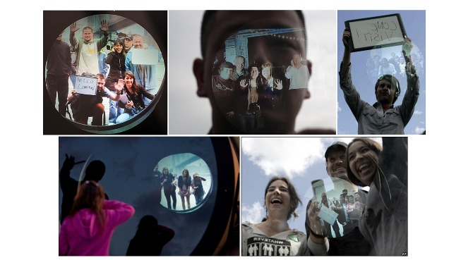

The chance for abuse in the manner of Chat Roulette, well, we can’t call it zero, but I’m fairly certain you’re going to be arrested if you try.

以《聊天轮盘》式的方式来滥用电镜的机会，不能说绝不存在，但我相当肯定，如果你尝试，你会被抓起来。

Seeing how just those few additional rules affected player behavior—let’s go one level deeper, playing behind digital avatars in an online game.

看到了这些额外的规则是如何影响玩家行为之后--让我们再深入一层，去看那些在网络游戏的数字化身后的游玩行为。

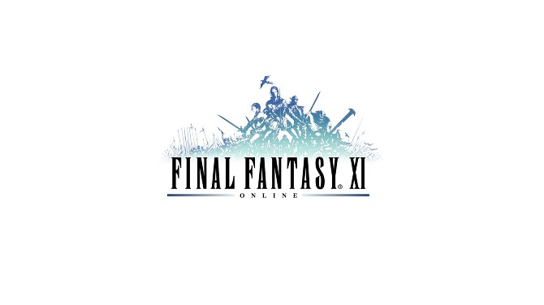

My first experience playing an MMO was in 2002. I was 16 and the game was Final Fantasy XI. Like the Fish Market story earlier, when I entered Final Fantasy I was surrounded by all sorts of information I couldn’t understand. I wandered outside of town, where I saw a Mountain. I approached the mountain—and at the base, I met up with another player and we started fighting monsters together. And then we died...

我第一次玩MMO（MMO 大型多人在线Massive Multiplayer Online Game）的经历是在2002年。当时我16岁，游戏是《最终幻想11》。就像之前鱼市的故事一样，当我进入《最终幻想》时，我被各种我无法理解的信息包围。我在城外徘徊，在那里我看到了一座山。我走近那座山，在山脚下，我遇到了另一个玩家，我们开始一起打怪物。然后我们就死了...

When we died, a prompt appeared on my screen which read “You can wait to be revived, or you can click to teleport and return to your Home Point.” accompanied by a timer counting down toward Zero. This was my first time dying, so I didn’t know what that meant.

当我们死亡时，我的屏幕上出现了一个提示："你可以等待被复活，或者你可以点击传送，回到家园点。" 伴随着一个逐渐归零的计时器。这是我第一次死亡，所以我不知道这些是什么意思。

Where’s my home point?

我的家园点在哪里？

Is that where I started?

那是我开始游戏的地方吗？

Is my buddy’s home point the same as mine?

我的伙伴的家园点和我的一样吗？

If I clicked the button, would we stay together?

如果我按下按钮，我们还会在一起吗？

What happened when the timer reached zero?

计时器到了零的时候会发生什么？

None of this was explained by the game. And so again I’m nervous. I quickly typed to my buddy “What should we do?”. But the response didn’t come from him, it came from the game:

这些都没有在游戏中得到解释。于是我再次紧张起来。我迅速向我的伙伴打字："我们应该怎么做？"。但得到的回应不是来自他的，而是来自游戏：

“You are not allowed to type when dead”.

"死亡状态下不允许打字"。

Here I was, my corpse laid out next to his, and we couldn’t communicate. And then something phenomenal happened. I realized that if I was here, at my corpse, and my buddy’s corpse is still there, than he must still be there too.

我在这里，我的尸体躺在他的旁边，而我们无法沟通。这个时候，我有了一种不可思议的感受：我意识到，如果我在这里，在我的尸体旁，而我朋友的尸体还在那里，那么他也一定还在那里。

I suddenly felt more aware that there was a person behind that avatar than ever before.

我突然比以往任何时候都更清楚地意识到，在那个游戏化身avatar背后有一个人。

A human being.

一个活生生的人（human-being）。

I could see him sitting at his computer, staring at my corpse, waiting for me as I was waiting for him. We were having a conversation without any actions at all.

我可以看到他坐在电脑前，盯着我的尸体，等待着我，就像我在等待他一样。我们在没有任何行动的情况下进行着对话。

Now, it’s worth pointing out that this was all totally in my head. For all I know, he could have been away heating up a Hot Pocket knowing he had 8 minutes to spare, but that’s not what I felt .

当然，这一切完全是我的想象。据我所知，他完全可能会已经离开了，并且有8分钟时间足够加热一个Hot Pocket，但这并不是我的感觉。

【译注：Hot Pockets是美國品牌的微波周轉食品，通常包含一種或多種類型的奶酪，肉或蔬菜。】

Just as the counter neared Zero, my anxiety growing, a White Mage appeared out of nowhere and revived both of us.

计数器逐渐接近零，而我的焦虑感也越来越强，一个白袍法师不知从哪里冒出来，把我们俩都复活了。

My voice returned, I sprang up and thanked the mage. This time my response did come from the player, but instead of a “You’re Welcome”, it was a single character of Kanji and a question mark.

我能够说话了，我猛地站起来，向法师表示感谢。这一次我的回应确实来自玩家，但不是 "你太客气了"，而是一个日式汉字和一个问号。

When we realized we couldn’t speak to each other, the Mage began using the in-game gesture system to communicate. I wasn’t even aware yet that there was such a thing, and so now the Mage was teaching me, building on top of the positive relationship we already established.

当我们意识到我们无法与对方交谈时，法师开始使用游戏中的手势系统进行交流。我甚至还不知道有这种东西，所以现在是法师在我们之间已建立的积极关系的基础上在教导我。

Over the next couple of years, I would wave to that Japanese Mage whenever we crossed paths. Unfortunately, that was not the case with many other Japanese players, and I’ll explain why.

在接下来的几年里，只要我们见面，我就会向那位日本法师挥手致意。不幸的是，其他许多日本玩家却不是这样，我将解释其中原因。

In Final Fantasy XI, all of the things that are valued—obtaining new armor, earning new abilities, fighting new monsters, even seeing the world—each of these is predicated on the need to Level Up. Well, leveling up meant obtaining lots of Experience Points...... and experience points were obtained through Combat.

在《最终幻想11》中，所有被重视的东西--获得新的盔甲，获得新的能力，与新的怪物战斗，甚至只是看到更大世界--每一项都是以等级提升为前提的。好吧，提升等级意味着要获得大量的经验值......而经验值是通过战斗获得的。

If you died, you lost Experience Points, and so Combat was important. In order to get the most Experience Points, you needed to partake in Team Combat to kill monsters stronger than yourself.

如果你死了，你就会失去经验值，所以战斗很重要。为了获得最多的经验值，你需要参与团队战斗，合作来杀死比自己更强的怪物。

In order to perform good Team Combat, you needed to know how to link moves with your teammates—You do a move....then I do a move...and those moves combine to perform a super move. In order to coordinate these moves, we had to Communicate.

为了进行良好的团队作战，你需要知道如何与你的队友协作：你进行一步....，然后我也进行一步......这些动作结合起来就可以完成一个超级动作。为了协调这些动作，我们必须进行沟通。

More specifically, we had to communicate through Text.

更具体地说，我们必须通过通过文本语言进行沟通。

And so it became difficult to succeed with the Japanese players. And so you’d see this...

因此，与日本玩家一起成功变得很困难。你会看到这个...

Looking for members（Japanese Only）

招募队友（仅限日语）

and this... Looking for members（English Only）

招募队友（仅限英文）

Soon enough the entire world was segregated into English and Japanese-speaking players— all because the best way to achieve Experience Points relied on strong textual communication. It’s not that players didn’t want to play together. Of course they did! It’s that the design discouraged it. It didn’t have value in the game world. Certainly not if you wanted to get those precious Experience Points.

很快，整个世界就被隔离成讲英语和讲日语的玩家--这都是因为获得经验值的最佳方式依赖于强大的文字交流。这并不是说玩家不愿意一起玩。他们当然想！这是因为设计上不鼓励这样做。它在游戏世界中没有价值。特别是当你想得到那些宝贵的经验值的时候。

And so it went unconsidered.

所以这是被忽视的。

"Oh that’s just how you play the game."

"这就是你玩游戏的方式。"

As a player I felt alienated, unwanted, disconnected... Because that was my experience. As a player, I only knew how I felt. I was not able to see the root of the problem which was occurring because something may have gone unconsidered or undervalued in the design.

作为一个玩家，我感到被疏远......不受欢迎......脱节......。因为这就是我经历过的事。作为玩家，我只能知道我的感觉。我无法看到问题的根源——因有些东西在设计中没有被考虑到，或着这些东西被低估了。

A single rule or value can pollute an entire system.

一个单一的规则或价值可以污染整个系统。

But what was it that got me so hooked in the first place? What were the seeds of my connections?

但是最初的时候是什么让我如此着迷？我的这些联系的来源于什么？

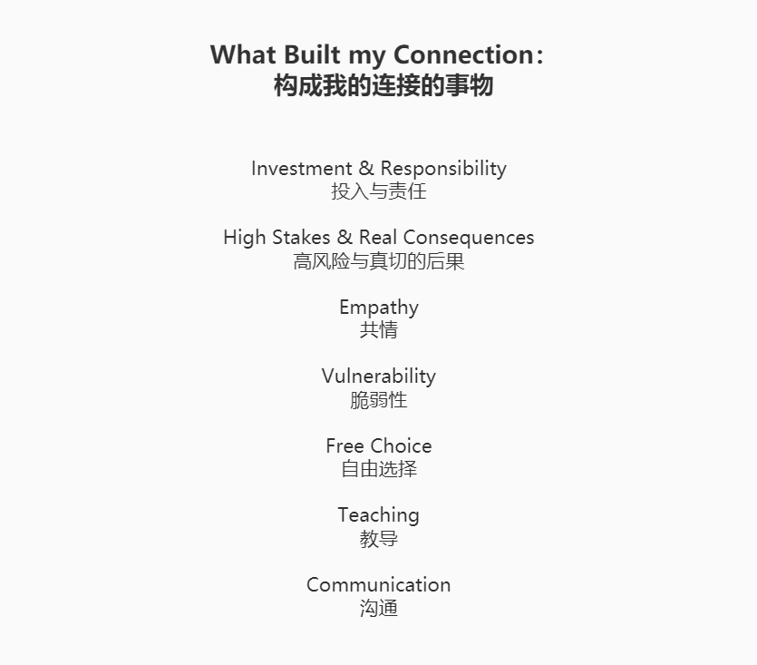

There was investment...I had made it to the Mountain and met up with a partner... There were serious consequences...we died and were about to be separated, possibly forever... There was empathy...myself projecting what I thought he was thinking and feeling... There was him honoring my vulnerability—at least as I inferred it—his choice to stay with me, even when he didn’t have to... There was the Mage, freely choosing to help... And there was the moment of teaching and communication without words.

这其中有投入......我走到了那座山中，遇上了一个伙伴...... 有严重的后果......我们死了并且即将被分开，可能是永远。有共情......我感受到，在我身上投射出的他的想法和感受。他尊重了我的弱小无助--至少我是这样推断的——他选择和我待在一起，而这并不是必须的...... 还有法师，他自愿选择选择了帮助（我们）...... 还有那个无言的教导和交流的时刻。

But how do you design for that?

但这些如何能够设计出来呢？

This all took place within an enormous MMO. For the large majority of players, it’s safe to say they didn’t have this specific experience. Where the system is so big, it’s unlikely this kind of moment was the sole intent of the designers...or at the very least, I doubt it was their primary focus. So how do we create a game where similar emotions happen more often? Where they are our focus?

这一切都发生在一个巨大的MMO中。对于大多数玩家，可以说，他们不会有这种特殊的经历。在如此庞大的系统中，这种时刻不太可能是设计师的专门去试图达成的......或着至少我怀疑这并不是他们的主要关注点。那么，我们如何创造一个游戏，让类似的情感能更频繁地发生？让这些情感它们，成为我们的焦点？

These are the types of questions and problems that influenced our thought processes for Journey and WAY.

这些都是影响我们对 《风之旅人》和《WAY》 创作思考的各类困惑和难题。

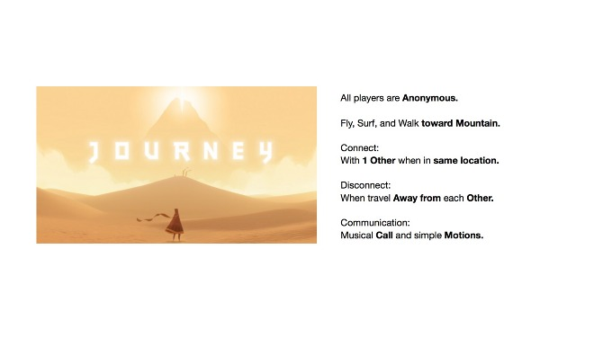

All Players are **Anonymous**

**两位玩家都是匿名的**

Fly, Surf and Walk forward Mountains

共同朝着山飞翔、滑行、行走

Connect：With **1 Other when in same location**

和一位同时处在相同区域的玩家连接

Disconnect：When travel Away from each Other

当远离了另一位玩家

Communication：Musical Call and Simple Motions

乐音式的呼唤和简单的动态

【以上为幻灯片文字翻译】

You may have heard of Journey. For those that don’t know, Journey is an online game where anonymous players walk, surf, and fly toward a Mountain—and can connect with 1 player at a time in the process. Connections occur when two players are in the same part of the world. If the two players move far enough apart, they are disconnected. Players can’t talk or type, instead they communicate through a musical call and the simple motions of their characters.

你可能听说过《风之旅人》。如果你没听说过，《风之旅人》是一个联网游戏，在游戏中，匿名的玩家们朝向着一座山行走，滑行，与飞翔。每次这个过程中可以与一个玩家相连接。当两个玩家处于世界的同一地区时，就会发生连接。而如果两个玩家之间的距离太远，连接就会断开。玩家不能说话或打字，而是通过音乐性的呼喊和他们角色的简单动作进行交流。

I’d like to briefly mention that I wasn’t on Journey for the first half of its development. That time was spent developing WAY. And so I’ll speak specifically on Journey as we developed it in the last 15 months.

我想简单提一下，在《风之旅人》开发的前半段，我并没有参与其中。那段时间我在开发《WAY》。因此，我将具体谈谈我们过去15个月里开发的《风之旅人》。

One of the focal questions of Journey is "What if...in a game about discovery and transformation, you experience that transformation alongside another?"

《风之旅人》的核心问题之一是「如果在一个关于发现和转变的游戏中，你与另一个人一起经历了这种转变，会怎么样？」

What will you feel?

你会有什么感觉？

Will you feel connected?

你会感觉到被连接吗？

Like many linear games and other classic stories, Journey borrows the structure of the monomyth—a transformation story. Emotions arc as the protagonist passes from experience to experience. Because you engage in these experiences with another player, there is the potential to share a wide range of emotions with them.

就像许多线性游戏和其他经典故事一样，《风之旅人》借用了英雄之旅的结构——一个「转变」的故事。随着主人公经历了事物，情绪便产生了弧光（发生变化）。而你与另一个玩家一起经历了这些体验，所以有可能与其分享这些丰富的情感。

Now because there’s no textual or verbal communication in Journey, it’s impossible to know exactly what the other player is feeling or thinking. Personally, I find that beautiful. After all, no two persons in this room could ever know exactly how each other feels—we are creatures of interpretation—each with our own perspective. Like the dead corpse in Final Fantasy XI, without words, the player is able to project their own thoughts onto the other person and what they think the other person is thinking...generating perceived empathy.

正是因为《风之旅人》中没有文字或语言交流，所以不可能确切地知道其他玩家的感受或想法。就我个人而言，我觉得这很美。毕竟，在这个房间里没有任何两个人能够确切地知道对方的感受--我们是解释性的动物，每个人都有自己的视角。就像《最终幻想11》中死去玩家的尸体一样，在没有语言的情况下，玩家能够将自己的想法投射到对方身上，并去思索他所认为对方在想什么的事情......这产生了可感知的共情。

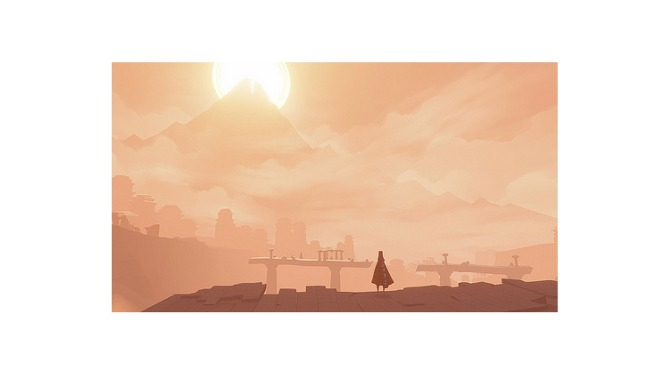

This is true not only of a moment of discovery, but also when players choose to walk away from each other. When two players separate, they disconnect. Why did that person leave? Did they not want to travel with me? Were they distracted by something? Should I follow? These are all questions. You wonder about them because you don’t know for sure.

这不仅适用于共同探索的时刻，也适用于玩家选择离开对方的时候。当两个玩家分开时，他们断开了联系。那个人为什么离开？他/她不想和我一起旅行吗？他/她是被什么其他东西分心了吗？我应该跟着他/她吗？这些都是问题。你想知道答案，正因为你无法确知。

When players disconnect, they disappear from the world. Because the world of Journey has many large and barren vistas, players feel small and lonely. Because it’s barren, this also means that when another player appears and moves through the landscape they become a focus.

当玩家断开连接时，他们从世界中消失。因为《风之旅人》的世界有许多巨大而荒芜的远景，玩家会感到自身的渺小和孤独。因为它是荒芜的，这也意味着当另一个玩家出现并在地形中移动时，他们会成为焦点。

Journey also maintains the important 4th wall. Though one might argue text and speech allow players to more clearly discuss or rejoice over a particular event...text and speech also introduce a number of unwanted verbs that could break the experience. Players could be pulled out, the game could become an object for discussion versus the world that simply is, etc.

《风之旅人》维持了重要的第四面墙。有人可能会说，文字和语音可以让玩家对某一特定事件更清晰地讨论或为之欢欣鼓舞......但文字和语音也引入了一些不必要的动词，而这可能会破坏体验。玩家可能会因此抽离出来，游戏本身可能成为讨论的对象，而不再是一个简单的世界，等等。

Personally, I prefer that players communicate through nonverbal actions. This places everyone on a more even ground—any two players have the same actionable verbs.

就个人而言，我更喜欢玩家们通过「非语言行为 nonverbal actions」交流。这使每个人都处于更平等的地位——任何两个玩家都有相同的「可执行动词」【例如在游戏空间中移动，行走，发出音乐性的呼唤等等】。

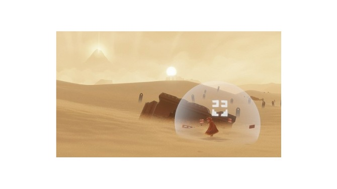

In Journey, one of the clearest examples of these is the players’ musical call. The call serves a number of functions—one of which is to get the attention of the other player. Though it’s a single button, the call has a range of expression—and this is important. Tap the call in quick succession and it may resemble excitement. Hold the call button down for a longer period, and the character releases a more powerful shout. How players call helps bring identity to their person.

在《风之旅人》中，最明显的例子之一是玩家的音乐性的呼喊。呼喊有许多功能，其中之一是引起其他玩家的注意。虽然它是个单键，但却能有一定范围表达的可能——这很重要。快速连续点击，这可能类似于表达兴奋。长时间按住呼喊的按钮，角色就会发出更有力的呼喊。玩家进行呼唤的方式有助于建立他/她的身份特性。

I spent many hours playtesting with my teammates at thatgamecompany, and I could often tell one person from another just by how they used their calls to express themselves. Like any strong relationship—it requires the other person has a unique, personal, human identity for you to resonate with.

我和我在thatgamecompany的同事花了很多时间进行了游戏测试，我经常可以仅仅通过他们使用呼喊功能来表达的方式来区分他们。就像任何牢固的关系一样——它要求对方有一个独特的、个人的、人类的身份特征，以令你能产生共鸣。

We can remove text and speech, but we must not remove the player’s voice— their ability to express emotions, feelings, and opinions.

我们可以拿掉文字和语音，但我们不能拿去玩家的声音-表达（voice）——他们表达情绪、感受和观点的能力。

The call provides other functions. Players can “harmonize” with other players in the world— glowing the players and giving each other expendable energy with which they fly. Players can obtain this resource by physically touching each other—encouraging them to stay close, again bonding them—or by calling to each other within the radius of the bubble created by the call. The shared dynamic this creates is that of a Call & Response.

这个呼喊技能也有其他的功能。玩家可以与世界上的其他玩家 "谐调 Harmonize"——让玩家角色发光，并会给对方提供可供飞行的消耗性能量。玩家可以通过角色的身体接触来获得这种能量资源——这鼓励他们待在一块、连接，或者在呼叫所产生的气泡半径内相互照应。这创造出的共享的动态是一种「呼唤和回应 Call & Response」。

I call to you, you fly and expel your resource, you call to me, and I fly and expel mine. This creates a rhythm between the players. I personally like to think of it like a dance, or perhaps a version of Leapfrog. This is an example of Reciprocity, equal give and take between both parties. Reciprocity is a fundamental characteristic of friendship.

我呼唤你，你就飞起来，释放出你的能量；然后你呼唤我，我飞起来，释放出我的能量。这在玩家之间创造了某种节奏。我喜欢把它想成是某种舞蹈，或者是某种版本的跳背游戏（Leapfrog）。这是一个「互惠（Reciprocity）」的例子，双方之间平等地给予和接受。互惠是友谊的一个基本特征。

Without the other person around, players are unable to continually fly. And so when they’re gone...or when they choose not to help...you can feel that. You feel it in the slow walk, your progress hampered, though not obstructed. This is us designing for a feeling of Longing.

没有其他人在身边，玩家就无法持久地飞翔。当他/她离开......或者当他/她选择不帮助时......你可以体会到它。你可以在缓慢的行走中感受到它，你的前进受到了阻碍，尽管没有受到阻挠。这是我们所希望设计出的某种渴望的感觉。

Together we fly toward a single shared goal—the Mountaintop—which funnels the players together.

我们一起朝着一个共同的目标飞去——山顶，而这将玩家吸引到一起。

Replayability often comes up in critiques of Journey. One of the questions we find interesting is, once the endpoint has been reached and the story completed—once the discoveries of the world have been revealed to the player—what becomes important then? What does it mean to play the game a 2nd, 3rd, 5th or hundredth time? Where will players find value then? And what about years from now, when the deserts are barren and there’s rarely a journeyer walking to the Mountain? What will it mean to suddenly find another person in the dunes?

可重玩性常出现在对《风之旅人》的评论中。我们发现一个有趣的问题便是，一旦到达终点，故事完成，一旦世界已经完全展现在玩家面前后——什么变得重要了？第二次、第三次、第五次或第一百次玩这个游戏意味着什么？那时，玩家将在何处找到价值？而多年以后，当沙漠荒芜，很少再有旅行者往山的方向走去时？突然在沙丘上发现了另一个人意味着什么？

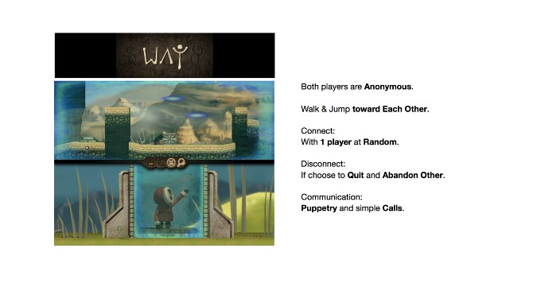

Both Players are Anonymous

两位玩家都是匿名的

Walk & Jumps toward Each Other

互相朝着对方走/跳去

Connect：With 1 Player at Random

和一位随机的玩家连接

Disconnect：If choose to Quit and Abandon Other.

如果选择退出并抛弃另一位玩家则失去连接

Communication：Puppetry and Simple Calls

沟通：提线木偶演出和简单的呼喊

【以上为幻灯片文字翻译】

Before working on Journey, I spent 12 weeks designing the shortform version of WAY with a small team. It was made without any preexisting knowledge of Journey, mostly designed before Journey was even announced—and yet there are quite a few similarities. In our attempts to form connections between strangers, both designs arrived at similar conclusions—and yet they are two very different games. Each with a very different set of aesthetics and design philosophy.

在制作《风之旅人》之前，我和一个小团队花了12周时间设计《WAY》的短篇版本。它是在对《风之旅人》没有任何预先了解的情况下制作的，大部分是在《风之旅人》正式宣布之前设计的——而它们之间有许多的相似之处。在在陌生人之间形成联系的尝试过程中，两个设计都得出了类似的结论——然而它们是两个非常不同的游戏。各自有一套非常不同的美学和设计哲学。

WAY is a communication puzzle-platformer. In WAY, you and an anonymous player venture toward each other from opposite ends of the world, solving the puzzles between you. The game is played in split-screen, and each player sees the world differently. One player will have information the other does not—such as the location of an invisible platform where they need to jump, or perhaps a trap they need to avoid—and so you need to communicate this information with each other to progress. Like Journey, there is no text or speech communication. Instead, players have to share information by puppeteering their avatars. You can point, wave, mime a circle, nod your head—whatever works for you in the system. All of these are player controlled—ensuring the puppetry is a manifestation of your specific voice.

《WAY》是一款强调交流的平台解谜游戏。在《WAY》中，你和一个匿名玩家从世界的两端向对方的方向进行冒险，解决在你们之间的谜题。游戏以分屏方式进行，每个玩家看到的是不同的世界。一个玩家会有另一个玩家没有的信息——比如他们需要跳上的隐形平台位置，或者他们需要避开的陷阱——因此你们需要相互交流这些信息来前行。与《风之旅人》一样，没有文字或语音的交流。作为替代，玩家必须通过如同木偶戏式地操作（puppeteering ）他们的游戏角色来分享信息。你可以指向、挥手、划个圈，点点头——任何在系统中对你有用的方式。所有这些都由玩家控制——确保这种木偶式的操作能成为一种你特有的表达方式（manifestation of voice）。

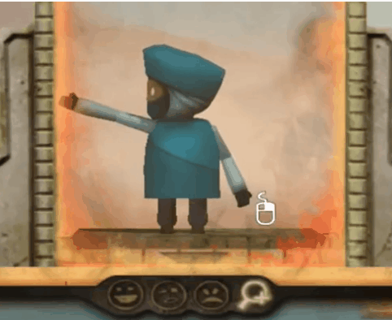

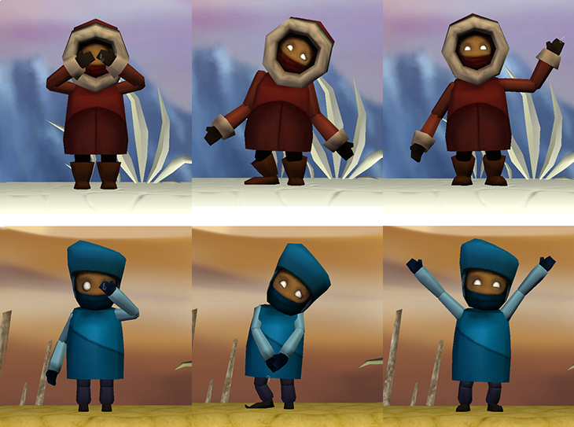

Because play is anonymous, players cannot use third-party chat clients like Ventrilo or IM to break the 4th wall.

由于游戏是匿名的，玩家不能使用如Ventrilo（Voice over IP \(VoIP\) group communications software）或IM（即时通讯 Instant messaging）的第三方聊天客户端来打破第四面墙。

When the game starts you are alone. It’s not until you proceed a bit further that your world splits in two and the other person appears. This creates a sense of surprise. The other person, like in Journey, is a discovery...an epiphany—and it’s this realization of the Other that grabs your focus.

游戏开始时，你是一个人。你继续前进，你的世界开始一分为二，而另一个人出现。这创造了某种种惊喜。另一个人，就像在《风之旅人》中一样，是一次发现，一个对事物真谛的领悟——正是这种对「他者」的意识吸引了你的注意力。

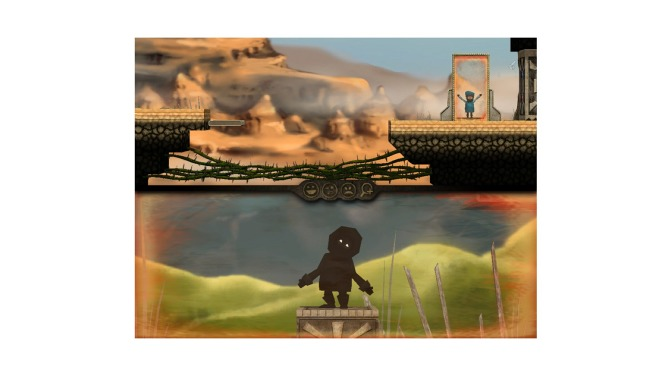

—

Little is explained within the game world, empowering the players to become teachers unto each other. Rather than teach the players ourselves, we instead empart as much of that responsibility to the player. This encourages players to speak to each other and creates opportunities for a stronger connection.

游戏世界中几乎没有任何解释，这使得玩家去成为彼此的老师。与其说是我们自己教玩家，不如说我们将这个责任尽量交给玩家。这鼓励了玩家互相交流，并创造了加强联系的机会。

When 1 player understands and does not teach it to the other—it can lead to failure and frustration—but this too can be positive! We’ve seen players suddenly realize they had information the other did not, and then feel shame for not helping each other. If this occurred outside the game, we would hope that person reflects on not helping when they could have.

当一个玩家理解了，但却没有教给另一位玩家的话，那可能会导致失败和受挫，但这也可以是积极的！我们看到过玩家突然意识到他/她有对方所没有的信息，并为没有能帮助对方而感到羞愧。如果这种情况发生在游戏之外，我们也会希望那个人会反思他自己在他/她本可以帮忙的时候却没有伸出援手。

That is something we value.

这是我们所重视的。

Because neither player has all of the information, players are interdependent. This is a big difference from Journey. Each player needs the other. In order to finish the game, you must invest yourself and commit to playing with this single other person.

因为双方都没有能掌握所有的信息，所以玩家们是相互依赖的。这与《风之旅人》有很大不同。每个玩家都需要对方。为了通关游戏，你必须投入自己，去与那位陌生人一起去玩。

Portal 2 multiplayer has something similar, but it's not quite the same for an important reason. I am a fan of Portal 2, but there are certain rules in the puzzle design that WAY approaches differently.

《传送门2》的多人游戏也有类似的东西，但由于某个重要的原因，结果却不太一样。我是《传送门2》的粉丝，但它在谜题设计上有某些特定的规则，与《WAY》的做法是不同的。

In Portal 2 multiplayer, it’s common for one player to understand the full solution of a puzzle. Once that is understood, the player simply need tell their partner what to do. This can lead to a sort of single-player domination effect where one player is solving the puzzle and the other is simply following orders. Because orders in Portal 2 are easily understood, because orders are not designed to be puzzling—I tag a wall with a cursor of a portal, you place a portal on that cursor—the puzzle need only be solved by one person.

在《传送门2》的多人游戏中，通常是其中一个玩家来理解谜题的全部解法。一旦理解了，这个玩家只需要告诉他的伙伴该怎么做。而这可能会导致一种单一玩家支配效应（single-player domination effect），即一个玩家在解谜，另一个玩家只需要听从指示。因为《传送门2》中的指示很容易理解，指示并不是解谜的一部分——我在墙上放一个传送门的标记，你就在这个标记上放置一个传送门——所以谜题只需要一个人来解决。

This can lead to a scramble effect, where players are trying to solve the puzzle faster than each other—and that can result in a feeling of spite if your partner solves it before you. I haven’t asked, but I wonder if this was the feeling they were going for. Another result of that same scenario is one player stops trying to solve puzzles entirely, and simply waits for the other to figure it out.

这可能会导致某种争夺效应（scramble effect），即玩家试图比对方更快地解开谜题——如果你的伙伴比你先解开，这可能会导致某种怨恨感。我没有问过，但我想知道这是否是他们所追求的体验。同样情形的另一个结果是，一个玩家完全不再尝试解谜，而只是等着另一个玩家想出解法。

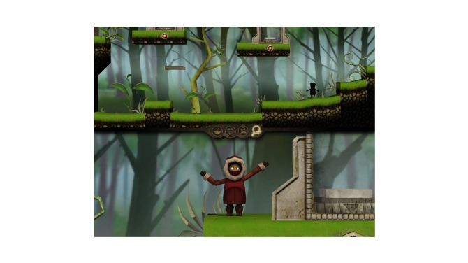

Because communication in WAY is interdependent, one player communicates while the other player actively listens, and vice versa—both are engaged and equally important. This creates a shared Call & Response dynamic—somewhat comparable to the call & response in Journey where players take turns sharing the resource to fly.

因为《WAY》中的交流是相互依赖的，一个玩家在交流，同时另一个玩家在积极倾听，反之亦然——双方都在参与，而且同等重要。这就创造了一种分享的「呼唤-回应」的动态——有点类似于《风之旅人》中轮流分享能量进行飞行的呼唤与回应。

In WAY, meaning is constructed from a freeform puppet system. The players create their language, freely choosing what means what. This ensures that whatever players come up with— however they solve the puzzle—is their own. We’ve actually seen players discover entirely valid solutions that we the designers did not even consider.

在《WAY》中，意义是由一个形式自由的木偶动作系统所构建的。玩家创造他们的语言，自由选择特定的动作来表达特定的意图。这确保了无论玩家想出的什么东西——无论他们如何解决这个谜题——都是他们独有的。我们实际上已经看到玩家探索出了完全可行的，而我们这些设计师却甚至从来没想到过的解法。

And there’s another win here too. Because puzzles are open-ended—because players create their own language to solve each problem—solutions can feel both smooth or clunky. This too is part of WAY’s philosophy. Group A might arrive at a transparent solution to a puzzle and it feels graceful, while Group B comes up with a convoluted one and it fails and fails until it finally works. Group B might walk away from that experience saying “oh that was horrible” or “how sloppy”—but I find that to be honest design.

而这也是另一种成功。因为谜题是开放式（open-ended）的——因为玩家创造了他们自己的语言来解决每个问题——所以解法可以感觉很顺畅，也可能很笨拙。这也是《WAY》哲学的一部分。A组可能会得出一个清晰、优雅的谜题解法，而B组则可能会想出了一个极度复杂的解法，并在最后成功之前不断失败。B组可能会说 "哦，这太可怕了 "或者 "太乱了"，但我认为这才是诚实的设计。

That’s how the world works.

这就是世界的运作方式。

They didn’t consider an alternative.

他们没有考虑其他的选择。

And then we’ve seen these players revisit those puzzles with a new partner who then shows them another way. And suddenly their perception grows.

然后我们看到这些玩家和一个新伙伴一起重温了这些谜题，而这个新伙伴又给他们展示了另一种解法。然后突然间他们的认知就增长了。

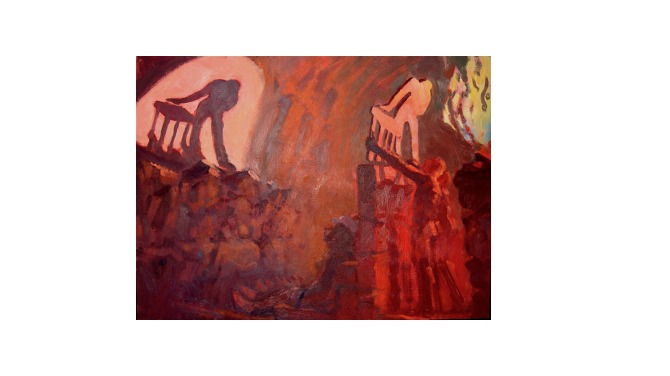

As a metaphor, consider talking to your friend and describing something they have never seen. How you explain what you mean will determine whether or not your friend understands you. Depending on the approach, coming to an understanding could be simple or difficult. So is true in WAY.

作一个比喻，想象你与你的朋友交谈，描述他/她从未见过的东西。你如何解释将决定你的朋友是否理解。这取决于不同方法，达成理解可能很简单，也可能很困难。在《WAY》中也是如此。

And in a game about communication, should we or shouldn’t we be teaching players to value how they communicate?

在一个关于沟通的游戏中，我们是否应该引导玩家去重视他们沟通的方式？

In the pamphlet I mention that I’d also talk about how we “maintain” these friendships. Both of these games attempt to establish a bond, but what it takes to carry a friendship forward...to transcend and become something bigger than the game...requires growing beyond the game itself.

在小册子中提到的，我还希望谈论我们如何 「维持」 这些友谊。这两个游戏（《WAY》和《风之旅人》）都试图建立一种纽带，但将友谊向前推进......超越并成为比游戏更大的东西......我们需要超越游戏本身的发展。

Within these controlled systems like WAY and Journey, it’s impossible to include so many of the things that might strengthen the bond between two persons. And so instead, we focus on establishing the connection. Then, upon completion, each game provides an invitation to carry that bond forward. The design for these invitations is very different in each game.

在《WAY》和《Journey》这些受控系统（controlled systems）中，不可能去包括这么多可能加强两个人之间联系的东西。因此相反，我们专注于建立这种联系。然后，在完成之后，游戏都提供了某种「邀请」，以使这种联系能继续下去。这种「邀请」的设计在每个游戏中都非常不同。

If it’s your intention to allow players to grow their bond beyond the game, you’ll need to eventually release them from the cave and relinquish your control as designer.

如果你的意图是让玩家在游戏之外发展他们的联系，那你最终需要放弃你作为设计师的控制权，把他们从洞穴中释放出来。

I’m going to reserve discussing the ending of WAY specifically. Instead, I’d like to share one last personal story that speaks to its spirit.

我将保留对《WAY》结局的具体讨论。相反，我最后想分享一个我个人的故事，以说明其精神。

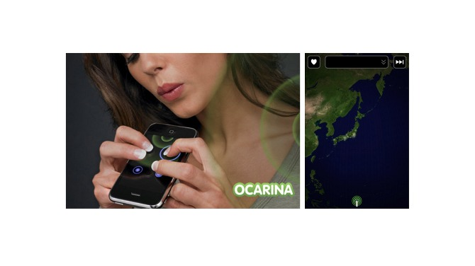

For those of you that aren’t familiar, the iPhone app Ocarina transforms the iPhone into an ocarina. Hold down keys and blow into the microphone to make different notes.

对于那些不熟悉的人来说，iPhone应用程序Ocarina将iPhone变成了一个陶笛。按住按键，对着麦克风吹气，就能发出不同的音符。

I’m a big fan of this app, and I use it in a very specific way. There is a feature in Ocarina that allows you to listen to people play as they stream their music live. Whenever there is a big event in the world, I like to open the app and listen to the songs being played there.

我是这个应用程序的忠实粉丝，而且我以一种非常特殊的方式使用它。Ocarina有一个功能，可以让你听人们直播他们的音乐演奏。每当世界上某处发生了大事，我总喜欢打开这个应用程序，听听那里的人弹奏的歌曲。

The day after the Tsunami hit Japan, I touched my finger over the eastern coast and waited for notes. I wasn’t sure any would come.

在日本发生海啸【译注：这里应是指2011年3月11日14:46:21在日本东北部太平洋海域发生的东日本大地震】的第二天，我用手指在日本东海岸的位置上触摸，等待着音符。我不确定是否会有任何音符会出现。

The song that came was “Ode to Joy”.

出现的歌曲是《欢乐颂》。

Those notes stunned me, and they stun me still. I immediately envisioned that person sitting amidst a horizon of rubble. I couldn’t process what they must be feeling, but I desperately wanted to send notes back.

这些音符震撼了我，时至今日。我当时立刻想到那个人坐在一片瓦砾中的情景。我无法完全地领会他/她的感觉，但我迫切地想把以音符去回应他/她。

I couldn’t.

我做不到。

That wasn’t part of the design.

这不是设计的一部分。

As architects of games, we have full control over what is valued. If the world isn’t valuing what we consider significant, we have the responsibility to create worlds that do.

作为游戏的设计师，我们对游戏中**「何为价值（ what is valued）」**能有完全的掌控。如果这个游戏世界并不重视（value）我们认为重要的东西，那我们有责任去创造一个让他们重视的世界。

Our medium is Play, an instinctual language of action that reaches across all cultures.

我们的媒介是游戏，一种能跨越所有文化的本能的行动语言。

And aren’t actions what’s important?

而行动不正是那重要之事？

What I will say concerning the ending of WAY is that players have the choice to do something.

在《WAY》的结局，玩家可以选择做一些事情。

It’s what you choose to do that reveals who you are.

而你所选择做的揭示了你是谁。

Thank You."

谢谢。"

**译者补充**

上文 you’ll need to eventually release them from the cave and relinquish your control as designer 中洞穴的比喻特别好，这里的cave指的正是在《WAY》和《Journey》的设计中玩家无法用言语和文字交流，并且一同穿过黑暗的冒险。

其中所说的「邀请 invitation」，在Journey中呈现为一片雪地，许多玩家在最后通关前都会在这篇雪地上走出爱心的形状对同伴表达自己的感谢与情意，在网上能够找到许多人分享的经历。

我会想起当时游戏主创陈星汉在另一个GDC Talk（这个内容@李姬韧在2014年已经有过翻译《&lt;风之旅人&gt;设计师分享团队开发游戏的过程》）中提到的两件事：

一件事是关于游戏内，**设计师所限定的表达手段而可能造成的表达效果**，从这个角度可以理解为何今天的大部分游戏是关于战斗与暴力的：

> 我们增加了玩家之间的物理特性，使得他们可以互相推，能够感觉到对方的存在。这非常棒。 但是，玩家们所做的，并不是把对方推过岩石，而是把他们推向一些更奇特的东西（仙人掌）。
>
> 有很长一段时间。我觉得是因为这些玩家玩了太多的使命召唤，他们变得这么险恶了。但后来，我们在自己办公室做测试，我们的主程序，把我推到障碍物上杀掉了，很多次。我问他，你知道这个游戏是关于帮助他人和建立情感连结的对吧？为什么你总是在这样做？他只是看着我，大笑，因为我们就在办公室两端，他说：快复活（再来一次？）。然后我意识到，有好长一段时间，我对人性感到失望。
>
> 有一天朋友介绍我建了一个心理咨询师。我就和她谈了人性的这种困境。她说，因为他们是玩家。他们是婴儿。什么意思呢？当你把你自己从现实世界代入到一个虚拟空间中，特别是一个角色长的像成年人的虚拟空间，你不再保持现实世界中的那些道德规范了。你就像一个婴儿。婴儿只追求反馈。把一个人推上岩石没有任何反馈，但把一个人推死，会有动画，有血，有哭喊的声音，有一股压抑着的社交焦虑等待你去复活你的人物。这更多是关于回馈的。当然玩家想要做有更多回馈的事情。所以我学到了，道德并没有代入到虚拟世界中，为了控制玩家的行为，你要控制输入和输出。
>
> 为了避免这种情况发生，我们最终放弃了碰撞的设计。为了取代互相推的玩法，我们设计了替代机制：当两个人站在一起，就会给对方能量。所以玩家们就喜欢在一起，因为有很多反馈，而无法从把队友推下悬崖中获得反馈。现在他们共同飞起来了，而且始终保持在一起，爱对方。

第二件是关于这类游戏的匿名性，这种匿名性所造成的的是某种情感的投射与想象，是某种混合着本就无法跨越的美好的误解，其中合适的一个距离反而成了美。

陈星汉在GDC上提到他收到了八百多封的来信，来自世界各地的玩家谈论他们游玩《风之旅人》的经历，他分享了其中的一封：

> 你的游戏确实改变的我的生命。这是我和他一起最大的快乐，自从他被确诊以后 ......我爸爸，2012年春天过世了，在确诊之后仅仅几个月。
>
> 他过世几周后，我终于能够让自己走出来一些，自己玩游戏。我试着玩《旅》，我看到那开始画面，就大哭起来。
>
>  在我和我爸爸玩《旅》的过程中，我发现这正是关于他，和他走向人生终点的旅程。我相信我和我爸爸在最完美的时机遇到了你的游戏。
>
>  我想感谢你，因为你的游戏改变了我的生命。它的美丽让泪水盈满我的眼眶。《旅》很可能是我玩过最好的游戏。
>
>  我持续的玩，一直记着它所带给过我的快乐，和它将持续带给我的快乐。
>
> 我叫索菲亚，我15岁，你的游戏让我的生命更美好。

而由于《WAY》的版本年代久远（2011），我尝试过了许多次都无法进行联网，所以选择了看通关视频，在游戏最后场景，玩家从世界的两端最终走到了一起而相遇，玩家坐上了一个上升平台，出现credits:

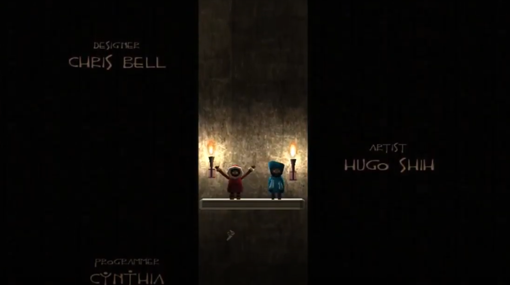

玩家会来到了一个巨大的绘制有世界地图的石墙前，玩家可以踩住机关并且在石墙上写字与绘制箭头，突然间，语言和直接的表达变得如此可贵，在我看的这个视频中，红色玩家激动地写下了Hello，并且在地图上圈出了一个地方，写道：

 "I'm here！"

 “我在这里！”

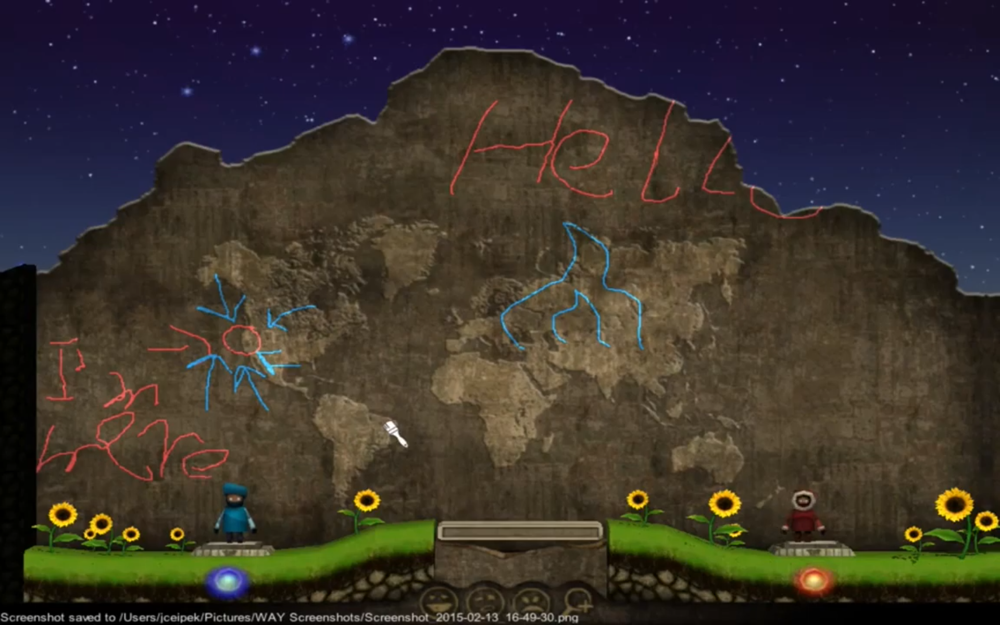

