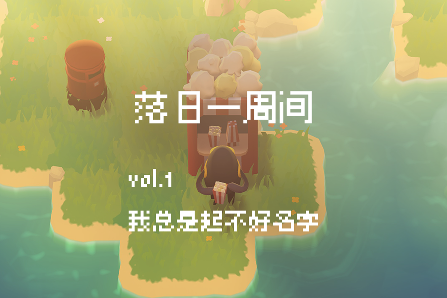
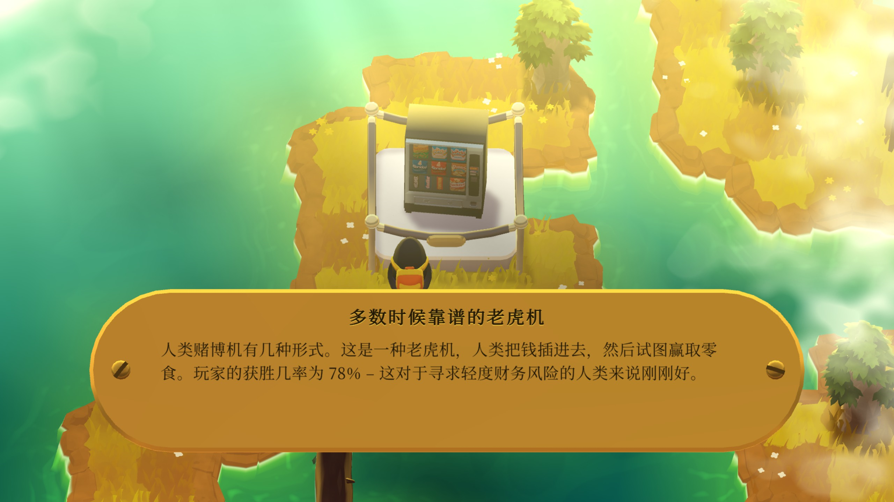
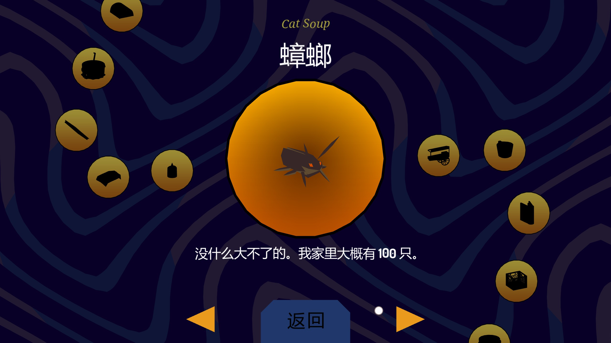
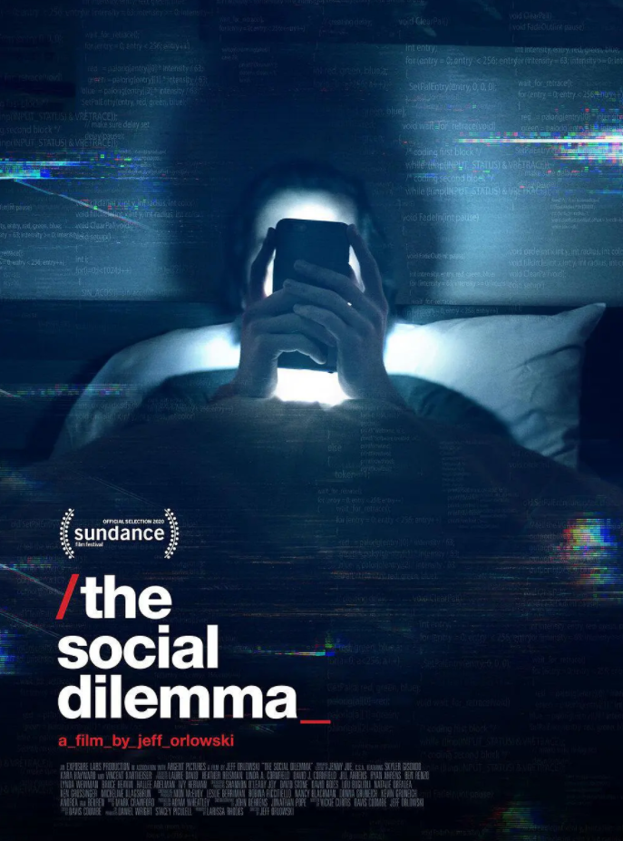
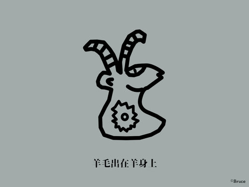
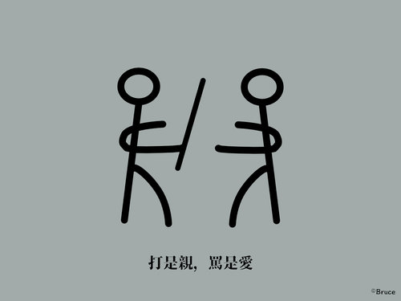

# vol.1 我总是起不好名字

  
**🐏 vol.1** [**我总是起不好名字**](https://xpaidia.com/weekly01/xpaidia.com/weekly01/) **\| 落日一周间 2020/10/12-10/18**

## 补遗

Newsletter 落日一周间 虽然名为每周更新，但是实际上是按照思考的步伐和时长进行更新的，如果最近有推进，那么就更新快点，如果没话要说，那就当这周还没有过去。

这份Newsletter的建立要感谢Bob的鼓励，从其开展的demo night分享会上如少楠等人那里获益也颇多。

在思考和尝试还有不断的更新和迭代之后，这份落日一周间的Newsletter并没有延续像是这第一期的结构和形态，而是逐渐变成记录媒体实验室「落日间」进展的日志，更多开始以专题方式处理一些更日常的、生活化的内容，而不再是时间性质的推荐。

但反倒是如此，这份内容居然比起落日间播客要更受欢迎，甚至也是大部分落日间会员支持的原因，那么既然有人想看并且有收获，那就继续做下去吧。

现在关于落日间的博客还有 xpaidia.com 的网站打算转变为Gitbook的后台，主要是考虑到阅读和追溯内容的体验，并且经过思考后发现我们并不需要member系统，所以逐渐改为gitbook + mailchimp的模式，Ghost已经更新4.0，所以这里面提到的经验和内容仅供参考。

后来与Bruce一同聊的那期播客也成了落日间最受欢迎和最出圈的播客之一，非常感谢他。

\(2021/4/12\)

## 目录

📡Newsletter / 博客建站

🍋一个游戏《怪物远征》

🗿科技伦理与游戏设计伦理

🦒一人 @Bruce Ding

🐖Encore

## 📡Newsletter / 博客建站

这个概念对大部分人来说其实并不陌生，我理解其实就是邮件订阅。

这个概念在中国比较少提，因为互联网各类知乎、微信公众号、头条这类大平台的强势介入，而中国网民也还没有西方企业养成的e-mail文化习惯（现在大家更习惯使用各类即时通讯工具），问了几个朋友，大家的邮箱大部分都属于千封未读的荒废状态。Newsletters服务十分小众。

但如开源博客工具Ghost.org谈论付费newsletter的[这篇文章](https://ghost.org/blog/how-to-create-a-newsletter/)中提到的：

> 社交媒体市场已经饱和，广告模型，垃圾信息，机器人与各类数据追踪大行其道，在这种情况下，如果你厌烦了这些平台，邮件系统可以成为一种新的内容供给方式。

邮箱newsleeter与url这类博客网站有这样几个好处：

1. 邮箱可以控制信息流的质量，是一种稳定的、来源经过认可的推送方式。
2. 可以通过邮件回件来进行更加深度的沟通，e-mail写作与日常留言评论方式不同
3. e-mail能够在pc上打开，阅读场景以及博客内容没有广告也没有更多的推送周边压力，更好地能够把注意力集中在内容上。

在今天，就像是有这样的一个光谱，对应着：

博客-Newsletter ———— 开放平台————封闭平台

* 博客-Newsletter：最左侧，能够托管在自己的服务器上，拥有独立域名，最为纯粹的内容平台。
* 开放平台：类似知乎zhihu，网站允许外链，可以被搜索引擎找到，但是内容托管在平台商那里，第三方广告商等从中获取利益
* 封闭平台：类似bilibili，微信公众号，有些不能被搜索引擎抓取，只能在内置的搜索中找到，无法外链，只能关联平台内的内容。

而封闭平台是与互联网创建的理想是背道而驰的，url网址就像是一座座岛屿，通过超链接的方式链接在一起，无法外链或许可以能够在平台内形成自己的易于管理的生态，但也很容易形成一个封闭的小世界，信息茧房。

上周在yichi的帮助下搭建了 xpaidia.com 的落日间的网站，使用的后台系统为[ghost](https://ghost.org/)，相对于其他同类的静态博客hexo来说，ghost更像是精简版的wordpress，能够有后台管理和编辑功能，可以接入各种插件：ghost可以购买整套的全年服务，也可以在自己的服务器上用他们的开源版本进行搭建。

_如果你对落日间网站的搭建缘由感兴趣可以查看：_[_落日间Sunset搭建小记_](https://xpaidia.com/sunset-blog/)_搭建的技术过程yichi记录在他的博客中了，可见_[_使用 Ghost 打造个人站点'_](https://xiaoyc.com/2020/10/15/2020-10-build-website-with-ghost/)

## 🍋一个游戏《怪物远征》

_作为一个独立游戏玩家与游戏设计师，谈论游戏不仅仅是游戏安利，而是希望能够传递一些游戏设计上的“美学”的视角给大家。_

上周有一个游戏[《怪物远征》\(Monsters Expedition\)](https://store.steampowered.com/app/1052990/_/?l=schinese) 推出。目前应该已经可以在steam，IOS的applearcade订阅服务，其他平台上玩到。

打了六个小时后我发了一条：

> 玩了六个小时，感觉绝望，不是说类似stephan sausage那样太难玩不过，而是说做得真好，自然，这要多么的细心以及能力啊，下一个这样优雅的，复杂度适中的机制又去哪里找，我感觉我做不出来。btw 周边也做得极好，无论是世界设定和类似donut county的写作，还是说类似downhill的小憩都让这样的解谜体验更加舒服与丰富，这就是慷慨与丰富。

一位即刻上的朋友写了安利介绍这个游戏，大家可以通过这篇文章来大致了解一下这个游戏[《怪兽远征》：巧夺天工的游戏设计](https://www.gcores.com/articles/129661) ，文章写得很棒，可以先大概阅读来有一个整体的认知。

有几点值得强调与扩展一下：

### **A. 游戏极其自然。**

所以作者在文章中所写的“巧夺天工”是恰当的，“天工”所以近乎没有人为制作的痕迹。

我曾经总结了一种[“发现”而非“创造”的自然的游戏设计观](https://www.zhihu.com/question/33501667/answer/1467457131)，而youtube上百万订阅的游戏设计自媒体“GMTK 游戏制作工具箱” 最近也有一集 [The Games That Designed Themselves](https://www.youtube.com/watch?v=kMDe7_YwVKI) 可以传达这种没有人工介入的痕迹。

设计行业也有类似的说法，即如果你没有感受到这个设计的存在，这才是最好的设计。

从一个实用性角度上来说或许可以理解为“[设计可用性\(Deisgn Usability\)](https://www.interaction-design.org/literature/topics/usability)”，但是作为艺术创作来说，这是一种谦逊的创作者心态，关于游戏设计的真理。可能是一种对世界，对事物潜能的发现，也可能是一种与世界的慷慨神秘丰富的相遇。\[1\]

一座岛上长着几棵树，你觉得不会想到这样简单的，人畜无害的地方有那么多的秘密与可能。

### **B. 节奏感与休憩**

游戏的音效和小设计非常重要。

当你在游戏中遇到一个小的奶茶店，你可以拿起一杯小奶茶喝上一会，或者是坐在沙滩边上晃晃脚，然后镜头缓慢拉远，并且音乐慢慢变得舒缓，这时候一种游戏的世界感与时间的触感浮现出来。

这些设计与游戏的核心机制毫无关联，它不会给你角色变强，或者是带去什么特别的道具，但是它就是存在在这个游戏世界之中，为什么？因为如果有这样一个世界，有这样一个怪物，它或许有些时候也想要坐着休息一会，听听海风，享受一下阳光。

在另一个同样我今年特别喜欢的游戏《[LonelyMountains: Downhill](https://lonelymountains.com/) 孤山速降》\[2\]中，一个竞速的自行车游戏中却没有对手，甚至你可以停留在某个休息处看看风景吹吹风，这种设计我觉得在核心紧凑的游戏设计中给了一种节奏的美感以及世界感，非常好。

### **C. 银河恶魔城解谜 \(Metroidvania Puzzles Games\) \[3\]**

银河恶魔城某种意义上可以称作一个游戏品类，因为它实际上是由两个游戏的词根组成的:任天堂的[《银河战士》\(Metroid\)](https://en.wikipedia.org/wiki/Metroid)，还有五十岚孝司的[《恶魔城》\(Castlevania\)](https://en.wikipedia.org/wiki/Castlevania)，这类游戏常常以大世界地图，可获取的升级能力同时解锁区域，非线性探索等要素来辨识，做得好的话能达到一种独特的世界整体感以及好奇心，现代独立游戏中的标杆是《空洞骑士\(Hollow Knight\)》。

但是这类游戏大部分为平台跳跃以及动作游戏。

解谜的银河恶魔城很少见，但这类作品往往都非常优美。

GMTK有一期谈论Tokitori2 [《小鸡快跑2》中的邪道路线](https://www.bilibili.com/video/BV1Px411m7RV)，我能想到的还有类似《The Witness 见证者》。

这类解谜游戏并不是可能常人认知中的，点击解密游戏——一种更武断\(arbitrary\)的，由设计师主观规定的规则想象，或是添加许多小游戏来让游戏性得以保证。这类解谜作品往往是基于某个核心机制的交互体验出发所做的扩展与浮现\(emergence\)。

你不仅仅是游戏的进度推进，经验升级来获取满足，而是通过对于这个游戏世界的规则学习来获取进步，而这些谜题仅仅是设计师引导你认识与学习规则的径路而已。所以当你获取了这种规则，你重新回到游戏世界中，你往往能「看到」某些东西，而非「看见」某些东西，这种东西是不可说的，神秘的。\[4\]

### D. 怪物的视角与清新的叙事

游戏的叙事很弱，更多是作为收集品存在的一些岛上事物的调查，这个背着书包的小怪兽的世界是一个后人类的时间，怪兽们发掘出各种人们以前遗留下来的物品，做出研究与猜测。

这种「非人」的视角给了玩家一种特别的角度去审视一些日常生活的物品，与游戏整体的体验一致：作为一个外来的解密者在探索这个世界的规则。这种叙事感有很像是[Donut County](https://store.steampowered.com/app/702670/Donut_County/)，让人忍俊不禁，无形中也消解了难题的紧张感与疲惫。

_\[1\] 这一部分我希望能够与艺术家的authorship的内容相互对比，并且勾连JonathanBlow的演讲相互理解，这里暂不展开。我希望能够准备一期关于游戏设计师JoanthanBlow的播客，其中会谈论到这些内容。_

_\[2\] 下次补一篇关于《LonelyMountains：Downhill 孤山速降》的文章_

_\[3\] 如果对银河恶魔城游戏感兴趣，可以以我的这个回答提及的游戏入手_ [_如何评价《精灵与萤火意志》\(Ori and the Will of Wisps\)？_](https://www.zhihu.com/people/xie-mo-zhe/answers?page=2)_。_

_\[4\] 我曾经尝试写过一些这一种感觉_ [_The Witness 01-10 说不可说_](https://zhuanlan.zhihu.com/p/32139452)

## 🗿科技伦理与游戏设计伦理

希望推荐一部最近很多人提到的Netflix纪录片

[监视资本主义：智能陷阱 The Social Dilemma \(2020\)](https://movie.douban.com/subject/34960008/)，在[B站](https://www.bilibili.com/video/BV1h54y1m7x8?from=search&seid=9857868409578420434)能看\[1\]。

在看过之后我希望以游戏角度谈论几个印象深的点：

* 把片中主体，即Social Media换做今天的许多免费游戏，完全成立。
* 王者荣耀的设计师可以轻易的影响到数千万的人，这点他们是有意识的吗？这一点已经正在发生了，并且以及发生了很久了。
* 很多游戏的逻辑，例如抽卡斯金纳箱，例如数值成长，点击反馈，这些逻辑都隐秘地进入我们的无意识，建立反馈系统。
* 就像是JonathanBlow在Rice University所做的演讲 打的比方所解释的，面对当你觉得无聊（Boredom）\[2\]，你就会希望尝试去创造某些东西，获取意义，但是现在唾手可得的游戏已经短路了这个过程。
* 为什么这些东西是免费的，因为在你与游戏开发商交易的时候，有第三方正在其中收钱，这个第三方会影响这个东西的信息，内容质量等，但今天的我们有些时候并不能觉察。
* 2011年后，美国的青少年抑郁率大幅上升，一代人变得更加脆弱，更少人走出去，更少人与人交流，对于情绪的掌控力愈加退化。
* 像是纪录片中所说的那样，这群人是特例与少数，因为他们并不遵照一个纯然的BusinessDriven商业驱动而行动，也不仅仅讲自己的工作与技术当作谋生的手段；而从JoanthanBlow在不同场合的分享与自嘲下也能感受到这样的人在游戏行业是少数。

谈论技术伦理与科技伦理总是涉及到很多，或许有几个可以思考的要点：

1. 科技进步观。科技是不会一直自动进步的，科技进展总是与资本、政治等相互影响的不均匀状态，甚至是会退化的，以登月为例。
2. 科技的脆弱性编程和抽象语言的健壮性，高度耦合高度抽象。\[3\]
3. 技术的毒性与解药（pharmakon）斯蒂格勒的技术思考
4. 技术，科技，新媒介的特征与对我们日常生活的影响
5. 艺术家将科技除了视作一种创作媒介和工具外，还应该注意什么？

_\[1\] 观看时做了简单的_[_笔记与关键词记录_](https://www.notion.so/The-Social-Dilemma-17079d5d8aa0467ea76a31453e618277)

_\[2\] 这个问题很大也很有意思，可以将大卫华莱士，Ian Bogost，韩炳哲都拉进来谈，留在下期。_

_\[3\]_ [_JoanthanBlow 阻止文明崩塌_](https://www.bilibili.com/video/BV15E41167JT?from=search&seid=10303188326472816258)

## 🦒一人 @Bruce Ding

_先有艺术家，然后有艺术 There is artist first, then there is art. —— BruceDing《弱艺术宣言》_

_同理，往往内容后的个人比起内容本身要有趣得多，这个栏目希望能够以某些人作为主题来谈论，因为当我们遇到某一篇有趣的文章的时候，当你眼中只有文章时，更多是一个功利性角度去使用，而如果你对其后的个人有兴趣的话，那或许驱动力是来自于一种好奇感，他人的，异质性内容的好奇。_

_所以介绍人会很有意思。_

贡布里希在《艺术的故事》一书中有一句非常脍炙人口的话：

> _没有艺术，只有艺术家_

策展人，艺术家，我的朋友BruceDing在他的《弱艺术宣言》中说得或许更好：

> _先有艺术家，然后有艺术There is artist first, then there is art_

和Bruce是在bob的灵感买家俱乐部认识的。

他是一位特别好的倾听者，你很难去完全地定义他的身份，我理解下，是一位对于科技伦理和政治有细致关怀的实践者，剧场和各类公共活动的组织者，也是一位艺术家兼策展人。

当然这些介绍只是试图归纳他身份的语词，在拉康拆穿了自我同一性的面具之后，社会角色并不代表什么，而我们也无需用这个社会扮演的角色去认识某个人。

### **从工具到科技**

从他的[少数派页面](https://sspai.com/u/hyd4bsqs/posts)中的关于笔记软件Roam Research的文章[Roam Research Report——别加入 roamcult](https://sspai.com/post/61010)可以反映他对于工具的看法

——**「做工具的主人，而不是它的信徒」**。

他对于科技的反省也是如此。在他的播客[The Topical Podcast](http://www.bruceboding.org/topical) 中，他与好友，艺术行业合作者伙伴进行了数场聊天：

[E3 不一定欢乐的宫殿&游戏的想象与现实](https://www.xiaoyuzhoufm.com/episodes/5e819404418a84a046eb98ad?s=eyJ1IjogIjVlYmNkNzkwMjFhYzg1ODA0MTJiNzcxMCJ9)

[E4 艺术、黑客与技术的社会理想](https://www.xiaoyuzhoufm.com/episodes/5e987ac0418a84a0465bdfa3?s=eyJ1IjogIjVlYmNkNzkwMjFhYzg1ODA0MTJiNzcxMCJ9)

他与艺术策展人谈论科技的脆弱性，伦理性，公共空间，谈论艺术家authorship，谈论艺术的赞赏经济与支持模式，都很有启发，就如他所引用的那句话：

> 科技给出了答案，但问题是什么？

一切科技都被过快地搬上了台面，存在的，还未存在的，投入使用的，还在研究中的，只要商业有利可图，那么科技就能给答案，但是我们为什么需要这些东西？这些东西对于我们是什么？

### **信息∠交流**

我很好奇他是如何与信息相处的：他从今年开始将其每周的阅读整合为周报，并且开始运行了一个[Telegram channel](https://t.me/s/intheflux)，名为**激流中（In the Flux）。**

他将每日所阅读思考做了分享和为一条带有技术伦理批判眼光的信息流，因为没有tg账号，无法订阅，但在PC端阅读下来，内容引人深思，角度都很独特。（不知其名字意指激浪派\(Fluxus\)，亦或是鲍里斯•格洛伊斯\(Boris Groys\)谈论互联网时代艺术命运《In the Flow》\[1\]）。

Bruce担任策展人的2019年12月7日在深圳华侨城创意文化园的展览[《欢乐宫殿》\(Fun Palace\)](http://www.bruceboding.org/projectdetail/2019/fun-palace)里，在展厅的入口处看似随意的分布着如“这里有wifi么？”“中午点什么外卖”“扫脸支付专享半价优惠”等日常生活中，与手机或科技有关的手写体字句。

就如他在[策展访谈](https://www.trueart.com/news/368942.html)中讲的：

> _虽然我们有时会被所谓的“知识”所累，但对一个问题的认识常常更来自对生活的敏感与思维的逻辑。我想，把问题具体化也许更能唤起切身的经验，而共识与共情总是交织在一起的。_

他没有那种当代艺术圈子内的智力崇拜或是习性，他总是会从一些非常平实的，具体的事物与实践出发去进行发问。

或许是先前的剧场或公共活动的经验，在与他交流的过程中你很难猜测出他的身份，他总是隐匿于人群中倾听，提出问题而不着急于表现自我与给出答案。这样的一个游离着的，包裹着的，总在探索发问的Bruce，就如他在个人网站自我介绍中写的目标那样：

> _I am inspired all the time by people who know their profession very well and are able to communicate in an informative and unpretentious way. And I wish I could also be one of them. As much as I respect the quality of deliverables, I enjoy knowing about the questions more than the answers._

### **机制的声音**

先前在BIE的公众号看到一篇文章印象深刻[《要是不想按照别人的规则生活，那就只能自己动手了》](https://mp.weixin.qq.com/s/B1qIgWc1LSE5b5VzeBz3FQ)，后来才发现Bruce正是文中所描述的「上阳台」团体的业主之一。

「上阳台」是一种尝试脱离现有艺术圈体系的合作社实践，通过共担租金、共同利用的方式，创建一个能把艺术家和社区聚集起来的场所。中药师如何在实践中发现并理解某种机制的细节和动态。

他在探寻某种独特组织和机制在资本主义影响下生存发展的可能性。就正如我与他认识所在的「灵感买家俱乐部」在探索的会员制+newsletter+共同业余线上社群的模式的尝试一样。

> “最好的状况也许就是说不出来这个模式是什么，但却还是能存在下去。这比我们清楚地知道什么有效更有意义，因为如果它能这样活下去，说明我们可能找到了以前不知道的路。”

或许当你为现在手上正做的事业/内容难以找到参考而感觉些许不安，那说明你找到了以前不知道的路。

或许当你晚上睡不着，你可以听听他做的ASMR来入睡\[2\]。

_\[1\] 《In the Flow》前言由Bruce翻译发布在 Medium_[_《The Rheology of Art 艺术的流变学》_](https://medium.com/rhythm-bruce/translation-%E7%BF%BB%E8%AF%91-the-rheology-of-art-%E8%89%BA%E6%9C%AF%E7%9A%84%E6%B5%81%E5%8F%98%E5%AD%A6-3936523e816b)_\*\*\[2\]_ [_Meridian of Fortune \| 財經二周天 \(2018\)_](http://www.bruceboding.org/workdetail/2018/meridian-of-fortune)

### Bruce Ding

tg：[IntheFlux](https://t.me/s/intheflux)

Podcast：[The Topical Podcast](http://www.bruceboding.org/topical)

blog：[BruceBoDing](http://www.bruceboding.org/)

sspai：[宽治](https://sspai.com/u/hyd4bsqs/posts)

## 🐖Encore

### **体感大事**

_对于我来说比较有印象的事，谈论这些之外的事，那就不是附近了_

* 《原神》IGN打分9分，《博德之门3》 7 分
* NExT Studios[《不思议的皇冠》](https://store.steampowered.com/app/1000010/Crown_Trick/?l=tchinese)上线
* CAC Presents的直播：[游戏、数字化人与虚拟偶像](https://mp.weixin.qq.com/s/BTOzL2mV4CrHPXQgYP2hEA)
* 手游《天涯明月刀》上线
* 上海Unfold2020艺术书展
* LOL英雄联盟S10全球总决赛中国队TES让二追三进入四强，与SN争夺决赛名额

### 

### 本周进展

午餐回答了一个知乎问题：[请帮我分析分析：为什么原神让我氪648，我会上头，买2077 298我却舍不得？](https://www.zhihu.com/question/424310125/answer/1526937092)

与yichi建立落日间网站并且搬运了部分播客《落日间》的推送到[网站](https://xpaidia.com/tag/podcast/)以及[知乎](https://www.zhihu.com/column/c_1137656202019459072)

公众号推送内容[《xpaidia.com 我们的网站上线啦》](https://mp.weixin.qq.com/s/85T0S3Jo70pzvmf5kmObqQ)

在组织原想与两位《后戏》的朋友进行[游戏是隐形的建筑](https://club.q24.io/demo-night-plus-newsletter/)的扩展分享

周日准备灵感买家俱乐部的[DemoNight](https://club.q24.io/demo-night-plus-newsletter/)进行落日间Newsletter发布

展望了可能的[落日间支持感谢计划](https://xpaidia.com/donation/)

2020.10.18

叶梓涛

