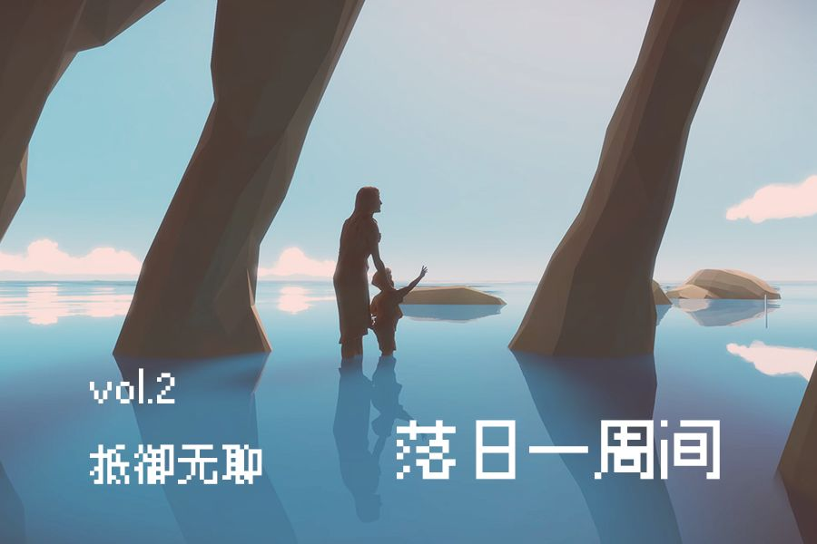
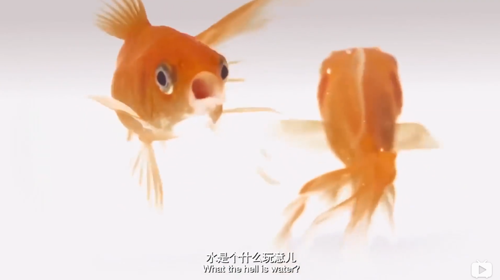

# vol.2 抵御无聊

**🐏vol 2 抵御无聊 | 落日一周间 2020/10/19-10/25**

> _如果你能够抵御无聊，那么你一定事事成功。 —— David Foster Wallace_

如果你想买一个东西必须在商店中排队，这段时间你会做些什么？

你如何打发这种无聊？

### :rofl: 无聊：一种健康系统

Boredom（无聊），无聊是什么？

游戏设计师Jonathan Blow在Rice University的演讲从这个问题谈起。

他将其作为一种健康的生理反馈 (A Healthy Response to Unproductive situations) 。

在一个理想的循环中，没有其他东西干扰的情况下，当我们觉得无聊（Boredom）时，我们就会活动起来，希望尝试去创造某些东西与他人联结，去观察世界中有趣的东西，我们会尝试改变自己的行为方式，从正常的情况中走出去，去创造，然后从中获取意义，然后再等待下一次无聊，以此循环，形成良性的回路。

### :imp: 刺激：不要停下

面对无聊，现代生活与科技的大家并不想着如何改变自我，如何改变回路，而是选择让自我想要得到的东西直接地出现在你的面前。

我们有唾手可得的刺激反馈，《荒野乱斗》从打开到开始一局游戏可能不用5s，抖音、知乎上都有刷不完的内容，只要一直下滑就足够了。

我们可以在家里等待外卖，外卖软件上自己会跳出推荐我中午吃的东西，我甚至不需要做什么选择。不再有路途与距离，一切都在被极度地压缩，一切都在尽力地减少各类使用摩擦，一切都在变得极致地平滑。

就像上篇[vol.1 我总是起不好名字 | 落日一周间](https://www.notion.so/vol-1-8ca8f4f03d06424ab992f56138d8a4ca) 中的纪录片**《监视资本主义》**中提到的那样，社交媒体开始大规模普及的2011年后，美国青少年的抑郁与自杀率大量上升，一代人变得更加脆弱。

因为我们越难越处理自己的情绪，因为手机其中的无限就像是一个情绪平稳器（Emotion Pacifier），一旦我们有一点点的无聊、不适、或者我们需求任何什么，手机里都有，马上就会有，它总是会有。

在这个用户与科技的交互之中，我们的主动性或创造性在愈发减弱，这些东西就像构成了一个巨大的婴儿茧房，在其中我们直接地索取一切我们想要的东西，或者说我们在被投喂（Feed）以及养殖。

电子游戏中令人着迷的一点就是「你的努力总是有反馈」，「你的付出总是有报偿」。这种虚构世界中的反馈依旧可以有效地愚弄我们生物大脑的多巴胺分泌。

所以这种反馈强度上的猛烈，可刷内容的无限，上手方便甚至身体可以走在意识之前的平滑，现代的互联网以及软件以一种极快地速度短路了我们的**无聊-自己改变-寻找意义-无聊**的循环。

这样的后果就是无聊再无聊，拿空虚填补空虚。我们焦虑的同时不知道自己要做什么，错失恐惧症（Fear of missing out，FOMO）、抑郁症或许都是这样无聊免疫系统失效的后果。

韩炳哲《[倦怠社会](https://book.douban.com/subject/33442259/)》中有这样的一段文字描述我们的时代病症：

> _现代晚期的功绩主体拥有过量的选择，因此没有能力建立一种密切的联结。抑郁症患者身上，一切关联被解除，包括同自身的联系。抑郁症则没有客体，因此没有明确的方向。_

缺乏主动性，缺少改变的理由与动力，习惯于被投喂，自我的无聊机制难以正常地运作，是当代人缺乏意义的原因之一。

**参考阅读：**

本周发布在腾云公众号上的旧文扩展《[游戏设计作为隐性的建筑学](https://xpaidia.com/paidia3/)》

知乎发布过的卸载系列：《[写在卸载<阴阳师>之前](https://zhuanlan.zhihu.com/p/24089486)》《[写在卸载<家国梦>之前](https://zhuanlan.zhihu.com/p/84813908)》

###

### :bust\_in\_silhouette: **** 想象：想象一种意义

所以如何是好，我们应该如何面对无聊？

首先要向各位推荐的是一部很短的毕业演讲，它的影响力仅次于乔布斯在斯坦福的那次。

演讲者是美国小说家大卫华莱士，写过《无尽的玩笑》，他在给美国大学毕业生的演讲，[**这就是水 This is Water**](https://www.bilibili.com/video/BV15x411u7GB)，这篇演讲也有出版，名为 THIS IS WATER：some thoughts, delivered on a significant occasion about living a compassionate life，中文翻译为**《**[**生命中最简单又最困难的事：日常生活就是我们的本身，既绝望又禅意**](https://book.douban.com/subject/26665498/)**》**

在演讲中，他没有提梦想，改变世界这种大词，而是一反常态地为毕业生谈论起工作后我们要面对的日复一日，年复一年的空洞日常，作为小说家，他对着这种憋屈体验的表述令人忍俊不禁。

但他说，当我们无比烦躁地在长长的结账队列中等待的时候，周遭的人在我眼中会变得无比丑恶，令人厌烦，因为我天生的默认设置就是想要达到目标，而其他阻碍我达到目标的事物都是敌人，那时周遭的人会变得无比令人厌烦。这是一种自动的反应，甚至算不上是一种选择。——这背后的隐藏的考量是，我眼前的需求和我个人的感受，应该决定世界的运转。

他希望我们明白，我们可以有某种自觉的意识(awareness)去构建，去想象周遭世界的意义，例如这个对着电话大吼大叫的女人或许这是她最糟糕的一天，她可能马上还要回去照顾她骨癌晚期的丈夫；或者那个收银员可能是在于他许久未见的老友在交谈，而不是故意拖延时间。

我们可以有意识地决定什么事情是有意义的，而什么是没有的。周遭世界很多时候被隐藏起来了，但那就是时刻围绕着我们的，隐藏在我们的生活之中且常常被我们所忽略的，真实与重要的事物，就仿佛水之于鱼一样，这就是水，这就是水。

我想起皮埃尔·阿多在**《**[**作为生活方式的哲学**](https://book.douban.com/subject/25900373/)**》**中提到的

> 蒙田对感觉自己一整天什么都没做的一个人说道：“**什么？你不是活着吗？那不仅是你职业最根本的，而且也是最光彩照人的事。**”

### :dart: 抵抗：深度工作与思考的能力

《[深度工作](https://book.douban.com/subject/27056409/)》一书认为在当前社会，深度工作的能力是有价值的，少见的且不可替换的

作者卡尔·纽波特提出了四条深度工作的准则，其中第二条便是拥抱无聊。

他引用了克利福德·纳斯（Clifford Nass）的研究：

> _一旦你的大脑习惯了随时分心，即使在你想要专注的时候，也很难摆脱这种积习。更具体地说：如果你生活中潜在的每一刻无聊时光——比如说，需要排队等5分钟或者是在餐厅坐等朋友——都是用浏览智能手机来打发，那么你的大脑就可能已经被重新编排，从某种程度上说，就像是纳斯研究所里说的“心智残疾”。这时你的大脑已经不能够胜任深度工作。_

其实使用网络或手机本身并不会减损你的能力，而实际上损耗专注能力的行为是：**稍有无聊或遭遇一点点认知上的挑战，就从低刺激、高价值的活动转向高刺激、低价值的活动，这使得你的大脑不能容忍没有新奇性的东西**。

所以我们需要重新计划好使用网络的时间，一些人使用了类似网络安息日或者是信息斋戒的方式，给自己某段时间完全地隔绝网络技术。

**「学习梭罗，在这个普遍联系的世界里有一点点的失联」**。

而对于类似商店中排队的被迫等待时间，作者认为，

> _在这个时刻，如果你正处于离线阶段，那么一定要忍耐这暂时的无聊，凭借大脑的思考度过这一段时间。静静等待并忍受无聊已经成为现代生活的一种新奇体验，从集中注意力训练的角度出发，这具有不可思议的重要价值。_

我们需要能够忍受这种因为觉得无聊而立刻就习惯性滑向一种高刺激，低价值活动的惯性，我们要学会抵抗那些千方百计想要以其新奇性来吸引走我们注意力的标题党。

这是我们在今天能够做更多有价值的深度工作的重要因素。

当然这里面需要区分的一点是，这里说的《深度工作》并不是不知疲倦的，不断积极工作自我规训的过劳，不断地追求，而是有节奏的休憩与深度思考工作的结合。

### :cat2: 玩：建构一种规则

或许你会觉得华莱士的想法真好，这种舒缓情绪地方式或许能有效抵抗现实的侵蚀。

但华莱士于2005年5月21日在Kenyon College毕业典礼的这次演讲又过了三年，饱受抑郁症困扰的他在家中上吊自杀，年仅48岁。

大卫·华莱士指明了我们可以掌控自己的思考并且赋予我们认为的事物意义，这没有问题，但或许有问题就在于，他赋予的意义的他臆想出来的，而非现实存在的意义。

他选择面对无聊的方式更像是一种心态的调整，他避免以自我为中心，然后去为一些下意识的情绪编造出虚假的解释。

游戏评论家与学者伊恩·博格斯特 (Ian Bogost)在《[玩的就是规则](https://book.douban.com/subject/30173831/)(Play Everything)》一书中试图指出他所认为大卫华莱士的问题——让生活充满乐趣并不取决于你本身（去想象一些意义与可能性），而是取决于你身外的事物以及你如何使它们为你提供乐趣。

就如他所写的：

> _编造虚假的故事自我安慰无疑是非常愚蠢的行为，在这个世界上，有无数真实的、平凡的事物等着我们去发现：商场里的地板瓷砖、吉布森公司的经典款电吉他、橘柚长满结瘤的枝干、机器生产的盒装品客薯片、一条推特文章或者十四行诗的特殊格式，以及无数本书所要探讨的平凡的事物。保持对事物的尊重和好奇心，并不要求我们了解它们的动因和内在生命—不管是橘柚的内在生命过程，还是地板瓷砖的存在意义。我们只需要投注足够的注意力，了解它们的功能及其运作方式，发掘它们表象之下的本质，然后用一种令人愉悦的、新颖的方式发挥它们的作用。_

Ian Bogost认为我们所在的时代是一个反讽的时代。

和前文提到的韩炳哲所描述的抑郁症状况类似：反讽是一种过剩状态，选择太多：可用的产品、活动、陪伴、生活与爱。要是选择错了怎么办？反讽者坚信，世界如何慷慨，充满选择和变数，因此对任何事物都要敬而远之，以防出现什么好事。

> _我们觉得任何事物都会对我们发起攻击（理由非常充分），因而心中充满恐惧，正是这种恐惧孕育了反讽。总有事情让我们感到失望或者带给我们不幸，我们感觉到不安，为了保护自己而拒绝参与。我们试图在真实世界之上创建一个缓冲区，保护我们远离这种危险。反讽就像你祖母家沙发上的塑料套：塑料套保护沙发免受假想中的意外的破坏，但同时让沙发座套失去了作用。_

反讽是一张免审判卡，一条逃跑路线，一个退出策略，我们通过对一件事物表示反讽而逃离真挚，是在「真心想做的事」与「不屑做的事」之间不得不做的选择。我不得不对其表示反讽表达出不屑一顾，我们通过反讽来与事物拉开距离并保护自己「你能做的任何事情，我都可以控制其元信息。」

就像年轻的鱼在水里游动，呼吸，却看不见水，甚至还拒绝承认水，远离水，仿佛自己能够超越水。

在这个背景下，他认为「玩」是一个路径，

「玩」是我们自己有意识进行的活动，是一种在可接受的限制条件内实践的自由，它能够将世界变成一个娱乐场，就如同他女儿，或者是我们每一个人曾经在地上走着会去踩瓷砖，数步数做的那样。

「玩」的核心并不是自由与轻蔑，而恰恰是谦恭以及对规则限制的认可，当我们将事物以及周围世界其视作一个游戏场并且充分与其发生互动的时候，我们将自己投入进某个现实的事物本身，我们以一种与平常生活所不一样的态度去对待生活中的事物。-

> _反讽和娱乐场是相对立的。热衷于反讽的人不接受现实、不创造现实，也不会采取其他方式接受世界本质上的荒诞，更不会与之互动。_

这也是他所认为的游戏的魅力，不在于能够提供奖励与可能，而是在于它们在设计上存在的结构限制为游戏的「玩」提供了无限丰富的可能性。这里的游戏并不是关于满足奖励，或技术或媒体，更不是关于艺术与设计的，而是关于谦虚、专注与关怀——要求我们尊重事物的本质，不要把我们的希望强加于事物。

面对某个事物，如果我们不知道如何欣赏，不会心怀感激，无聊感就会随之出现，

但无聊是激发快乐的密钥，是玩的邀约，无聊向我们传递了一个信息：此处有意义，被无聊所掩盖而亟需被发掘。

> 只有先体验到百无聊赖，了无意趣，你才能从中燃起令人惊奇的，充满激情的乐趣。

所以我们又回到了开头所讨论的那个**无聊-自己改变-寻找意义的**循环，

或许下次当你觉得无聊时，

**请等等！**

****

****

### 🐖Encore

**体感大事**

* LOL英雄联盟S10全球总决赛半决赛结束，SN和DWG出线

**本周进展**

1. 腾云旧文扩展：Paidia系列第3篇 《[游戏设计作为隐性的建筑学](https://xpaidia.com/paidia3/)》
2. 录制了播客《落日间》with Bruce并且剪辑发布: [E9 如果游戏是答案，那么问题是什么？](https://xpaidia.com/e9/) (这期播客已经发布！欢迎在小宇宙，荔枝FM等各大泛用性播客客户端收听)
3. 公众号阶段性整理《[五月](https://mp.weixin.qq.com/s/dhrHx48k\_vm4WCaDH1sH7w)》
4. 收获了Xinwang，少楠，bob，xichen，小河几位内测支持者！收到了大勇的赠书，感谢！

叶梓涛

2020.10.26
