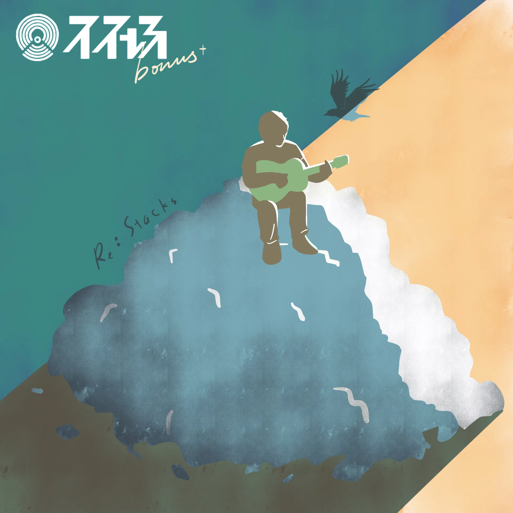
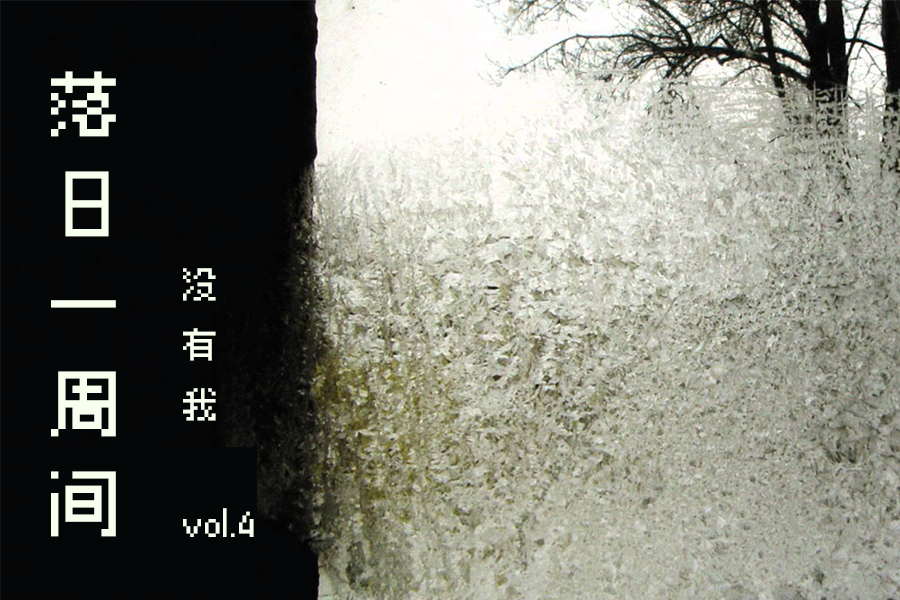

# vol.4 没有我 |《不在场》

**🐏vol 4 2020/11/02-11/11 没有我 | 《不在场》**

这期想和大家谈谈播客，并推荐播客《[不在场](http://buzaichang.xyz)》。

## 声音，身体与信息

声音的介质非常具有身体性，这意味它并非机械的。

一句说出来的话和一句话的字面本身有着很大的差异，同一句话在不同人的口中会有完全不同地传达方式。谈论的环境，气氛，口音，情感，语音语调，这些东西都充满着无限的细节，是无法无损耗地还原成信息的。

播客是可以倍速的，但是其信息密度和传达的速率依旧有限，相较于视频或文字阅读，信息效率很低。但恰恰是因此，播客成为陪伴性的，我们能够在例如通勤这样的特别的场景中去使用它。

非直接的声音介质也带来不易传播的结果，几天前听的一期《[落选沙龙](https://www.xiaoyuzhoufm.com/episodes/5fa3972083c34e85ddf02f8e?s=eyJ1IjogIjVlYmNkNzkwMjFhYzg1ODA0MTJiNzcxMCJ9)》，嘉宾反而谈到播客的不易传播性带来的好处，如更能达成完整表达，更不容易被断章取义，而愿意听音频的受众更有耐心等。

播客在降噪耳机的帮助下，在人与人愈发冷漠分割的社会以及都市白领上班焦躁routine中重建了一个温暖舒适的空间，以某种极切近，极私密的方式介入到了现代生活的个人经验中。

从这个角度来说，播客限定的信息传输效率或许恰好是现代人反知识焦虑反FOMO的一种方式，是一种Slow Media，它并非获取干货的工具与手段，而是共情，抚慰，倾听与交流的空间。

> 海量信息很大程度上增加了世界的熵，即世界的噪声量。思考需要安静，是在安静中的一种探险。

韩炳哲在《[爱欲之死](https://book.douban.com/subject/30389924/)》中论及想象力的丧失时是这样说的。

> 如今社会的海量信息，随着时间推移，事件的发生，信息在不断堆叠，无限地增长。但是这种「肯定性」的信息与需要「否定性」的思考是不同的，思考需要安静，思考是在安静中的一种探险。

所以重轻在第一季《不在场》的最后的一期《[Bonus 关于：堆](http://buzaichang.xyz/episodes/Bonus-re-stacks)》中谈及做这档实验性节目的初心，他希望能够创造一个特别的场景来谈论一些不好聊的东西，这些东西不能作为一个标题党去与其他的头条去竞争，也难打上干货的标签成为知识见解堆砌的金字塔的。

它什么都不是，但它又很动人，很重要。

在听播客时，或者说至少在听《不在场》的时候，

你甚至可以闭上双眼。

> 闭上眼，在事物的旁边逗留，它们的内在乐音才会被听到。巴特这样援引卡夫卡：“人们对物品进行拍照，是为了将它们的意义夺走。我的故事某种程度上是为了让人闭上眼睛。” 当今时代的各种超高清图像的画质已经使人无法闭上眼睛。快速更迭的图像让人无暇他顾。闭上眼睛这个动作是否定性的，是不被今天的加速度社会的肯定性和积极性所容忍的。由于被迫需要时刻保持警觉，闭眼成为一件困难的事，工作主体的神经系统也因而精疲力竭。修身养性也是一种生命的闭环形式。闭上眼睛恰恰是生命行至终点的可见性标志。在僻静的生命中，感知也变得完整。 《爱欲之死》

只留下了耳朵，那么在黑暗中，想象力才会苏醒。

## 不在场

《不在场》这点做得很好。

按照主理人留下的话来说，是**「对无用之事的obsession」**。

我们谈论obsession的时，我们谈论的是激情，爱欲，而不是对某物的欲望，恰恰因其无用但又散发出动人光彩，我们才会不计功利地去追寻它们。

《不在场》是一个谈论音乐的节目。

其中涉及到了许多单曲，如日本近年忽然在网上病毒式传播的City-pop，竹内玛莉亚的《Plastic Love》（[EP1 『塑料爱』](http://buzaichang.xyz/episodes/ep1-plastic-love)），被无数人翻唱的《I Can't Make You Love Me》（[EP3 "I Can't Make You Love Me"](http://buzaichang.xyz/episodes/ep3-i-cant-make-you-love-me)），我们所有人都会唱但是唱不好的生日快乐歌（[EP7 生日快乐](http://buzaichang.xyz/episodes/happy-birthday)）,在《头号玩家》中使用的a-ha的这首高亢的《Take on Me》（[EP9 带上我](http://buzaichang.xyz/episodes/take-on-me)）,当然还包括着谈论播客缘起的最后一期，在日出升起的雾气中演唱的《Re：Stack》（[Bonus 关于：堆](http://buzaichang.xyz/episodes/Bonus-re-stacks)）。

在谈论每一首曲子时，重轻总会从故事和背景说起，这使得这些歌不再是单一扁平的声音，而充满了历史厚度和当事者创作过程的个人状态。例如他谈及的四位好莱坞女神的悲伤故事（[EP8 四个女人](http://buzaichang.xyz/episodes/four-women)），还有Bon Iver的创作《For Emma, Forever Ago》在那件小木屋中达到的独特的精神状态（[EP10 冬天好](http://buzaichang.xyz/episodes/Bon-Iver)）。

除开传统以旋律为主的我们熟悉的流行音乐外，对于某些有欣赏门槛的音乐，重轻非常耐心地从具体的制作历史思路的变化上说起：

例如爵士乐那种和而不同，暗流汹涌的音乐是如何从这样一个最小存在单元fake book中召唤出来的（《[EP5 假书真书](http://buzaichang.xyz/episodes/fake-book-real-book)》）；而在谈论电子音乐先驱Aphex Twin《[EP4 四月十四](http://buzaichang.xyz/episodes/ep4-avril-14th)》，他特意用一个音乐实验来向听众说明电子音乐时代后的合成器和各种变化的音乐和声音制作思路，而这点在《[EP6 九种渐变](http://buzaichang.xyz/episodes/morphing)》中给予了深化。

除了知识性的基础补充和历时性的回顾外，更重要的还是他在其中对于音乐自身语言的结构性分析以及拆分与重组，其中略微突兀的《[EP2 吉他死了么？](http://buzaichang.xyz/episodes/ep2-is-guitar-dead)》或许回应了他业余音乐制作爱好者的身份，并且从头贯穿到尾的他在每期播客中做的音乐分轨与即兴演示，有某种鼓励式的邀约，就像其在[Bilibili](https://space.bilibili.com/17180401/)上关于合成器和音乐制作丰富的教学视频一样，他鼓励我们上手去接触声音，玩弄声音，就如同Aphex Twin在对电子器械的把玩中找到了一种新的音乐语言，而作为欣赏者的我们，也才能在这种过程中由品味而上升为一种富有激情的obsession。

与如同Bon Iver的For Emma, Forever Ago这张专辑的最后的Re:Stack的同名的播客最后一期《[Bonus 关于：堆](http://buzaichang.xyz/episodes/Bonus-re-stacks)》他说明了自己做这档播客的初衷：而这也很清楚地暗示了他在以做一张专辑的方式在做这样一档播客。

如他所说：

> 《不在场》所期待的，它不希望我们从中带走什么知识点takeaway，而希望只有体验和感受本身.

现代人缺的不是好作品，而是进入这些作品的机会，想象力触碰的方向，听觉，视觉，体验与感受的能力，就像是玩开放世界游戏的主播与我们的差别，面对同一件事物，他们能够为我们呈现出一条打开的缝隙，这就是艺术批评的目的。

> 「让感觉复苏吧！希望这个不在场，最终可以回到在场」

《不在场》作为播客节目，其标题、谈论的对象（音乐/声音）与方式、这些都与前文谈论的播客媒介的身体性达到了统一。

## 没有我

「不在场」还有另外一层，即「没有我」。

当我们谈论obsession的时候，指的是一种迷恋，是一种爱。

「爱」是如同野猪将它的獠牙刺进美少年阿多尼斯的身体之中，如同法语中Je tombe amoureux与英文的Fall in love中的跌倒之意，那种冲击性地爱情是自我的坠落与消失，即「我无法保持住自我」：

> 在费奇诺看来，爱情是“所有瘟疫中最严重的一种”，它能直接导致“变形”，让一个人抛弃他的本性，教他“容纳陌生的东西”。

而「没有了/失去了我」与「找回了我」的辩证法贯穿了《不在场》始终。

开篇E1竹内玛莉亚和日本那个年代的创作便是日本这群音乐人完全舍弃自我而狂热地迷恋模仿西方风格的产物，但他们却最终也没有丢掉自己，华丽的，昂扬的City-pop风格广为流传。

EP4 四月十四谈论忘我的怪人Aphex Twin对于声音和电子器械本身的玩弄迷恋，EP5 假书真书中谈论作为乐手与乐手交流与表演并且在每次的创作中重新召唤的过程，连通E7对于生日快乐歌以及版权的讨论，共同的母题便是，音乐就是应当被我们所把玩，演奏，哼唱，分享，在一遍遍重复和改造中流传而复活的事物，而非某人占有其创作权的过程。

EP9讲述了华纳音乐请了两位不同的制作人两次发行《Take On Me》的经历，其中一位试图以自己的方式，彰显自己制作人的功绩和自我而将整首音乐推翻重来，最后让作品变得黯淡无光，而好在有另一位甘愿放下自己，抓住了原曲高亢清亮音色的特点，只在一些地方做了调整，最终这首歌才历尽曲折，所幸没被埋没。

而最后的一期E10我们来到了终点，或者说回到了这个播客的起点，Bon Iver在临近放弃和毁灭的那个冬天后退到威斯康辛州的那个森林小木屋中，

> _这是一个真正放弃了的人，他放下了社会对自己以及他自己对自己的任何期待。这里令人好奇甚至神往的，不是闲暇也不是无聊，而是允许。允许自己认输，允许自己成为一个失败者。一个认命了的人，无条件的句号。_

就是在这种真正地「无事可做」中与「无我」，Bon Iver 开始了发现或者是重建。

这就回应重轻在EP1中提到的，我们常常会有一种自我保护的情结，当我们面对一些作品的时候，我们会下意识地与之抗衡，我们总是想要追求一种跳出的状态，说「这东西没什么了不起的」，「那也不过如此」，对其保持一定的距离，这也是[vol.2 抵御无聊 | 落日一周间](https://docs.xpaidia.com/newsletter/vol2) 中所说的「反讽」——我们感觉到不安，为了保护自己而拒绝参与。

但其实这种自我对某件事情的投入与迷恋带来的并不是自身的破裂，反而是在谦逊的态度中放下了自己，去尊重与发现事物本身，在这个过程中，自我开始重新塑造，并且以一种新的形式降临。

> 爱情对于马尔西里奥·费奇诺而言是“在他者中的死亡”：“我爱你，而你也爱我，我在你中找到我，而你也想念我，我将自己舍弃，进入你，而你接受我，于是我找回了自己。” 费奇诺认为，爱着的人在被爱者身上忘却自己，而这种忘却能帮助自己找回自己，重新拥有自己，这就是所谓“他者的馈赠”。我不再维护自己的地位，而是在他者中、为他者失去了自我，同时，他者又帮助重塑了自我：“统治者通过统治他人确立强权；求爱者通过他者重新找回自我。爱情中的双方必须首先从自我中走出来，走进对方，让自我在对方中死去才能重生。”

## 都是「我」

如果按照以上所想的播客暗线谈论的话，那我们应该跳过重轻老师这个主理人的身份和相关信息，因为就正如整季播客所谈论的，他也不希望其中有他的「我」。这个角度去说，这篇文章是对其的冒犯，毕竟我在试图去谈论一件或许不希望以言语被谈论和固定下来的事物。

在评论区每当谈起重轻自己的时候，他总会有意避开，这让我更加钦佩他，并不是因为他特别厉害什么都会或者声音好听，而是因为他愿意与我们分享他的视域，他并不是一个人，而是千万股水汇聚为一条河流的中转站，他站在河流的交汇口，给我们指向他背后的那些直入云霄的山岗与俊朗的明月——那些伟大的音乐作品。

所以从来就没有什么稳固的「我」，无论是从佛教还是从拉康的意义上说。

现代人过多的强调「我」的能力，「我」的知识储备，「我」的财富与资产，那么就误把自我当作一个有强烈内在本质与意义的事物，将自我表达视作一种具有独特原创性，绝新的实践，那么就会引起自我与他人之间的间隔和竞争心态，将知识视作宝藏予以占有，以量来算计差异。

但这往往忽略了，「我」的意义并不在自我，甚至「我」都不是一个容器，向内只是一个空洞。我们应当将自我看作一个**通道**，是那些透过「我」的视角所看到世界的模样，「我」所喜爱和着迷的事物，我思考和清理世界之熵后所显露出的那些东西，共同构成了「我」。

当你在分享那些没有你的，但确是你所喜爱的事物时，那也这是你。

我读过的最好的文学批评《[最接近生活的事物](https://book.douban.com/subject/27073501/)》的第三章中，詹姆斯·伍德谈论文学批评视野一致性与书写一致性的时引用了弗吉尼亚·伍尔芙为艺术史家罗杰·弗莱所写的传记，她描述她在伦敦听这位身穿晚礼服，手执教鞭的批评家公开演讲的场景：

> _所有的一切，他在他的书里做过一遍又一遍，但是这里出现了一个不同之处。当下一张幻灯片滑过薄片时，他停顿了一下。他再一次注视着那张图片。然后在一瞬间，他找到了他要的那个词，他不假思索地加上了他刚刚看到的那个词，仿佛是头一回看见。也许，那就是他吸引观众的秘诀所在。_
>
> _他们能看到情感在撞击，在成形；他能让感知的那个时刻暴露在公众面前。因此，随着停顿和情感迸发，精神现实的世界在一张又一张幻灯片中浮现——在普桑，在夏尔丹、在伦勃朗、在塞尚——在高低不平处，一切都连接在一起，所有的都融入到整体中，投射在女王大厅的巨大屏幕上。最后，一直透过眼镜看的演讲者停了下来。指着塞尚最新的一幅作品时，他感到困惑的了。他摇了摇头，教鞭立在地上。他说，它远远超出了他能力的范围内能做的任何分析。所以他没有说“下一张”，而是鞠了个躬，观众们都散去，走出大厅来到了朗豪坊。_
>
> _两个小时里，他们一直在观看画像。但是他们看的其中一张，演讲者本人并没有意识到——是一个男人投射在屏幕上的轮廓，一个穿着晚礼服、停下思考问题然后举起教鞭指示的苦行者。这一幅图像会跟其余的一起留在记忆里，这一幅粗糙的素描会在未来的岁月里给观众中的许多人充当一位伟大批评家的画像，一个有着丰富的情感但又苛求正直的人，当理智无法再深入时，他就突然叫停。但是，他自己相信并且也说服了其他人相信，他所看到的东西确实在那里。_

批评家的职责并不在于玩弄辞藻，将作品变得模糊不清，批评家要的是「我会努力使你如我一般看待文本」，召唤一种清晰地且敏感的感受力。

伍德说，当一位批评家或者是音乐家在「引述」其他作者的文本的时候，他成为的不是引述者，而是表演者，不仅是评论家，而且是艺术家兼评论家。

他无法「引述」，他只能重新创造。

他在重新创造。

[http://buzaichang.xyz/](http://buzaichang.xyz) 《不在场》的网站

叶梓涛

2020.11.11

## :pig2: 落日间进展

1. 录制并剪辑发布第11期的「落日间」，与低科技艺术实验室的郑达老师聊天，讨论他尘封的，关于严肃游戏的经验和回忆，可见 [E11 生成的线索：游戏的自在之语 | 落日间 x 低科技](https://docs.xpaidia.com/update/podcast/e11)
2. 录制关于祛魅3A游戏的一期，但还没有时间对音频材料进行处理。
3. 参加DiGRA China的线上会议
