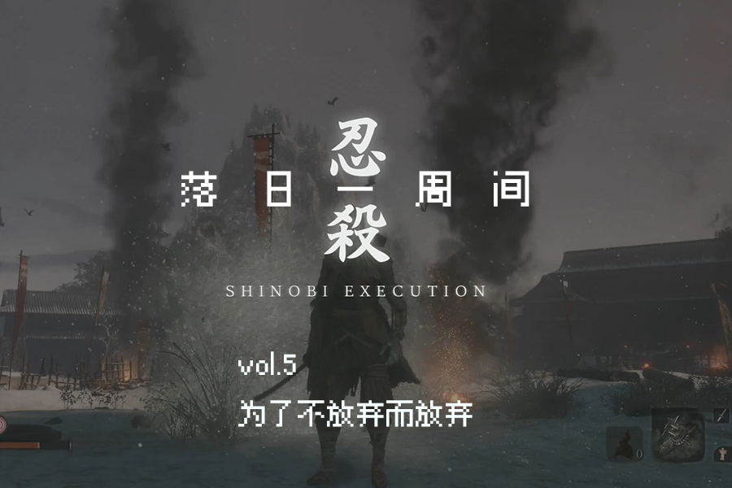

# vol.5 为了不放弃而放弃

**🐏vol.5 为了不放弃而放弃 2020/11/12-12/08**

不好意思，《落日一周间》一段时间没有更新。

本以为每周有那么多可以谈论的事物，写一篇newsletter不在话下，但是大概是因为忙，或说只是焦躁不安，这件事情变成了一件需要很高心智成本而我又不愿意糊弄过去的事，所以就只能拖到我觉得足够写作的状态下时才能开始。

恰好这篇Newsletter回应的正是我的这一种焦虑感。

## 放弃那些只是「看上去不错的东西」

我们在互联网和各类工具应用信息教程可能性都高度丰富的今天，我们每天在网上收集各种东西，我们生怕错过什么（FOMO，错失恐惧症），我们觉得似乎一切都非常有用，我们觉得我需要追求一切我认为我觉得好的东西，将一切放入收藏夹的仓鼠病。

我们可能常常觉得：“虽然这件事情可能没有什么用，但是这件事情也没什么坏处”。

机会成本是一种选择或决策的代价，企业从事某项经营活动而放弃另一项经营活动的机会。从这个概念出发，当我们做一件事情的时候，我们同时在失去做其他事情的时间。

在《[深度工作](https://book.douban.com/subject/27056409/)》一书中谈论到一种选择工具的原则。

1. 首先明确个人职业和私人生活中主要的高层次目标。
2. 列出为实现每一个目标而需要的两到三个重要活动。这些活动应该足够明确，保证你能清楚地了解如何执行。另一方面，目标应该比较宏观，确保目标的实现不是取决于某一时间点的结果。例如，“做更好的研究”太宏观了，而“在接下来的会议前及时完成关于广播降低限制的论文”又太具体了（这是一个某一时间点的结果）。在此背景下，一项好的活动应该是这样的：“定期阅读并理解我所在领域的最前沿成果。”
3. 这一策略的下一步就是思考你当前正在使用的网络工具，对于每一种工具，用你之前确定的关键活动来审查，认真思考使用此工具对你平时顺利地参与该活动是有实质的积极影响、实质的消极影响还是无影响。
4. 现在最重要的决断时刻来了：只有你认为一种工具会带来实质的积极影响并且这些积极影响大于消极影响后，才继续使用这种工具。

打个比方：关于以写出好作品为高层次目标的路易斯来说：问题不是推特能否给路易斯带来可以看得见的益处，而是使用推特是否可以**显著积极地影响到他职业生涯中最重要的活动。**因为他的关注点在于尽可能写出最好的作品，而不是通过作者营销来增加几本的销量。

这样的思路同样可以放在衡量其他事物上，我们买一件东西并不是因为这件东西对人有好处，或是是否优惠，是否实惠，而是我们付出这些金钱是否能够带来符合我们目的的价值。

## 放弃那些不适合的自我

在前些日子火热的陈春成的短篇小说集《[夜晚的潜水艇](https://book.douban.com/subject/35005045/)》中《裁云记》写到一个洞穴的隐喻：

> 这些年我像在洞穴中行走。我站在分岔处，前方有许多通道，每一条都深不见底。随手扔进一颗石子，数十年后仍传来回声。我知道随便选一个洞口进去，沿途都有奇妙的钟乳和璀璨的结晶，每一条通道都无穷无尽，引人着魔。但我就是下不了决心去选择。总是走了一段，怕再走就回不了头了，又毕恭毕敬地退出来。我不知道哪个最适合我，又无法逐一尝试。选择其一，就意味着放弃了无穷减一种可能性。

这里的洞穴就像那些值得人沉迷一生的事物，我们在外面兜兜转转，下不去决心，这也映照出一种现代社会令人恐惧的丰富性，甚至是绝对的不可把握性。

有些人常常羡慕那些从小就明白自己要做什么的人，如同钢琴之于郎朗，一种强烈的，宿命般的冲击与神秘力量在某些坚定的人身上降临，但大部分人可能并不一定有那种的幸运。

很多人在这个迷茫的社会中寻找自我，

但真实的自我并不是早就存在的，也不是稳定而绝对的：

@动机在杭州老师[《了不起的我》](https://book.douban.com/subject/34836531/)一书中提到了一个与真实自我的假设相对，斯坦福大学认知心理学家黑兹尔·马库斯（ Hazel Markus）提出了一个关于可能的自我的理论。

这个理论认为，与所谓的真实自我不同，每个人身上都存在很多可能的自我。这些可能的自我，有些是我们梦寐以求的理想化的自我，有些则是我们非常厌恶的、不愿意去扮演的自我。这些不同的可能自我，在我们内心展开激烈的竞争。在你迷茫和犹豫的当口，它们好像在对着你喊：选我选我。**如果你选了其中的一个自我，那其他自我就会不断衰退。**

如果你不知道怎么选，但或许可以从放弃那些不适合的开始。

有两期播客或许能有所映照：

在很早一期的《无业游民》中[无业游民003. 世上无难事，只要肯放弃](https://theue.me/episode/give-up/)，其中有位从本科读到博士后的嘉宾，学术通关成功入职学术体制内后，因为受不了体制内的一些事而离开的故事让我印象深刻，其中友人杨静也谈到她放弃博士之路的过程。只记得听完之后感觉轻松了不少。播客中有一句话令我印象深刻，把放弃变为选择。

而在[随机波动029. 如果弈棋如登山，除了顶点还能想象什么？](https://www.stovol.club/029) 中，围棋国手李喆从下棋到逐渐退出棋坛而转为追求其他的事物，他分享了他对下围棋，胜负和追求巅峰的意义的思考。

对于游戏规则的质疑以及逃出，这样的循环在生命中需要重复不断地进行。

动机老师笔下的“自我转变的过渡期”就是一个新的自我与旧的自我在一起共存、竞争，逼迫我们做出选择的时期。

我们会不断和自我讨价还价，拖延做选择的时间。既是因为放弃旧的自我会带来损失，更是因为我们对未来不确定性的恐惧。直到某个契机表明我们不能再逃避选择，而让真正地转变来临。而就在这个转变之后，我们感受到了踏实，在这踏实的感觉中，有我们真正想要成为的自己。

## 放弃是为了更好的留出空间

《了不起的我》第四章部分谈到转变的时候提到了美国作家威廉·布瑞奇的《转变之书》，转变需要经历：结束——迷茫——重生，三个阶段。

> 为什么转变是从结束开始的？为什么我们不能在人生中不断做加法，而偏要先做减法呢？以前我并不理解这个问题，直到我自己经历了很多转变，从一个体制内的大学老师，变成了一个自由执业的心理咨询师，我才慢慢理解：这是因为自我的发展是需要空间的。就像装修一间房子，需要先把旧家具搬出去，才能把新家具搬进来。同样，我们只有先结束、先放弃，才能为新的发展腾出空间。

我就想起我有时候会逼迫自己不断地删除自己正在玩的游戏，因为需要为其他更多的游戏腾出空间，才不会停滞不前。

而放到人生选择上亦如此，我可以对事物充满好奇，对世界的可能性充满迷醉，对丰富的他人充满羡慕，独立游戏人可以想要学全部的东西，但是一定不能成为负担，成为一种时间稀缺下的知识焦虑，为了给自己留出可能性而迟迟不做出决断与放弃实际上是在浪费时间与逃避。

最近听《[一个硬核的世界游荡者是如何养成的](https://www.xiaoyuzhoufm.com/episode/5fc63cbadee9c1e16d88ffde?s=eyJ1IjogIjVlYmNkNzkwMjFhYzg1ODA0MTJiNzcxMCJ9)》以及豆瓣的采访：《[丁红：一篇“不消费主义”践行者的采访](https://www.douban.com/group/topic/200789130/)》的主角Mantis在27岁丢掉了自己大部分的东西，六年不租房，这样的生活并没有让她变得干瘪，反而丰富而轻盈。这与断舍离的概念也有相似的地方，因为东西少，所以才能让每件物品绽放其光彩，也才有时间对每件物品留出心思。

## 以带宽而非时间的思路来思考

同样的思路出现在行为经济学之中。

因为我最近穷且忙，所以当我看到畅销书《稀缺》的副标题：我们是如何陷入贫穷与忙碌的时候就好像被戳中了，《[稀缺](https://book.douban.com/subject/26178426/)》全书似乎在用一个怪怪的视角谈论着我们似乎早已知道的道理。

但直到我看到结尾的一段的时候突然好像明白了一些东西：

> 人们总是会忽略带宽的重要性。
>
> 带宽（bandwidth）是心智的容量，包括认知能力和执行控制力，文中认为稀缺会降低所有这些带宽的容量并且使我们缺乏洞察力和前瞻性，还会减少我们的执行控制力。
>
> 当你事务繁忙，需要决定接下来要做哪件事情时，就会想到你能利用的时间，这件事需要花多少时间，但很少会想到自己的带宽。你可能会说：“我只有半个小时，来把这件小事做了吧。” 而你很少会说：“我的带宽有限，来把这件轻松就能完成的事情做了吧。”当然，有时你意识不到，但也做到了这一点，比如你在一项任务上怎么努力都停滞不前时，会换一件事情来做。
>
> 但这不过意味着，你是为已经稀缺的带宽又增加了一份负担。

《稀缺》中谈论到穷人贫穷并不是因为他们无能，而是因为他们被金钱的稀缺心态压得喘不过气，而没有足够的带宽去学习新的东西，因为任何技能的习得，社交技巧消费习惯都需要带宽，如果没有带宽将很难去做和掌握这些。

而世界上的那些好的东西，有益处的东西太多了，在没有带宽限制的世界中，所有知识都是值得学习，一切事物都有其美好之处。但现实世界，并不是那样。当我们觉得难以做好手上的某一件事的时候，忙碌得停不下来的时候并不是要陷入管窥（tunnelling）的心态，只看到眼前的急迫，而借用（borrowing）之后的时间，也不是去选择多线并行同时做其他事情。

要拒绝过多的事物，为自己留出余闲（slack）**。**

这或许也是为何《[及格家宣言](https://book.douban.com/subject/35149254/)》（The Underachiever's Manifesto）的副标题同样吸引人的缘故了吧：让一事无成的你也能心安理得快乐生活的指南。但它并不是让你真正的一事无成，而是让你在一种心安理得和闲庭信步的生活节奏里找到重要的东西。

这是一种说不的能力。

今天并非有人赶着我们走，而是在社会的压力下我们自己推着自己，自己压迫着自己，汲汲于自我的规训，我们休息不下来，如果全世界都在学，我们总得找点什么事情学，这也是韩炳哲唠唠叨叨地在《[暴力拓扑学](https://book.douban.com/subject/34841552/)》书中谈论的一种新型的暴力：自我规训，积极的过劳，缺乏他者的现代，在无限的网络空间中追逐他者的注意，自我曝光和自我剥削成为一体。

在《[不可理论33：试论无能](https://www.bukelilun.com/33)》，其中宝婷讲述了她阅读理论的过程中某一时间的汇通，将阿甘本以及韩炳哲还有其老师廖朝阳的论述联系到了一起：**真正的能力基于无法掌握、无法占有、无法认清的无能，向他者的敞开基于空白自我以及对他者的无能为力**。

《[倦怠社会](https://book.douban.com/subject/33442259/)》中这样写道：

> 这种消极的能力有别于单纯的无能，即没有能力做某事。无能仅仅是积极能力的反面。它本身也是积极的，由于它和某件事物联结在一起，即它无法完成某事。消极的能力则超越了这种束缚于某件事物的积极性。它是一种不去做某事的能力。如果一个人缺少了消极的能力，那种不去感受某物的能力，而只有积极的能力，即感受的能力，那么感官将无助地面对汹涌而至、不由自主的刺激和冲动。“精神性”（Geistigkeit）也完全不可能存在。如果一个人只拥有去做某事的能力，缺少不做某事的能力，那么他将陷入致命的过度活跃之中。如果一个人只有去思考的能力，那么思想将迷失在一系列无止境的对象中。

或许一句很饶舌废话可以概括这篇没有图片的文章:

**放弃应该放弃的，是为了不放弃那些不想放弃的。**

## 🐖 本段时间进展

2020/11/12-12/08

参加CiGADA活动中国独立游戏开发者大会

录制整理并发布播客《落日间E12：「祛魅」3A》

录制整理并发布播客《落日间E13：游戏能否改变世界：现实主义游戏与一次社会实验》

知乎写作《[在最难熬的时候，哪些游戏给了你力量？](https://www.zhihu.com/question/432724835/answer/1607439594)》以及《[身为游戏从业者，玩游戏时你们有过哪些“职业病”？](https://www.zhihu.com/question/432724879/answer/1607419641)》，后者被游戏葡萄[转发](https://mp.weixin.qq.com/s/RZqaHuiaGHM5WCrAWyrbLw)

参加华东师范大学 “游戏致/至死”——[游戏与哲学一日谈](https://www.thepaper.cn/newsDetail_forward_10201281) 《游戏的高度“严肃性”》

「落日间」以游戏文化工作室品牌身份参与到山中天艺术中心的《[乌力波60周年：从自己制造的迷宫中逃出去](https://mp.weixin.qq.com/s/rXtcD1uB2rMz640-OkCxnQ)》，制作了一个填字小游戏《[寻找乌力波](https://xpaidia.com/lab/game/oulipo/)》，后会有专门介绍。

整理并尝试写作长文《中国当代艺术场域的电子游戏》

叶梓涛

2020.12.08

