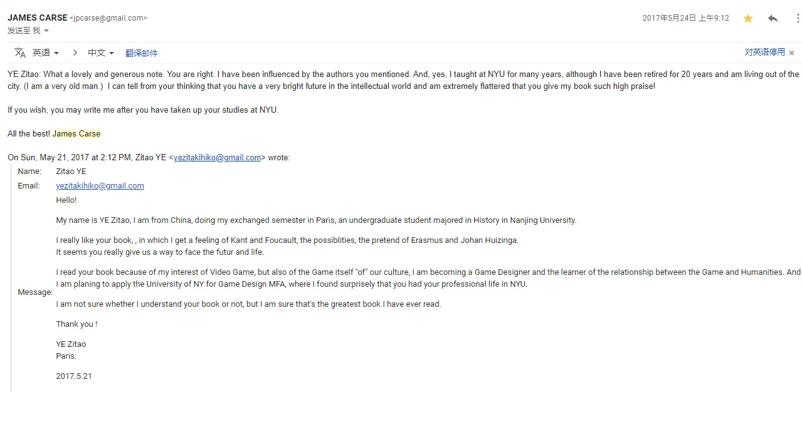

# vol.7 穿好衣服

从上一封Newsletter到现在，我建立了我最基本的「穿衣自觉」，同时思考「落日间」品牌的事。

然后我发觉，这是同一件事。

####

### 1 祛魅

首先要对「品牌」一事祛魅。

作为文科生，我潜意识中隐含着对消费主义的批判：品牌、营销，这样词语讲出来似乎下意识就是要嗤之以鼻。

但是品牌或营销并非糟糕的东西。品牌不是涉及到内容质量，而单单仅涉及传达。

我们所讨厌的，是那些以糟糕的手段、用广告整日充斥和打扰我们的生活，是让我们被欺骗，买下名不副实的产品。

但其实品牌仅仅是手段，并且它无处不在：

前段时间和朋友聊天，他有个比喻我觉得挺好：品牌、营销和商业并不是全部，而是你有一个东西了，然后把它递出去的过程。

> 因为服装风格本身并不是最终目的，相反，它是一扇大门，通往你所追求的改变。通过改变服装来改变自己的生活是可能的。

####

### 2 意义 → 价值

文科生的批判其实无非是对「有意义之物」与现实中「有商业价值之物」的错位的批判。

我也会开始疑惑这个世界上有意义的东西 / 有价值的东西 / 有商业价值的东西，这些似乎不是一件事？

那是不是那些有意义的东西就都只能是与「现实的苟且」对应的「诗和远方」

在面对现实的时候只能全部垮台？而理想与现实一定是撕裂的吗？

在一本试图通过荣格原型理论（Archetype）来描述品牌分类的老书《很久很久以前》（感谢即友@Erjie\_的推荐），是我少数有看到的，愿意站在人文的高地上，但它却没有去批判，而是正面地论述在这个灵韵消失，宗教祛魅，商品和消费成主流的世界中如何以建构地商业的方式去改变世界和认知世界的事物，这对常年浸泡在消费主义和商品拜物教批判的我来说很有启发。

其实如今的世界甚至已经开始我们都开始「消费消费主义」，我想，比起以批判商品拜物教来获取道德高地获取文化资源玩有限游戏，正确认知到现状然后思考在这规则中能做点什么才是更有意义的。

> 忽略那些热衷玩身份游戏的人。他们是依靠攻击玩创造财富游戏的人来获得身份。 —— Naval Ravikant

在这本书中：意义与价值被联系起来了，书中的「原型理论」就是把意义和产品联系在一起并且获取商业成功。

意义的产品化，产品的意义化，是一个双向过程。

商业价值和意义一点没有冲突，相反，最好的品牌一定要富于意义，一定能够给予顾客予意义，而最好的意义的表现也常会有一个具象的产品的形体。

商业并不等于依靠减价和成本缩减来把竞品淹死，还有哪些能够创造出属于自己的独特的体验和意义来获取合适的品牌溢价的企业（诸如创新之于苹果，灵感之于喜茶）：而相对应的，这种意义并不是蒙骗，而是以诚信的态度来销售意义，不要做违背自己产品和品牌意义的事情。因为欺骗最终都会被顾客反噬。

### 3 衣物自觉

在思考品牌这件事之前，我在整理我的书柜，并且阅读[《改变你的服装，改变你的生活》](https://book.douban.com/subject/26878635/)

这本书给我的最大帮助就是：我开始对穿衣服，对衣物管理这件事有了些许自觉（还在逐步改变中）。

> 这是一本教你去观察的书。这是一本关于你与外部世界的关系的书。
>
> 这本书会给你的外表带来条理与和谐，进而改变你的内在世界。

这里所说的「衣物自觉」并非是我每天穷于心思去追逐潮流和搭配，而是我对于有多少件衣服，衣服放在哪里，哪些衣服不再适合我了需要处理，而我又可以尝试什么样的衣服等等，这样的一些问题有了初步的认知。作者并没有大篇幅地谈论怎样的穿衣风格是潮流的，应该买多少怎样的基本款，而是试图启发我们对衣服认识和思考的基本方式。

本书的秘诀可以归为一句话：**问问自己，这件衣服表明了什么？**

> 你的衣服反映出你的哪些方面？它们讲述了你的哪些故事？你希望生活在这些故事里吗？这些故事能够真实地反映你的性格、目标和渴望吗？它们讲述的故事是不是一二十年前的事，已经不再真实了？如果有那么一件衣服，我们已经拥有很长时间了，这也许说明，我们还在坚持对早该走完的生活阶段不放手。
>
> 你的衣服传达出成功、幸福、希望、自信，还是透露出不安、害羞、困惑、恐惧？你的衣服真实地反映了你现在所处的生活阶段、你所希望的生活，还是展现了很久以前的自己？

穿衣自觉这件事情意味着我开始需要对自己对外展现的事物有意识，而不是每次都选择最上面的几件衣服就穿出去了。

别笑，这件事对于一个男生或至少是我来说并不容易的，至少我现在开始把一些我不再认为代表我这一生命阶段的衣物打包整理掉，购买一系列更方便的透明柜子来做分类和整理，每天走出门前至少照一下镜子，思考一下今天的穿衣。对我来说已经是难得的进展了。

在《断舍离》所指向的极简主义生活中，衣物也往往是囤积癖的重灾区，这类囤积癖与那些同样拥有很多衣服且热衷穿搭的朋友不同在于：他们对于自己有多少衣服都不会有概念，他们更没办法掌握衣服信息，颜色的搭配，布料质感，剪裁还有与身体特性之间的关系。而当我们对于一件事物没有概念和自觉的时候，那我们只能依靠动物性以及幼年积累下来的本能行动，连整理都无法下手，更别提如玩一个游戏一样，每天借助自己衣柜中有的单品、套装、首饰，选择，搭配出不同的可能性，带给自己与他人不同的感受。

我无法说，我为了做播客，工作不顾其他一切，

因为**做一件事的方式就是你做所有事的方式。**

####

### 4 修饰与穿衣

> **衣服是一座桥梁，连接着我们私密、内在的世界和公众、外部的世界。**

如果你是一个创作者，或许你衣柜的情况也正对应着你的创作给其他人的感受。

如果衣柜凌乱，无法一目了然，那其实意味着，我在对外展现我的内在世界这点上并不敏感，而他人对于我的创作的感受或许也是如此。

翻阅先前的公众号的写作，我发现我的创作更像是随性的写作，纵然我有很丰富的表达欲与背景，但凌乱的画风，难以预测的内容，这些我自己都不能明白，更别提第一次关注到我的东西的人了：

> 衣橱是连接你的内在世界与外在世界的地方，从这里开始，你的个人世界走向公共世界。衣橱的状态不仅说明了你对衣服的看法，而且也说明了你给外部世界留下的印象。

在这里「衣橱」和当今互联网所谓「个人品牌」似乎是一件事。所谓的个人品牌，IP，虚拟空间Avatar，本质上就是个人被互联网传播的杠杆数字化与放大复制的过程。

这一些其实和穿衣是一样的。

所以我总是很纠结，因为没有一个直接的答案告诉我应该在哪个平台发布，要怎么去选择平台，怎么去商业化等等。我很头疼在于：为什么我就会遇到这些问题，而其他一些做自媒体的似乎就都很明确要怎么做？

我的回答是：我和他们的不同在于，我不想利用这个赚钱，获取流量，所以我并不天然地去学习那些固有路径。我更像是在探索，在试图回答些什么，同时寻找表达的方式，无论是商业化，还是品牌；而对于其他有些人来说，商业化和品牌这件事就是目的本身，所以他们有非常明确的利益导向的取舍，也有非常明确的路径。

而对于我来说，如果想不明白「我想要做什么？」，

那么我就没法回答商业化和品牌这件事情。

### 5 想明白品牌就是想明白自己

这里面最大的洞见其实就是个很简单的道理：如果搭配打扮这件事能够给看到你的人带去不同的感觉、意义、价值，那么谁能最感受到这些呢？

其实就是你自己。

我们不仅仅是为别人而打扮和穿好看衣服的。

> 你的服装所传达出来的信息不仅向外传播，同时也会影响你，影响你对自我身份的认识。它会影响你对世界的看法，以及你在这个世界中的位置。没有一样东西能够像思想一样影响你的生活轨迹。然而，大多数人都忽略了这关键的一点，那就是我们的服装能改变我们的思想。
>
> 衣服是变幻多端的斗篷，有着象征性的力量。这种力量通过两种方式作用于我们，不仅深深影响我们的自我感觉，同时也告诉我们陌生人、熟人和所爱之人如何看待我们。比起我们的其他物品，服装拥有定义我们身份的力量。

想明白自己穿什么样的衣服，就是在想明白你表达什么样的自己,就是在想自己想要成为怎么样的人，自己在做和想做什么样的事。

有个很大的误会在于我们下意识地认定了「女为悦己者容」，但其实更重要的是「女为悦己而容」。

我们很容易下意识地把穿衣当作掩盖，把品牌当作虚伪，把遮蔽当作不真实。

但为什么这件事情不能是一件放大器、和自我展现的艺术呢？品牌原型应该和创始人的自我的内在性一致。例如「落日间」，我相信即便它成了所谓品牌，那么也一定是真诚的。

因为好的自我定位和品牌并不压制内容，甚至有助于明确和寻找新的内容。

思考品牌和自我，其实或许也是Naval、《Difference》、还有《营销想象力》所谈论差异化的本意：我们要如何能够通过「做自己」来逃脱竞争？

我们如何Productize Yourself 自身的产品化，而不是被迫被人拉到同样的一些自己不认可的赛道之中。品牌并不代表标准化，而恰恰在寻找定位的过程中，通过放弃自己不那么喜欢的部分来找到自己最独特的地方。

> 弄清楚自己要传达的信息，你就拥有了主导权，你就能控制自己塑造的形象。这是一项非常实用的技能。穿衣打扮的风格和方式有无限种可能，你不需要学习心理学或者花很长时间成为专业的造型师就能够熟练掌握穿衣打扮这个游戏。你唯一要做的就是，提出正确的问题：“它表明了什么？”

如果想明白了品牌定位和整体的意义原型，想明白了自己要做什么，想成为什么，那么就可以做选择和判断了。

我们就可以如同瀑布一样，降维地思考所有的那些具体的决策，思考这些决策对整体品牌设定是否符合亦或造成什么变化：

* 对于平台的选择。例如抖音和头条，这样的流量和高频切换的阅读场景并不符合品牌认知所以放弃。
* 去做一个自我与他人的区分，自己能把什么事情做到最好，什么事情不能，确定自己的边界和姿态。
* 思考和我自己类似的顾客更喜欢或更能接受怎样的商业模式
* ...

简单地说，没有任何的东西应该被理所应当的接受，没有一定的路径一定要去遵守，这都取决于你是谁，以及你的目标和自我定位。不属于你做的事情，你不擅长做的事情其实都应该避免分散你的精力或影响他人对你的认知。

> 你衣橱里的每一件单品都必须是完美10分的衣服，除此之外，没有其他衣服。
>
> 其实所有东西都是你创造的整体形象的一部分。不搭的、邋遢的包和不合适的外套有同样的效果，都会破坏你费尽心思制造的印象
>
> 扔掉那些不适合你或者不能凸显你的优势的衣服，你做选择的过程就会变得非常简单。

所以这个时候，他人、其他品牌，阅读的各类书籍各类同路人都不再是竞争对手，而是成为一面镜子来作对照和选择。

> 镜子不是你的敌人。镜子只是一个工具。你要每天都使用这个工具，乐观地平衡你的优势和缺陷，将目光吸引到优势上，避开缺陷。

### 6 品牌作为作品

我反思自己思考品牌时下意识会有一些抗拒:

原因一：我觉得品牌和商业世界会简单化我个体的复杂性

或许是福柯或一众艺术家所言「我逃避对我的定义和标签化」影响了很多人，

但首先「逃脱别人的定义」与「没有自己的定位」是完全不同的两回事。搞清楚我是在逃脱定义对我的简化，还是我根本没想清楚自己是谁和想要做什么？

他人对你有那样的认识不是试图定义你，而是你展现的自我让他这样去认知你，混乱的定义和灵感固然迷人，但同样让人摸不着头脑——先前的「快做一个好玩的文科生」就是这样。

而更进一步来说：

品牌的思考也是一个走出自我，对抗自大（Against Ego）的过程，

这在于认识到，自己不是所有的都那么好，所有的创造都值得给别人看。

品牌是不能完全呈现出我的复杂性，但是为什么要呈现自己的复杂性和全部？不是所有人都要接受你的一切，即便是你的父母和爱人，他们也并不一定要承受你的一切。

自我表达不等于自我暴露。

一个缺少自我品牌管理和整体意识的创作人，在今天谈论衣柜与品牌的类比里，某种意义上来像是不分场合穿衣甚至不穿衣服的露阴癖。

或许我们可以在艺术家与作品的关系上来谈这件事：

从这个角度上来说，品牌更像是作品，而绝不等于艺术家。

贡布里希说「没有艺术，只有艺术家」，而杜尚、福柯、波德莱尔则谈论把自己的生活过成艺术。

你不需要品牌来代表你的全部复杂性，你只需要让其如同作品一般，达成自在的和谐就足够了。

> 说到底，一切跟和谐有关。和谐是拥有好的穿衣风格的捷径，是一条神奇有效的捷径。不管是画作、家里的装饰品、自然界，还是时尚，人的眼睛都会被和谐吸引。

作品 穿衣 品牌 游戏设计，或许首先都是关于构建和谐，即便是实验性也有自己的「和谐」。而作品这件事在完成后是可以没有艺术家的，作品是可以自成一体的，品牌也一样，本来就不需要有太多的个人要素的介入。

而关于品牌的顾虑，似乎还有人认为：

我要接受并打造品牌，似乎就要妥协些什么，就要放弃些什么：

对此我并不赞同，

妥协是在缺少对现状的认识、以及缺少冗余和创造力下的被迫选择对其主动进行思考与探索是我们希望面对这个无法逃避的现实中我们能够拥有主动选择的权利，任何事物领域都有标准程序和创造性解法。

我不觉得我妥协了任何东西，最多只是放弃了我对于正视自己的拖延，相反，思考这个问题，让我更清晰地认识到我要做什么，也给予了自己更高的也更明确的标准，例如：

> 落日间希望尊重每一位关注者的注意力和时间。
>
> 我们希望创造「慢」的，可回溯，不制造焦虑的，有长远价值的内容。
>
> 我们相信在这个信息过载的时代，安静与克制是必须的。
>
> 我们希望「说人话」，不故弄玄虚，侯世达、费曼、莱维特是我们学习的目标。
>
> 落日间有自己的写作和内容创作的节奏，不定期更新，
>
> 就如同我们也希望你在你的生活中能够拥有自己的节奏。

### 近期阅读记录

这段时间看的七八本书都很有启发，

需要提醒的是，这些书本身质量并不一定都很高，只是恰好对我当下的某种状态下有启发，所以只分享，不构成任何推荐建议。

[《改变你的服装，改变你的生活》](https://book.douban.com/subject/26878635/)

虽然是面向女性，虽然作者是一个在twitter上被封禁的老男人...但是我觉得书中的很多表达对我这样一点没有衣服自觉的人启发很大：1. 衣柜的游戏就是创造一个时间性改变的系统，让这个系统中的元素相互联系。2. 衣橱是连接你的内在世界与外在世界的地方，从这里开始，你的个人世界走向公共世界。衣橱的状态不仅说明了你对衣服的看法，而且也说明了你给外部世界留下的印象。3. 如果有那么一件衣服，我们已经拥有很长时间了，这也许说明，我们还在坚持对早该走完的生活阶段不放手。4. 思考衣服传达的信息，并且去改造信息的表达。5. 做一件事的方式就是你做所有事的方式 6. 你的服装所传达出来的信息不仅向外传播，同时也会影响你，影响你对自我身份的认识。它会影响你对世界的看法，以及你在这个世界中的位置。

（还看了另一本 山本耀司《做衣服》，也蛮喜欢）

[《很久很久以前 : 以神话原型打造深植人心的品牌？》](https://book.douban.com/subject/1136648/)

这本书帮助很大，或许是因为从文科的角度入手，并且给出了一个非常清晰的框架思路，关于原型与意义。不同于鲍德里亚的那种把商品消费当作一种象征链的批判，这本书以一种审慎的方式拥抱了这件消费和商业的事情，从正面表述了“消费在今天已经成为宗教”的事实，并且希望创业或者是进入商业世界的品牌都能够让自己的原型以及其内容都保持一个真实而不是欺骗的建构想法。所以读这本书的体验很好，让我可以高屋建瓴地思考这件事，而不是单纯地将其化作一种与艺术自我表达冲突地东西，艺术自我表达没有意义（价值）那么只能是一种自恋，这就是真实，刺破独立艺术家和工作者的自大。详情见《落日尚徘徊》播客004，我和我的品牌之间的关系。

[《从 0 到 1 打造个人品牌》](https://book.douban.com/subject/35131783/)

并没有很差，当作一个完全不了解现在玩法的普通年轻人来说也算一种理解世界的方式。如果你看不起这样的东西，一样可以在其中对照，自己能够接受的事情，明确自己的界限，话糙理不糙，关于复利，杠杆，很多都是非常易用的。

[《营销想象力》](https://book.douban.com/subject/2180422/)

这本书真正让我从高位，商业的角度去思考了Marketing这一事情，祛魅，并且与销售Selling区分开了，和《很久很久以前》或许可以构成一个递进关系，感觉在中文世界又是一本被低估或者与急于求成的那些人错位的书，似乎很多内容在今天可以用想象力进行推进：1. 吃饭之于人，盈利之于企业 2. 全球化这件事情在今天就是互联网以及一份内容的无限复制分发 3. 互联网最低的低价就是免费 低成本 + 高质量 + 低价 4. 服务的工业化简单的就是现在的卖课与各类打包售卖。很多的内容让我在读完了电子书后重新买入了二手的版本，没有过时，只是你需要填入不同的内容，并且根据今天的互联网做出自己的想象——这就像一道题目和游戏。

[《哈佛学院最受欢迎的营销课》](https://book.douban.com/subject/30224687/)

1. 未来的品牌
2. 第一个共同特点是：**它们会提供一些很难寻觅的东西 。**思考自己缺乏什么，是安静，是一点思考的时间。品牌可以通过远离这个产品过剩的世界去创造价值，这样的机会是存在的，而且一直都存在。它们能提醒着我们什么东西已经过剩，然后再给我们提供一些我们缺少的东西
3. 未来品牌的第二个共同点是：**它们都能够“坚守一个大创意”。**差异化是一种异常行为；差异化是一种重新排列；差异化意味着坚持创造前所未有的事物，换句话说，差异化代表着抛弃常规的事物
4. 未来品牌的第三个共同点是：**它们都“非常人性化”。**换句话说，它们将是由对人类精神的复杂性极度敏感的人们创造出来的。
5. 差异化不是一种策略，而是一种思考方式，一种精神状态，一种来源于倾听、观察、吸收和尊重的精神状态。更重要的是，它还是一种承诺，一种要理解人们，让人们知道“是的，我们懂”的承诺。

### 落日间阶段记录

🐏vol 7 2020/02/14-2021/03/28

02/18 在豆瓣上建了关于 文科生的[四个豆瓣书单](https://www.douban.com/people/96753197/subject\_doulists/book)

02/20 书单这件事引起了我对自己的反思和对落日间到底是在做什么的长久思考，开启了品牌与商业，内容与平台之思。

02/23 发布落日间 Live 系列节目Live#2，[失落的理想主义:新时代独立游戏生存谈](https://mp.weixin.qq.com/s/NOnrsI1R32dBK4gEv8xQeQ)。落日间开通微博账号，只为了同步发布内容 @落日间

02/24 整理第一次的落日间 Live 的回顾:[Metaverse 虚实之间:游戏的未来](https://mp.weixin.qq.com/s/jK8edU-TSEzS6lF\_6aLLyg) 于 公众号发布。

02/25 新短播客项目[《落日尚徘徊》](https://www.xiaoyuzhoufm.com/podcast/603735c3c24a73cb5e8ea3ee?s=eyJ1IjogIjVlYmNkNzkwMjFhYzg1ODA0MTJiNzcxMCJ9)进行实验，已经更新满五期，这期Newsletter的很多内容思考痕迹能在播客找到。

询问朋友"你认为落日间是什么? / 你最喜欢的部分是什么? / 你觉得做得不够好的地方呢? "

02/26 发布落日间 [E20 谜与顿悟 | Artless x 落日间](https://mp.weixin.qq.com/s/AjEHnyNicXILLMAhYEvAfQ)

03/01 因为某些机缘，落日间E20 间接推动了让Jonathan Blow 直播了《Understand》

新项目启动:[The Game Flux Monthly 激流 - 一份免费的付费内容计划](https://mp.weixin.qq.com/s/xksc0NH9jptd7Q6xSeLiLg) 并发出第一封会员通讯

发布 [爱发电的 donation 计划](https://afdian.net/@sunset\_studio)，并且得到了许多朋友的支持。

03/03 感谢友人推荐，播客《落日间》登上苹果播客Podcast新品推荐

03/06 与《聊声与无》主播/落日间会员 DC 录制串台播客，《聊声与无》已发布为 [《野行行Vol.003 | “氪金设计”和“独立艺术”中间还有什么？【聊声与无 X 落日间】》](https://www.xiaoyuzhoufm.com/episode/6055842b892e07b459396367?s=eyJ1IjogIjVlYmNkNzkwMjFhYzg1ODA0MTJiNzcxMCJ9) ，落日间会随着下一封关于商业的newsletter进行发布。

03/07 举行线上活动 [落日间 Live#3 Ghost & Shell 人工智能与游戏](https://mp.weixin.qq.com/s/L\_ro4dh5KmJELPVMEi1Utg)

03/08 少楠老师将落日间加入 [产品沉思录](https://pmthinking.com)的友情推荐

03/12 进一部推动落日间[井盖chat社群](https://app.gitbook.com/s/-MSk3cbkW29VtZARx0pE/update/newsletter/sunset.jgchat.net)建设，增加 #每日一问 群组活动 以及 #日 | 落 翻译计划 、建立 游戏 x 人工智能，游戏开发等栏目，目前已有305人，并且非常感谢井盖chat 成为落日间第一家的商业合作支持。

03/16 得知《有限与无限游戏》作者 James Carse 过世，想起我曾收到的他的回信，自警需加倍努力。

03/24 与yichi讨论 xpaidia.com 的官网后台改造，计划将Ghost修改为gitbook，创建落日间的COS对象存储，尝试[game.xpaidia.com](https://game.xpaidia.com)的域名绑定

