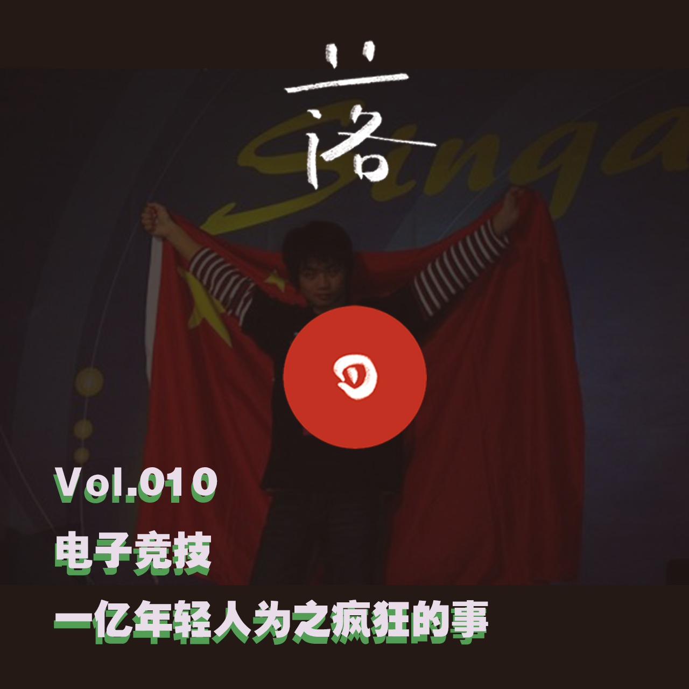
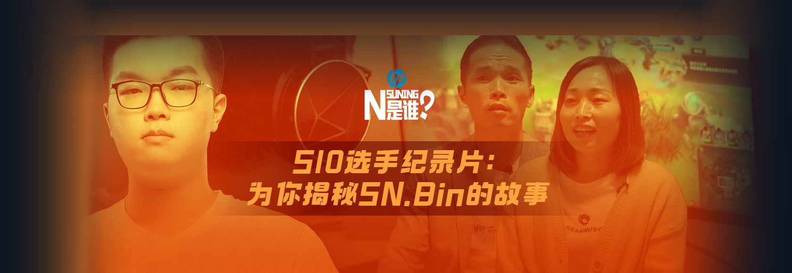
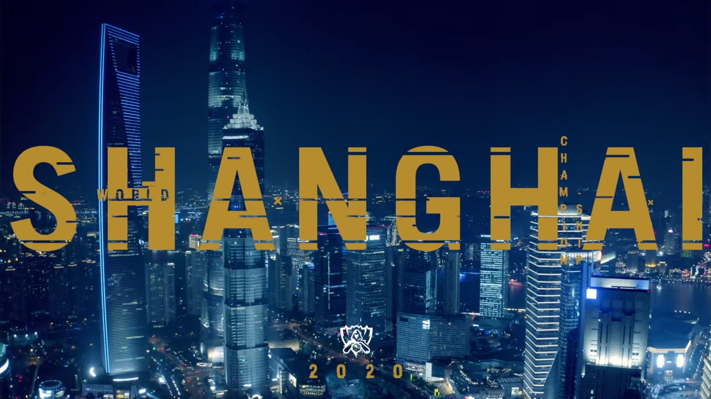

# E10 一亿年轻人为之疯狂的事

## 🎩 基本信息

后戏 After Gaming x 落日间 第三期

电竞相关内容延伸可参考



部分资料收集参考王亚晖[《中国游戏风云》](https://book.douban.com/subject/30399060/)

特别推荐《中国电竞幕后史》作者BBKing所做的演讲[《TEDx演讲 中国电子竞技 让路更多一些》](https://xpaidia.com/ghost/#/editor/post/5f9c582e3ac24b2335c71f1a)

背景音乐：涅槃（Phoenix） 2019年英雄联盟全球总决赛主题曲

### 开场词

by Tony （[后戏AfterGaming\#03：感恩电竞，让游戏被看见](https://mp.weixin.qq.com/s/hsHGaa-THMpoDzYnGSJ4_Q)）

2022年第19届亚运会组委会昨天确认，电子竞技和霹雳舞获准列入2022年杭州亚运会竞赛项目。无论是游戏行业的人，还是电竞玩家，这都是一条令人兴奋的消息。

在2018年，电子竞技是被列为雅加达亚运会的表演项目，中国获得两金一银，但作为表演赛，奖牌是不会计入总排名的。而列为正式比赛项目则不同，获得的奖牌将记入总奖牌榜。

在10月底我们趁着《英雄联盟》第10赛季总决赛的举行，制作了一期关于电竞的节目，如果您还没来得及收听，不妨借这个机会来了解一下电竞的发展，电竞与传统体育的异同，以及电竞对游戏意味着什么。

### 收听/收看链接

《落日间》音频版：[《E10 一亿年轻人为之疯狂的事》](https://www.xiaoyuzhoufm.com/episodes/5f9c6e8f83c34e85dd499adb?s=eyJ1IjogIjVlYmNkNzkwMjFhYzg1ODA0MTJiNzcxMCJ9)

《后戏》视频版 [\#03：感恩电竞，让玩家被看见](https://www.bilibili.com/video/BV1rT4y1F7Ba)

\(Tony 很有心地做了一个片头，2020年Bin的镜头，与13年前Sky还有2005年WCG的镜头穿插，时空穿梭，令人感慨\)

### 出场

叶梓涛 NExT Studios 游戏设计师，在做「落日间」

Xichen 希辰 NExT Studios 音频设计师，前育碧员工，个人网站 [Soundoer](https://soundoer.com/) , B站 [@Xichen](https://space.bilibili.com/157914767)

Tony \(主持\) 游戏运营，游戏爱好者，前新闻传媒工作者

## 🗒 Show Notes

00:00 前言，[寒羽良](https://www.sohu.com/a/364297051_116000)（陈宇） [Sky](https://3g.163.com/game/video/V6SND1DAD.html)-[孟阳Rocket boy](https://www.bilibili.com/video/BV11s411v74g?from=search&seid=1873761270865476302) 《鲁豫有约》 [中国电子竞技国家队](https://baike.baidu.com/item/%E4%B8%AD%E5%9B%BD%E7%94%B5%E5%AD%90%E7%AB%9E%E6%8A%80%E5%9B%BD%E5%AE%B6%E9%98%9F/8804252?fr=aladdin)

02:39 自我介绍与各自的电竞回忆 [世界电子竞技大赛（World Cyber Games，WCG）](https://baike.baidu.com/item/%E4%B8%96%E7%95%8C%E7%94%B5%E5%AD%90%E7%AB%9E%E6%8A%80%E5%A4%A7%E8%B5%9B/3567247?fromtitle=WCG&fromid=6705&fr=aladdin)

04:50 《巅峰对决》 [游戏风云](https://baike.baidu.com/item/%E6%B8%B8%E6%88%8F%E9%A3%8E%E4%BA%91/4496188?fr=aladdin) 节目（还有90套[GTV电子体育](https://baike.baidu.com/item/GTV%E7%94%B5%E5%AD%90%E4%BD%93%E8%82%B2/698811?fr=aladdin)）

06:02 对电竞的认知 / PVE（玩家对战环境，Player VS Environment）PVP玩家对战玩家（Player versus player）的扩展

07:47 Leaderboard 最早出现在1979 Atari平台的游戏[《小行星》 \(Asteroids\)](https://en.wikipedia.org/wiki/Asteroids_%28video_game%29)

08:30 电竞的小史 斯坦福大学 / [任天堂世界锦标赛（Nintendo World Championships）](https://baike.baidu.com/item/%E4%BB%BB%E5%A4%A9%E5%A0%82%E4%B8%96%E7%95%8C%E9%94%A6%E6%A0%87%E8%B5%9B/17392073?fr=aladdin) / [雷神之锤（Quake）](https://baike.baidu.com/item/%E9%9B%B7%E7%A5%9E%E4%B9%8B%E9%94%A4/1020067) / [DOOM启世录（Masters of Doom）](https://book.douban.com/subject/1152971/) Id Software / [LAN Party](https://en.wikipedia.org/wiki/LAN_party) [DreamHack](https://en.wikipedia.org/wiki/DreamHack) / [方鏞欽\(Dennis Fong\)](https://en.wikipedia.org/wiki/Dennis_Fong) / [魂锁典狱长-锤石](https://na.leagueoflegends.com/en-us/champions/thresh/) \(Thresh\)

11:00 电竞的特殊性，观赏的门槛 / 没有固定项目E-Sport is a form of sport competition using video games.

12:00 电竞的扩圈与影响力 / 2003年国家体育总局将电子竞技列为第99项体育运动 / 体育的定义与合理性

14:53 电子竞技所要求的游戏与玩法 [《电子竞技：技巧、浮现、与传统游戏精神》](https://zhuanlan.zhihu.com/p/23026441)关于深度\(depth\) 技巧范围等概念可以参考文中Tynan Sylveste的[《体验引擎》](https://book.douban.com/subject/26323699/)一书 / [APM](https://baike.baidu.com/item/APM/516)（每分钟操作次数）/ 知乎问题： [其他 FPS 游戏的高手如果和 Quake 高手对战 Quake 3 会发生什么？](https://www.zhihu.com/question/40553611/answer/87729340) / MOBA（英文全称：Multiplayer Online Battle Arena，缩写：MOBA，中文翻译：多人在线战术竞技游戏 指的是 《Dota》，或者是《英雄联盟（LOL）》（俗称撸啊撸）《王者荣耀》这类

18:05 游戏能力与外部环境 / 商业收益与谋生 / 电竞选手的巅峰期 /

20:45 电子竞技与传统体育的差别：游戏项目特殊性，开发商作为项目占有与运营者，电竞作为商业运营手段

22:20 对游戏的认知变化与资本入场

24:30 打游戏的能力为什么有了价值？资本的交换 / 普及以及广泛认同与参与人群 / 关于外部与内部作用 / 电竞内部认可与外部认可的小讨论

29:12 两位少年 [SN Bin 纪录片](https://v.qq.com/x/cover/mzc0020085wxasb/u0034xsakxt.html) SN.Bin的成长记录 , 补充（[少年来到海边：油管上SN战队Adc焕烽的故事](https://www.bilibili.com/video/BV1VA411E7Lp/?spm_id_from=333.788.videocard.0)） / 职业化的可能与整体印象的转变

31:23 一段让Tony鼻酸的话，一代人的游戏情结

（《中国星际争霸历史回顾》，转引自王亚晖[《中国游戏风云》](https://book.douban.com/subject/30399060/)）

> 无论承认与否，事实就摆在面前，星际的繁荣已经走到尽头，现在呈现的是一个游戏多元化的时代，每个经典游戏都有人数不等的拥护群体，星际作为将竞技游戏带入成熟（无论职业化还是商业化，总之正在逐步完善）领域的过渡，已经成功完成了任务，从这个意义上来讲，中国的星际玩家与《雷神之锤Ⅲ》玩家都是这个阶梯上第一个台阶。很不幸我这样比喻，星际与广大前仆后继的星际玩家为中国电子竞技产业做了铺路石子，享受这个成果的是今后的游戏和玩家。若干年后，同处在我们这个年龄的年轻人正在宽松良好的政策环境下玩游戏，他们不知道什么是电子海洛因，不知道网吧玩竞技游戏属于违法，不明白玩游戏也需要权利。他们怎么也不会理解有多少孩子曾经很有组织有纪律地聚集在一起，发誓永远不碰游戏，将童贞与天性掐死在自己手里。他们会问：什么是星际？

35:42 电竞行业的职业化 / 不成功的反思 / 生态构建和职业生涯的保障延续 / 带来的职业门槛提高 /

39:00 电竞赛事举办的特殊性：需要版权，第三方赛事亏钱的状态 / 电竞入奥的微妙与意义 / [DECLARATION OF THE 8TH OLYMPIC SUMMIT](https://www.olympic.org/news/declaration-of-the-8th-olympic-summit) /

> The sports movement should focus on players and gamers rather than on specific games. / Many sports simulations are becoming more and more physical thanks to Virtual and Augmented Reality which replicate the traditional sports.

41:20 B站[8亿拍下S赛独家直播权](https://www.zhihu.com/question/359128416) ，并且8月14日进行[分销](https://www.zhihu.com/question/414193215/answer/1411350490) 2018年，全球电竞观众人数为3.95亿，其中电竞爱好者人数为1.763亿

41:53 传统体育面对改变？电子竞技和年轻人群体的改变 / 一些乱想

44:17 电子竞技项目进入公共领域？成为公共项目？标准和第三方的需要

47:05 再思体育职业化 [Body Shapes of Olympic athlete](https://www.google.com/search?q=athlete+body+types+by+sport&newwindow=1&rlz=1C1CHWL_zh-CNHK895HK895&hl=zh-CN&sxsrf=ALeKk02WDFdMhApKyV5UIjWfeY_sIRM8dQ:1604080154666&source=lnms&tbm=isch&sa=X&ved=2ahUKEwieo72e8NzsAhWTtp4KHT7bC_IQ_AUoAXoECAwQAw&biw=1857&bih=816#imgrc=IxDewtSPBIss1M&imgdii=AhQIu-UdKWzH3M) 身体的规训而非健康的身体 /[业余原则](https://www.rulesofsport.com/faq/can-professional-athletes-compete-in-the-olympics.html)到职业化

50:50 赫伊津哈《[游戏的人](https://book.douban.com/subject/2269047/)》 游戏精神的丧失 / 佩恩恩\(Payne Zhu\) 《天梯系统》 / 电子游戏的天梯系统排位体系的设计与反思

52:20 以小区篮球赛为反思例子，电子竞技的胜负心，菜是原罪 / 能力的量化

59:00 资本的 [万家电竞](https://www.zhihu.com/question/266164830/answer/304674331) / 文化影响力 / [SN. Sofm](https://www.bilibili.com/video/BV1Xa4y157RX?from=search&seid=16525312052143003171) /

60:55 结尾 SN 加油！

62:02 节目官网ShowNote

## 🐖 其他

看完了全程决赛，颠荡起伏太刺激了，遗憾也太真切。

我觉得电竞圈整体的氛围确实非常复杂，在这个吸引交杂着年轻人爱与恨的场域里，选手，年纪轻轻都要承担常人难以想象的网络压力；我们会把气撒在给电竞投资的资本苏宁上，会撒在可能还不满十八岁的少年身上，在隐形的面具下我们随意倾吐自己的戾气，菜是原罪，不够强不能符合自己的期待也是，这也是年轻人的网络情绪制造机。

苏宁的年轻人都很年轻，站到巅峰也要承担其重量，失败也会承担起骂名，是一种强大的压力也会是一次绝好的成长机会，可千万挺住了！韩国97年开始的电竞和游戏产业的成熟，解说用“机器人”形容LCK的战队听起来是非常恐怖的，不知道背后有多少这种非人的训练，苏宁的创造性和平稳还是没有达到一个完美的协调，但多希望能以一种轻盈舞蹈的姿态去享受比赛啊。

