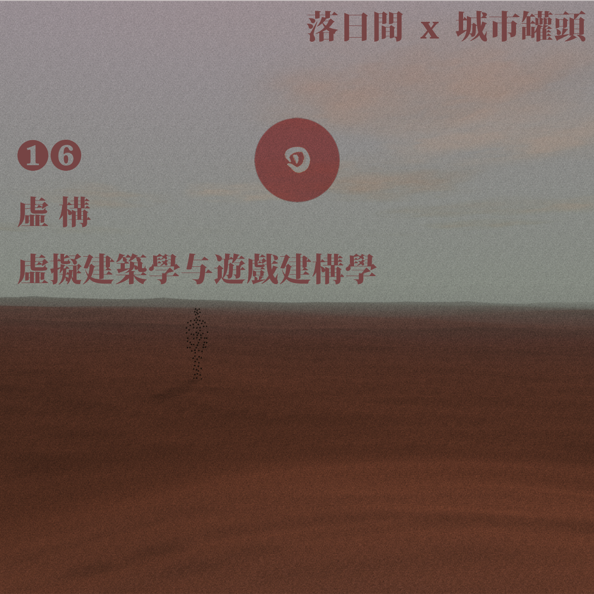

# E16 虚 构：虚拟建筑学与游戏建构学｜城市罐头 x 落日间

\*\*\*\*⛩ **游戏 x 建筑**

本期内容是落日间与群岛Archipelago书店出品的播客《城市罐头》进行的一次串台节目。本身也是落日间尝试真正与建筑行业的朋友进行跨界交流与合作的一次尝试。本期也上了小宇宙的首页：）

远在美国的向老师与Yao老师都很棒，罐头设计师@celery海报和头像太好看了。群岛书店就在上海西岸云锦路地铁站出口，有很多关于建筑和人文的书籍，去过两三次，很喜欢，没想到以这种形式进行了一次合作。期待之后还有更多合作的机会！毕竟向老师毕设展也快结束了，特别期待再听向老师谈动森与可爱。

## 基本信息

1993年12月 ，Id Software发布了可能是世界上第一款真3D游戏——毁灭战士Doom，也许就是在这个历史性的时刻，电子游戏与建筑学以非常原生的方式被关联在了一起。

多年后的今天，建筑学日渐式微，而游戏产业日臻成熟。游戏中的建筑与建筑学有何不同？未来我们生活中大部分的虚拟世界会不会由游戏设计师来塑造，而未来的游戏空间会不会成为建筑师的新战地呢？

### 收听/观看链接

腾云文字节选版 [游戏设计 or 建筑设计：未来，谁来规划我们的虚拟空间？](https://mp.weixin.qq.com/s/FogiFZWrnV7vwH7hs2i8VQ)  
落日间版 [E16 虚 构：虚拟建筑学与游戏建构学 \| 落日间 x 城市罐头](https://www.xiaoyuzhoufm.com/episode/5ff55450dee9c1e16d3343cb?s=eyJ1IjogIjVlYmNkNzkwMjFhYzg1ODA0MTJiNzcxMCJ9)  
城市罐头版 [13 虚构：虚拟建筑学与游戏建构学｜城市罐头×落日间](https://www.xiaoyuzhoufm.com/episode/5ff53a05dee9c1e16db37c9b?s=eyJ1IjogIjVlYmNkNzkwMjFhYzg1ODA0MTJiNzcxMCJ9)

（因为内容过长，所以略有倍速，可以自行减速）

### 关于《城市罐头》

群岛FM【城市罐头】是由群岛Archipelago推出的系列播客节目。**城市罐头**是一档讲述文化、消费与城市空间的播客。我们不传递价值观，只想用打开罐头的轻松，带你一窥城市的文化与消费空间。[群岛丨Archipelago](https://www.zhihu.com/org/qun-dao-gong-zuo-shi-archipelago-97) 《城市罐头》公众号推送：[城市罐头vol.013丨虚拟建筑学与游戏建构学｜城市罐头×落日间](https://mp.weixin.qq.com/s/R7-n_ktOBdhl2Ewlt-21qA)

### 出场

本期节目我们邀请到了建筑师Yao和雕塑装置艺术家向向向，一起来聊一聊游戏与建筑学。

非常辛苦小王老师的精心剪辑，对三个小时原音频内容修剪以及校对，还有Yao与向向向老师对Show Notes的认真整理，我在这次跨界聊天的过程中收获巨大。

#### 嘉宾

**向向向** 雕塑装置艺术家 [https://xianghuidi.com](https://xianghuidi.com)

**Yao** 建筑师 [https://wall-atlas.com/JiaweiYao](https://wall-atlas.com/JiaweiYao)

#### **主播**

**叶梓涛** 游戏设计师，落日间主播

## Show Notes

### 时间轴

02:50 栖居在别处：人为什么要玩游戏？   
****06:10 主播与嘉宾们的年度游戏体验   
12:50 游戏中的建筑：形式美之下的乐趣   
19:00 游戏中的空间叙事   
23:00 游戏关卡中的建筑设计   
36:00 电子游戏作为纸上建筑的新媒介   
42:00 尺度感与分辨率：一种虚拟的身体性   
54:00 建筑学与游戏学：坍缩与膨胀，古老与新生   
59:00 学科自治，一种语言困境  
68:00 罐头与落日间：两种角色，两种定位   
70:00 业余作为一种创作态度   
74:00 游戏与艺术创作的历史在场感   
78:00 玩乐与劳动，始终在场的资本力量   
82:00 游戏设计师与建筑师：比想象更相像的两种角色   
88:40 两种行业，两种权力关系   
94:00 游戏作为一种大众化的艺术表达   
99:30 游戏开发工具反哺建筑学   
102:00 《曼达洛人》与Fun Palace, 巨大的机会与潜藏的危险   
109:00 审视危险，步履不停   
115:00 一种框架和两种新视角

### BGM

[Build That Wall - Darren Korb](https://i.y.qq.com/v8/playsong.html?songid=1368954&source=yqq#wechat_redirect)

* 推荐人 叶梓涛

播客中我是从[《建筑师》](https://book.douban.com/subject/30218241/)漫画的方式那样去理解的，但是实际上有趣的是：在游戏背景中，是在唱一个生活在地下的民族，对他们来说建一面墙反而是无意义的事。 [【游戏音乐课】《堡垒》与《晶体管》的歌声](https://www.bilibili.com/video/BV1UW411t7eW)

[The Valley of The Pagans\(featuring Beck\) - Gorillaz](https://i.y.qq.com/v8/playsong.html?songid=280882164&source=yqq#wechat_redirect)

* 推荐人 向向向：

虚拟乐队Gorillaz的两位主创Damon Albarn和Jamie Hewlett在去年作客了Gary Whitta在动物森友会里进行的对谈节目Animal Talking并表演了他们新专辑Song Machine, Season One: Strange Timez里的The Valley of The Pagans。

### 扩展阅读

**开场：游戏和建筑是什么**

[人为什么要玩游戏：栖居在别处，无用之用](https://zhuanlan.zhihu.com/p/24959725)

**游戏中的建筑：形式美之下的乐趣**

建造与模拟：《动物森友会》 Ian Bogost 去年四月对于去年发售的最新动森系列的评论：[_The Quiet Revolution of Animal Crossing_](https://www.theatlantic.com/family/archive/2020/04/animal-crossing-isnt-escapist-its-political/610012/)

历史的再现：[育碧在巴黎圣母院失火后限期将《刺客信条·大革命》免费发放](https://news.ubisoft.com/en-us/article/2Hh4JLkJ1GJIMEg0lk3Lfy/supporting-notredame-de-paris)

[《耻辱》系列中的意识形态，纪念碑，与虚构的历史：建筑何以塑造游戏世界](https://www.erudit.org/en/journals/loading/2019-v12-n20-loading04974/1065898ar.pdf)

[《Manifold Garden》用建筑启发游戏](https://archive.curbed.com/2016/6/23/12005774/manifold-garden-video-game-william-chyr)

[《赛博朋克2077》：一场无言的建筑批评](https://www.archpaper.com/2021/01/cyberpunk-2077-is-an-architecture-critique-with-nothing-to-say/)

**作为体验的游戏与实体空间：语言与身体性**

关卡设计中的空间经验：

[多人游戏关卡设计视觉化指南](https://zhuanlan.zhihu.com/p/33335089)

[来试试设计一个《守望先锋》的关卡](https://zhuanlan.zhihu.com/p/58303220)

建筑师与游戏设计师所面临的的不同Context

* 功能性 《The Witness 见证者》
* 生活性/审美性

游戏中的地图设计 《星球大战绝地：陨落的武士团》Metroidvania 银河恶魔城 曼达洛人与Fun Palace 身体与城市空间

颗粒度 细致度 《我的世界 Minecraft》 《风之旅人 Journey》

游戏中的身体性：空间认知与尺度感 《块魂 Katamari Damacy》

**游戏与建筑作为学科的相同点与不同境遇**

学科的自治与语言的独立 [《自治——未竞的建筑学现代性探索》](https://www.douban.com/note/43725259/)

玩家创作的Modification 模组与改造 - 关于玩家 斯蒂格勒

一个媒介语言转译的例子 - 巴赞[《电影是什么》](https://book.douban.com/subject/1320206/)

**建筑学院中的游戏实践**

Sci Arc的新项目：[MS Fiction and Entertainment 专业](https://www.sciarc.edu/academics/postgraduate/fiction-and-entertainment)

UCL的相关课程：[Videogame Urbanism](https://www.youandpea.com/vushowcase)

[上海交通大学设计学院青交建筑论坛03｜李博：从建造游戏到游戏建造](https://www.bilibili.com/video/BV1754y1C7J6)

南加大助理教授篇Sanchez的演讲，[游戏作为建筑师的替代劳动](https://www.youtube.com/watch?v=PvG6H4VS5f8)

**其他准备的材料**

[【李博翻译，重轻推荐】游戏中的建筑学 Architecture in Video Games: Designing for Impact](https://zhuanlan.zhihu.com/p/110865408)

[叶梓涛：为什么说游戏设计是隐形的建筑学？](https://mp.weixin.qq.com/s/_dd8rXhGrKW_vTRrmKMAUQ)

[Level Design Workshop: An Architectural Approach to Level Design: Creating an Art Theory for Game Worlds](https://www.gdcvault.com/play/1025176/Level-Design-Workshop-An-Architectural%20)

[Level Design Workshop: Architecture in Level Design](https://www.youtube.com/watch?v=XW7KvppTspc&t=1s)

[Manifold Garden: Level Design in Impossible Geometry](https://www.youtube.com/watch?v=ed2zmmcEryw&t=1725s)

[Manifold Garden - Architectural Inspirations](https://www.youtube.com/watch?v=ZUD8ao1EMus%20)

[An Architect's Guide to Creating Expressive Game Environments](https://www.gdcvault.com/play/1023257/An-Architect-s-Guide-to%20)

[建筑学在关卡设计的应用和界限（一）- 机核](https://www.gcores.com/articles/22104)

[IT公论 Episode 194: 如何在露营时继续玩 PS4](https://itgonglun.com/episodes/194%20)

[以现代建筑思潮探讨关卡场景设计](https://www.gameres.com/871731.html%20)

[一套游戏x建筑的Zine - Heterotopias](https://itch.io/s/20655/heterotopias-001-007-2020-bundle)

### 探讨游戏虚拟空间相关的当代艺术

#### 作品

郑国谷，帝国时代/了园，1997-至今   
Eddo Stern, Fort Paladin, 2002   
Cory Arcangel, Super Mario Clouds, 2002   
Aram Bartholl, WoW, 2006-08   
Eva and Franco Mattes, Re-Enactments, 2007-10   
Stephanie Rothenberg, Invisible Threads, 2008   
曹斐, RMB CITY, 2008-11   
Ian Cheng, Emissary trilogy, 2015–17   
David OReilly, Mountain, 2014; Everything, 2017;   
Everest Pipkin, The Worm Room, 2016   
Angela Washko, Womanhouse \(Or How To Be A Virtuous Woman\), 2018   
Ryan Scavnicky, 热衷游戏直播和制作meme的建筑师，Extra Office 创始人   
Noclip.website, 一个网络艺术家自制的电子游戏关卡博物馆

#### 阅读

Ian Bogost, _How to Do Things with Videogames_, 2011 Ian Bogost, _How to Talk about Videogames_, 2014

[中国当代艺术场域中的电子游戏 \| 落日间](https://mp.weixin.qq.com/s/fMOkRcm08kW3g4PPFnOvQQ)

Rhizome Net Art Anthology，一个包含了比较广义上的各类net art作品的平台

### 建筑或可参考的游戏推荐

Bioshock I - 海底城市   
Bioshock III Infinite - 云中都市，反乌托邦   
The Witness 见证者 - 游戏中建筑与景观的空间连续性与玩法的高度统一，建筑与景观设计师高度参与的游戏项目   
Manifold Garden 无限宫苑/歧管花园 - 3维折叠成四维空间的呈现，以及通过对于offset的调整带来的无限感，Brutalism，对于各类如安藤忠雄，矶崎新等建筑的游戏中展现。   
Minecraft - 体素方块颗粒度下的自由与真实   
Assassin Creed 系列 - 历史场景的还原，游戏功能性与文化性的协调   
Control 控制 - Brutalism与建筑神秘感   
Journey 风之旅人 - 较低模的颗粒度与「分辨率」，landmark与纪念碑性   
Katamari Damacy 块魂 - 尺度感变化的空间体验   
Luxuria Superbia 色彩与傲慢 - 透视的无限空间   
Circa Infinity - 圆形正负形的二维空间 纪念碑谷，无限回廊 - 埃舍尔的视错觉   
Fragments of Euclid - 埃舍尔的空间的实体还原尝试   
黑暗之魂 - 「反建筑设计」的建筑，良好的landmark以及连通性设计，光照与景观的体验与叙述设计   
怪物猎人，地平线，塞尔达传说，荒野之息 - 架空世界观下的建筑合理性   
耻辱1、2 - 维多利亚时代背景风格的建筑设计，丰富立体的室内空间和意识形态形塑的建筑语言   
Townscaper - 算法与过程式生成的建筑禅意建筑构筑体验   
Block'hood - 城市规划与环境之间的生态平衡性协调   
模拟城市，过山车大亨等 - 区域规划与城市规划   
Islanders - 城市规划与区域的禅意建造   
FRACT OSC - 音乐空间，空间与声音   
Portal，Anatomy - 空间与建筑作为有机体的身体   
GTAV / 赛博朋克2077 - 现代与未来都市生活情境的展现   
Division 全境封锁½ ，The Last of Us 美国末日½，辐射，尼尔：机械纪元 - 灾难后时代，末日幻想Post-Apocalyptic 的城市时代   
Edge of Miroir 镜之边缘 - 颜色与简洁的空间指引以及轻盈感   
星球大战绝地：陨落的武士团 - 3D空间地图指示   
The Second Life 第二人生 - -传奇的虚拟社交多人时空   
[Fugue in void](https://moshelinke.itch.io/fugue-in-void) - Brutalism以及空间带来的情感体验

## 评论

> 这一期不仅是干货多吧，主要是信息密度高，表达也非常干净和迅捷。这个其实很难，对主播的思维和知识储备等方面都要求很高。因为听上去你们基本没有在念稿或者套招，即兴的部分相当多。话说女主播语速真的自带三四倍速，我几次停下来看自己是否开启了倍速，真是太灵的姑娘。—— 伊夏

> 「 indie architect 其实是有的，虽然很罕见，主要因为房子太大了内容太多，一个人很难弄完，而房子的设计周期往往也比游戏要短很多。如果是单说设计工作的 indie，最著名的应该是 Glenn Murcutt，他是 one man band 一个人做完，而且不可思议的是他一直都还是手绘制图。建筑中别说制作，连设计 solo 都是举世罕见，因为太复杂了，如果是包括设计和建造两方面，我以前有个同学他和她爸俩人，花了三年时间两个人盖了自己的家，除了某些步骤外聘了工人来操作吊机和挖掘机，其他都是两人一手一脚做的，浇混凝土啊，切木头搭梁，剪力墙和隔墙，还有保温层，铺地板、地暖，楼梯，坡屋顶，所有管道，厨房、卫浴、屋顶。。。。难以想象。」—— 李博

> 「谢谢你们愿意陪我玩，这不就是游戏最原始的意义吗 」—— 来自设计师celery 的留言

