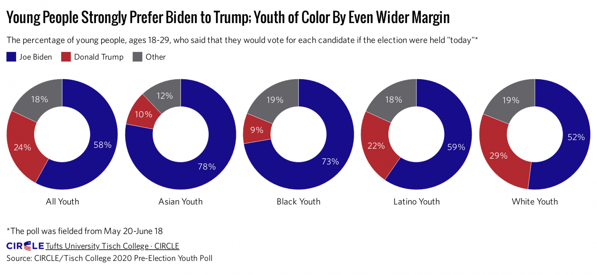
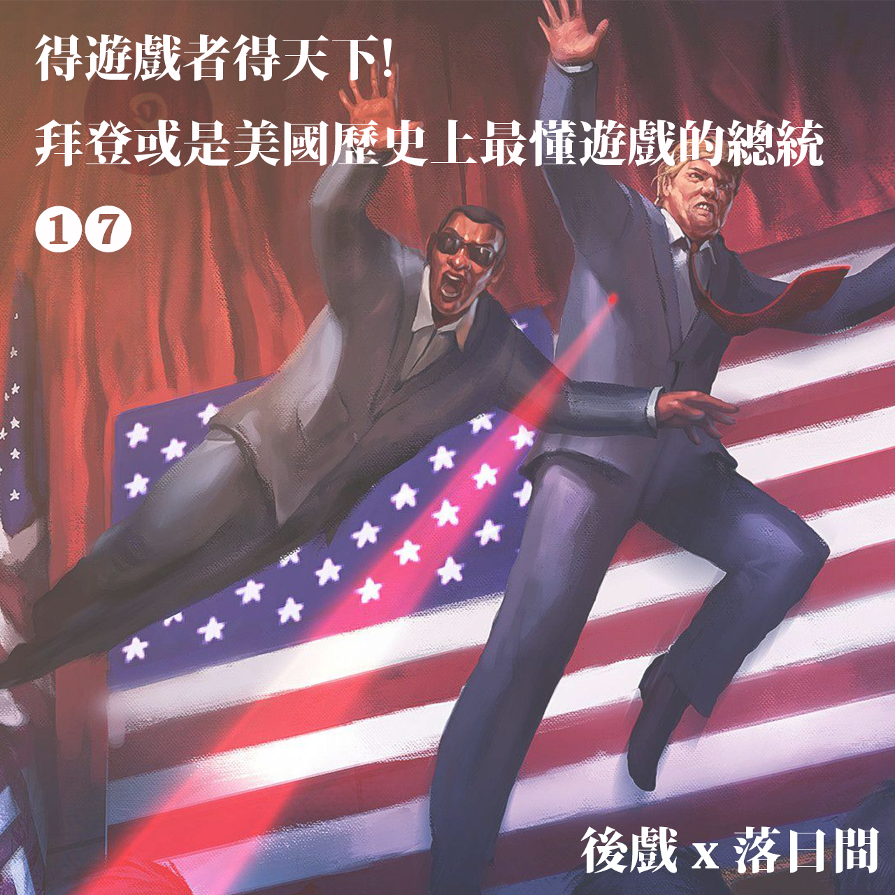

# E17 得游戏者得天下：拜登的动森拉票法与政治的游戏延伸

## 🦸♂ Info

这期是当时《后戏 After Gaming》\#06 因为喜马拉雅平台审核而无法发出，于是在落日间代发的内容。但在数个月后的今日来看，在那之后开始兴起一股称之为 Metaverse 的风潮，其实本质上这只是游戏作为强大的资本与技术高地所必然产生的溢出效应——无论是政治、经济、商业、不同传统艺术、媒介都想要借着游戏蹭一蹭热度，借由转变自身。

开发了充满欧洲左翼政治意味游戏《Disco Elysium 极乐迪斯科》的工作室 ZA/UM 创始人罗伯特说：

> 必须要承认，如今的年轻人已经很难接受小说。  
> 而相比之下，游戏要比任何一个传统载体，更能打动年轻人。

（补遗）

### 文案

文案/剪辑/提纲：Tony

北京时间1月21日上午9点半，美国将迎来历史上最懂游戏的总统。

根据第三方机构Circle的统计，45岁以下，特别是30岁以下的美国人，大多数投给了拜登，而川普在45岁甚至65岁以上的人群中更受欢迎。拜登成为更多美国年轻人的选择，或与他主动进入年轻人的圈子有关，游戏便是其中一例。

拜登的团队中有专门负责在游戏渠道拉选票的成员。大选期间，他们在任天堂去年最热门的模拟经营游戏《动物森友会》中开设“拜登岛”，在全球最火爆的多人射击游戏《堡垒之夜》中推出定制地图，在游戏中动员玩家参与投票。

拜登团队的这些举动显然是希望通过电子游戏与美国年轻人打成一片，赢得他们的青睐。

不过这一现象也引起了玩家的担心，他们认为游戏不应该与政治绑在一起。有玩家在twitter上表示，政治介入让游戏失去了原本的轻松。而且任天堂官方后来更新了使用条款，并明确表示，严禁将宗教和政治主张带入游戏。

随着网络的发展，越来越多的游戏具备了社交和用户自创内容的功能，游戏内容不再是过去封闭的世界，而是让渡了部分创造权力给到玩家自己，与真实世界的界限也越来越模糊。

那么，如何看待游戏作为一种媒介宣传工具？

### 收听链接

落日间版 [E17 得游戏者得天下：拜登的动森拉票法与政治的游戏延伸 ｜后戏 \#06](https://www.xiaoyuzhoufm.com/episode/60072173ca2eae825672f19d?s=eyJ1IjogIjVlYmNkNzkwMjFhYzg1ODA0MTJiNzcxMCJ9)

后戏版本 [AG06：得游戏者得天下！](https://www.xiaoyuzhoufm.com/episode/6007aa54ee3ec78161e72ab6?s=eyJ1IjogIjVlYmNkNzkwMjFhYzg1ODA0MTJiNzcxMCJ9)

原后戏微信推送 [后戏AfterGaming\#06：得游戏者得天下！拜登或是美国历史上最懂游戏的总统](https://mp.weixin.qq.com/s/hAC2KAocdN6L6qTPmcWccA)

### 出场

**特邀嘉宾**

王睿 上海交通大学文创学院博士研究生（传播学）

**主播**

叶梓涛 NExT Studios 游戏设计师，在做「落日间」  
Xichen 希辰 NExT Studios 音频设计师，前育碧员工，个人网站 [Soundoer](https://soundoer.com/) , B站 [@Xichen](https://space.bilibili.com/157914767)  
Tony \(主持\) 游戏运营，游戏爱好者，前新闻传媒工作者

## Show Notes

Opening music: Fishing Tourney——《动物森友会》by Nintendo Sound Team

04:15 拜登竞选团队中的游戏小组   
05:20 传播学诞生于美国大选/游戏作为一种媒介工具   
06:07 主动拥抱题材的游戏/为了市场最大化避之不及的海外厂商   
08:58 内容+影响力=媒介价值   
12:30 通信230法案/游戏与社交媒体类比/任天堂禁止用户   
15:15 中国社交媒体的判例/游戏的社交属性   
18:57 游戏作为表达工具的演变：从反思的表达到利益集团的侵入   
23:27 游戏内表达营造的奇观感  
29:10 游戏与电影的传播比较：社交/沉浸感   
31:25 从伦理的角度审视   
37:37 游戏潜移默化的影响力与戒备

## 评论

> 我记得我当时看到拜登campaign用了动森的时候我脑子里冒出来的第一个问题就是真的有用吗，动森真的能帮助拜登吸引到新的选民吗，还是说这只是一场自娱自乐。（似乎当时希拉里在她2016年的campaign里也提到了pokemon go。） 我觉得就像各位讨论的一样，可能作为一名普通的动森玩家，我感到不适的点正是游戏平台变成了一种政治奇观而非真的作为一种民主化的具有自主性的政治表达或者交流的一种新的平台。个人，组织和平台的责任如何划定，这确实是一个非常值得讨论的问题。 说到游戏是假的我记得很有意思的是好像川普方当时对于拜登campaign使用动森的回应就是说当拜登在虚拟地下室与voter交流的时候川普campaign在与真正的人交流哈哈。

—— @向向向

> 个人愈发觉得游戏未来可能会作为“高级”意识形态去宣传，而不仅像现在看到的用于政治宣传。独特世界观，玩家扮演等元素使游戏中的意识导向比起现实中的“说教”更深入人心。（这一点在目前的好莱坞电影已经很明显了）另外，关于现实世界与游戏虚拟世界的坍塌，推荐《感官游戏》这部电影，里边对伦理这一话题也有所涉及。

—— @fanshitao

