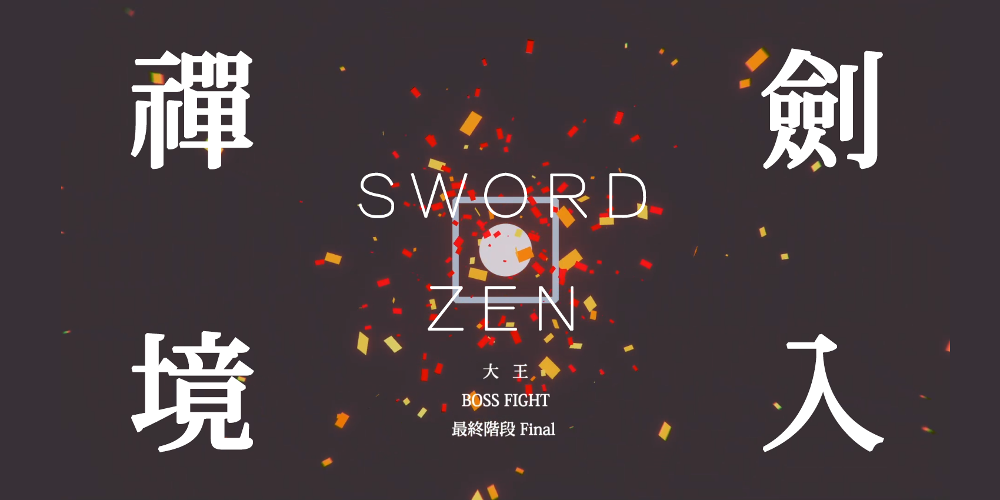
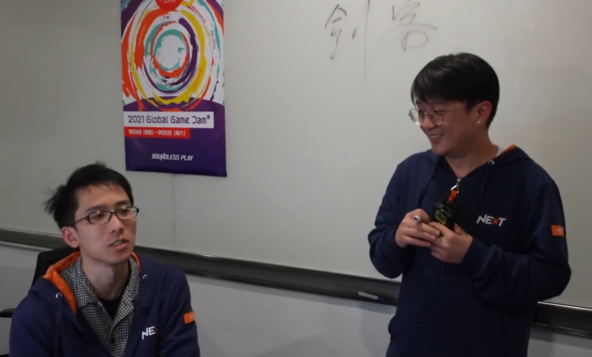
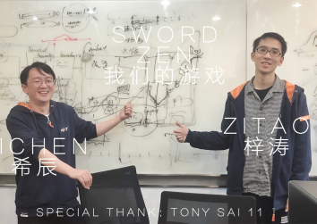

# E18 四十八小时做个游戏？《剑入禅境》GGJ 2021 Post-Mortem

## 补遗

关于这个游戏，虽然已经过去两个月了，但是感谢小宇宙的首页推荐，还有可能B站视频的一些长尾效应，一直有新的人看到它，而甚至还有人找到我来询问游戏发行的事宜，因为是NExT Jam作品，所以具体操作起来会有一些困难，但我还是特别开心人们喜欢这个作品。它确实给了我不少信心，和对真正创作Engaging的作品的实践想法，就正如ZA/UM所说的，真正好的游戏并不一定要Fun，但是至少要是引人入胜的。

我认为这个游戏可能做到了这一点。为此我觉得运气太好了，遇上这样的点子还有合作伙伴。

## Info

关于这次的游戏开发，我和Xichen录制了一期回顾（Post-Mortem）播客，作为《落日间》的第18期发了出来。我们谈论了很多，例如关于团队合作，GameJam是什么，游戏互动音频设计的思路，独立游戏极限开发创作的思路等等。

游戏名：《Sword Zen 剑入禅境》

这是我与@希辰Xichen 合作的Global Game Jam作品，这也应该是「落日间」第一次正式以游戏的形态和大家见面！

我把游戏全程的音效部分分段剪辑进入播客之中了，记得尽量不要倍速，可以还原最佳体验

可以先去玩了游戏之后再来听！

### 游戏介绍

一个声音禅意动作游戏。

游戏中，你是一位饱受过往经历折磨与失落之苦的剑客，你要重新面对自己混沌的内心，通过调整寻找呼吸的节奏来恢复自己对事物与当下的感知，面对威胁冲破阻碍，并重新学习如何在气息平稳时挥出那完美一击，战胜那个巨大的影子，找寻到自己的平静，面对终极。

希望大家在尝试的时候戴上耳机，甚至有时闭上眼，用想象力构造属于你的旅程。

A sound action zen-like experimental game.

In the game, you are a swordsman who has suffered from the torture and loss of the past. You have to face your chaotic heart again, adjust your breathing rhythm to restore your perception of things and the present, and face threats to break through obstacles. , And relearn how to strike that perfect blow when the breath is stable, defeat the huge shadow, find your own peace, and face the ultimate.

I hope you wear headphones when you try, and sometimes even close your eyes, and use your imagination to construct your own journey.

### 收听与观看链接

**播客**

[E18 四十八个小时做个游戏？\| 《劍入禪境》GGJ 2021 Post-Mortem](https://www.xiaoyuzhoufm.com/episode/60194593a58c1dd0adfd579d?s=eyJ1IjogIjVlYmNkNzkwMjFhYzg1ODA0MTJiNzcxMCJ9)

**视频**

[@希辰Xichen](https://space.bilibili.com/157914767) 用寡淡家庭纪录片风格记录了《剑入禅境》创作过程，展现了我俩的丑恶嘴脸（感谢NExT品牌组提供的素材帮忙）

[Xichen's Vlog \#037 2021 Global Game Jam《剑入禅境》开发纪录](https://www.bilibili.com/video/BV16v411s7i6)

[Sword Zen 劍入禪境 Trailer 预告片](https://www.bilibili.com/video/bv1Lt4y1B7xz)

**游戏下载**

[剑入禅境 indienova](https://indienova.com/g/swordzen)

[GGJ 中国站页面-游戏便当](https://youxibd.com/v2/gamejam/ggj2021/works/768)

[GGJ 全球站页面](https://globalgamejam.org/2021/games/way-truth-9)

### 玩家的评价

关于这个游戏的评价我自己不好评价，就摘取玩过的人的评论吧：

> 云不起来的游戏！一个视频根本无法展现魅力强烈推荐亲自体验。交互 ，音效，环境音设置将代入感拉满。细节颇多的音效质感和简约极致的画面，各种设计相当贯彻游戏减法，好久没有这种整体体验感如此棒的gamejam demo了。燃起来了！

—— [甜香饼猫头鹰](https://space.bilibili.com/12526514)

> 今天通关两遍了，是玩过的氛围感做的最好的游戏之一，代入感也很强。虽然只有极简的画面和与之配合的音效，却能把自己逐渐带入到那个与内心搏斗的剑客之中，带来一种只有电子游戏这种媒介才能带给人的独特感受。设计感很棒的游戏，让人拍案叫绝。

—— [Cryptozoologist](https://space.bilibili.com/13179674)

> 在这个抽象的游戏中，你却能沉浸体验一次剑客之旅。
>
> 游戏的最开始，你需要学会吸气吐气——长按空格四秒，然后松开四秒，如此循环。这一吐纳法作为全过程的基底核心。然后你会听见弓箭声、刀剑声（在屏幕上呈现为黄圈袭来），你需要在适当的时机点下左键格挡。最后是学会挥刀攻击，长按左键，然后在松开空格的时候松开左键。 熟悉一个简单操作并重复的基底，不知道是否让你联想到艾迪芬奇中著名的切鱼关。相对切鱼关中分裂玩家操作的目的，剑入禅境的“二心”收归“一心”。你的吐纳越准确，中央的圆圈就越小，你所听见的声音也就越清楚。两个系统紧紧贴合。
>
> 可以试着闭眼游戏，有时这么做效果会更好（不仅限于此游戏）。对于主声音的游戏，The Nightjar到Dark Echo到疑案追声，本作是让我感觉最自然的。或许是搭载节奏系统本身的原汤化原食，或许是剑士呼吸感受的契合，抓准时机挥刀的一刹，满溢的决斗感。 杀死Boss后再次挥刀音乐响起，华丽谢幕。但其实也可以继续。该系统的延展路线是明确的，即在玩家熟悉了4秒吸4秒放的节奏后，引入新节奏体系（波 纹 呼 吸/水 之 呼 吸）与新战法。再让玩家在不同的呼吸节奏中转换穿行，不过即便在此上加花，延展出的时长大抵也是有限的，但我很希望有人来做这类节奏转换的完整探索。

———— [@Gentova](https://www.zhihu.com/people/5877e45204f816fa0f87904ef935ba11) 的文章提到《剑入禅境》的部分：[**2021开年的免费游戏们**](https://zhuanlan.zhihu.com/p/348650905)

## Show Notes

[【中文字幕】Jonathan Blow给游戏制作人的建议：尝试深度工作 完成长期项目](https://www.bilibili.com/video/BV1ZW411P77q)

去年的GameJam作品《C（8，3）》视频：[一个砍鸭子的奇葩节奏游戏](https://www.bilibili.com/video/BV1F541187is/) 游戏网页 [https://yezi.itch.io/c38](https://yezi.itch.io/c38)

充满了黑历史的Xichen Vlog 《[Xichen's Vlog \#026 NExT Game Jam](https://www.bilibili.com/video/BV16J411Y7FG)》

2019年七月 CiGA Game Jam 上海椰岛站 最受欢迎奖 [《S E E K》](https://mp.weixin.qq.com/s/2MPbApekgj3ZJx4qL8MP2Q)

关于侯老师  
[Xichen's Vlog \#029 Audio Designer as Game Developer](https://www.bilibili.com/video/BV1Za4y1i7Rd)   
[Xichen's Vlog \#032 快乐合成器](https://www.bilibili.com/video/BV16h411X7u7)

[《无人深空》的无限配乐 The Band Behind No Man's Sky's Infinite Music \| GSF](https://www.bilibili.com/video/BV1rt411f7tk)

[Cultist Simulator: Designing an Experimental Game for Commercial Success \| GDC](https://www.youtube.com/watch?v=0pBvMIUk1nQ)

[Xichen 希辰的游戏音频设计文档 Game Audio Design Document](https://soundoer.com/game-audio-design-document/)

[冥想游戏原型 \#meditationgames](https://meditations.games/)

制作了《纪念碑谷》团队Ustwo

[《PAUSE诞生记》](https://indienova.com/indie-game-development/ustwo-pause/)

[《Ustwo 的交互应用好在哪里》](https://indienova.com/indie-game-development/why-ustwo-interactive-apps-are-so-good/)

Ustwo [作品网站](https://www.ustwo.com/work/) 与 [游戏作品](https://www.ustwogames.co.uk/)

[《冥想正念指南 Headspace Guide to Meditation \(2021\)》](https://movie.douban.com/subject/35284424/)

Acoustic Frontier Trip Hop 自然声边境迷幻舞曲 -《堡垒》

Old World Electronic Post-Rock 旧世界电子后摇滚 - 《晶体管》

[《堡垒》与《晶体管》的歌声 Building a Supergiant Soundtrack \| Game Score Fanfare](https://www.bilibili.com/video/BV1UW411t7eW)

关于良质 - [少楠：我的人生哲学（三十六岁版）](https://mp.weixin.qq.com/s/tgJeEG0p6HnhCTwr2B-dFg)《禅与摩托车修理技术》

「许多凌乱的许多点在于没有终止和随意输入」[https://linmi.cc/pin/9011](https://linmi.cc/pin/9011)

[Derek Yu- Finishing a Game](https://makegames.tumblr.com/post/1136623767/finishing-a-game)

## Game Jam的活动形式

### 对Game Jam的理解

GameJam 我多多少少计算下来参加了十多次了...非常惭愧到现在都没有做出什么名堂出来。

我理解GameJam是种聚会而不是比赛，是大家在一起开发和分享的过程。我会遇到很多人都是第一次来参加GameJam，甚至这也是成为很多游戏爱好者接触游戏开发的起点，无论是你是什么背景，都可以在这样一个充满活力的活动中找到自己的位置。

GameJam强调的是48小时内的完成。这本质上提倡了一种专注于某些具体的、有辨识度的、强风格化、清晰的设计导向，在其中你要做的是聪明，并且有特色地展现自己的设计能力，而不是像我们的日常流水线或者商业手游作品那样通过制作水平去堆砌内容。

GameJam活动与独立游戏审美相伴而生的，如果你喜欢GameJam，那么可以说你一定也会接受那些颇具个人特色的独立游戏 。

GameJam背后映射的是民主化的开发过程，社群的扩张，游戏开发变得像是艺术创作一样，可以由单人在很短的时间内完成一段完整的体验 ，这种个人主义的创作体力的挥洒更接近「艺术家」，而不是大家想象地坐在互联网日光灯下的超大团队体量的螺丝钉。

JonathanBlow在 [给游戏制作人的建议：尝试深度工作 完成长期项目](http://link.zhihu.com/?target=https%3A%2F%2Fwww.bilibili.com%2Fvideo%2FBV1ZW411P77q) 分享中提到，GameJam的参与也是一种放松。

### GameJam经历

我把GameJam看作学习的过程，第一次接触游戏开发就是实地在厦门GameJam感受了一次，虽然并不是特别成功，但是过程是有意思的，同时也感受到没有技能的无奈和焦虑感，这感觉后来在17年巴黎的GameJam中更甚。

[参加 Global Game Jam 2017（全球游戏创作节） 是一种怎样的体验？](https://www.zhihu.com/question/55020532/answer/142524435)

19年四月的时候我独自参加了网上的Ludum Dare，

2019年四月份LudumDare的作品[《Hold the Button 按那个按钮》](https://mp.weixin.qq.com/s/0Z2N0sqCiGe_Nb67yNRwhA)

2019年七月 在CiGA Game Jam 上海椰岛站拿到了最受欢迎奖。

[参加 CIGA Game Jam 2019 是一种什么体验？](https://www.zhihu.com/question/333893211/answer/748216067)

我觉得GameJam的乐趣在于给自己的挑战，和那种一段时间里劳作的快感，就是通过耗费来滋养自己，即便是在办公室开发也不能在座位上，一定要在一个会议室，第二天晚上一定得刷一下夜，才有那种仪式感，而这是很容易上瘾的。

### 《剑入禅境》的设计过程

如同登山，整个设计过程，中间有两次都想要放弃：

第一次是第二天的下午。我的塑料程序水平，中间一次花了两个小时尝试写一个固定化触发音乐的模式 —— 后面和xichen讨论后觉得不应该这么做（这么做也很繁琐），然后换个方式，但连续思考了两个小时的我已经无法继续了，没法把新的逻辑搞清楚，感谢xichen请了程序员朋友帮我把思路理顺了，我自己写好伪码，最终还算顺利地写了下来。

去年也有这种情况，音乐游戏，或者节奏游戏这种层层嵌套的模式不想清楚后写的话会越写越乱，加上有一些时间的压力，很容易急躁——去年我是去酒店（当时在酒店开发）游了个泳，然后今年的话请了朋友帮忙。

第二次是第二天晚上12点出来基本玩法时，发现太难玩了，太难了，构想的体验推出的玩法跑不起来——直到Xichen提议加入一些视觉的提醒，才把之前的设计串联起来。

过了两三天的我现在剪辑起播客，当初的感觉甚至这个游戏我都有些遗忘了，这游戏对我来说就像是意外的惊喜，创作过程48小时有蛮多波折的，其实一切就如那个比喻，游戏设计师在丛林中迷路并且寻找可行得道路，一切都不那么可控，一切都不那么可预知，那也就同样可能会充满惊喜。

最后现在回头看来，这样作品的已经完成并且接近封闭了。

昨天在内部分享，有着5.1声道，超大显示屏，全黑且专业的声学环境展示，看到了各种玩家的通关时候的姿态，他们很兴奋，大喊牛逼，真的很开心，却也有点迟疑与难以断定，我无法确定自己做出了一个怎样的作品。

短短几天，虽然这游戏中的代码都是我一行行写的，但已经感觉有点陌生，像是它有了一些自己的生命和内在运行的逻辑，我越来越不能形容它了，可能还要再过段时间，等创作的毒性过去后再回头看。

请一定要去玩，我真的很愿意去分享让更多人玩到这个游戏，这在过去是比较少见的。虽然只有48小时，但对我来说可以说是我做过的作品里完成度最高的一个了。

希望你能通关它！

没有失败，只有放弃。

Music from "Crouching Tiger, Hidden Dragon" OST

By Tan Dun, Yo-Yo Ma, Xie-yang Chen, David Cossin

A 2021 Global Game Jam Game by Zitao & Xichen

**Special Thanks**

Zhang Tao

Sai

11

Chengzhong Hou

NExT Studios

## 评论

> 插科打诨地见证了这个实验性作品的研发过程，没看到源头，中间看到两位在黑板上比划如何解决呼吸节奏断点重续的问题时，就隐约感受到这个作品的一丝禅意。说说几个感觉最特别的地方：玩法上，左手按空格键保持稳定节奏，右手按鼠标左键应对节奏变化，这种体验与弹钢琴很类似，对不习惯的玩家有一个很高的上手门槛。然而，设计的巧妙之处在于没有失败，只有放弃，节奏错乱后稍作调整就可以进入新的循环，心理上的挫败感很快被下一次尝试所移除，只要不放弃，就能一直练习下去只到掌握要领。正负反馈间的距离很短，很容易消除负体验。想象一下开免伤修改器打只狼你就懂了。最后说下视觉效果，虽然两位都不是美术出身，但服务且仅服务于玩法的原则上做得非常棒。方框的旋转是计时，圆圈的缩放是呼吸节奏的把握能力，明暗变化是进一步渲染由呼吸节奏把握差异带来的生死状态，配合音频的虚实转换，气氛很到位。最惊艳的是格挡或者击杀后飞舞的黄或红的碎纸片，基本功能上是给予玩家一个操作表现的正反馈，而当后面打boss节奏更快，格挡和击杀更多时，满屏飘散的碎纸片，竟也把紧张气氛烘托到最高潮。要说真有什么不足，无非是玩法本身对“禅”的诠释比较弱，更多是依赖前后的角色独白来隐隐表达一种你中有我我中有你，阴阳对立统一的哲学。当然，这点苛刻的要求确实过分了。

—— TonyZ

> 戴着耳机又玩了一遍，非常快就通关了。刻意练习终于导向收放自如，感觉很好。 这一次终于有余力去捕捉昨天忽略的各种环境音效，比如雨声，呼吸的弥散和收敛，以及寥寥几句语音勾勒出的叙事框架。“I won. But I'm nothing without him.” 两天做出来的作品，真的很棒。

—— HD315969f

