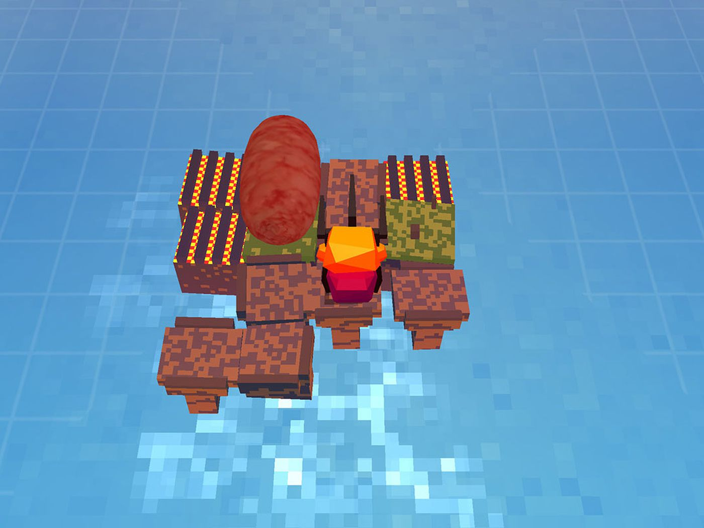

# E20 谜与顿悟 |  Artless x 落日间

### 播客开头的话

播客并不适合介绍电子游戏，电子游戏作为视听交互媒介，最接近的展示形式是视频，这个角度上，我其实也想得很明白，我并不想，并且认为也不该通过播客形式去向每个人科普和介绍这些游戏。

播客更适合对话。它这次更像是设计师之间的讨论而不是科普、应该是将我们的思维和认知推到那个平常不会到达的点上然后继续打开的过程，与他人的一次谈话应该令双方都受益匪浅。

有人会说你们这样的谈话对大家很不友好。

举个不恰当的例子，我读艾柯、卡里埃尔的对话录《别想摆脱书》，他们的谈话必然会涉及到人类学，剧本，文学，还有各种小众的藏书甚至孤本。也如同当我们谈论某一类的文学名著或艺术作品时，必然会谈论到许许多多的我们所熟知的文学作品。

**简单地说，落日间希望将游戏与它们等同。**

我们并不像游戏导购或游戏评测一样去谈论新游戏的玩点，趣味性，性价比，我们希望谈论的是：

**在一个相互交织的，对媒介进行充分和复杂多样化处理的作品网络中的游戏**

—— 一种游戏批评，也在一种谈论游戏方式的尝试。

所以这不可避免地会涉及到很多具体的游戏，而如果你不常玩游戏，或即便你玩过很多游戏，说不定都会没听过。

这非常自然，就仿佛电影的观影量，读书量，像落日间第13期谈到的，这种迷惘是必然要经历的，因为我们大部分人对游戏素养不够，我们接触过的，玩过的游戏都太少了，这需要后续通过完整的游戏清单和业内与各方不断探索才可做到。

我们能够保证的是这里面所对解谜游戏的谈论和谈到的解谜游戏，一定是站在国内顶尖的视野上的。而不是浪费时间的过程，而其中提到的游戏，我会在下面附带一些力所能及的解释和介绍，但非常推荐你去搜索视频，甚至去玩，或许可以多一些想象。

当然这或许也并不妨碍你听到我们的聊天。

本期我请到了国产解谜独立游戏《Understand 顿悟》的开发者Artless以及游戏写作者Gentova还有老朋友yichi来录制这一期节目，artless这个人其实特别有意思，你可以听到其中谈论到的一些地方的时候，那种迸发的对事物的激情，他有某种天才和对解谜的敏感性，以及对他自己所在领域的创作的自信与风格的坚持，在现在如火如荼的游戏互联网行业，他是极度稀有的。

我们这次谈论是一种游戏——解谜游戏。

我们或许有几个词来形容解谜游戏中玩家的体验：

**Understand**，就如同artless所开发的游戏的名字，明白了，懂得了。

**Eureka** ，Eureka moments 尤里卡时刻，据传是阿基米德在洗澡时发现浮力原理,高兴得来不及穿上裤子,跑到街上大喊:'_Eureka_!' ，我发现了！我明白了！也可以是一种 a-ha moments，意思是“我发现了！”现在常在商业或者是科研人员那里形容一种灵光乍现。

**Epiphany**，游戏设计师jonathan blow可能更喜欢使用，描述一种顿悟，对事物真谛的领悟。一种对其实早已存在于我们身边事物的突然发现，《心灵奇旅》中，男主对着22号留下的东西弹得钢琴曲子，也是我们这期的开场曲，这首曲子就叫做epiphany，一种对世界的慷慨感悟以及其神秘的呈现。

游戏有这样的力量，有这种体验，为什么，因为我自己就体会过，在见证者中the witness之中。

Artless将解谜游戏描述为比科研次一级的喜悦，是一种对虚拟世界规则的一种发现的乐趣与惊喜，这样描述科研和解谜游戏的关系颇为有趣。

但我现在想来，就如同Jonathan blow说他的解谜游戏设计来自于规则的假设，他做的只是对系统问出一个问题，而这个系统会自己回答它，这个问题是：如果...的话，会发生什么？就像是《Braid时空幻境》来源于这个问题：如果在平台游戏中，时间可以倒流，会发生什么？《传送门》来自于，如果你能连通两个空间，那么会发生什么？

或许我们也可以从另外一个角度说，在这个角度上，解谜游戏就像是一种浪漫的科学，一种充满理性主义的想象，一种逻辑能够自洽并运作的「硬科幻」。

在我们的聊天中，包括剪辑后思考并写出这段开头文案的我，我们还没有很好的语言能力去表述出这种在解谜游戏的顿悟和奇迹：

当然，如果言语能表述的话，那还要游戏，还要艺术本身做什么。

\*如果对于《understand》部分你希望看过视频或者玩过后再听，可以先跳到21:55 进行收听

### 开场

艾柯、卡里埃尔的对话录[《别想摆脱书》](https://book.douban.com/subject/25714759/)

Understand，就如同artless所开发的游戏的名字，明白了，懂得了。

Eureka ，Eureka moments - a-ha moments，意思是“我发现了！” 灵光乍现。

Epiphany，世界之慷慨的神秘呈现，领悟。

或许很好的解谜游戏入门——[《怪物远征 Monster Expedition》](https://store.steampowered.com/app/1052990/A\_Monsters\_Expedition/)（或许你需要一个steam）

BGM ： [Trent Reznor and Atticus Ross - Epiphany](https://c.y.qq.com/base/fcgi-bin/u?\_\_=UZPJSBB)

####

### 收听

[E20 谜与顿悟 | 落日间 x Artless](https://www.xiaoyuzhoufm.com/episode/6038ca5118b0a35246bc4662?s=eyJ1IjogIjVlYmNkNzkwMjFhYzg1ODA0MTJiNzcxMCJ9)

### 嘉宾

**Artless** 《Understand》《YAPP》设计师 [steam页面](https://store.steampowered.com/publisher/artless) [itch页面](https://artless.itch.io)

**GENTOVA** 文学系学生 解谜游戏爱好者，游戏文章作者 知乎/奶牛关 [@Gentova](https://cowlevel.net/people/GENTOVA007) 可以找到更多\
[《\<Understand>与让你“连猜带蒙”的游戏们》](https://cowlevel.net/article/2137601)\
[《从入门到入定：你最靠谱的解谜入门指南》](https://cowlevel.net/article/2144824)

**Yichi**：数学和人工智能背景，解谜游戏爱好者，业余独立游戏开发，个人主页 [https://xiaoyc.com](https://xiaoyc.com)

**主持**

叶梓涛：游戏设计师，在做「落日间 」

####

### 部分名词解释

**云的**：指没有亲自玩游戏，而通过看游戏视频来了解游戏。

**元游戏/超游**：Metagame，或关于规则本身的游戏，这里或许能延伸到是一种万物同构，并返还到玩家自身的隐喻，在美学上可参考《The Witness 见证者》以及《The Pedestrian 步行者》结尾的二层谜题

**跳，能跳的**：这里指一个特定的游戏类型：2D平台动作类 2d platformer, 类似《超级马里奥》这样的作品，极度考验玩家的操作能力，晚近类似《奥日与黑暗森林》《蔚蓝》都是这类的作品。

**SpeedRun**：速通玩家社区，速通一般指尝试以最快速度通关游戏的行为，目前已经形成特定的玩家社群。

**银河恶魔城**：一种游戏标签。Metroidvania，其词根分别来自最早于1986年任天堂出品的《银河战士（ Metroid）》系列游戏与科乐美出品的《恶魔城（ Castlevania）》系列游戏，类似于《恶魔城》与《银河战士》的「混血儿」；其挑战性、探索性和连续性贯穿始终，基于获取物品或升级以解锁游戏里的新区域。其代表性的独立游戏为《空洞骑士》《奥日》系列。 可参考 [如何评价《精灵与萤火意志》(Ori and the Will of Wisps)？](https://www.zhihu.com/question/335651027/answer/1077830772)

####

### 部分作品简介

《顿悟 Understand》，Artless制作的解谜游戏，灵感部分来自《The Witness 见证者》玩家会在一连串的题板上进行一笔画，连接或避开其中的几何图形，玩家需要通过系统的正确与否的反馈来进行猜测规则。我现在会理解为就如同对于数列猜测规则的游戏（参见《数学女孩1》）。可参考Gentova所写的[《\<Understand>与让你“连猜带蒙”的游戏们》](https://cowlevel.net/article/2137601) 或下方亚恒的B站视频介绍。

《史蒂芬的香肠卷 Stephan's Sausage》，Stephan Lavalle制作的解谜游戏，难度很高，所谓被称作「神作」，类推箱，玩家需要操控一个类似烧烤叉的角色进行腾挪并且滚动香肠来使得香肠两面都得以烤熟但是却不会烧焦。

《见证者 The Witness》Jonathan Blow在《时空幻境 Briad》之后的第二部作品，简单的第一层来说，玩家在一个无人的小岛上苏醒，在小岛上可以找到很多题板，玩家并且通过一笔画的方式启动激光，并且进行探索。一笔画中规则是未知的，要通过尝试来明白题板上的内容，这点上《顿悟》与其类似。我早期有篇文章或可参考，知乎： [The Witness 01-10 说不可说](https://zhuanlan.zhihu.com/p/32139452)

《怪兽远征 Monster Expedition》Alan 的工作室的新作品，我在知乎以及[vol.1 我总是起不好名字 | 落日一周间](https://xpaidia.com/weekly01/)中都有推荐过，内容也可以参考听众 游戏写作者 webber写的评论：[《怪兽远征》：巧夺天工的游戏设计](https://www.gcores.com/articles/129661)

Zachtronics：一家解谜独立游戏工作室，其作品常常以编程类型著称，强调开放式问题解决，Problem Solving，甚至涉及到诸如汇编语言写各类元件，《太空化学 Spacechem》，建造各类工程学流水线的《Infinifactory》或《Opus Magnum》诸如此类。

《Baba is You 巴巴是你》一款看似人畜无害的推箱子游戏，每个箱子都是一个英文单词，名词（Baba/box/wall）对应场景中的物体，动词谓语（is/has/is not）对应定义与属性，宾语可以是个名词也可以是形容词（weak/stop/push)，每一关游戏的规则由场景中的箱子组成的规则（主谓宾）形成，玩家通过推箱子来改变该关的规则来通过游戏。

### Timeline

00:15 开场\
03:40 本期内容：解谜游戏\
07:06 关于落日间的一个困惑和请求帮助\
\
08:12 节目开始\
09:55 understand的构思\
12:40 「规则猜测」的文章，黑魔法游戏“数马”\
15:40 artless现场的猜规则游戏\
21:55 自己是怎么认知understand与其他的解谜游戏的关系？独一无二的作品\

25:20 artless 认为的解谜游戏和游戏是什么，解谜游戏的宗教体验\
30:00 解谜游戏中的类型化作品，类推箱，「暴风雪山庄」\
36:50 点击解谜\
37:50 元游戏/元谜题\
40:00 对《见证者 The Witness》评价\
42:35 对《怪兽远征 Monster Expedition》的评价\
46:30 银河恶魔城解谜与「软锁」\
49:00 什么是好的解谜游戏？游戏的宽度和深度《怪物远征》与《史蒂芬的香肠卷》对比\
56:20 解谜游戏设计师的作者性与谜题\
60:10 从解谜到制作谜题，游戏设计什么时候成为一个想法\
64:10 解谜游戏的「宽度」和「深度」\
69:55 编程游戏与解谜游戏的关系\
71:15 做解谜游戏的体验\
73:25 解谜游戏中的动作成分 YAPP\
76:15 最喜欢的解谜游戏设计师和解谜游戏作品\
78:00 人工智能与解谜游戏\
81:28 桌游与电子游戏中的体现

84:30 开发现状，正职与游戏之间的关系\
88:00 新的开发计划\
89:34 游戏设计咨询相关事情与合作计划\
91:18 解谜游戏群体——《见证者》qq群 246303424\
97:40 为什么叫Artless

Artless为Baba is You所写的政治笑话

_在一次解谜游戏游戏开发者大会上，主持人说道：“觉得应该靠深度提升难度的请坐到左边，觉得应该靠宽度提升难度的请坐到右边。”_

_大部分人坐到了左边，少部分人坐到了右边，但还有一个人坐着没动。_

_主持人问：“这位同志，你觉得深度好还是宽度好？”_

_“我想做一个尽可能宽的游戏，但玩家还是卡在深度上。”_

_“Hempuli，请坐到主席台上来。”_

####

### Shownotes

讨论到的机制展开的高复杂度的反例或许可以参考 [你见过哪些不太合乎常理，却又体现着开发者自信的游戏设计？](https://cowlevel.net/question/1997886)\
[Indie Figure：Daniel Linssen - Ludum Dare 中历练出的设计师](https://indienova.com/indie-game-news/indie-figure-daniel-linssen/) 他的关于窗口的游戏[《Window frame》](http://ludumdare.com/compo/ludum-dare-35/?action=preview\&uid=3479)\
[黑魔法游戏](https://www.zhihu.com/question/38484141)，数马，打苍蝇（NC游戏）\
[《Game Inside a Game》](https://samhogan.itch.io/game-inside-a-game)\
[《Patrick's Parabox》（未发售）](https://store.steampowered.com/app/1260520/Patricks\_Parabox/)\
《Edge not found》 [https://auroriax.itch.io/edge-not-found](https://auroriax.itch.io/edge-not-found)（对PP的截胡）\
AI生成题目的解谜游戏[《Dis Pontibus》](https://store.steampowered.com/app/996980/Dis\_Pontibus/)\
Artless的头像：Carl Chudyk 桌游《We didn't playtest this at all》（中文版《试个好游戏》）\
我提到对于游戏设计占坑的体会可以参考 [2019 年，身处在游戏行业的你，哪些瞬间让你觉得「我太难了」？](https://www.zhihu.com/question/362039517/answer/949643022)\

#### 或许有帮助的补充

[【游戏制作工具箱】谜题设计之道 What Makes a Good Puzzle | Game Maker's Toolkit GMTK](https://www.bilibili.com/video/BV18W411p7XU)\
[【游戏制作工具箱】《小鸡快跑2》中的邪道路线](https://www.bilibili.com/video/BV1Px411m7RV)\
[【游戏制作工具箱】解决谜题……又或是解决问题？](https://www.bilibili.com/video/BV18W411p7XU)\
[【游戏制作工具箱】什么造就了优秀的侦探游戏?](https://www.bilibili.com/video/BV1Sx411x7zn)

[weiyun：推箱子的历史，理论研究和衍生游戏介绍 - 奶牛关](https://cowlevel.net/article/1964314)

机核上两篇介绍日本的paper puzzle发行商nikoli的文章\
[https://www.gcores.com/articles/121980](https://www.gcores.com/articles/121980)\
[https://www.gcores.com/articles/122224](https://www.gcores.com/articles/122224)

[《Toki Tori 2》的解谜谜题设计](https://xiaoyc.com/2016/12/26/game-toki-tori-2/)\
关于点击解谜：Point and Click Adventure Game ，我的一篇[评测](https://www.zhihu.com/question/367162740/answer/1017644939)\
友情推荐 宝婷《不可理论》的文科理论视角下的解谜[《Empuzzlement》](https://www.bukelilun.com/35)\
关于Jonathan Blow的内容，强烈推荐重轻老师 在 Gadio Pro的节目\
[关于游戏的信仰 - Jonathan Blow的创作哲学](https://www.gcores.com/radios/95312)

####

#### Artless的其他内容链接

（Artless：这个文章的观点是过时的）[artless笔记《如何制作一个高难度解谜游戏》](https://indienova.com/indie-game-development/how-to-design-a-difficult-puzzle-game/)\
Artless的营地[个人主页](https://www.iyingdi.com/web/personal/home?id=598699)\
[Understand 开发日志](https://cowlevel.net/people/artless)\
[artless的奶牛关](https://cowlevel.net/people/artless/answer)\
[亚恒关于Artless的视频](https://www.bilibili.com/video/BV1ir4y1c7AM)\
[亚恒之前对Artless做的访谈](https://www.bilibili.com/video/BV1ir4y1c7AM?p=2)\
[《解谜游戏的分类法》](https://cowlevel.net/article/2143206)\
[Baba Is 政治笑话](https://steamcommunity.com/id/dicehatesme/recommended/736260/)\
[Carl Chudyk生平](https://www.iyingdi.com/web/article/home/60025)\
[和美少女游戏设计师一起云游戏 Episode 00](https://www.bilibili.com/read/cv9198062)

####

####

#### 提到的其他游戏

[5D Chess With Multiverse Time Travel](https://store.steampowered.com/app/1349230/5D\_Chess\_With\_Multiverse\_Time\_Travel/)

[NieR:Automata 尼尔：机械纪元](https://store.steampowered.com/app/524220/nierautomata/)\
Gentova还和群友制作的游戏[《法则之间》](https://www.taptap.com/app/205715)\
[传送门 Portal](https://store.steampowered.com/app/620/Portal\_2/)\
[Gorogoa 画中世界](https://store.steampowered.com/app/557600/Gorogoa/)\
[The Witness 见证者](https://store.steampowered.com/app/210970/The\_Witness/)\
[Monument Valley 纪念碑谷](https://www.ustwogames.co.uk/games/monument-valley/)\
[The Pedestrian 步行者 /人行道](https://store.steampowered.com/app/466630/The\_Pedestrian/)\
&#x20;[一篇谈论《步行者》与《见证者》的评测](https://steamcommunity.com/id/weinima233/recommended/466630/)

**Increpare Games**

[Stephen Lavelle](https://www.increpare.com)\
[Stephen's Sausage 史蒂芬的香肠卷](https://store.steampowered.com/app/353540/Stephens\_Sausage\_Roll/)\
[English Country Tune](https://store.steampowered.com/app/207570/English\_Country\_Tune/)

**Draknek & Friends - Alan Hazelden**

[Monster Expedition 怪物远征](https://store.steampowered.com/app/1052990/)\
[Cosmic Express](https://store.steampowered.com/app/583270/)\
[A Good Snowman Is Hard To Build](https://store.steampowered.com/app/316610/)\
[Sokobond](https://store.steampowered.com/app/290260/Sokobond/?curator\_clanid=33018631)

**Corey Martin**

[Pipe Push Paradise](https://store.steampowered.com/app/721390/Pipe\_Push\_Paradise/)\
[Hiding Spot](https://store.steampowered.com/app/950140/Hiding\_Spot/)\
[Bonfire Peaks](https://store.steampowered.com/app/1147890/Bonfire\_Peaks/)

**Matthew Brown**

[Hexcells](https://store.steampowered.com/app/265890/Hexcells/?curator\_clanid=33026422)\
[Alchemia](https://store.steampowered.com/app/932330/Alchemia/?curator\_clanid=33026422)\
[Cypher](https://store.steampowered.com/app/746710/Cypher/)

[Taiji](https://store.steampowered.com/app/1141580/Taiji/)\
[Youropa](https://store.steampowered.com/app/640120/Youropa/)\
[The Talos Principle（塔罗斯法则）](https://store.steampowered.com/app/257510/The\_Talos\_Principle/)\
[Patrick's Parabox](https://store.steampowered.com/app/1260520/Patricks\_Parabox/)

[Recursed（递归）](https://store.steampowered.com/app/497780/Recursed/)

[Baba is You - Hempuli Oy](https://store.steampowered.com/app/736260/Baba\_Is\_You/)\
[Induction](https://store.steampowered.com/app/381890/Induction/)\
[Dis Pontibus（沉江）](https://store.steampowered.com/app/996980/Dis\_Pontibus/)

**Vladaa Chvatil**

[【桌游设计师列传】Vlaada Chvátil](https://www.iyingdi.com/web/article/home/56568)\
[Fish Fillets 2（摸鱼2）](https://store.steampowered.com/app/33950/Fish\_Fillets\_2/)\

[The Golem](https://store.steampowered.com/app/1270390/The\_Golem/)\
[Möbius Front '83](https://store.steampowered.com/app/971160/Mbius\_Front\_83/)\
[地城谜踪 Dungeon and Puzzles - HuMoFish](https://store.steampowered.com/app/1229060/\_/)

见证者群的[解谜游戏推荐列表](https://docs.qq.com/sheet/DV3V0Q3dtRGRHRkFp)

Thinky puzzle games的discord上看到的一个解谜游戏的list [链接](https://docs.google.com/spreadsheets/d/1EAysXgFMiuGRXHotk\_RahUrxyiiAKWez2kltO62exFA)\
国内推箱子社群网站[http://sokoban.cn/](http://sokoban.cn)\
解谜游戏辅助设计工具 [Puzzle Graph](https://runevision.itch.io/puzzlegraph)\
一个类推箱游戏制作网页工具 [Puzzle Scripts](https://www.puzzlescript.net/play.html)\
Puzzle Script的[selected list](https://pedropsi.github.io/selected-puzzlescript-games.html) 和[database](https://pedropsi.github.io/puzzlescript-games-database.html)\
Puzzle Scripts 其中的一个游戏[《VEXT EDIT》](https://www.puzzlescript.net/play.html?p=9eb8f8f3df4efb450b798a279eeba2e0)

感谢听友游戏设计师[@Dan](https://twitter.com/igaryhe1)提供的一些补充资料

