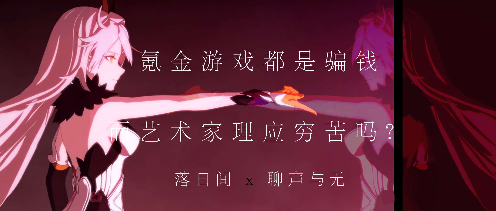
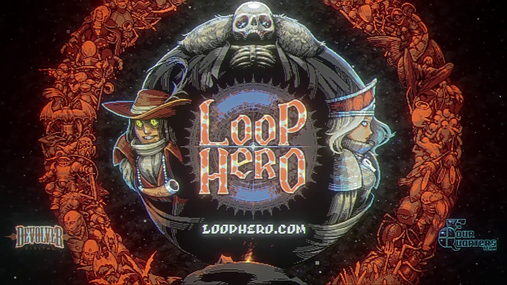
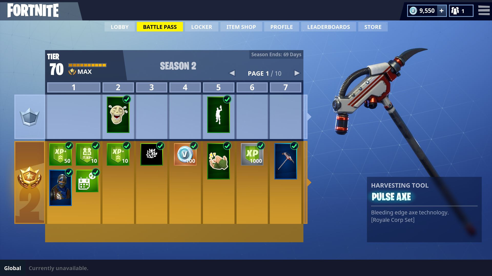
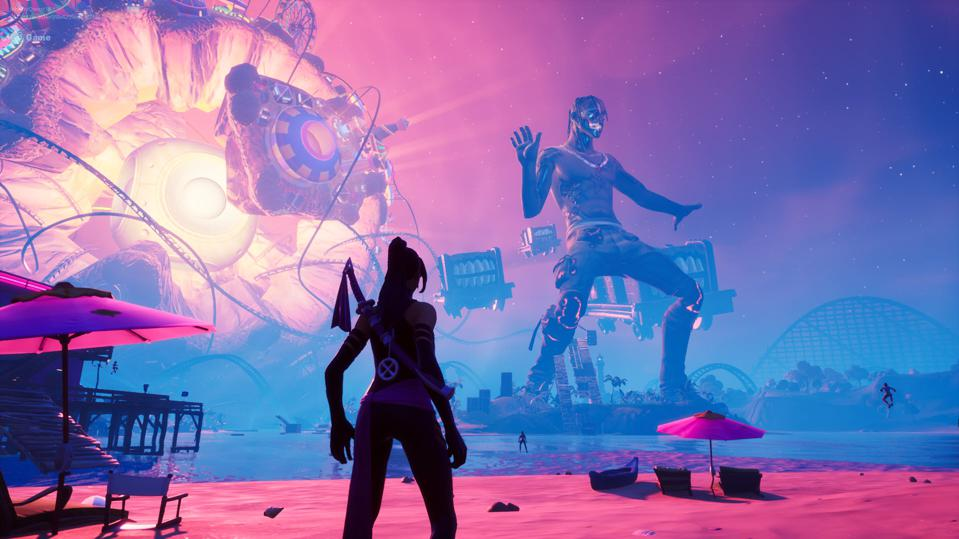
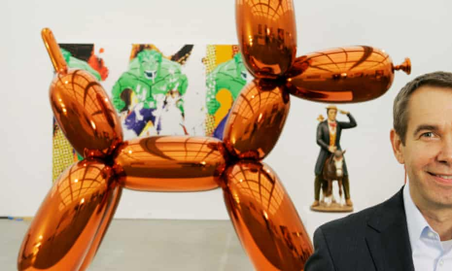
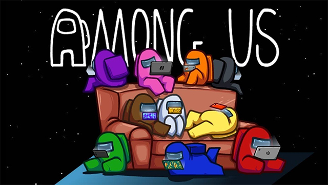
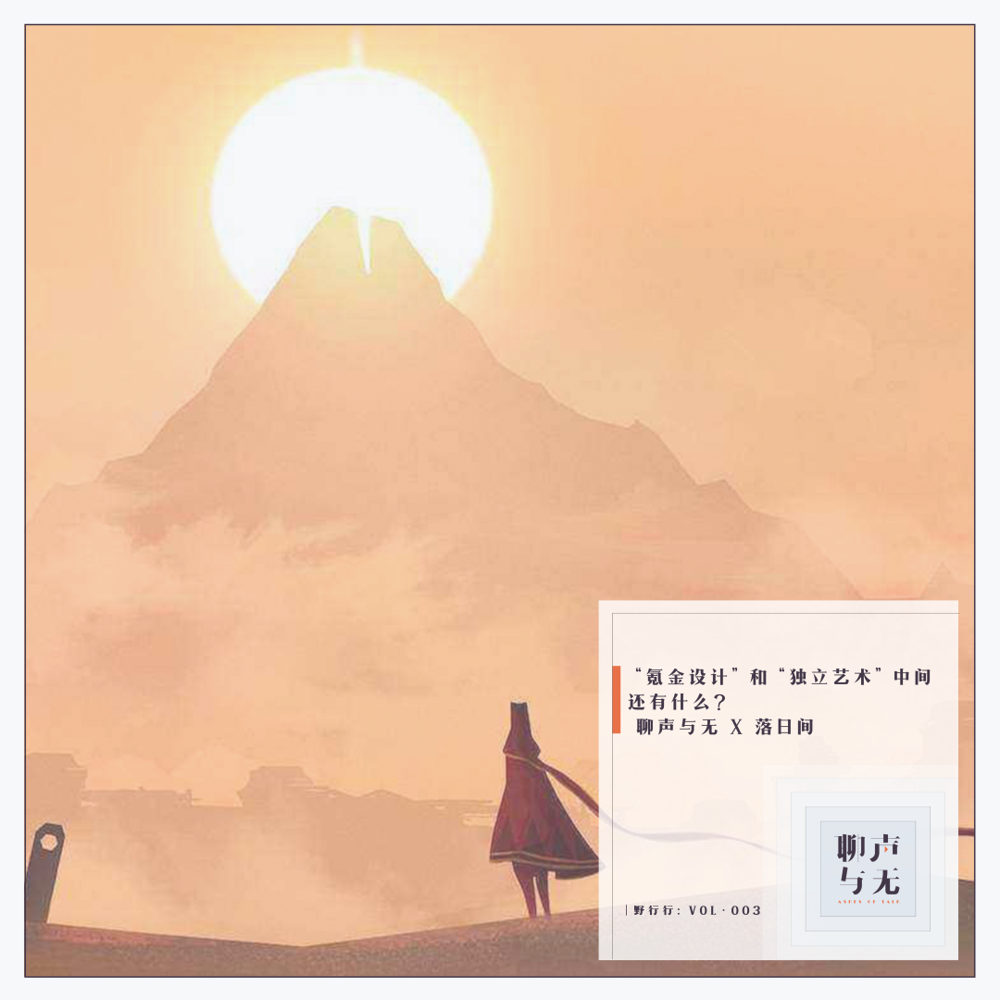

# E22 氪金游戏都在骗钱，而艺术家理应穷苦吗 \| 落日间 x 聊声与无

这期播客是一个追问的起点：

**我们如何在今天的商业世界创作和生存？**

我的观点很简单，无论是 哲学、艺术还是人文，如果我们去妖魔化资本，那只会让自己成为资本的附庸，你远离它和恐惧它，你就不会了解它，更别提去创造性地使用它甚至改变它。在今天这个时代，不同的创作者应该对自己有完全不同的思考并寻找符合自身目的且自身认可的商业化的方式。

## 基本信息

——来自嘉宾@DC的留言

我和很多朋友都说我并不是很喜欢输出价值观这件事情，但我很愿意与人分享我的个人偏好和对事物的看法，也因此我在剪辑中保留了很多我们三人对于游戏创作和商业模式思考的分歧。不管是对于艺术评论、商业化设计又或者对于游戏媒介的价值评价，我觉得都应该营造一种开放的讨论环境，这也是聊声与无想要实现的（试图为本人在节目中的疯狂吐槽挽尊）。

### 收听

落日间版 [E22 氪金游戏都在骗钱，而艺术家理应穷苦吗](https://www.xiaoyuzhoufm.com/episode/6092ded5925f506c9b31e851?s=eyJ1IjogIjVlYmNkNzkwMjFhYzg1ODA0MTJiNzcxMCJ9)

聊声与无版 [野行行Vol.003 \| “氪金设计”和“独立艺术”中间还有什么？](https://www.xiaoyuzhoufm.com/episode/6055842b892e07b459396367?s=eyJ1IjogIjVlYmNkNzkwMjFhYzg1ODA0MTJiNzcxMCJ9) / [微信推送](https://mp.weixin.qq.com/s/tV-Y5B48tN8Lb_OPMljBwA)

### 出场

DC 直流电：商学院研究员，聊声与无ashes of talk主播

Lia：某游戏公司Game Narrative designer，混迹于USC传媒与游戏专业，做过影视编剧/拍过电影/制作过游戏/学过戏剧的斜杠青年

叶梓涛：游戏设计师，《落日间》主理人

### 关于「聊声与无Ashes of Talk」

「聊声与无Ashes of Talk」是由直流电DC与AndPlay联合发起的专注于探索艺术、科技、商业与个体自我表达的播客小组。

## Show Notes

### 开场

00:00 前言 补充

05:03 开场 嘉宾个人背景介绍

### PART I 电子游戏 x 商业

07:00 商业与电子游戏商业化

理论与现实 西奥多莱维特的《营销想象力》 - 游戏是涵盖多元学科的内容载体：《游戏改变学习》（James Paul Gee）

**13:30 从Meow Wolf 的艺术商业展开始的讨论**

Meow Wolf 的艺术家抱团的商业化实践 / 艺术展 与 游戏展

**22:30 浅谈游戏氪金现象和个人经历**

专业训练帮助培养消费者素养：因为太好玩退款《Loop Hero》/ 脱离商家操纵的消费才是游戏价值的理性体现？氪金的定义：是不自觉的过度消费 / 抓住用户心理的生存策略游戏、内容消费的互动小说（乙女向、Chapters和Episode）

**29:40 游戏氪金设计**

国产游戏偏数值的氪金设计：数据驱动付费点优化 / 数值的成本优势

Jonathan Blow免费游戏 vs. 付费游戏：两种不同的媒介 / 用户分层先于游戏机制 / Free to Play是一种可以实现完全价格歧视的先进模式 / 商业游戏的底线

独立游戏的机会：单机游戏加入线上模式 （game as a service） / 差异化的发行（Devolver Digital、Annapurna）

替代性娱乐内容造成了Free to Play出现的必然性

**38:30 无限的免费游戏**

独立游戏短周期的工作模式难以维持免费游戏的运营

氪金游戏的设计方向是无限游戏

订阅制是否会改变行业生态：SoundCloud在分成模式上的新尝试 / 订阅制是更利于小众艺术家还是“超级明星”

**44:25 游戏付费机制的高低之分**

Battle Pass带来的付费机制革命：付费点和游戏设计的整合

游戏付费设计变得越来越subtle / Loot Box对赌场游戏（斯金纳箱）的模拟 / 付费机制也可以视为赞赏创作者的一种方式（OPUS地球计划）

游戏场景远比实验室环境要更为真实：游戏设计师每天都在做模拟（A/B测试）

**58:50 我们还想要在游戏中满足何种需求？**

分类学和游戏设计：分类是否能帮我们更好找到游戏设计的思路？/ 每个原型背后都有阴影

Metaverse和缝合怪游戏：Avatar是一种无限可能 / Metaverse通过“包罗万象但又四不像”的游戏封装所有人的需求和意义

### PART II 艺术创作 x 商业化

**72:20 在批判资本主义之余，艺术家如何找到立足点？**

艺术的价值来自于稀缺性，而游戏拥抱开放和复利的互联网思维：艺术市场的线上化尝试 / 艺术家是否缺少让大众市场接受的能力 / 被艺术馆收藏的独立游戏（陈星汉）

游戏行业实现了技术和设计的绝对领先：艺术馆中不可玩的游戏 / 艺术创作中的黑话、对话和瞎话

游戏品类的特殊性：没有玩家的自我表达是缺失的 / 游戏是一种完美的后现代艺术呈现方式

“引导”在当代艺术中的缺失：游戏入口帮助玩家找到意义所在 / 欣赏当代艺术就像玩爬楼游戏 / 让玩家自行探索需要更高明的设计

**85:50 在商业世界里寻找意义**

商业产品也可以体现科技和人文的关怀：脆弱的公共产品 / 很多艺术名为批判消费主义，实则消费消费主义

艺术家需要保持和市场的互动：艺术身份的反向价值绑架 / 过度的自我曝露并非一种良性的沟通姿态 / 建立更有效架接独立创作者和受众的市场机制

**105:00 一段关于品牌运营和商业化路径的讨论**

标题党动物性背后的流量和品牌调性取舍 / 品牌就像游戏设计中的新手教程 /快速投机 vs. 价值投资

“商业化是否必然导致一个文化产品的异化？又或者说创作者如何面对现实、怎么面对现实？”

## 拓展材料

玛格丽特·马克/卡罗·皮尔森[《很久很久以前》](https://book.douban.com/subject/1136648/)

[监视资本主义：智能陷阱 The Social Dilemma \(2020\)](https://movie.douban.com/subject/34960008/)

《落日间》E19 失落的理想主义：新时代独立游戏开发生存谈

 [写在卸载《阴阳师》之前](https://zhuanlan.zhihu.com/p/24089486)

詹姆斯·卡斯[《有限与无限的游戏》](https://book.douban.com/subject/33438841/)

Every Business Can Be a Subscription Business：[hbr.org](https://hbr.org/podcast/2020/07/every-business-can-be-a-subscription-business)

[堡垒之夜：游戏付费的第三次革命](https://zhuanlan.zhihu.com/p/44222140)

[“氪金”之路：中国游戏付费模式探讨](https://zhuanlan.zhihu.com/p/44297765)

DC老板的论文 Goal Gradient Theory [目标梯度效应与会员体系](https://home.uchicago.edu/ourminsky/Goal-Gradient_Illusionary_Goal_Progress.pdf)

 [中国当代艺术场域中的电子游戏](https://mp.weixin.qq.com/s/fMOkRcm08kW3g4PPFnOvQQ)

《落日间》E16 虚构：虚拟建筑学与游戏建构学

《聊声与无》直流电单口Vol.001 深扒Meow Wolf：从地下艺术团体到商业帝国

[野行行Vol.003：“氪金设计”和“独立艺术”中间，还有什么？\| 聊声与无 X 落日间](https://mp.weixin.qq.com/s/tV-Y5B48tN8Lb_OPMljBwA)

[长篇｜以年轻艺术家为燃料的自媒体平台，究竟在触发什么？](https://mp.weixin.qq.com/s/OJagZh3jAWgZx0uuCY_7Ig)

[机票盲盒：概率促销 98元机票盲盒有多火？](https://mp.weixin.qq.com/s/CTOWeBlvS59o2bUmCUN5uA)

[请帮我分析分析：为什么原神让我氪648，我会上头，买2077 298我却舍不得？](https://www.zhihu.com/question/424310125/answer/1526937092)

[纯数据驱动的Zynga曾经的衰败](https://zhuanlan.zhihu.com/p/136527222)

抽卡 Loot Box 的方式

[充值两万，大仙是否能在成龙传奇里，怒刚土豪？01](https://www.bilibili.com/video/BV18b411k7hZ)

 [迟早更新：订阅制的两个半问题和一个隐喻](https://podcast.weareones.com/109)

订阅制存在的问题：人文角度的来看，这是一种低效的手段，不利于打破和扩大Filter Bubbles。认为未知订阅和已知订阅都不好。杂志的本质应该是发现不同事物之间的联系 - 但是如果是基于订阅制的大众媒体就会有问题，更好的应该是类似mook 或者是 zine。

 [《Making is Show Business now》](https://alexdanco.com/2020/10/08/making-is-show-business-now/)

正向的独立游戏的支持内购付费例子 [OPUS Rocket of Whisper](%20https://www.sigono.com/)

[疯投圈 51. 从泡泡玛特谈起：物质消费中的情感价值](https://www.xiaoyuzhoufm.com/episode/601a83dc939fa818084e03f8?s=eyJ1IjogIjVlYmNkNzkwMjFhYzg1ODA0MTJiNzcxMCJ9)

[阿特小报：他们是世界上最有钱的人，但他们不买艺术品。](https://mp.weixin.qq.com/s/qegZop0ys5kEbkGSnWZP9Q)

[邱志杰：十大学生腔](https://www.douban.com/note/496169901/?from=tag)

说唱歌手小老虎的[爱发电界面](https://afdian.net/@jfever)

Vue.js 的[赞助页面](https://cn.vuejs.org/support-vuejs/)

Nicky Case的 Patreon赞助页面 [Nicky Case is creating ✨playful things ✨](https://www.patreon.com/ncase)

独立游戏组织 Sokpop 的网站 [https://sokpop.co/](https://sokpop.co/)

GDC 分享 [One Year of Sokpop Games Subscription on Patreon](https://www.youtube.com/watch?v=7c2lYRWNxyY&t=1s)

我听 huhu 分享做的笔记 [关于《创作者经济》](https://m.okjike.com/originalPosts/606a9e32111a4f001827ccb9?s=eyJ1IjoiNWM2ZTdkYWU1YmQ5ZTEwMDEwN2VhZGQ4IiwiZCI6MX0%3D)

灵感买家俱乐部 解散派对 [「创作者与钱」](https://mp.weixin.qq.com/s/wf7dYhryNldXEfzxKwi1ew)

播客 科技早知道 [S5E03｜创作者经济为何开始在美受到追捧？](https://www.xiaoyuzhoufm.com/episode/6064560cb0f61e89dce95b7b)

[耗时600小时！纯手工含泪总结2020 @蘸酱Jam](https://www.bilibili.com/video/BV17z4y127rz)

[Tale of Tales](http://tale-of-tales.com/)

落日间的[爱发电页面](https://afdian.net/@sunset_studio)

Show Notes 还有很多扩展资料很多由 DC 倾情补充，感谢！

## 评论

> 终于体会到梓涛说的回听两个月前播客的那种羞耻感，或许我也应该放下对信息密度的执着并学着做自我考古。 落日间发布的这期几乎保留了我们当时完整的对话，我的牙套音也无处隐藏了🤭 因为播客，我开始有很多机会和欣赏的创作者交流。但老实说聊声与无只是我用来学习和表达的媒介之一，未来还会探索更多有趣的方向（这是预告没错）

—— @ DC  

