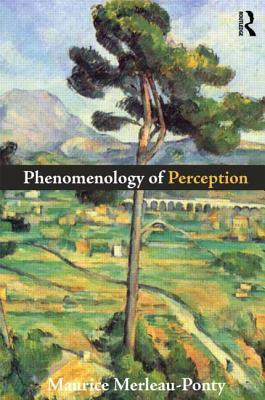

# E23 在哲学与游戏之间 \| 姜宇辉 x 落日间

落日间在逐渐找自己的位置。

我们通过将游戏和不同的学科联结并构成对话，围绕电子游戏这样一个新兴事物的思考展开对其他学科的外部性思索，同时也借助外部来推进我们对于电子游戏的思考。

播客之于落日间也越来越成为某种记录：**记录下我们与更多人更多人对话的努力**，无论是否成功与否，但相信都是宝贵的探索。

非常高兴能够请到我特别喜爱的姜宇辉老师一起聊游戏和哲学，感谢他愿意以平等尊重的姿态和我进行交流。

这次的疏忽在于我没有提前好让老师配置好远程麦克风和录制，采用了会议云录制，音质并不那么好，十分抱歉。

但我觉得这或许是落日间目前最真诚和有力量的一期，就我们如同在播客里所说的：

**电子游戏与哲学就如同火**，危险，但却给予我们力量和生机。

对这样的话题，我们无法不真诚。  

## 基本信息

### 嘉宾

姜宇辉，巴黎高等师范学校硕士，复旦大学哲学博士。华东师范大学哲学系教授，博士生导师。外国哲学教研室主任。上海市“曙光学者”。法国哲学研究会理事。CAC-CAFAcat 写作计划顾问委员会成员。主要研究方向为当代法国哲学与艺术哲学。专著有《德勒兹身体美学研究》与《画与真：梅洛-庞蒂与中国山水画境》。译著有《千高原》与《普鲁斯特与符号》。目前专注于后人类主义与影像研究。

### 收听

[E23 在哲学与游戏之间 \| 姜宇辉 x 落日间](https://www.xiaoyuzhoufm.com/episode/609dda6a9ff6e8a89fcec0e4?s=eyJ1IjogIjVlYmNkNzkwMjFhYzg1ODA0MTJiNzcxMCJ9)

或在小宇宙app，qq音乐，荔枝fm，苹果Podcast等搜索落日间

## Show Notes

00:00 BGM: Gorillaz - On Melancholy Hill

**02:20 关于姜宇辉老师**

《[奇异人生\(_Life is Strange_\)](https://store.steampowered.com/agecheck/app/319630/)》  
认识姜宇辉老师的讲座《[始于单音](https://www.sohu.com/a/322995114_660788)》/ [部分笔记](https://www.notion.so/yzitao/PSA-68eac0ba9761414b8eb9c2b6feff8664)  
吉奥乔·阿甘本《[万物的签名：论方法](https://book.douban.com/subject/26970610/)》  
陈嘉映《[走出唯一真理观](https://book.douban.com/subject/34988734/)》  
姜宇辉《无生成的影像：从德勒兹到后人类主义》（未出版）  
《[怪物、畸形与幽灵—— “怪物”概念的三重变体](https://mp.weixin.qq.com/s/H_qketedECZ5LvK_8N_34Q)》  
吉尔·德勒兹《[哲学与权力的谈判](https://book.douban.com/subject/19958279/)》，再版为《[在哲学与艺术之间](https://book.douban.com/subject/34990007/)》  
吉林大学讲座《[一切生命的目的皆是死亡——弗洛伊德、福柯与德勒兹的死亡之思](https://www.bilibili.com/video/BV1W5411c7kU?)》/ [笔记](https://www.notion.so/yzitao/38fe49fcffc646828a2b64d55b3c3fe5)  
尤伦斯「游戏咏/永生」游戏研究工作坊《[姜宇辉：火、电子游戏与超梦机器](https://www.bilibili.com/video/BV1xB4y1P7Tu)》/ [笔记](https://www.notion.so/yzitao/8143112339964fe2ac444c3dfceff524)  
《[声音怎么就艺术了－姜宇辉与声音艺术家殷漪对谈](https://www.ximalaya.com/gerenchengzhang/3754907/12624845)》/ 声音剧场《[声音的面容](https://www.trueart.com/news/273310.html)》  
《[姜宇辉 \| 树到底有没有发出声音？](https://mp.weixin.qq.com/s/JV05QD2a7xRcCDkWak1SMg)》

**11:10 姜老师的电子游戏经验**

《横扫千军 Total Annihilation》\(1997\) 《魔兽争霸》《星际争霸》《帝国时代》《红色警戒》《反恐精英 Counter-Strike》（1999 简称 CS）《仙剑奇侠传》（1995）  
即时战略游戏（Real-Time Strategy Game，RTS）如《魔兽争霸》  
角色扮演游戏（Role-playing game，RPG）如《仙剑》  
第一人称射击类游戏（First-person shooting game，FPS）  
指的是《星际争霸》中三大种族中的异虫（Zerg）

《[古墓丽影 Tomb Raider](https://en.wikipedia.org/wiki/Tomb_Raider)》  
《[刺客信条：英灵殿 Assassins Creed Valhalla](https://store.ubi.com/cn/assassin-s-creed-valhalla-all-games)》  
《[姜宇辉 \| “玩是谦恭，不是解放”——作为控制、反制与自制的电子游戏](https://mp.weixin.qq.com/s/wkC6ygVLhZ569ERGiGXXsg)》  
《[姜宇辉：21世纪“颠覆性游戏”反思](https://mp.weixin.qq.com/s/izy_7Vq8IwtzRYuxG3Pheg)》  
《[HOW开幕论坛 \| 严肃游戏：非虚拟与非真实的激进场域](https://mp.weixin.qq.com/s/Q_vD3-x7K3zim3Si7WC2qA)》  
《[地铁：离乡Metro Exodus](https://store.steampowered.com/app/412020/Metro_Exodus/) 》《[Resident Evil 2](https://store.steampowered.com/app/883710/Resident_Evil_2/)》《[Silent Hill](https://www.silenthillmemories.net/main/main_en.htm)》

安东尼·吉登斯 \( Anthony Giddens, 1938 - \) 本体安全\(ontological security\)

《[底特律：化身为人 Detroit: Become Human](https://store.steampowered.com/app/1222140/Detroit_Become_Human/)》\(2020\)《[行尸走肉 The Walking Dead](https://store.steampowered.com/app/207610/The_Walking_Dead/)》\(2012\) 《[棉兰号：黑像集 The Dark Pictures Anthology: Man of Medan](https://store.steampowered.com/app/939850/The_Dark_Pictures_Anthology_Man_of_Medan/)》\(2019\)  
吴冠军《[谁说文科没有实验室？我们的实验是场投资巨大的艺术 \| 吴冠军](https://mp.weixin.qq.com/s/k8_IBwtlzHQu4TTTMN3wYA)》  
《[只狼：影逝二度 Sekiro™: Shadows Die Twice](https://store.steampowered.com/app/814380/Sekiro_Shadows_Die_Twice__GOTY_Edition/)》/ [我的感受](https://www.zhihu.com/question/432724835/answer/1607439594)  
[【游戏制作工具箱】我们需要魂系这个游戏类型吗？](https://www.bilibili.com/video/BV1fx411v7Sh?)  
押井守《[我每天只工作3小时](https://book.douban.com/subject/30240074/)》

**27:10 叶梓涛的哲学阅读经验**

牟宗三《[中国哲学十九讲](https://book.douban.com/subject/34942822/)》《[中西哲学之会通十四讲](https://book.douban.com/subject/4252064/)》《[五十自述](https://book.douban.com/subject/2257462/)》/ [笔记](https://zhuanlan.zhihu.com/p/32696583)  
康德 / 福柯 《[何为启蒙](https://www.douban.com/note/560344139/)》Michel Foucault 《[Dits et Ecrits, tome 2](https://book.douban.com/subject/2073923/)》

詹姆斯·卡斯《[有限与无限的游戏](https://book.douban.com/subject/33438841/)》/ 我给老爷子发的[邮件](https://m.okjike.com/originalPosts/60505af1cb3ace00113a1940?s=ewoidSI6ICI1YzZlN2RhZTViZDllMTAwMTA3ZWFkZDgiCn0=) / 《[我知道自己在玩游戏，所以我不相信](https://zhuanlan.zhihu.com/p/25055224)》  
皮埃尔·阿多《[作为生活方式的哲学](https://book.douban.com/subject/25900373/)》《[伊西斯的面纱：自然的观念史随笔](https://book.douban.com/subject/30267181/)》  
梅洛庞蒂《[哲学赞词](https://book.douban.com/subject/1048338/)》《[眼与心](https://book.douban.com/subject/2141589/)》

**32:36 哲学与艺术媒介的关系**

陆兴华《[艺术还能做什么？从阿甘本的景观批判出发](https://www.bilibili.com/video/BV1vi4y1472M?t=3305)》  
Ian Bogost [网站](http://bogost.com/) 《[玩的就是规则 Play Anything](https://book.douban.com/subject/30173831/)》《[Alien Phenomenology](https://book.douban.com/subject/6991851/)》《[Unit Operations](https://book.douban.com/subject/3233800/)》

康定斯基《[艺术中的精神](https://book.douban.com/subject/6437840/)》保罗·克利《[克利与他的教学笔记](https://book.douban.com/subject/6429635/)》  
德勒兹《[电影 I 运动-影像](https://book.douban.com/subject/26803559/)》《[弗兰西斯·培根：感觉的逻辑](https://book.douban.com/subject/2249390/)》  
《[何以为家](https://movie.douban.com/subject/30170448/)》\(2018\)

**44:00 哲学学科的外部性 Dehors / 电影哲学文本中创作者视角的缺失**

米歇尔·福柯 《[词与物](https://book.douban.com/subject/26838822/)》  
齐泽克《[斜目而视：透过通俗文化看拉康](https://book.douban.com/subject/5905979/)》《[真实眼泪之可怖: 基耶斯洛夫斯基的电影](https://book.douban.com/subject/30134614/)》齐泽克自己的电影《[变态者电影指南](https://movie.douban.com/subject/1887385/)》（2006）《[变态者意识形态指南](https://movie.douban.com/subject/11613507/)》（2012）

  
外部 法语：Dehors - Outside  
米歇尔·福柯《[古典时代疯狂史 Histoire De La Folie a L'age Classique](https://book.douban.com/subject/1393233/)》福柯的历史学家好友 保罗·韦纳《[福柯：其思其人](https://book.douban.com/subject/27602481/)》  
谱系学 福柯《[尼采·谱系学·历史学](https://www.douban.com/note/795985432/)》 / [参考解读](https://www.douban.com/note/384947055/) / 弗里德里希·尼采《[道德的谱系](https://book.douban.com/subject/26264205/)》  
王汎森《[权力的毛细管作用](https://book.douban.com/subject/26581737/)》福柯《[规训与惩罚](https://book.douban.com/subject/33455183/)》

**53:10 电影机器**

《[让-路易·博德里：基本电影机器的意识形态效果](https://www.douban.com/group/topic/78994007/)》dispositif - machine  
姜宇辉《[“谵妄便是清醒者之梦”——后人类时代的谵妄电影（delirium cinema）指南（上）](https://mp.weixin.qq.com/s/q39xt1nTOE7PySLYjoYQbg)》/ 《[指南（下）](https://mp.weixin.qq.com/s/oM9YdnUN3oNChEeM_ePHOA)》  
克里斯蒂安·麦茨《[想象的能指：精神分析与电影](https://book.douban.com/subject/1482365/)》

**60:36 后人类时代的主体性问题与游戏态度**

叶梓涛《[游戏的态度：如果不“严肃”，你就无法感受它的魅力](https://mp.weixin.qq.com/s/p34QyzNl91PUCH4vcKc5BA)》  
机制\(Mechanics\)，动态\(Dynamics\)，体验\(Aesthetics\)《[MDA：一种用于游戏设计和研究的方法](https://zhuanlan.zhihu.com/p/103420183)》  
关于「[异质同质化 heterogeneous homogeneity](https://www.zhihu.com/question/437886651/answer/1850402280)」  
《[导读德勒兹&lt;差异与重复&gt;](https://book.douban.com/subject/35099104/)》

> 德勒兹不断地强调这一点。一种真正激进的批判并非对位于过去的、空心化的批判对象的批判。一种真正的激进批判要展示批判对象在起源处已是批判过了的。

Oulipo 「潜在文学工厂 Ouvroir de littérature potentielle 」[山中天 \| 乌力波60周年：从自己制造的迷宫中逃出去](https://mp.weixin.qq.com/s/rXtcD1uB2rMz640-OkCxnQ) 他们给自己的定义 “Rat qui construit le labyrinthe dont il se propose de sortir” 想从自己制造的迷宫当中逃出去的老鼠 / 使用骑士巡回乔治·佩雷克《[人生拼图版](https://book.douban.com/subject/27116728/)》骑士巡逻（Knight's tour）在文学中的实验性应用

Ian Bogost 《[Video Games Are Better Without Stories](http://bogost.com/writing/video-games-are-better-without-stories/)》/ 叶梓涛《[游戏与电影：相似的外表，不同的灵魂](https://mp.weixin.qq.com/s/Ckqn-KvI4muqtG9xLzDaGg)》Poor Image / LOFI - / Pixel Game / [Pico-8 Fantasy Console](https://www.lexaloffle.com/pico-8.php) 游戏引擎 / 游戏 《[Passage](http://hcsoftware.sourceforge.net/passage/)》《[Stone Story RPG: 现代主义设计的乡愁](https://zhuanlan.zhihu.com/p/23302307) /《[Ailleurs \#2 一与多](https://zhuanlan.zhihu.com/p/93316173)》

[游戏理论：哈伦·法罗基（Harun Farocki）最后的项目 \| ARTFORUM杂志](https://mp.weixin.qq.com/s/Ri24M4JvL-BE0bzJa1UjZQ)

**71:40 「迷影」与「迷游戏」/ Meta Gaming 对游戏的发问**

Stephanie Boluk / Patrick LeMieux 《[Metagaming: Playing, Competing, Spectating, Cheating, Trading, Making, and Breaking Videogames](https://book.douban.com/subject/30150550/)》

佩恩恩《[Ladder System \| 天梯系统](http://paynezhu.com/works/ladder-system2018/) 》三频录像 \| 3 Channel Video，4K，11’49’’，2018

《[赛博朋克 2077](https://store.steampowered.com/app/1091500/_2077/)》

聊天中提到的人「哲川」 [Nick Zhang](https://www.zhihu.com/people/nickzhanggame) 《双子 Gemini》《疑案追声 Unheard》制作人

苏珊•桑塔格《[百年电影回眸](https://www.douban.com/group/topic/75555074/)》 李洋《[迷影文化史](https://book.douban.com/subject/4934772/)》Cinéphilie 迷影 / Claustrophobia 幽闭恐惧症

**80:45 电子游戏「感染」的机会未来**

《[Among Us](https://store.steampowered.com/app/945360/Among_Us/)》  
[敖厂长推广《大圣归来》风波](https://zhuanlan.zhihu.com/p/88575853)

整体对资本和商业的思索见文 [02 当代资本世界生存指北](https://docs.xpaidia.com/gide/02) / [公众号](https://mp.weixin.qq.com/s/A5OmPqvHyoifxOhXUx6PHQ)



