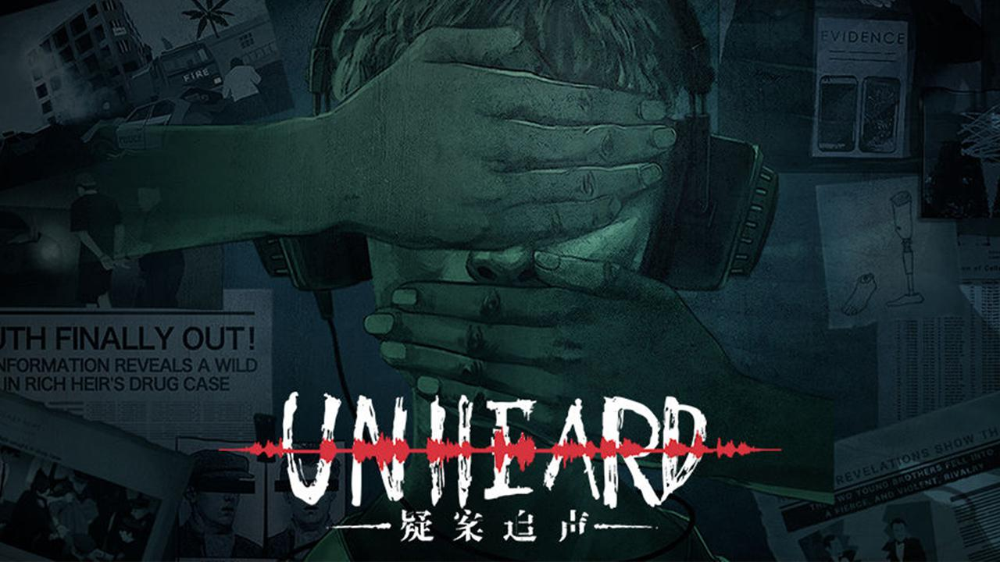
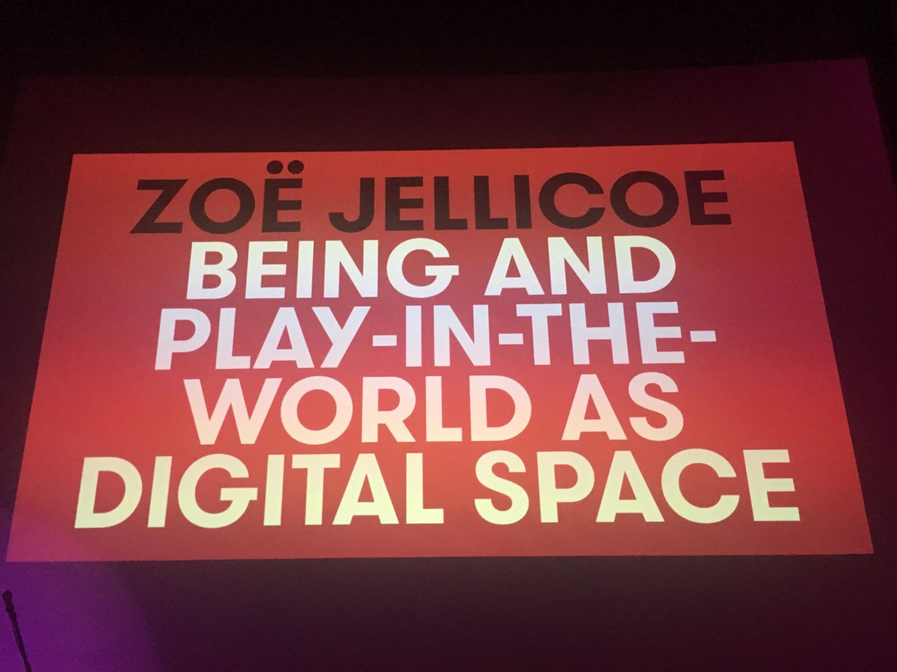
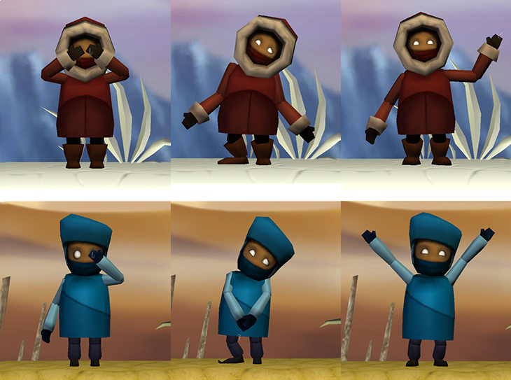
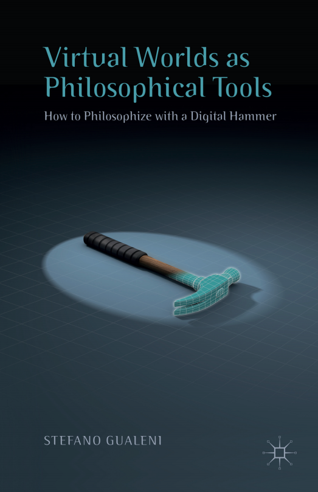
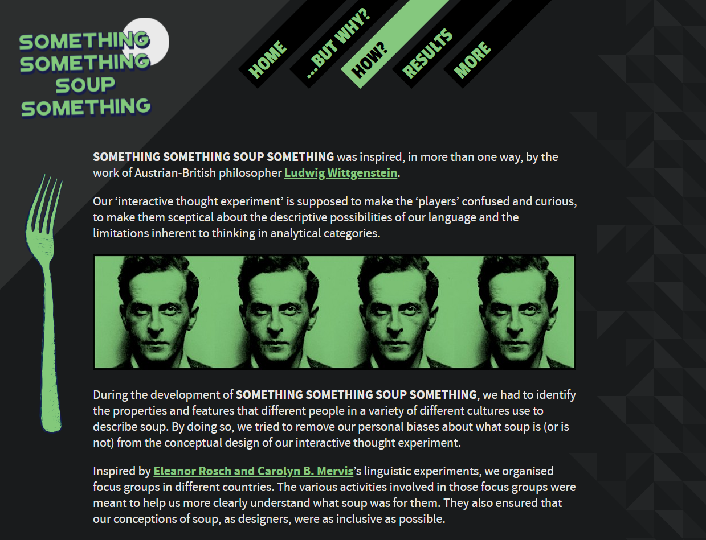
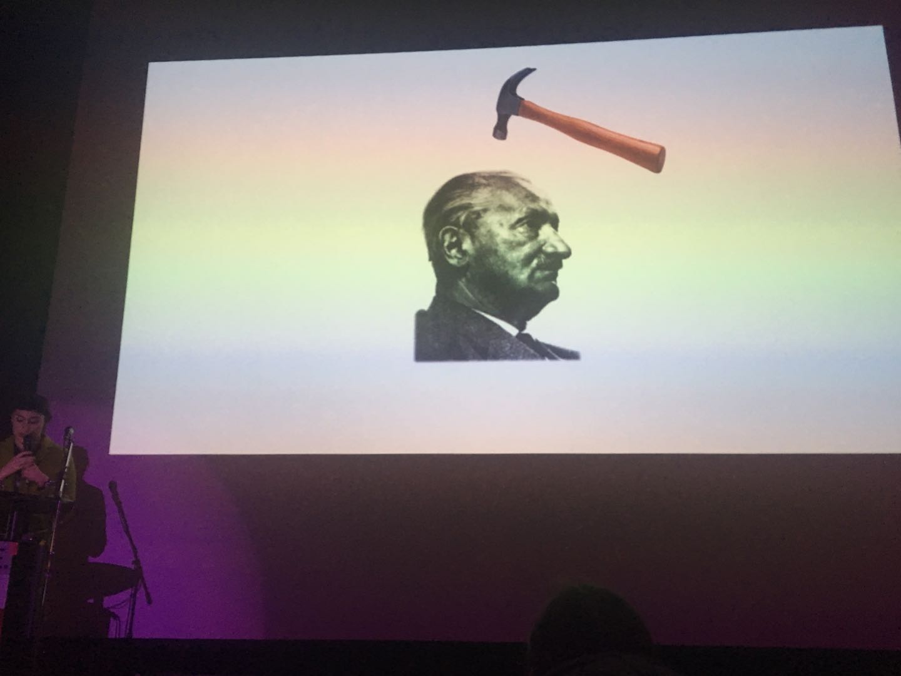
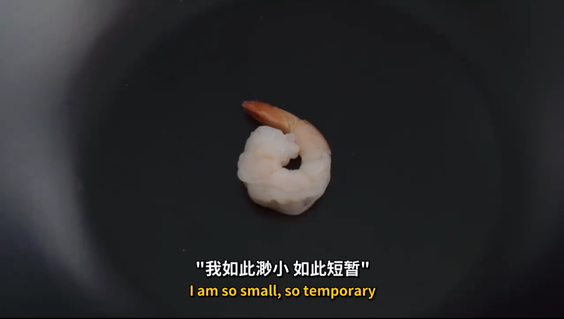

# E25  做个哲学游戏吧！| 落日间 x NExT Studios

## **在语言之前的，和那比语言更多的**

&#x20;好久不见！上次在[E23 在哲学与游戏之间 | 姜宇辉 x 落日间](https://link.zhihu.com/?target=http%3A//mp.weixin.qq.com/s%3F\_\_biz%3DMzIzMjM0NDk1NQ%3D%3D%26mid%3D2247485841%26idx%3D1%26sn%3Db13d56a4733809d724075e5c08e1769d%26chksm%3De8971585dfe09c9375b13654777d8b03ed446c4dcdfcd6cbdcc526fb7fb39b17773c0ca635bd%26scene%3D21%23wechat\_redirect)与姜宇辉老师聊得非常开心，而这次我们则直接把姜老师邀请到了NExT Studios 工作室现场，并与我们的游戏制作人张哲川Nick，一起聊了这一期节目，我也很高兴可以给两位做主持。

我们先回顾了姜老师与NExT Studios的渊源，和他玩《疑案追声》的感受，聊起我们三人都在其中有深刻哲思感受的游戏作品，最后一同讨论了「做一个哲学游戏」的具体可能性。

其中萦绕在讨论前后的，我觉得是对于游戏这个媒介与哲学的共鸣方式的探讨：

游戏能带来的人与人之间的沟通似乎是「先语言」的，或者说是「无言的」，更加基础的、深入的；而其作为能将万物比特化而再重组的电子媒介存在，似乎又可不仅仅停留在语言之上，能借助运动、反馈、视听去给常以文字叙述的哲学更加丰富的感受与具体的把握。

进入一个新的电子游戏，不仅作为一种与日常生活完全不同的「被抛」的场景而冲击着人，而当玩家经过了沉浸并逐渐熟悉了游戏世界，也有能够从Meta（元）的层面去解开游戏，去向玩家展现「在世界中的」的机会。

欢迎一起跟随我们进行创作的头脑风暴与讨论，与哲学教授姜宇辉、《疑案追声》游戏制作人张哲川来做哲学游戏。欢迎在小宇宙和公众号的评论区分享你的观点。

## **收听**

扫码，或在QQ音乐，苹果等Podcast平台搜索 落日间

\*本期播客节目是落日间与游戏工作室 NExT Studios 官方播客《爱游新生》的串台节目，关于《**爱游新生**》：

「爱游新生」——NExT播客新体验，自带New Experience and Technology（新体验与技术）基因，关注游戏的人，谈论关于游戏的方方面面，立志做一个只要想进入游戏的世界，就能听得懂的游戏聊天节目。

更多欢迎参考《[做创意游戏的那些“意外”](https://link.zhihu.com/?target=https%3A//mp.weixin.qq.com/s%3F\_\_biz%3DMzUzNjI3OTE5NQ%3D%3D%26mid%3D2247491576%26idx%3D1%26sn%3D92416aa7a32da2c630d604ebbfec3cda%26scene%3D21%23wechat\_redirect)》

## 嘉宾

**张哲川 Nick**

NExT Studios 《疑案追声》制作人 ，见[《疑案追声》制作人张哲川：这或许是走出大内卷时代的一线希望](https://mp.weixin.qq.com/s/WCnr6AFAxHPhj2oEe4pNAQ) ，参与的其他播客可见： 《[山顶洞人#005 张哲川：爱看戏的声音侦探](https://www.xiaoyuzhoufm.com/episode/5e4ff35b418a84a046962a6d?s=eyJ1IjogIjVlYmNkNzkwMjFhYzg1ODA0MTJiNzcxMCJ9)》《[故事FM E445.三位独立游戏开发者的勇者之路](https://www.xiaoyuzhoufm.com/episode/5fd9e4d0dee9c1e16d750904?s=eyJ1IjogIjVlYmNkNzkwMjFhYzg1ODA0MTJiNzcxMCJ9)》

**姜宇辉**

巴黎高等师范学校硕士，复旦大学哲学博士。华东师范大学哲学系教授，博士生导师。外国哲学教研室主任。上海市“曙光学者”。法国哲学研究会理事。主要研究方向为当代法国哲学与艺术哲学。专著有《德勒兹身体美学研究》与《画与真：梅洛-庞蒂与中国山水画境》。译著有《千高原》与《普鲁斯特与符号》。

.png>)

BGM：Jason Rorher - Passage [游戏背景音乐](https://link.zhihu.com/?target=http%3A//hcsoftware.sourceforge.net/passage)

封面游戏：Gorogoa

公众号封面：视频《厨房里的哲学家——海德格尔》

上期内容见 [E23 在哲学与游戏之间 | 姜宇辉 x 落日间](https://link.zhihu.com/?target=https%3A//www.xiaoyuzhoufm.com/episode/609dda6a9ff6e8a89fcec0e4%3Fs%3DeyJ1IjogIjVlYmNkNzkwMjFhYzg1ODA0MTJiNzcxMCJ9)

## Show notes

### 一 姜老师遭遇 NExT

**02:30 正式开场与嘉宾介绍**&#x20;

**04:00 姜老师与NExT Studios的缘分**

2020/11/21 华东师范大学哲学系 游戏哲学研讨会 \
2021/3/20 尤伦斯「[游戏咏/永生](https://www.thepaper.cn/newsDetail\_forward\_11877743)」《[姜宇辉：火、电子游戏与超梦机器](https://www.bilibili.com/video/BV1xB4y1P7Tu)》 \
[HOW开幕论坛 | 严肃游戏：非虚拟与非真实的激进场域](https://mp.weixin.qq.com/s/Q\_vD3-x7K3zim3Si7WC2qA) （2019.8.2） \
[HOW Vision | 说不可说：电子游戏的艺术语言](https://mp.weixin.qq.com/s/8kjMPfVYOQwDzoGPWstnfw) (2019.10.13)

**05:20 NExT Studios作品《**[**疑案追声 Unheard**](https://store.steampowered.com/app/942970/Unheard/)**》**

姜宇辉老师的声音哲学研究 [姜宇辉 | 树到底有没有发出声音？](https://mp.weixin.qq.com/s/JV05QD2a7xRcCDkWak1SMg)\
姜老师提到的是他未发布的论文《游戏不相信眼泪——晚近中国独立电子游戏中的人声与感动》《[Perception](https://store.steampowered.com/app/426310/Perception/)》《[Dark Echo](https://store.steampowered.com/app/368650/Dark\_Echo/)》《[ICEY](https://store.steampowered.com/app/553640/ICEY/)》《[Paper Dolls: Original / 纸人](https://store.steampowered.com/app/1051310/Paper\_Dolls\_Original/)》

#### 07:20 游戏哲学写作与游戏创作者的碰撞

关于电影批评《[迷影文化史](https://book.douban.com/subject/4934772/)》《[电影是什么？](https://book.douban.com/subject/3266617/)》 [居伊·德波 Guy Debord](https://movie.douban.com/celebrity/1014808/)

#### 09:50 谈创新

### 二 现在的游戏怎么可以更哲学？或者是带给更多的哲思？

12:00 给我们带来哲思的游戏

Jason Rorher 《[Passage](http://passage.toolness.org)》Jonathan Blow《[见证者 The Witness](https://store.steampowered.com/app/210970/The\_Witness/)》《[孤山速降 Lonely Mountains: Downhill](https://store.steampowered.com/app/711540/Lonely\_Mountains\_Downhill/)》

《[Everything](https://store.steampowered.com/app/582270/Everything/)》[起初我是一匹野马，后来我成了整个宇宙丨触乐](https://mp.weixin.qq.com/s/8PrbAusW2hjrS1MHvT1xwA) 艾伦 · 瓦茨(Alan Watts)的哲学家 《[山 Mountain](https://store.steampowered.com/app/313340/Mountain/)》 [Steam 7大名著](https://www.zhihu.com/question/28687268)

《[SPORE 孢子](https://store.steampowered.com/app/17390/SPORE/)》

《[死亡搁浅 Death Stranding](https://store.steampowered.com/app/1190460/DEATH\_STRANDING/)》不同于数值成长、eye candy的驱动方式

#### 19:05 游戏未来的公共空间，在一起

《[姜宇辉 | “玩是谦恭，不是解放”——作为控制、反制与自制的电子游戏](https://mp.weixin.qq.com/s/wkC6ygVLhZ569ERGiGXXsg)》

#### 24:40 姜老师喜欢的末世游戏

《Life is Strange》《Metro：2033》《辐射 Fallout》 apocalypse

#### 26:50 《赛博朋克2077》的超梦，游戏作为交感 Telepathy

来自《[火、危险、交感：电子游戏中的情感](https://mp.weixin.qq.com/s/mqzvuUO4ehaDb562yuUR6g)》

Noninvasive Brain Interface [A Direct Brain-to-Brain Interface in Humans’, in PLoS One, November 2014, Volume 9.](https://www.researchgate.net/publication/267809989\_A\_Direct\_Brain-to-Brain\_Interface\_in\_Humans) 「这个实验本身无疑是里程碑式的，因为它真正用“non-invasive”的方式实现了对那些看似最为内在、私密、隐藏的“non-verbal content”的意念的直接真实的传输。」

#### 29:10 游戏中人与人「前语言」的沟通

作者[ChrisBell](https://chrisbelldesign.com) 的作品《WAY》 [WAY-in Way, two strangers learn to speak](https://makeourway.com) Chris Bell 后面也参与了《Journey》《艾迪芬奇的回忆》《Sky 光遇》等作品的制作，Nick提到的演讲是Chris Bell 2012年在GDC的分享《[Designing For Friendship](https://chrisbelldesign.com/Designing-For-Friendship)》在其官网上有链接，落日间 日 | 落翻译计划已经翻译完成 ，参加落日间公号 《[译介：Chris Bell 面向友情的设计 Designing For Friendship](https://mp.weixin.qq.com/s/hLKsZvM-\_nmIipw7pibiFA)》。

#### 33:27 双人与多人游戏中的当下动作

《It takes two 双人成行》

《[IG队内语音2018大合集，骚话迭起，阿水的情商真的很高](https://www.bilibili.com/video/BV15t41127Gi?)》

#### 34:50 游戏世界中的「被抛」

陈星汉关于《Journey》的GDC Talks中文翻译：[《风之旅人》设计师分享团队开发游戏的过程](http://gamerboom.com/archives/81509)

> _我们增加了玩家之间的物理特性，使得他们可以互相推，能够感觉到对方的存在。这非常棒。_

> _但是，玩家们所做的，并不是把对方推过岩石，而是把他们推向一些更奇特的东西（仙人掌）。有很长一段时间。我觉得是因为这些玩家玩了太多的使命召唤，他们变得这么险恶了。但后来，我们在自己办公室做测试，我们的主程序，把我推到障碍物上杀掉了，很多次。我问他，你知道这个游戏是关于帮助他人和建立情感连结的对吧？为什么你总是在这样做？他只是看着我，大笑，因为我们就在办公室两端，他说：快复活（再来一次？）。然后我意识到，有好长一段时间，我对人性感到失望。有一天朋友介绍我见了一个心理咨询师。我就和她谈了人性的这种困境。她说，因为他们是玩家。他们是婴儿。什么意思呢？当你把你自己从现实世界代入到一个虚拟空间中，特别是一个角色长的像成年人的虚拟空间，你不再保持现实世界中的那些道德规范了。你就像一个婴儿。婴儿只追求反馈。把一个人推上岩石没有任何反馈，但把一个人推死，会有动画，有血，有哭喊的声音，有一股压抑着的社交焦虑等待你去复活你的人物。这更多是关于回馈的。当然玩家想要做有更多回馈的事情。所以我学到了，道德并没有代入到虚拟世界中，为了控制玩家的行为，你要控制输入和输出。_

### 三 哲学游戏的脑暴

#### 36:24 「多于语言」的哲学游戏的可能与考察

Gua-Le-Ni 的专著《Virtual Worlds as Philosophical Tools: How to Philosophize with a Digital Hammer》同样以尼采、海德格尔的锤子出发。

《Harfest》用第一人称模拟的飞行来处理 Thomas Nagel 的心智哲学论文 ：What is it like to be a Bat ? (1974)

《[Something Something Soup Something](https://soup.gua-le-ni.com)》

《[Here](https://here.gua-le-ni.com/%20)》Inference 指涉

《[Necessary Evil](https://evil.gua-le-ni.com)》

Pippin Barr : [SNAKISMS](http://www.pippinbarr.com/2017/01/25/snakisms/%20) 对于游戏中预设的价值观的揭示

#### 41:45 海德格尔的锤子？

见《存在与时间》第十五节 在周围世界中照面的存在者的存在

这里提到的应该是 Graham Harman: [Tool-Being: Heidegger and the Metaphysics of Objects](https://www.amazon.com/Tool-Being-Heidegger-Metaphysics-Graham-Harman-ebook/dp/B005IG5YNO)

Ian Bogost Play Everything，中文 《[玩的就是规则](https://book.douban.com/subject/30173831/)》

伽达默尔眼中的海德格尔 见回忆录《哲学生涯》《[「绝大多数人不想同行」](https://book.douban.com/review/13602099/)》

#### 44:14 作为「图解」或「共鸣」的哲学游戏？

谈论哲学与电影的共鸣之物 德勒兹在电影学院的讲座《[什么是创造行为？Qu'est-ce que l'acte de création?](https://www.bilibili.com/video/BV1CV411Y7VJ) 》

#### 50:15 关于自由的脑暴 ①

姜宇辉：[后人类时代-人类的超越与自由](https://www.bilibili.com/video/BV1xV411m7xq)

#### 58:13 关于自由的脑暴 ②

&#x20;[什么是涌现？](https://mp.weixin.qq.com/s/1g0Kg105aT4tPpqpRsIJzg)

#### 64:40 概念的形象与「被抛」的游戏世界

《[厨房里的哲学家——海德格尔](https://www.bilibili.com/video/BV1Bs41197fx)》

进入游戏世界 - 「被抛」- 熟悉游戏 - Meta - 在世界中本真

#### 68:40 批判反思与Meta Game

《[How to Do Things with Videogames](https://book.douban.com/subject/6905762/)》

#### 70:00 作为Inviting的游戏艺术

#### 71:33 关于时间的脑暴 ① Materialized idealism

#### 72:47 姜老师认为的游戏的时间性

《生化奇兵：无限 Bioshock: infinite》

#### 75:45 关于时间的脑暴 ② 三种钟

&#x20;Digital Time is Dead Time

《[历历在目 Before your eyes](https://store.steampowered.com/app/1082430/\_/)》

《[游戏设计中的时间 | 落日间](https://docs.xpaidia.com/ficstruction/undo/timeingamedesign)》

#### 82:00 关于讨论的讨论，作为游戏设计的播客

感谢姜宇辉老师与Nick，也非常感谢NExT Studios品牌组的支持。

