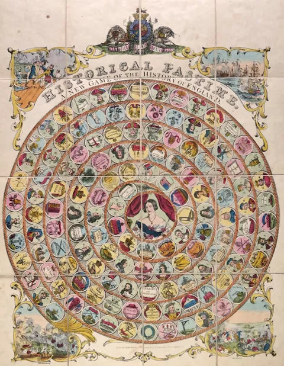
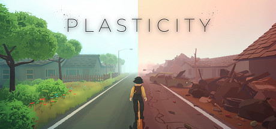
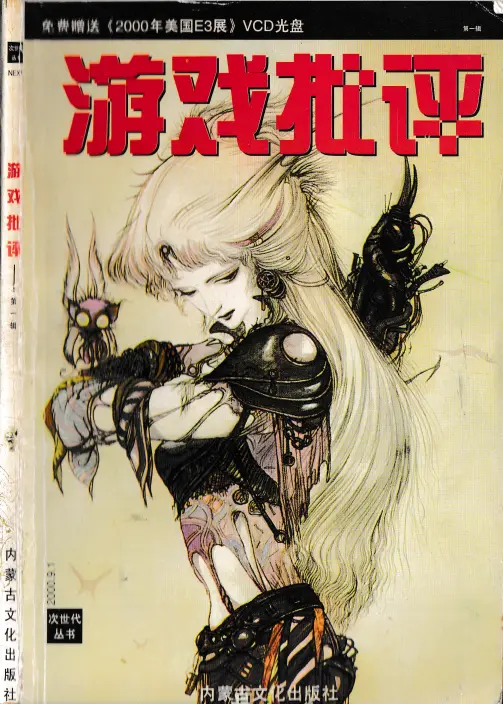
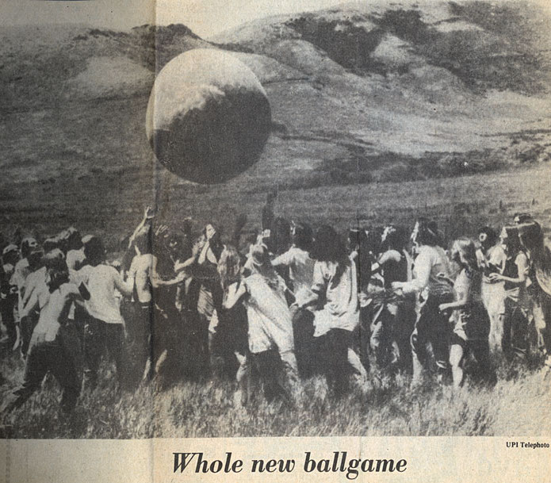

# E27 异乡的两生花：再谈游戏与当代艺术中的现实主义，批评与作品 | 落日间 x 卡壳

落日间 x 美凯龙艺术中心「卡壳Cacotopia」

本期内容是与美凯龙艺术中心播客《卡壳Cacotopia》的串台节目。

“卡壳”（Cacotopia）是一个收集不同声音的播客项目，专注于那些在日常生活中容易被忽略的声音。“卡壳”每期邀请1～2位艺术家、学者、研究者作为嘉宾，与我们共同分享他们跨学科的创作、文本和思考。

查看卡壳对本期的推送以及部分内容的文字版与注释： **《**[**卡壳｜与游戏研究者和设计师聊聊现实主义、艺术评论和美术馆中的游戏作品**](https://mp.weixin.qq.com/s?\_\_biz=MjM5NDk5NTgxNw==\&mid=2247488259\&idx=1\&sn=5c7d45b70f5d8b2c60fdd08442616fc9\&scene=21#wechat\_redirect)**》**

Hi！本期内容是前段时间受到美凯龙艺术中心的播客计划《卡壳Cacotopia》的邀请所做的一期播客，主持人Noah陈於建是我的朋友，也是《黑齿》杂志助理编辑和美凯龙艺术中心助理策展人，他在听了落日间与刘梦霏老师的那期《[E13 游戏能否改变世界：现实主义游戏与一次社会实验](http://mp.weixin.qq.com/s?\_\_biz=MzIzMjM0NDk1NQ==\&mid=2247485506\&idx=1\&sn=abd86daac07d29dc46472472beb47d7d\&chksm=e8971456dfe09d406d1a7a0fb0edd55e7418597d7af932cd9c4dc1c7450e23c58d545178714c\&scene=21#wechat\_redirect)》后在黑齿杂志做了推荐（[黑齿编辑部元旦快电](https://mp.weixin.qq.com/s?\_\_biz=MzI3Njc2MDE2MA==\&mid=2247484945\&idx=1\&sn=5e833cafed3b5618bf027522f7695472\&scene=21#wechat\_redirect)），然后就联络上了。

在半年后的今天，刘梦霏老师参与的「游戏星球」纪录片拍摄结束，而我也有了些思考的推进，所非常开心能借着这个机会和刘梦霏老师还有Noah再进行一次讨论，也是是**学术研究者，当代艺术工作者，游戏行业从业者**的三方的一次深入交流。

近来我播客和实践中深刻感受到，**电子游戏与文化圈存在着一种双重的认知错位。**

游戏行业坐拥充分的资本，技术与大众，却妄自菲薄，缺少人文的自觉与实践；而当代艺术和文化圈或许则是完全相反，学术和艺术作品生产压过与观众之间的紧密联系，漂浮在空中，对电子游戏往往失语。双方之于自身，之于对方都有着某种认知失调，我们需要更多在两者之间的工作与讨论来摆正这一情形。

刘梦霏老师在谈论过程中提到的：「今天我们往往以**异乡**来看待历史，而不是一个与自身有时间接续的存在」，这令我颇有感触。

游戏和当代艺术之间也并不应该是异乡，不应该被场域的空间隔离，即便今天的玩家和当代艺术的受众重合往往很小，但从时间的角度来看，或者未来也有机会相互连接，或许我们曾经有过，而也将会同属一体。

扫码进入小宇宙收听，或在QQ音乐，苹果等Podcast平台搜索 落日间

### **** **Show Notes**

\
**从「现实主义游戏」聊开去**

03:30 Noah的卡壳开场白\
****07:06 「游戏星球」项目简介（见落日间[《游戏能否改变世界：现实主义游戏与一次社会实验》](http://mp.weixin.qq.com/s?\_\_biz=MzIzMjM0NDk1NQ==\&mid=2247485506\&idx=1\&sn=abd86daac07d29dc46472472beb47d7d\&chksm=e8971456dfe09d406d1a7a0fb0edd55e7418597d7af932cd9c4dc1c7450e23c58d545178714c\&scene=21#wechat\_redirect)）\
08:42 「现实主义游戏」概念提出的背景以及基本内涵\
11:08 对于概念的穿刺与艺术界中的「现实主义」\
12:54 概念的生命力与误用，与自我与世界紧密的，有人文关怀的游戏创作\
15:55 此类游戏创作目的论和创作动机之间的张力

17:05 《女神异闻录5》（P5）所进行的现实批判，游戏最擅长的是传达的「虚」的事物，是戏假情真 \
19:50 前电子游戏时代的「现实主义」游戏，赛鹅图、大富翁，从Elizabeth的《The Landlord's Game》到《The Landlord's Game and Prosperity》

25:00 游戏是从庄严到浅薄的历史，游戏的社会性与现实的脱钩 \
27:30 从现实主义游戏过渡到了游戏现实主义，将游戏看作深层社会现实的镜子，《王者荣耀》和《吃鸡》背后的「内卷」，历史作为异乡 \
32:33 过去游戏的形态与今天游戏的变化，与自然的脱钩，成长感的出现 \
33:50 游戏作为狂欢节的替代品以及针对狂欢节的两种说法：狂欢节是反抗还是固化了权力结构？「游戏超现实主义」? \
36:30 抽卡游戏背后的「神意」，玩家Agency的变化，是崇高或是亵渎 \
40:30 「治沙」游戏的社会实验所遇到的问题，刻板印象与玩家的游戏素养

&#x20;**何为好的游戏/艺术批评**

44:29 游戏纸媒的消亡和游戏评论式微；兼谈艺术评论与游戏评论的异同\
49:47 什么样的（游戏）评论是好的评论，以文学批评作为范本 / Playable /\
54:30 游戏批评在行业生态中的缺位，以及带来的更多重的价值尺度，活着的游戏批评\
61:50 文字或许难以把握和Reference游戏，游戏主播和视频制作者作为批评者，更生成/时间性的批评可能\
68:48 「无辜的眼睛」的评论空间，评论的真诚。\

**美术馆中的游戏作品**\
****75:00 当代艺术展览中游戏作品的体验为何总是让人尴尬？\
81:30 游戏可能为当代艺术带来的新思路，「向游戏学习」\
83:35 游戏和当代艺术的各自作为亚文化的认知失调\
89:54 艺术家做的游戏类艺术作品与作为市场产品游戏的区别：完成度与测试的缺失\
94:00 艺术作品和游戏的生命周期，艺术游戏作品的缺失，游戏体验作为艺术体验\
98:40 或许落日间要开点工作坊？\

****\
****

### **嘉宾**

刘梦霏，游戏研究学者、游戏化设计师，主要以历史的视角研究游戏的本质与社会影响。现就职于北京师范大学，任讲师，此外兼任国际期刊《游戏研究》审查委员、游戏的人档案馆（Homo Ludens Archive）馆长、游戏化专业委员会学术委员会主席，中华电子游戏研究协会（Chinese DiGRA)前副主席、理事。2015年于北师大开设国内第一门研究生层面的游戏研究课程“游戏研究与游戏化”并于清华大学发起国内第一次游戏研究的国际会议“电子游戏在中国：过去、现在与未来”。

叶梓涛 ，腾讯NExT Studios的游戏设计师，写作者，独立媒体实验室「落日间」的主理人，播客《落日间》的主播，知乎游戏、游戏设计方向优秀回答者，公布的独立作品有《剑入禅境Sword Zen》等。正积极推动电子游戏与人文、艺术、科技的跨界联结、祛魅与创作活动；近期关注的话题有哲学、文学、建筑、互动音乐等。毕业于南京大学，曾前往巴黎第七大学（l'Université Paris-Diderot）交换游学，兼有历史学、哲学、艺术与文化创意、人文社科高级研究院（IAS）的跨学科背景。

**陈於建 Noah**，《黑齿》杂志助理编辑，美凯龙艺术中心助理策展人。

\*嘉宾照片借用友台推送，感谢听友MITOO提供的胶片人像。本次主持由Noah 陈於建进行，这次讨论进行了三个半小时，非常感谢Noah辛苦的剪辑。

**相关链接**

**卡壳推送对本期有很丰富的注释与文字记录，值得参看 《**[**卡壳｜与游戏研究者和设计师聊聊现实主义、艺术评论和美术馆中的游戏作品**](https://mp.weixin.qq.com/s?\_\_biz=MjM5NDk5NTgxNw==\&mid=2247488259\&idx=1\&sn=5c7d45b70f5d8b2c60fdd08442616fc9\&scene=21#wechat\_redirect)**》**

New Games Movement 《[The Impact of New Games: Then and Now](https://www.playgroundprofessionals.com/play/impact-new-games-then-and-now)》

《[Plasticity](https://store.steampowered.com/app/1069360/Plasticity/)》USC Games

[黑齿编辑部元旦快电](https://mp.weixin.qq.com/s/irJjozhO-uPsAItfjCIzyg)

[E13 游戏能否改变世界：现实主义游戏与一次社会实验](https://mp.weixin.qq.com/s/qH6k3QfCk4vskZdV0efMCw)

《[亿万恋人](https://store.steampowered.com/app/1578860/\_/?l=schinese)》

《[赛鹅图：从十四世纪开始风靡的盘上人生](https://www.gcores.com/articles/26417)》

《[游戏图鉴](https://book.douban.com/subject/33435429/)》

《[拉伯雷研究：拉伯雷的创作与中世纪和文艺复兴时期的民间文化](https://book.douban.com/subject/1045923/)》

《[罗芒狂欢节：从圣烛节到圣灰星期三1579-1580](https://book.douban.com/subject/24899303/)》

《[唐运冠：法国中世纪至近代早期的游戏伦理](http://www.cssn.cn/sjs/sjs\_dqgbs/201905/t20190529\_4908293.shtml)》

[中世纪题材的好游戏有哪些？历史上中世纪好的游戏又有哪些？](https://www.zhihu.com/question/354516668/answer/936525271)

Playables 《KIDS》《Plug & Play》

《悠游小说林：艾柯哈佛诺顿演讲集》/ [成为第二层的模范读者](https://book.douban.com/review/13729980/)

重轻《不在场》

张定浩《[无形之物](https://book.douban.com/subject/35323792/)》詹姆斯·伍德《[最接近生活的事物](https://book.douban.com/subject/27073501/)》

《[<游戏批评>创刊号-编者的话（2000年9月）](https://zhuanlan.zhihu.com/p/395757299)》

[PSA青策 | 《平面游击：起来！数字失神者》不完全参观指南](https://mp.weixin.qq.com/s/zcCgpqbU3aNES-TNhSnrFg)

[采访：起来！当代艺术入侵互联网，数字失神者联合打一场平面游击战](https://mp.weixin.qq.com/s/sAFtCtySCZlWzZ18EwvJ2Q)

[黑齿电台 | 胡昊：希望我的文章能跟别人的作品并肩而行](https://mp.weixin.qq.com/s/3-O23gdMn-LaILOHyZhX2w)

indienova《旗舰游戏评论》机核

[山中天 | 乌力波60周年：从自己制造的迷宫中逃出去](https://mp.weixin.qq.com/s/rXtcD1uB2rMz640-OkCxnQ)

韩炳哲《[美的救赎](https://book.douban.com/subject/34841553/)》

吉奥乔·阿甘本《[渎神](https://book.douban.com/subject/26942703/)》

伽达默尔《[美的现实性：作为游戏、象征、节日的艺术](https://book.douban.com/subject/3886632/)》

****

**落日间相关内容**

[中国当代艺术场域中的电子游戏 | 落日间](http://mp.weixin.qq.com/s?\_\_biz=MzIzMjM0NDk1NQ==\&mid=2247485549\&idx=1\&sn=b9376d4301b3dfa53ff6a8424c394f8b\&chksm=e8971479dfe09d6f4cc92c366f7f35d7c4de7f0e3d0eadf4cb9a58b0ebab6704b077d8b77330\&scene=21#wechat\_redirect)

[E7 冯梦波：对照记](http://mp.weixin.qq.com/s?\_\_biz=MzIzMjM0NDk1NQ==\&mid=2247485301\&idx=1\&sn=8de68b1bd75b22236f2b92402fbb904e\&chksm=e8971b61dfe09277d4a6eaf0301f856e4a452cd1524a7959f6f87459329f27eee7099377c6c3\&scene=21#wechat\_redirect)

[E9 如果游戏是答案，那么问题是什么？](http://mp.weixin.qq.com/s?\_\_biz=MzIzMjM0NDk1NQ==\&mid=2247485413\&idx=1\&sn=06aeab9be0e3fd88835c7347eec5f16d\&chksm=e8971bf1dfe092e7444f805b87a9d06d82ed2597d0b8a6c4d0919a91747db5cc20ada1784704\&scene=21#wechat\_redirect)

[E11 生成的线索：游戏的自在之语](http://mp.weixin.qq.com/s?\_\_biz=MzIzMjM0NDk1NQ==\&mid=2247485455\&idx=1\&sn=61b048f563844782d23a96b9d3e03bff\&chksm=e897141bdfe09d0d0893ef0fa45f0783fa0f1e582b306805c1d4d2e32d13a240c2df52da1c08\&scene=21#wechat\_redirect)

[E13 游戏能否改变世界：现实主义游戏与一次社会实验](https://mp.weixin.qq.com/s?\_\_biz=MzIzMjM0NDk1NQ==\&mid=2247485506\&idx=1\&sn=abd86daac07d29dc46472472beb47d7d\&scene=21#wechat\_redirect)\
