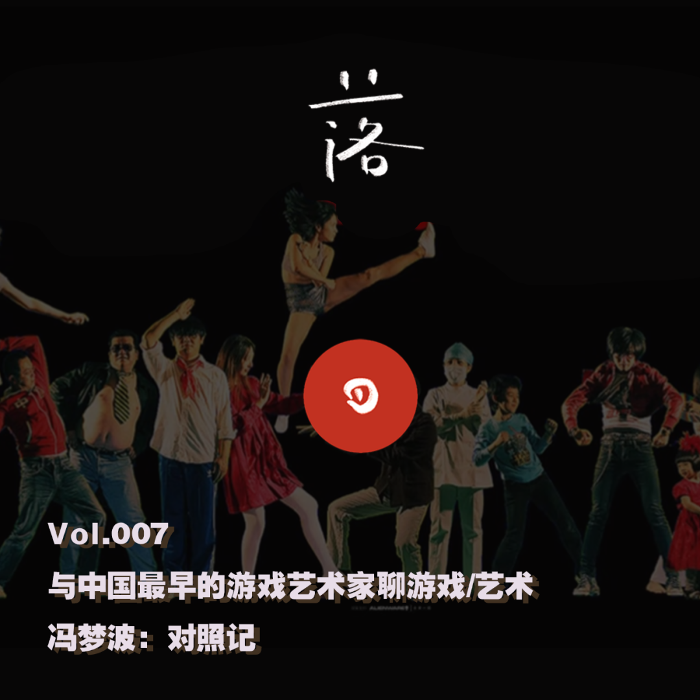
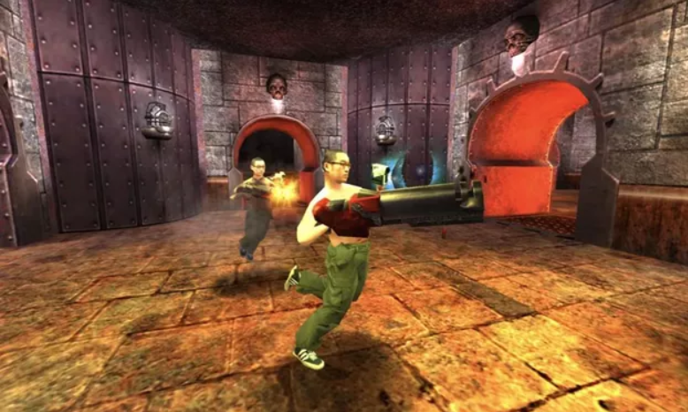

# E7 冯梦波：对照记

### 补遗

在和冯梦波老师聊之前前先通了电话，冯梦波老师非常热情地给我发了他的作品集。感谢杨静让我认识了冯梦波老师，他是个很有力量或者是很会玩的人，无论是「大收藏家」还是「大玩家」可能都不足以形容其对于自己所爱之物的Obsession，他看得很清楚，也明白自己的作品受到欢迎与否，这个艺术圈游戏的承认与否与他自己日常爱好可以并没有绑定关系，他只需要保持业余性，按照自己的兴趣去探索去玩，东西就会自然流露。

我总是很喜欢看到冯梦波老师在朋友圈晒娃，拍狗，还有放他各式各样地通过动捕或者3D扫描建模技术把他喜欢的春丽放到游戏引擎之中看她们在游泳池子玩耍，他像我展现了一个充满好奇的艺术家是怎么去接受和尝试新事物的。也很感谢在后来我写作《中国当代艺术场域中的游戏》一文中给予我的帮助与事后的传播。

希望冯梦波老师能越玩越年轻。

### 基本信息

这是落日间与播客[《山顶洞人》](https://adhk.me)的串台节目，山顶洞人的推送见 [《山顶洞人：#015-016 冯梦波：对照记》](https://mp.weixin.qq.com/s/1KiCDbshfd5\_havwqaczwA)

杨静在山顶洞人版本的这期名字确实取得蛮好的，整个对话后期有着一个从艺术界看游戏，从游戏界看艺术之间的一种对照，前段时间杨静说这像个围城，她和她搭档，还有在游戏圈外的艺术界朋友想着进入游戏行业，而像是我这样的，在游戏工业中的，反而对艺术界跃跃欲试。所以或许从这样的对话也是一个为双方祛魅的过程，在今天这个当代艺术场域和游戏业界都遭遇某些瓶颈的时候，或许可以提供一个新的视角。

#### 嘉宾

**冯梦波**，艺术家，现任教于中央美术学院版画系第六工作室，有游戏艺术作品《Q3》，真人采集图像制作的《真人快打》（新裤子彭磊也在其中），还有类Mario的横板平台跳跃《重启：长征》。

主播

**杨静** 策展人，播客《山顶洞人》洞主

**叶梓涛** 游戏设计师，在做《落日间》

剪辑

**柳柳** 最近在学习巴西柔术和学习做个快乐的人。

####

#### 收听

落日间版：[E7 冯梦波：对照记（原名：与中国最早的游戏艺术家聊聊游戏和当代艺术）](https://www.xiaoyuzhoufm.com/episode/5f4f068f9504bbdb77ba44c8?s=eyJ1IjogIjVlYmNkNzkwMjFhYzg1ODA0MTJiNzcxMCJ9)

山顶洞人版：[#015 冯梦波：对照记](https://www.xiaoyuzhoufm.com/episode/5f4caadd9504bbdb77dc5fff?s=eyJ1IjogIjVlYmNkNzkwMjFhYzg1ODA0MTJiNzcxMCJ9)

#### ****

#### **时间轴**

00:00 开场《DOOM》- Michael Gordon

00:45 落日间开场 艺术家：冯梦波 [在商场里的艺术游戏](http://mp.weixin.qq.com/s?\_\_biz=MzIzMjM0NDk1NQ==\&mid=2247485156\&idx=1\&sn=3b0ae467b2518fa55af18b5d8bb120d0\&chksm=e8971af0dfe093e6a61496e30e91be2c1c3ef6eec1dba21a3d6a03463f8a962abad75ed02f18\&scene=21#wechat\_redirect)

02:02 《山顶洞人》播主：杨静 和我阐述认识冯梦波的过程《重启：长征》

05:00 冯梦波老师自我介绍和有街机的版画工作室

06:50 冯老师的童年 连环画作品《童年》

11:11 冯梦波老师的音乐爱好，与80年代的火热的美好年代

16:15 90年代直到现在的艺术作品创作与工具 游戏《Quake 雷神之锤》冯梦波作品：《真人快打》Nintendo最早的VR设备 [VirtualBoy](https://en.wikipedia.org/wiki/Virtual\_Boy)

28:25 当代艺术圈做作品的出发点，游戏与当代艺术对其媒介的对照与使用

30:33 游戏媒介与艺术作品间的稀缺性与数字分发的不可调和？

34:27 当代艺术界与游戏行业的对照，中国游戏/艺术行业的分裂

41:37 游戏策展与当代策展，线上/实体？[《Devolverland Expo》](https://store.steampowered.com/app/1283220/Devolverland\_Expo/)

45:20 游戏的污名化以及游戏沉迷的现代社会，艺术家看手游/单机游戏，冯老师喜欢玩的游戏

48:15 用游戏讲故事？对于游戏的故事性的讨论

51:50 直播的形式

53:45 从游戏[《Do Not Feed the Monkeys别喂猴子》](https://store.steampowered.com/app/658850/Do\_Not\_Feed\_the\_Monkeys/)谈到游戏的去类型化与多样性；《死亡搁浅》以及魂-like

57:25 科技与原始的创作状态的切换

59:06 《大收藏家》公众号：[大收藏家冯梦波](https://mp.weixin.qq.com/s?\_\_biz=Mzg3MjAyOTkwMA==\&mid=2247494752\&idx=1\&sn=7f9ac51a61e8b45e608e73a16858c57d\&scene=21#wechat\_redirect)，最重要的作品，物品

1:03:18 创作计划的数量讨论，业余精神与独立创作的，无功利性

1:08:45 为艺术界祛魅，关于收藏作品

1:11:15 艺术家眼中的游戏与艺术，游戏与新媒体

1:16:30 游戏/媒介艺术中的科技与工业水平与独立创作的矛盾性

1:18:50 游戏中的写实性与虚幻性的讨论[《Passage》](http://hcsoftware.sourceforge.net/passage/) / [在线](http://passage.toolness.org)2016 继续的发展

1:23:30 跟着兴趣走，不要谈“独立”，独立和主流 —— 冯梦波

****

### **聊两句**

#### @Zitao Ye

可能不知道为什么，或许是大学时候对于哲学的兴趣，同时对于游戏还有艺术的思索，当时艺术与文化创意研修班的课程启蒙，自己总是对于艺术有种说不开的好奇心，我明白在今日当代艺术成为一个多为网红打卡消遣，亦或我等普通人避之不及，看不懂的一个东西，但是就像一个产业一样，它们或许和人文学科的官僚或者僵化一样，在努力斗争与自我改变，努力能够用更新潮的言语，谈论更深刻的事物。

今天很凑巧，前段时间在B站看中国美术学院的节目，其中有几期谈论游戏，然后我就关注留了言，结果今天因此有幸认识了当代社会与艺术思想的两位博士生同学，她们用B站视频的方法，策展游戏化，以游戏为媒介主线的策展都引起了我的关注。

我感觉过去的十多年中国的当代艺术和游戏行业都还未成熟，而这两端似乎中间有着一道很深的裂痕，这里有互联网行业资本注入，游戏成为资本造血机器，重复的商业化手游套路，单机与独立游戏生存空间缩小，且还未成熟的缘故；也可能有当代艺术行业同样在00年后世纪之交的后感性混乱，商业化，艺术家对于新媒体工具的使用还不够纯熟，或是游戏媒介还未被人深入理解的各种缘故。

但也越来越能看到很多游戏艺术的展，也像是上次的[HOW Vision | 说不可说：电子游戏的艺术语言](https://mp.weixin.qq.com/s?\_\_biz=MzA5MzA0NTUyMw==\&mid=2649886187\&idx=1\&sn=4c412cc05be7c4262320d541cc75d7dc\&scene=21#wechat\_redirect)严肃游戏展，这些优秀年轻人的策展游戏展的尝试，我感觉我能看到这两股力量在努力地交汇，期待有那么一天**。**

#### @Yang Jing

很久没有更新了，这个月我开始一砖一瓦地做电子游戏了，这大概是我人生所有工作里最消耗的一次，技术的、叙事的、行业的、自我的，所有难题和挑战迎面而来。我和搭档一共两个人，深感生产力（或者 [aaajiao](http://mp.weixin.qq.com/s?\_\_biz=MzI3NTUzNjM2Nw==\&mid=2247484820\&idx=1\&sn=5258a610371c7a72ef4cfed365571ea8\&chksm=eb020514dc758c027a138107479ad87e765fe1ff510906670bc3a0fd8ceba2c39f224c4f5963\&scene=21#wechat\_redirect)所说的运力）低下。

我问在大厂工作的设计师朋友叶梓涛，为什么这么难啊，如果在大厂就好了。他最近在忙着写艺术相关的文字，反问我，大厂为什么要砸钱做你想做的游戏？

一针见血。好在世界上除了大厂，还有独立游戏，除了独立游戏还有作为艺术品的游戏作品。我和叶梓涛一个月前以前录制了一期播客，访问对象是中国最早最早将电子游戏做成艺术的人，冯梦波老师。他为人熟知的作品中，《长征》系列把任天堂的横版马里奥改造成满是政治波普符号的长征，《阿Q》则是把他自己编入了1999年风靡世界的第一人称视角射击大作《雷神之锤三》中，《真人快打》则把他的家人和朋友变成今天可能会被叫做MR（混合现实）的格斗游戏装置中，每个人还有自己的大招。游戏之外，冯老师也是各种科技产品的早期剁手者，从90年代的mac，混音器到现在的HoloLens，是个大玩家，也是个大收藏家，他的公号《大收藏家冯梦波》连续一整年都在数自己买的保存得很好的各种技术和非技术产品：从花瓶到合成器，应有尽有。他的知识杂而精，所以很难概括，他也不喜欢被人定义和概括，可我总觉得这是一个在机器（软件与硬件）上找到的乐趣比在人事上多的人。

这一期剪辑的时候，我发现我和叶梓涛都在问自己想问的问题，对于听众来说可能不够友好吧，都没怎么具体聊前文提到的冯老师的作品。叶梓涛同学是个「有意思的文科生」，在大厂上班的同时，写文章、做播客（对这又是联合录制的一期，友台是《落日间》），做b站。他总想着反套路，用人文和艺术的眼光来重构艺术设计。而我则羡慕大厂的资源和人力，希望能做出好玩的东西，让好玩更无罪。遇到冯老师这个又艺术又游戏的人，我们当然坐不住，结果大部分问题与回答都成了比较学，谈游戏的时候聊聊艺术家的自由，谈艺术的时候聊聊游戏界的水准。两相对照，两相祛魅，或用冯老师的话来说“各有各的倒霉”。

但各有各的倒霉另一面就是各有各的幸运，世界上哪有什么都满足我们的好职业、好圈子和好人生，创作有时候需要限制，有时是资金、有时是时间、有时是技能，才会有属于创作者自己的独特的作品。而每个创作的人都知道，创作本身的乐趣是最大的。再次quote冯老师“自己和自己玩”——从小时候在脑子里想象世界大战到现在在家里给VR贴图，创作即是游戏。

做媒体这些年往回看，写报道与做访问，每个人问的问题看似一样，其实不一样，总会夹带私藏问些自己关注的事情。几年前我爱问艺术家：“是不是很难？有没有想过放弃？”那其实是在创意产业边缘艳羡但不敢进去的我在给自己找理由，现在喜欢问更具体的问题，更具体的事；叶梓涛一直在问艺术界会不会更自由、更有作者性，我猜想这是他本身对于这两样的认可和渴求吧。冯老师没问我们问题，但听的时候我能察觉谈到机器、软件的时候最兴奋，让我从之前对他的敬畏放松了很多，所谓玩物丧志是我们三个人的最大公约数，然后彼此对照，于是有了这期播客，也有了这期这个题目——当然是盗自张爱玲。

隔了一个月迟迟才出，大部分的工作其实是帮忙做播客的小朋友柳柳完成的，她也写了一段话，是另个视角的冯老师，我抄在这里下面。疫情看来还会持续很长一段时间，每个人都有自己的倒霉要处理，我没什么过来人的经验，可能就是对自己好点吧，放纵点，偶尔玩物丧志一下吧。

「老听众们应该都熟悉，山顶洞人播客受到主播个人风格影响，最大的两个标签就是游戏和艺术了。这一期请到的嘉宾冯梦波老师就完完全全是为这两个领域的集合——他是中国最早关注和运用数字技术的艺术家之一，一个将电子游戏玩成艺术的人。他的作品《长征——重启》《冯梦波：电子游戏》《阿Q——冯梦波的虚拟世界》等都是用电子游戏作为框架建构的。我们的主播杨静小姐还在读博士的时候就受到过冯老师的启发并且厚脸皮地拜访过他，即便如此，请冯老师来上节目对她来说还是一件很有压力的事情，这一次为了做好这个采访，她还邀请到了正在大厂做游戏设计的叶梓涛一起。三个游戏迷在一起聊了聊对于游戏的理解，探讨游戏究竟能不能算是艺术；也拓展到了八九十年代中国艺术的good old days（听冯老师讲那过去的事情）；最后逐渐走向了冯老师为后辈们祛魅艺术这个行业。乍一听冯老师是个严肃权威的师长，让人有些生畏，可是仔细听下来，就会被他的有趣的人格吸引。听到冯老师说小时候坐在床上摇头晃脑当作自己游戏的启蒙时候会忍俊不禁；听到他说会给自己工作室备齐各种游戏机带着学生一起玩会羡慕不已；听到老师介绍自己对音乐，收藏，技术的钻研会由衷地敬佩这个热爱学习的老顽童。山顶洞人一直致力于带着听众们去所有有趣的大脑中钻洞，在他们百转千回的大脑褶皱里探险，写到这里要向各位听众保证，带好你的耳机，你即将开启一段丰富有趣的声音之旅。Enjoy your trip!」

### 其他链接

[CAFA ART INFO 洞见：新媒体领军先锋冯梦波与他的收藏情怀 FENG MENGBO: I am enthusiastic about life for collection!](https://www.youtube.com/watch?v=yw3S\_Y8eUhI)

