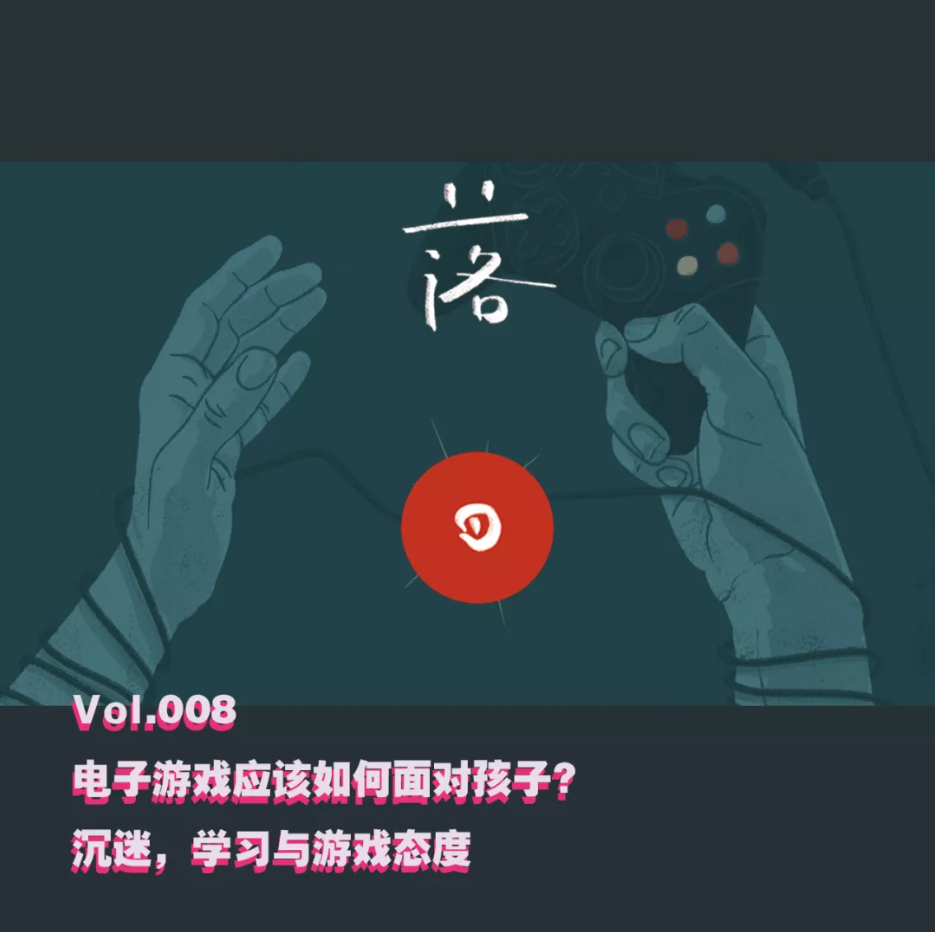

# E8 电子游戏应该如何面对孩子？

## 基本信息

后戏 After Gaming x 落日间 第三期，感谢小宇宙推荐首页。

虽然标题是《电子游戏应该如何面对孩子？》但我觉得在面对电子游戏这样的一个新兴事物前，大部分人都是孩子，大部分人都还没有准备好要如何面对这个事物，如何有一个好的心态去接受它们，穿过它们，使用并创造它们。我个人认为这一期所谈论的内容还是蛮重要的，希望你也能有所获益。

### 出场

叶梓涛 NExT Studios 游戏设计师，在做「落日间」

Xichen 希辰 NExT Studios 音频设计师，前育碧员工，个人网站 [Soundoer](https://soundoer.com/) , B站 [@Xichen](https://space.bilibili.com/157914767)

Tony \(主持\) 游戏运营，游戏爱好者，前新闻传媒工作者

#### 

### 收听

[E8 电子游戏应该如何面对孩子？沉迷、学习与游戏态度](https://www.xiaoyuzhoufm.com/episode/5f6d78b383c34e85ddf835ef?s=eyJ1IjogIjVlYmNkNzkwMjFhYzg1ODA0MTJiNzcxMCJ9)  

### **时间轴**

00:59 拉家常和自我介绍

01:39 话题：孩子与游戏

03:12 游戏是洪水猛兽？

07:30 免费/单机游戏的媒介属性“媒介即信息” 与商业模式

12:30 沉迷是什么？应该如何定义？为什么会认为某事是沉迷？功利主义/无用论

15:40 上瘾内含的价值判断/上瘾与沉浸的区别“斯金纳箱子”/上瘾与抑郁的因果倒置/

19:20 对于家长/老师/我们来说如何判断上瘾和沉浸的区别？

21:10 游戏的“无功利性”的态度

21:50 游戏媒介的特性以及碎片化

22:58 游戏作为一个广泛类型作品的集合，以“更高层视角”看游戏

24:30 游戏有没有用？

26:10 无功利性与审美，过程与目标，事物本身的乐趣与意义

29:00 游戏与学习 游戏作为学习过程本身/功能游戏/游戏改变学习/游戏与教育。

31:05 游戏带来的某种“能力”/ 老年人玩游戏？

34:15 家长应该尊重孩子的世界

35:35 从业者应该如何面对玩家与孩子?

37:58 电子游戏的社会责任与社会历史进程，玩家游戏素养与审美

41:40 个人的审美体验的进步，《江南百景图》

44:00 现在的火热游戏王者/吃鸡，取决于游戏态度与自我选择

46:15 如果给广泛传播的免费游戏施加年龄评级，是否可以作为一种解决方案？

48:30 游戏鉴赏能力和素养的成长/好的互联网产品与好的游戏

50:27 如何找到合适的好游戏？任天堂/主机游戏/Steam/Wegame平台/独立游戏

54:00 游戏作为家人之间的互动桥梁与共度美好时光的方法，平常心，反向输出

56:40 作为历史进程中的新事物，上世纪的美国广播，

58:40 历史进程的感慨，或许孩子作为数字原住民比我们会明白如何对待世界

1:00:24 彩蛋-个人自白与结尾

#### 

## 补充

我们需要对**上瘾和沉浸有区分**，同样是花了大量地时间在某一件事情上，那会有什么区别。

无功利审美折射出来的关于过程以及目标价值的区分 可以参考书籍[《蚱蜢：遊戲、生命與烏托邦》](https://book.douban.com/subject/26880839/)

**免费游戏和付费游戏的媒介差异** 可以参考其他播客内容

**游戏 = 学习** ，甚至是更高级的学习。对于这点，推荐[《游戏改变学习》](https://book.douban.com/subject/34893291/)，其中核心概念就是现今的教育应该向游戏学习哪些东西，并且游戏本身如何让“学习”这件事情变得有趣的，还有包括纪录片的片段[《谁说游戏是玩物丧志！》](https://www.bilibili.com/video/BV1D4411R75b) 描绘了Quest to Learn 「求索」学校的情况，这应该也是[《游戏改变教育》](https://book.douban.com/subject/27081321/)一书谈论的部分内容。

如果你是家长，我推荐腾云公众号做的系列的《新游记》[家长如何成为孩子合格的“游戏咨询顾问”？](https://mp.weixin.qq.com/s?__biz=MjM5NTA0MzIyMA==&mid=2649923030&idx=2&sn=37e154cccbbfdef386a33aa39ccc4a75&scene=21#wechat_redirect) 以及 心理学家叶壮写作的[《边游戏 边成长》](https://book.douban.com/subject/35127009/)（我自己还没看过不过）

